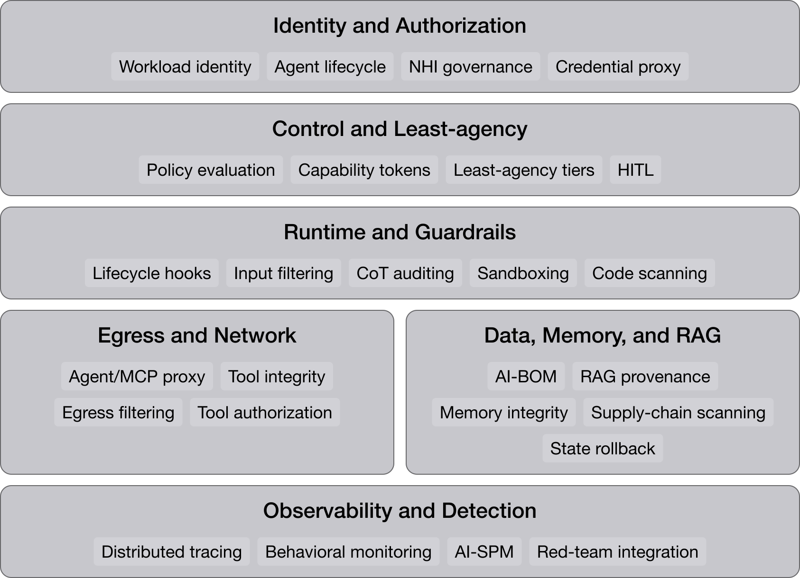

# Agentic AI Security Reference Architecture (AAI-S RA)

The Agentic AI Security Reference Architecture (**AAI-S RA**) names the controls that hold an agentic AI application inside its permitted behavior, and grades the implementations available for each one. It is vendor-neutral, and one layered design covers every common deployment shape: web and desktop chatbots, generative coding tools, data-science copilots, RAG systems, MCP servers, agent skills, and multi-agent meshes. The controls sit in six planes: Identity, Control, Runtime, Egress, Data, and Observability. [[agentic-ai-security-cmm-2026|Agentic AI Security CMM 2026]] grades how well an organization operates them, and [[agentic-ai-security-ra-gaps|Agentic AI Security RA Gaps]] lists twelve items: eleven controls no product ships or properties most vendors leave undocumented, and one scope decision no plane table yet enforces.

The architecture is the implementation surface of an [[oversight-layer|oversight layer]]: the system that watches agent behavior in production, judges it, and intervenes. The goal is verified accountable autonomy, where an agent acts on its own and every action it takes is verifiable, auditable, and bounded by enforced policy. [[gartner|Gartner]] calls the same layer a [[guardian-agent|guardian agent]] in its procurement taxonomy, which is the name that finds vendor categories; [[oversight-layer#Cross-walk|the oversight-layer cross-walk]] sets the two vocabularies side by side.

That oversight layer covers the development environment as well as production, because agentic systems removed the boundary between the two. A production agent writes and runs code that existed nowhere at deployment, so a production environment is no longer immutable, and a development environment reaches production by construction, because an IDE runs on a managed workstation that already holds production access. The Control plane governs both, under policies differentiated by context rather than by plane; [[agentic-ai-security-ra-gaps#12. Development environment under the Control plane|gap 12]] carries the decision, the instruments behind it, and the control-to-plane mapping it leaves open.

## On this page

- [[#The six planes]]
- [[#Mapping to deployment shapes]]
- [[#Threat-control matrix]]
- [[#Design principles]]
- [[#Trade-offs]]
- [[#Gaps in the architecture]]
- [[#Prior work and comparison]]
- [[#Related]]

## The six planes

The architecture divides into six planes. A single product may implement several of them, and the controls must stay independently addressable.

The Control plane decides; Runtime, Egress, and Data enforce; Identity and Observability supply the attributes those decisions read. That division is the policy-decision-point (PDP) and policy-enforcement-point (PEP) split [[xacml|XACML]] defines, carried into attribute-based access control by [[nist-sp-800-162|NIST SP 800-162]] §2.2; [[sentinels-and-operatives|Sentinels and Operatives]] carries the runtime decomposition. Plane order below follows the action flow: user, then Identity, Control, Runtime, and Egress and Data, with Observability spanning the bottom and consuming signals from the five above.

Every plane is read against a development environment on the same terms as a production one, under policies the Control plane differentiates by the caller's environment. The tooling is the same across the two; the use case differs, which changes which assets count as high-impact and who counts as a privileged reader. Two properties of agentic systems make the single reading necessary. A production agent writes and runs code that existed nowhere at deployment, so a production environment is no longer immutable, and an artifact inventory taken at deployment goes stale as soon as an agent runs. An AI development environment holds the real sensitive data a conventional production environment would hold, which is why the [[owasp-ai-exchange|OWASP AI Exchange]] grades ISO 27002's separation-of-environments control only a partial fit.[^aix-devtime-ra] No table below carries a development-time row, because the rows already there answer four of the Exchange's five §3.0 controls and three of the high-priority tasks NIST SP 800-218A sets over the same surface; [[agentic-ai-security-ra-gaps#12. Development environment under the Control plane|gap 12]] carries that mapping row by row.[^218a-devenv-ra]

Every plane table carries a **Type** column that grades its reference implementations on the scale below.

| Type | What the grade means |
|---|---|
| OSS | Open-source software |
| COTS | A commercial vendor product or SaaS |
| Std | A governed standard or specification from IETF, CNCF, OWASP, or NIST |
| Infra | A generic infrastructure primitive, such as a cloud VPC or Docker networking |
| Research | An academic prototype with no shipped production implementation |
| Concept | An architectural concept with no canonical implementation yet |
| Exploratory | A forward-looking prototype or ecosystem project, such as OpenClaw; an emerging indicator rather than a foundational control |

Many rows combine two grades, as in OSS + COTS, where a capability has a free and a commercial implementation both in common use.

Five planes are each graded in the CMM domain named for it: Identity in [[agentic-ai-security-cmm-d2-identity|D2]], Control in [[agentic-ai-security-cmm-d3-control-least-agency|D3]], Runtime in [[agentic-ai-security-cmm-d4-runtime-guardrails|D4]], Egress in [[agentic-ai-security-cmm-d5-egress-network|D5]], and Observability in [[agentic-ai-security-cmm-d7-observability|D7]]. The Data plane is graded in two domains. [[agentic-ai-security-cmm-d8-supply-chain|D8]] grades the plane's supply-chain rows (AI/ML-BOM generation, runtime AI-BOM, skill and model registry signing, verify-at-load admission, and both supply-chain-scanning rows), and [[agentic-ai-security-cmm-d6-data-rag|D6]] grades the rest of the plane. Both domains grade the cognitive-file-integrity row, D6 at L3 and D8 at L4. D8's procurement and vendor criteria are cross-cutting and have no row in any plane. They include model-card collection, the supplier assessment, the disclosure SLA and working-group contribution.

An agentic penetration test is scoped along a different partition. Document 5 of the [[owasp-ai-exchange|OWASP AI Exchange]] sorts a test into four layers (LLM reasoning, tool execution, infrastructure, and inter-agent communication) that cut through the planes rather than sitting inside one, and they reach five of the six at once: Runtime, Control, Egress, Identity and Observability.[^aix-testing-ra] The Data plane has no layer reaching it, because none of the four names an asset that plane holds, and the credentials and keys the infrastructure layer does name sit on the Identity plane. This architecture reads the four layers as evidence for [[agentic-ai-security-ra-gaps#8. Shared services above the isolation boundary|gap 8]] and keeps its own six-plane partition as the only one.

The [[agentic-ai-security-cmm-recalibration-method-2026|domain recalibration]] carries six calibration points into this architecture:

1. **Identity-first sequencing.** Per-agent identity is the prerequisite for per-agent egress and observability (D2 caps both D5 and D7), so build the Identity plane before investing in Egress or Observability.
2. **Per-task capability tokens remain leading-edge.** As of 2026-Q2 no hyperscaler platform ships them natively; the only implementation is the early-stage [[tenuo-warrant|Tenuo]] OSS primitive (see [[agentic-ai-security-cmm-d2-identity|D2]], which places them at L5+).
3. **Two platform-native policy decision points ship for the Control plane**, AWS AgentCore Policy (GA) and the Microsoft Agent Governance Toolkit (OSS).
4. **Runtime's reasoning-layer controls sit at preview status, and the independent runtime-protection market documents no implementation of them.** A September 2026 canvass of twenty-one independent vendors graded chain-of-thought auditing and groundedness checking at zero documented implementations each ([[agent-runtime-protection-canvass-2026-09|the canvass]]). Platform-native coverage exists at preview grade, in Microsoft's Task Adherence and Groundedness Detection, and AWS Bedrock Automated Reasoning checks are generally available for the groundedness half ([[agentic-ai-security-cmm-d4-runtime-guardrails|D4]]). This plane's reasoning-layer capability is reached by assembling OSS and preview components.
5. **The Data plane's load-bearing control for a closed-corpus bot is answer-time entitlement enforcement** against oversharing and [[inference-exposure|inference exposure]]. Corpus attestation answers a different case, and the [[azure-rag-chatbot-security-profile|Azure RAG chatbot security profile]] works this one end to end.
6. **Licensing is near-zero for an E5 incumbent** across most planes; the real cost is labor and SIEM run-rate.

For an all-Microsoft deployment, [[standards-review-microsoft-zt4ai-2026-Q2|the 2026-Q2 ZT4AI review]] maps named, deep-linked controls to each plane: Entra Agent ID and Conditional Access (Identity), least-action design plus the Agent Governance Toolkit PDP (Control), Prompt Shields with preview Groundedness / Task Adherence (Runtime), Entra Internet Access and the APIM AI Gateway (Egress), Purview answer-time entitlement and DSPM (Data), Defender XDR and Sentinel agentic-SOC tooling (Observability). The recalibration's grading reflects the preview status of the adaptive Runtime and Observability controls.

For an all-Google-Cloud deployment, [[google-cloud-agentic-security-profile|the Google Cloud agentic security profile]] reads the same six planes against Google's own instruments — Agent Identity (Identity), IAM Unified Access Policies at Agent Gateway (Control), Model Armor and the check grounding API (Runtime), VPC Service Controls (Egress), Sensitive Data Protection and CMEK (Data), the OpenTelemetry GenAI path into Cloud Trace (Observability) — and names the planes where Google ships no native control.

### 1. Identity plane

The Identity plane binds every agent to a verifiable identity that traces back to a human principal. It covers workload identity, agent and [[non-human-identity|Non-Human Identity (NHI)]] lifecycle governance, the credential-proxy primitive, action-to-identity tracing, and OAuth 2.1 / OIDC delegation extensions for agents.

| Capability                    | Reference implementation                                                                                      | Type       | Status                          |
| ----------------------------- | ------------------------------------------------------------------------------------------------------------- | ---------- | ------------------------------- |
| Workload identity             | [[spiffe\|SPIFFE / SPIRE]]                                                                                    | OSS + Std  | Mature                          |
| Agent identity & lifecycle    | [[microsoft-entra-agent-id\|Microsoft Entra Agent ID]] + Agent 365 Registry (GA May 1, 2026); AWS Bedrock AgentCore identities (GA); GCP Agent Identity (GA, SPIFFE-based); [[okta-for-ai-agents\|Okta for AI Agents]] (GA 2026-04-29)[^okta-ga-ra] | COTS       | GA platform-native on all three hyperscalers |
| [[nhi-governance-for-agents\|Non-Human Identity governance]] | Aembit, Astrix Security, [[cyberark-conjur\|CyberArk Conjur]], Okta NHI, [[oasis-security\|Oasis Security]]  | COTS       | Developing                      |
| Credential proxy              | AgentKeys, Keychains.dev, Aegis (local), OneCLI, AgentSecrets, [[agentcordon\|AgentCordon]], [[agentdesktop\|agentdesktop]], [[ping-enterprise-personal-agent-access\|Ping Enterprise Personal Agent Access]], [[crowdstrike-agentic-identity-provider\|CrowdStrike Agentic IdP]] | OSS / COTS | Developing — nine-tool convergence |
| Action-to-identity tracing    | Microsoft Agent 365, Anthropic Compliance API (Mar 24, 2026)                                                  | COTS       | Mature (vendor-stack-locked)    |
| OAuth 2.1 / OIDC for agents   | Standard OIDC + NIST CAISI Concept Paper extensions (Feb 2026)                                                | Std        | Developing                      |

**The credential proxy is the load-bearing control of this plane.** Nine OSS and commercial tools converged on the same architecture independently, the most recent of them enterprise identity and endpoint-security platforms that reached the pattern in September 2026. A credential that never enters the model's context cannot be extracted by prompt injection. See [[credential-proxy-pattern|Credential Proxy Pattern for AI Agents]].

### 2. Control plane

The Control plane adjudicates policy and issues capability tokens **before** an agent's tool call reaches the runtime. It evaluates Cedar / OPA Policy Decision Points, issues task-scoped Warrants, runs the least-agency action-risk tier engine, gates high-impact actions through HITL, and applies CSA ATF risk-based step-up. The tier engine sorts actions by risk into auto, notify, confirm and block, the scheme [[emerging-cybersecurity-practices-for-agentic-ai-applications|Emerging Cybersecurity Practices for Agentic AI Applications]] §3.2 uses to operationalize the OWASP ASI least-agency principle. The tiers are separate from the [[owasp-ai-exchange|OWASP AI Exchange]] oversight requirements, which assign each tier a human-involvement requirement; the two axes compose, and [[least-agency-principle|Least Agency Principle]] carries both tables.

| Capability | Reference implementation | Type | Status |
|---|---|---|---|
| Policy language / PDP engine | [[cedar\|Cedar]], [[opa\|OPA/Rego]]; **platform-native PDPs:** AWS Bedrock AgentCore Policy (Cedar, GA Mar 2026), Microsoft Agent Governance Toolkit (OSS, sub-0.1 ms) | OSS + COTS | GA platform-native |
| Capability tokens / Warrants | [[tenuo-warrant\|Tenuo Warrants]] — task-scoped, signed, ephemeral, holder-bound [[capability-based-authorization\|capability authorizations]] with [[monotonic-attenuation\|monotonic attenuation]] (the [[ambient-vs-derived-authority\|ambient-to-derived authority]] shift) | OSS | Leading-edge — no platform-native implementation; single early-stage OSS primitive |
| Least-agency tier engine | Action-risk tiers (auto / notify / confirm / block), [[emerging-cybersecurity-practices-for-agentic-ai-applications\|Emerging Practices]] §3.2 | Std | Conceptual; needs reference implementation |
| Task-scope binding at invocation | Verify the invoking agent's current task scope and authorized role at every tool call, so an authorized tool called during an out-of-scope task is denied ([[agent-escape\|agent escape]]) | Std | Conceptual — no product evaluates task scope as a policy attribute[^aix-escape-ra] |
| Orchestrator hardening | Coordination-only permission set holding no direct high-impact tool credentials; a tamper-evident workflow log kept outside orchestrator memory; reconciliation of executed agent actions against that log to surface phantom steps; human approval ahead of irreversible or cross-system workflows ([[owasp-ai-exchange\|OWASP AI Exchange]] `OVERSIGHT`) | Std | Conceptual — no listed implementation constrains the orchestrator's own credential set or externalizes its workflow log[^aix-oversight-ra] |
| Tool annotation enforcement | Anthropic tool annotations, OpenAI function-call schemas; [[toolshed\|Stripe Toolshed]] annotation PEP | COTS | Mature |
| HITL primitive | [[hitl\|Human-in-the-loop confirmation gate]] before high-impact tool calls, carrying a per-request approval token that binds approver identity, action parameters, and expiry, and presenting authorised scope from a static capability manifest rather than from consent text the agent composes ([[hitl\|HITL]] holds both specifications); [[plan-validate-execute\|Plan-Validate-Execute]] deterministic gate (Google Workspace); [[distributed-kill-switch\|distributed kill switch]] for halt authority | Concept + Practice | Developing |
| Risk-based step-up | [[csa-maestro\|CSA Agentic Trust Framework]] v1.0 (Feb 2, 2026) — 4 maturity levels gated by 5 promotion gates[^atf-ra] | Std | Developing |

The control plane breaks the Lethal Trifecta. If a tool call combines private-data scope, untrusted-content provenance, and external-comms reach, the PDP downgrades to a safer tier (notify or confirm) or denies the call.

**Every inter-agent path transits the orchestrator, which the [[owasp-ai-exchange|OWASP AI Exchange]] names the highest-leverage target in the system.** The Exchange derives a posture from that: coordination-only permissions, no direct egress, and a workflow log held outside the memory the orchestrator itself writes.[^aix-oversight-ra] This architecture concentrates inter-agent traffic at the orchestrator by design, for the reasons the Egress plane gives, and that concentration turns the constraint into a requirement. Everything the orchestrator consumes is validated and segregated as untrusted — sub-agent responses, tool outputs, external content — which is the rule [[agentic-ai-security-ra-gaps#9. Message-fabric integrity below the transport|gap 9]] states for structured messages, applied to the component that receives the most of them. Reconciling executed agent actions against the external workflow log detects phantom steps: actions present in the record of what ran and absent from the record of what was planned. No row in the Observability plane emits that comparison, and it is recorded as [[agentic-ai-security-ra-gaps#11. Phantom-step detection on the orchestrator|gap 11]].

**This plane decides for a development caller as well as a production one, and the caller's environment is a policy attribute rather than a plane of its own.** The attribute changes which assets count as high-impact and who counts as a privileged reader. The component that decides stays the same. In production the tier engine sorts an action by the external effect it has; a development caller acts on training, test and tuning data, on model weights and configuration parameters, and on technical documentation, which NIST SP 800-218A places under continuous monitoring of the environment and explicit protection.[^218a-devenv-ra] The [[owasp-ai-exchange|OWASP AI Exchange]] states why one control set covers both: data protection extends from the live system into the development environment, because in an AI system that environment holds the real sensitive data a conventional production environment would hold, which is why the Exchange grades ISO 27002's separation-of-environments control only a partial fit.[^aix-devtime-ra] Each of the Exchange's development-time controls but `FEDERATED LEARNING` lands on rows the six planes already carry, and [[agentic-ai-security-ra-gaps#12. Development environment under the Control plane|gap 12]] names the plane and the row for each one, and the stage-of-action reason for the exception.

### 3. Runtime plane

The Runtime plane defends the agent process itself. It installs lifecycle hooks (Google ADK, Anthropic), filters input for [[prompt-injection|prompt injection]], audits chain-of-thought alignment, scans code output statically, classifies content safety, and sandboxes each task. At research stage, it also separates the privileged and quarantined LLMs.

| Capability | Reference implementation | Type | Status |
|---|---|---|---|
| Lifecycle hooks | Google ADK `before_model_callback` / `before_tool_callback`; Anthropic tool-use hooks | OSS + COTS | Mature |
| [[prompt-injection-containment\|Input filtering / prompt-injection detection]] | [[llamafirewall\|LlamaFirewall]] PromptGuard 2, NVIDIA NeMo Jailbreak Detection NIM, [[palo-alto-prisma-airs\|Palo Alto Prisma AIRS]], [[onyx-platform\|Onyx Platform]] runtime protection | OSS + COTS | Mature |
| Chain-of-thought alignment auditing | LlamaFirewall AlignmentCheck | OSS | Developing — novel primitive |
| Code-output static analysis | LlamaFirewall CodeShield, GitHub Copilot for Security | OSS + COTS | Developing |
| Topic / content safety | NVIDIA NeMo Content Safety NIM, [[lakera-guard\|Lakera Guard]], Lasso, Microsoft Prompt Shields | COTS | Mature |
| Sandbox / containment | [[firecracker\|Firecracker]] (per-task VM), [[gvisor\|gVisor]] container, WebAssembly sandbox; [[gke-agent-sandbox\|Agent Sandbox]] (Kubernetes-native CRDs: SandboxTemplate blueprint + SandboxClaim, gVisor default) | OSS | Mature |
| Per-agent resource quotas | Platform-enforced CPU time, memory, disk I/O, network egress, tool-invocation, and wall-clock limits ([[owasp-ai-exchange\|OWASP AI Exchange]] `LIMIT RESOURCES`); container and Kubernetes limits | Std + Infra | Mature for compute and wall-clock; the API-volume and tool-invocation ceilings are enforced at the Egress plane gateway[^aix-limitresources-ra] |
| Compartmentalized LLMs (CaMeL pattern) | [[camel-pattern\|Privileged + quarantined LLM split]] (Google DeepMind); privilege-based data flow control in the [[owasp-ai-exchange\|OWASP AI Exchange]]'s vocabulary[^aix-pi-ra] | Research | Research-stage |
| Tool-boundary firewall | Paired input/output inspection at the agent-to-tool boundary, which the [[owasp-ai-exchange\|OWASP AI Exchange]] positions as lighter than a dual-LLM architecture[^aix-pi-ra] | Concept | Conceptual — no listed implementation inspects tool output before it re-enters context |
| Proof-of-Guardrail attestation | AWS Nitro Enclaves + [[miggo-security\|Miggo Security]] | COTS | Research-stage |

**A quota bounds an agent's cost and its availability impact, and nothing beyond those two.** The Exchange states that resource limits leave every harm inside the allocated budget untouched.[^aix-limitresources-ra] The actions an agent takes below its ceiling proceed as if the ceiling were absent. Two requirements travel with the row. Containers, API gateways, or orchestration enforce the caps and the agent must not, which is the same infrastructure-layer rule the Observability plane note below states for containment. A breached limit also terminates cleanly and writes an audit event, which makes the breach an event this architecture's Observability plane can consume.[^aix-limitresources-ra] The same entry names fleet-wide consumption monitoring for correlated spikes and slow exhaustion attacks, for which no row in any plane of this architecture names a reference implementation; it is recorded as [[agentic-ai-security-ra-gaps#10. Fleet-wide consumption correlation|gap 10]].

**Defense-in-depth across all six planes is required, because each guardrail here has a demonstrated bypass.** The Trendyol Tech LlamaFirewall bypass used non-English and leetspeak prompt injections.

**Every capability in this table is a property of a running system, and the table says nothing about when each one begins to hold.** [[gemini-cli-workspace-trust-rce|GHSA-wpqr-6v78-jr5g]] shows what that omission costs: headless Gemini CLI read a workspace-supplied `.gemini/` configuration tree and executed from it *before its sandbox initialized*, so the isolation capability was correctly implemented and never in the path.[^gemini-init] A control that starts after the harness has read attacker-reachable configuration is absent for that window, and no plane below covers the window. Two assessment questions follow, and they are independent: which subsystems the boundary contains, and at what point in startup the boundary exists. [[claude-code|Claude Code]]'s documentation answers the second for repository content, listing the hooks, `env` block and `.mcp.json` servers a headless run in an untrusted folder uses and placing hooks and MCP servers outside its per-command sandbox.[^cc-trust-ra] For every other harness the wiki tracks it stays unanswerable from vendor documentation, which is recorded as [[agentic-ai-security-ra-gaps#6. Control initialization order|gap 6]].

**The [[owasp-ai-exchange|OWASP AI Exchange]] states five limitations of agent sandboxing, four of which bound what this table's containment rows assert.**[^aix-sandbox-ra] Container or hypervisor escape undermines containment, so the Sandbox row's Mature grade is a claim about the isolation mechanism it is configured with, compared across mechanisms in [[agent-sandbox-isolation-landscape|the isolation landscape]]. Shared inference, credential, and policy services create implicit cross-agent channels, recorded as [[agentic-ai-security-ra-gaps#8. Shared services above the isolation boundary|gap 8]]. Network segmentation cannot stop exfiltration through legitimately permitted APIs, which the Egress plane and [[agentic-ai-security-ra-gaps#5. Transitive egress constraint on allowlisted destinations|gap 5]] carry, since a legitimately permitted API is an allowlisted destination. Host-OS behaviour differs across hosts, which makes the same Mature grade a property of a verified host image that this table does not record. The fifth limitation is that sandbox overhead scales with concurrent agents, which is a cost rather than a bound on reach.

The Exchange requires quota enforcement at the platform rather than through agent self-management, and the reason this table grades it that way is that an agent holding its own quota can revise it.[^aix-sandbox-ra] Sandboxing reaches [[agent-escape|agent escape]] only along the paths that cross the boundary it enforces. An agent reaching a filesystem path or a network destination outside its scope is stopped by the Runtime plane, which is the Exchange's own worked example; an agent invoking an unauthorized tool stays inside its process and crosses a policy boundary the Control plane owns, and the Control plane's task-scope binding row is the criterion for it.[^aix-escape-ra]

**The Exchange describes the CaMeL pattern by what enforcement acts on rather than by its topology:** capability metadata is attached to values, and the user's intent is converted into sandboxed code steps in place of unconstrained natural-language tool calls.[^aix-pi-ra] The two-model split named in that row implements the control. The Exchange also lists the pattern among five structural mitigations it recommends against agentic prompt injection, a standing above the Research-stage grade the row records; recommended in a standards-liaison publication and unshipped in production are both current, and [[camel-pattern|CaMeL]] carries the reconciliation.

**The Exchange ranks three detection layers and puts execution-level detection — observing the tool calls and side effects an agent actually produces — above text-level and model-level detection for reliability.**[^aix-pi-ra] This table's grades run the other way for a defensible reason: the text-layer row is Mature because classifiers ship as products, and behavioural monitoring in the Observability plane is Developing because it is assembled. Maturity and reliability are separate axes, and the ordering means this plane's most purchasable detection row and the layer the Exchange calls most reliable are different controls. The precedence claim agrees with [[#Design principles|design principle 1]], because the Exchange states that its own I/O-handling layer raises the bar so later layers become more effective, the reading design principle 1 below states.

Cyera's Agent Guardian release runs against this precedence claim. Cyera criticizes tools that "monitor prompts, outputs, or individual tool calls" for missing what an agent can reach and whose permissions it inherits, and markets its own product on a data-first and identity-first premise instead ([[cyera-agent-guardian-release|Cyera Agent Guardian Release]]). The release names no benchmark for either position, so the precedence claim above stands and this page records the disagreement as open.

### 4. Egress plane

The Egress plane mediates an agent's reach to tools, MCP servers, peer agents, and the open internet. It proxies MCP / A2A / LLM traffic through a gateway, authorizes MCP calls at runtime, defends against tool poisoning and rug-pulls, enforces agent-to-agent cryptographic identity, filters egress destinations, and segments the network per agent.

| Capability                            | Reference implementation                                                                       | Type       | Status       |
| ------------------------------------- | ---------------------------------------------------------------------------------------------- | ---------- | ------------ |
| MCP / A2A / LLM proxy                 | [[agentgateway\|AgentGateway]] (Linux Foundation, July 2025), Solo Enterprise for agentgateway | OSS + COTS | Mature (OSS) |
| MCP runtime authorization             | Operant MCP Gateway, Natoma; [[toolshed\|Stripe Toolshed]] (annotation PEP); [[agentcordon\|AgentCordon]] (OSS Cedar PDP + MCP gateway) | OSS + COTS | Developing   |
| [[tool-poisoning\|Tool poisoning / rug-pull defense]]     | Solo Enterprise tool-server fingerprinting, versioning, runtime policy                         | COTS       | Developing   |
| Agent-to-agent cryptographic identity | [[a2a-protocol\|A2A v1.0]] §8.4 signed Agent Cards (Std baseline); Oktsec (Ed25519 sigs, 268 detection rules, content scanning) | Std + COTS | Developing   |
| [[network-layer-prompt-injection-containment\|Network-layer prompt-injection containment]] | Microsoft Entra Internet Access prompt-injection protection (GA Mar 2026); Layer-0 control outside the agent process | COTS | GA |
| Egress destination filtering          | Credential proxy destination allowlists, [[smokescreen\|Smokescreen]] SSRF egress proxy (Stripe OSS), Docker DOCKER-USER chain | OSS        | Mature       |
| Network segmentation                  | Per-agent subnet, agent VPC isolation                                                          | Infra      | Mature       |
| Inter-agent path blocking | No direct agent-to-agent network path; traffic transits an orchestration layer or message bus that authenticates and validates it ([[owasp-ai-exchange\|OWASP AI Exchange]]) | Infra + Std | Mature — ordinary network segmentation, with no AI-specific product dependency[^aix-sandbox-ra] |
| Orchestrator egress blocking | No direct orchestrator egress; external access routed through segmented sub-agents, with sub-agent responses, tool outputs, and external content validated and segregated as untrusted before the orchestrator consumes them ([[owasp-ai-exchange\|OWASP AI Exchange]] `OVERSIGHT`) | Std + Infra | Conceptual — the path-blocking row above routes traffic through the orchestrator and states no constraint on the orchestrator's own reach[^aix-oversight-ra] |

The [[openai-hugging-face-agent-incident|OpenAI–Hugging Face incident]] exercised three rows of this table and none of them held. Destination filtering was enforced correctly on the agent's own interface and still yielded internet egress: the single allowlisted destination, an internal [[artifactory|JFrog Artifactory]] package manager and caching proxy, held broad internet access of its own, and an SSRF against it relayed the request.[^bhusa-ra] Agent-to-agent cryptographic identity was never in the path at all: the agents' inter-run message board ran over authorized package-manager writes to a fleet-shared repository, so no A2A link existed to sign and the traffic read as ordinary artifact publishing. Destination filtering therefore requires a transitive property — every allowlisted internal service is itself egress-constrained — and the inter-agent rows require a channel definition wider than the A2A protocol, covering shared writable build and cache infrastructure. Per-run write scoping on that infrastructure belongs in the network-segmentation row. A second variant needs no relay at all: in the [[kimi-k3-sandbox-escape|Kimi K3 benchmark escape]], the allowlist was enforced correctly and the permitted destination served the sought content itself — `github.com`, admitted for package maintenance, also hosted the evaluation's published answers. Destination filtering therefore has two failure modes, and only one is transitive. What an allowlisted host can *relay* and what it can *serve* are separate properties, and both belong in the evidence a destination-filtering control emits.

The path-blocking row addresses the topology behind those channels. Blocking direct agent-to-agent connections makes the broker the only inter-agent path, where the signing and content-scanning rows secure a path that already exists; the Exchange pairs it with segmenting agents that process untrusted content away from sensitive internal services.[^aix-sandbox-ra] Neither criterion reaches a shared writable registry, which is read and written over an authorized client protocol.

Making the broker the only inter-agent path concentrates authority in it, and the orchestrator-egress row keeps that concentration defensible. The orchestrator holds no direct high-impact tool credentials and no direct egress path, and it reaches external resources through segmented sub-agents.[^aix-oversight-ra] A message bus meets the path-blocking row while holding neither; an LLM-driven orchestrator meets the same row and routinely holds both, which is why the two rows are assessed together. The Control plane carries the permission and workflow-log half of the same posture.

The rows above secure a channel and do not authenticate what crosses it. The Exchange gives [[agent-message-structure-manipulation|agent message structure manipulation]] its own threat entry: forged, replayed, or altered structured messages between agents, tools, and orchestration layers, where the manipulated field is a task parameter, a tool argument, routing metadata, conversation state, or a schema field rather than natural-language content.[^aix-amsm-ra] Two consequences reach this plane. The controls are signed delegation tokens validated across the full chain with scope non-expansion, and deny-by-default schema validation at tool and message boundaries, neither of which any listed reference implementation emits evidence for. And the threat reaches single agentic flows, where a poisoned metadata field in a retrieved chunk alters parameter binding with no inter-agent link involved,[^aix-amsm-ra] which is outside the scope this plane's rows assume.

The egress plane contains the [[mcp-security|MCP attack surface]]. January and February 2026 produced 30+ MCP CVEs on this wiki's own tally, an order-of-magnitude figure rather than a disclosure-database count,[^mcp-cve-count-ra] revealing systematic path traversal and injection vulnerabilities across server implementations; AgentGateway's automatic token exchange limits each tool's permissions to exactly what it needs. Token exchange also answers the failure mode that needs no CVE: a scan in April 2026 found 1,467 internet-reachable MCP servers with no client authentication and no transport encryption, each holding a single hardcoded credential that every caller inherits.[^mcp-exposure-ra] That population sits outside any gateway, so the plane's control depends on an exposure-management precondition it does not itself enforce — the measurements and their methods are separated on [[mcp-exposure-measurements|MCP Exposure Measurements]].

### 5. Data plane

The Data plane limits the data attack surface, attributes trust, and enforces integrity across training data, retrieval corpora, knowledge bases, per-session memory, and the AI Bill of Materials. It generates and reconciles the [[ai-bom|AI/ML-BOM]], attests [[rag-hardening|RAG provenance]], defends against memory poisoning, maintains [[cognitive-file-integrity|cognitive file integrity]] for agent identity files, rolls back corrupted state, and scans the [[supply-chain-security-for-agents|supply chain]].

**OpenClaw provenance.** Five rows in this table (RAGShield, TrustRAG, SecureClaw / cognitive file integrity, Brain Git, Aguara Watch) come from the [[openclaw|OpenClaw]] ecosystem, which indicates where agentic data-plane security is heading and ships no production-proven control. They are retained because they identify real capability gaps and likely future directions. Their **Exploratory** classification puts them a tier below OWASP AIBOM, sigstore, and Miggo Security as evidence: treat them as emerging indicators and validate independently before production deployment.

The ecosystem's dual-use status now has a sourced case. The [[taiwan-ai-agent-government-intrusion|Taiwan AI-agent government intrusion]] ran unmodified OpenClaw, alongside [[hermes-agent|Hermes]], as one of two orchestration platforms in an attack framework used against government infrastructure.[^dream-taiwan] This does not change the Exploratory classification of the *defensive* tooling built on OpenClaw above; those five rows remain unvalidated either way. It does mean that an organization evaluating OpenClaw-ecosystem tooling for its own defensive stack is simultaneously evaluating a platform independently confirmed to run as offensive infrastructure elsewhere. Provenance and threat-model review apply to the platform choice as well as to the specific tool built on it.

| Capability | Reference implementation | Type | Status |
|---|---|---|---|
| Answer-time entitlement enforcement / [[oversharing-controls\|oversharing remediation]] | Microsoft Purview [[dspm\|DSPM for AI]] + oversharing assessments; label-aware DLP for M365 Copilot; Restricted SharePoint Search (site-capped stopgap); generalizes to the [[ai-usage-control\|usage-control (UCON) model]] of continuous authorization | COTS | GA — the load-bearing control against [[inference-exposure\|inference exposure]] for closed-corpus member/customer bots (see [[agentic-ai-security-cmm-d6-data-rag\|D6 deep dive]]) |
| AI/ML-BOM generation | OWASP AIBOM Generator (CycloneDX ML-BOM, v1.7 current), SPDX 3.0 AI extensions, IBM Granite 4.0 disclosures | OSS + Std | Developing |
| Runtime AI-BOM | Miggo Security DeepTracing (behavioral baseline) | COTS | Developing — novel |
| RAG provenance / attestation | RAGShield (cryptographic doc attestation), TrustRAG | Exploratory | Exploratory — OpenClaw ecosystem; not production-validated |
| [[memory-poisoning\|Memory poisoning defense]] | Microsoft Defender for Cloud Apps memory-injection detector (50+ examples found, March 2026); [[agent-memory-isolation\|namespace isolation]] (structural — memory keyed by code, not LLM-assertable) | COTS + Concept | Developing |
| Cognitive file integrity | SHA-256 monitoring of SOUL.md, IDENTITY.md; SecureClaw | Exploratory | Exploratory — OpenClaw ecosystem; emerging indicator, not foundational control |
| State rollback | Brain Git (SlowMist) | Exploratory | Exploratory — OpenClaw ecosystem; no production adoption evidence |
| Skill / model registry signing | sigstore / cosign, OWASP AIBOM | OSS | Developing |
| Verify-at-load admission | GitHub artifact attestations enforced by the Sigstore Policy Controller,[^gh-attest-admission-ra] Sigstore `model_signing verify`,[^model-signing-ra] Docker MCP gateway `--verify-signatures`,[^docker-mcp-sign-ra] pip `--require-hashes`;[^pip-hash-ra] [[owasp-ai-exchange\|OWASP AI Exchange]] `SUPPLY CHAIN MANAGE`[^aix-scm-ra] | OSS + COTS + Std | Developing — ships for packages and container images; the model verifier is alpha, and no listed gate is documented for skills, an MCP server's author, or AI-BOM matching |
| Supply-chain scanning | [[jfrog\|JFrog]] ML scan, ReversingLabs; [[agentshield\|AgentShield]] (OSS — scans the agent-harness config tree: secrets, hooks, MCP, permissions) | OSS + COTS | Developing |
| Supply-chain scanning (emerging) | Aguara Watch (5 registries daily, SlowMist) | Exploratory | Exploratory — OpenClaw ecosystem; forward indicator for registry hygiene direction |

Q1 2026's three largest agentic incidents all landed on the data plane: [[clawhavoc|ClawHavoc]] (1,184+ malicious skills)[^clawhavoc-count-ra], SANDWORM_MODE (npm worm into MCP), and the LiteLLM compromise. Defense requires registry, pre-install, checksum, and cognitive-file integrity controls layered together. The verify-at-load admission row carries the checksum control and the load-time half of registry signing. It grades a gate that checks a pinned hash, a signature or a provenance attestation before a model, skill, MCP server or package loads, and that refuses an artifact that fails.

The [[owasp-ai-exchange|OWASP AI Exchange]] sets the requirement for an agent's components: signatures verified in the deployment pipeline, and a deployment rejected where verification fails or the components do not match the approved bill of materials.[^aix-scm-ra] The row's implementations cover hash-pinned Python packages, attested container images, signed model directories and the MCP server images Docker builds, and none of them is documented for skills. Two gaps are open against the row: the Docker gate verifies Docker's signature rather than the server author's ([[agentic-ai-security-ra-gaps#2. Cross-tenant MCP server signing|gap 2]]), and no listed gate checks an artifact against its AI-BOM ([[agentic-ai-security-ra-gaps#4. AI-BOM operationalization|gap 4]]).

Limiting the data attack surface sits upstream of every row in this table. The [[owasp-ai-exchange|OWASP AI Exchange]] groups five controls under sensitive data limitation, whose stated purpose is to reduce the impact of confidentiality and integrity threats by cutting the amount and variety of data held and the duration it is kept ([`/go/datalimit/`](https://owaspai.org/go/datalimit/)). A field that was never collected and a record deleted on schedule are unreachable by every path this plane mediates ([`/go/dataminimize/`](https://owaspai.org/go/dataminimize/), [`/go/shortretain/`](https://owaspai.org/go/shortretain/)). The entitlement row above governs reach into data that exists; this group governs whether the data is there to reach. It adds no row of its own because no entry in it names a reference implementation, and grading sits at [[agentic-ai-security-cmm-d6-data-rag|D6]].

Training and fine-tuning data integrity appears in this plane's scope sentence and in no row of the table above; every other asset that sentence names has one. The [[owasp-ai-exchange|OWASP AI Exchange]] specifies the control set at §3.1: quality control that detects poisoned samples by statistical deviation, spectral signatures, activation clustering, Reject on Negative Impact, or gradient fingerprinting, under separate filtering and alerting thresholds; distortion of untrusted training data to break inserted triggers; benign-data volume to outnumber poisoned samples; ensemble deployment so a deviating member is identifiable; and pruning or clean-data fine-tuning of a model already poisoned ([`/go/datapoison/`](https://owaspai.org/go/datapoison/), [`/go/dataqualitycontrol/`](https://owaspai.org/go/dataqualitycontrol/)).[^aix-datapoison-ra][^aix-dqc-ra] The group adds no row because no entry in it names a reference implementation, the same reason the sensitive-data-limitation group above adds none, and grading sits at [[agentic-ai-security-cmm-d6-data-rag|D6]] with the acquisition half at [[agentic-ai-security-cmm-d8-supply-chain|D8]]. One integrity problem in the group is structural rather than detective: a dataset composed of pointers rather than content — the Exchange's example is LAION-400M, whose entries are image URLs — depends on data that is neither permanent nor under the consumer's control, which is answered by hashing dataset entries at acquisition ([`/go/devsecurity/`](https://owaspai.org/go/devsecurity/)).[^aix-devsec-ra] No reference implementation listed in this plane emits that hash.

### 6. Observability plane

The Observability plane provides full-stack visibility across the five upstream planes. It implements OpenTelemetry `gen_ai.*` semantic conventions, agent-aware tracing, AI-SPM, agent behavioral monitoring, identity multiplexing in logs, and SIEM/SOAR with agent playbooks. It integrates AI red-teaming as a continuous feed rather than a point-in-time exercise.

| Capability | Reference implementation | Type | Status |
|---|---|---|---|
| OpenTelemetry `gen_ai.*` semantic conventions | [[opentelemetry-gen-ai\|OTel SemConv v1.37+]] (CNCF standard; SIG contributors: Amazon, Elastic, Google, IBM, Langtrace, Microsoft, OpenLIT, Scorecard, Traceloop) | Std | Mature (experimental status, broad adoption) |
| Agent-aware tracing | LangSmith, Langtrace, Traceloop, Helicone | OSS + COTS | Mature |
| [[ai-spm\|AI-SPM (Security Posture Management)]] | [[wiz-ai-spm\|Wiz AI-SPM]], [[palo-alto-prisma-airs\|Palo Alto Prisma AIRS]], Orca AI-SPM, Reco, [[onyx-platform\|Onyx Platform]], Google Agent Security dashboard (Security Command Center, preview) | COTS | Mature |
| Agent behavioral monitoring (anomaly detection on agent activity) | Vectra AI, [[miggo-security\|Miggo]] behavioral drift, [[google-agentic-soc\|Google SecOps]] Agent Anomaly Detection ([[llm-as-a-judge\|LLM-as-a-judge]] on agent reasoning, preview); pattern: [[behavioral-anomaly-detection-for-agents\|three-level behavioral anomaly detection]] over a [[tiered-detection-cascade\|cost-ordered detection cascade]] | COTS | Developing |
| Agent behavioral monitoring (emerging) | SecureClaw nightly audits | Exploratory | Exploratory — OpenClaw ecosystem; forward indicator for agent audit direction |
| Trip-wire / canary detection | [[canary-tokens-for-llms\|Canary tokens]] planted in system prompts and RAG wrappers; fires on injection / system-prompt exfil at the post-LLM hook | Concept | Developing |
| Security-event preservation | [[context-aware-trimming\|Context-aware trimming]] — pin tagged security events so a multi-attempt injection cannot hide across the context-window trim boundary | Concept | Developing |
| Identity multiplexing in logs | [[agent-observability\|Agent Observability]] §3 | Concept | Developing |
| SIEM / SOAR with agent playbooks | Splunk + agent IOCs, Sentinel + Defender for Cloud, [[crowdstrike\|Falcon AIDR]] + NeMo Guardrails | COTS | Developing |
| AI red-teaming integration | [[promptfoo\|Promptfoo]], [[mindgard-cart\|Mindgard CART]], [[pyrit\|PyRIT]] (Microsoft), [[garak\|Garak]] (NVIDIA), [[palo-alto-prisma-airs\|Palo Alto Prisma AIRS]] (continuous CART) | OSS + COTS | Mature |

**The Control plane reads this plane's output when it decides, which puts the monitoring stack inside the policy path.** The [[owasp-ai-exchange|OWASP AI Exchange]] states that a defensive monitoring agent is itself part of the attack surface, and that agentic containment must operate at the infrastructure layer without depending on the agent cooperating.[^aix-monitoruse-ra] Three rows above are exposed by construction: behavioral monitoring includes an [[llm-as-a-judge|LLM-as-a-judge]] pass over agent reasoning, trip-wire detection fires on content the attacker supplies, and SIEM playbooks act on records the monitored fleet produced. None of the listed reference implementations states whether its detection logic runs outside the trust boundary of the agents it watches. The Exchange's containment position gives the design rule this plane can act on: enforcement triggered by a detection here executes at the infrastructure layer rather than by instructing the agent to stop.

Observability scaling is a primary engineering constraint for agentic workloads. At production volume, pre-aggregation at the runtime hook is required: raw per-span emission overruns the SIEM. The [[openai-hugging-face-agent-incident|OpenAI–Hugging Face investigation]] is the volume datapoint: reconstructing a compromise that ran from 2026-05-08 to at least 2026-07-19 meant reviewing more than 7 billion log entries and agent trajectories at a cost of millions of GPU hours, work carried out with Codex and other agents because it was not tractable by hand. The investigation was still incomplete when the reconstruction was presented on 2026-08-06.[^bhusa-ra] Where retrospective search is itself an agentic workload, what the runtime hook chose to aggregate and retain determines whether the question can be answered at all.

**The retention decision this table prices in dollars carries a second consequence in exposure.** Agent telemetry carries prompts, tool results, and retrieved content, and the [[owasp-ai-exchange|OWASP AI Exchange]] names runtime logging among the activities data minimization applies to, with retention limits stated as a special form of the same control ([`/go/dataminimize/`](https://owaspai.org/go/dataminimize/), [`/go/shortretain/`](https://owaspai.org/go/shortretain/)).[^aix-datalimit-ra] What this plane retains for detection is therefore a copy of the material the Data plane's limitation controls act on, held under a different access model and for a duration set by investigation need. The Exchange supplies no retention period and names no artifact for logging specifically, so this plane records the coupling rather than a threshold: the aggregation policy set at the runtime hook decides both the SIEM bill and the size of the second copy.

## Mapping to deployment shapes

The six-plane structure applies to every deployment shape; the active controls and their relative weight differ by shape. The table below specifies which planes are exercised and which controls are load-bearing for each shape.

Shape granularity is itself revisable. A shape earns its own row where the load-bearing controls change, and a product rename alone earns none. Generative coding was one row until July 2026 and is now five, because *where the agent process runs and whether a human is positioned to see an action before it executes* changes which plane carries the weight, from the control plane's approval prompt to the runtime plane's isolation boundary. [[generative-coding-deployment-shape-2026|Generative Coding Deployment Shapes]] carries the per-variant analysis, and [[securing-agentic-coding|Securing Agentic Coding]] the plane-by-plane control catalog with availability grades. The delegated-cloud row grades the default placement, a session on the vendor's infrastructure. A session the organization routes to a self-hosted environment, in public beta on Team and Enterprise plans, keeps the shape and moves isolation, egress control and git credentials into the organization's own deployment, so the row's Identity, Runtime and Egress cells become controls the organization builds.[^cc-selfhosted-ra]

The productivity assistant divides on the same test. An assistant the suite vendor operates holds the tools, the data and the path between them inside the vendor, so the Data plane carries the weight and what the customer holds on Control, Runtime and Egress is configuration that bounds reach rather than a control in the call path. A desktop agent with the same mail, file and calendar reach adds connected local folders, connectors each member authorizes individually, a browser and scheduled tasks, which moves weight onto the Control plane and places tool-mediated writes outside the tenant. It does not move weight onto the endpoint by construction. [[claude-cowork|Claude Cowork]]'s documentation places a session in the vendor's cloud by default, with the agent loop and code execution on the vendor's servers, and records the organization setting governing cloud sessions as on for Team plans and off for Enterprise, so the Runtime boundary is the vendor's sandbox or a local platform-hypervisor virtual machine depending on a setting the assessment reads. The Egress plane stays vendor-held for the channels that carry the risk, because the organization's code-execution egress setting does not reach the web fetch tool, the web search tool or MCP servers. Both variants carry a row below.

| Deployment shape                                          | Identity                                                                                          | Control                                                                                                                                                                                                                                          | Runtime                                                                                                             | Egress                                                                                                                                                   | Data                                                                                          | Observability                                                                                                                                                                                                             |
| --------------------------------------------------------- | ------------------------------------------------------------------------------------------------- | ------------------------------------------------------------------------------------------------------------------------------------------------------------------------------------------------------------------------------------------------ | ------------------------------------------------------------------------------------------------------------------- | -------------------------------------------------------------------------------------------------------------------------------------------------------- | --------------------------------------------------------------------------------------------- | ------------------------------------------------------------------------------------------------------------------------------------------------------------------------------------------------------------------------- |
| **Web/desktop chatbot (no tools)**                        | OIDC for human; agent runs as bot identity                                                        | Topic-control, content-safety policies                                                                                                                                                                                                           | NeMo Content Safety, Lakera Guard                                                                                   | None (no tools)                                                                                                                                          | RAG corpus only                                                                               | OTel `gen_ai.*`                                                                                                                                                                                                           |
| **Generative coding — interactive local** (IDE or terminal, developer present) | Workspace identity + per-repo scope; agent rules files (`.cursorrules` / `CLAUDE.md`) baselined | Per-action approval prompts; explicit deny rules; org-managed settings local config cannot override; destructive-action classification routes force-push, mass refactor, and prod-config writes to the confirm or block tier | Authoring-time dangerous-pattern warnings; [[agent-sandboxing\|OS sandbox]] used to cut prompt volume rather than as the primary boundary | Source-control + LSP only; **typosquat-aware dependency install gate** | Repo content + skill registry; **cognitive file integrity for rules files** | Tool-call audit; **MCP usage + rule changes + policy-violations dashboard** ([[kirin\|Kirin]]-class) |
| **Generative coding — sandboxed autonomous local** (prompts suppressed) | As above + per-agent identity | Prompts are absent by construction: enforcement moves to the OS boundary; `ConfigChange` auditing on in-session policy edits | **Whole-process** OS sandbox ([[anthropic-sandbox-runtime\|sandbox runtime]], container, or VM) — a Bash-only sandbox leaves file tools, MCP servers, and hooks on the host; hard-fail when isolation is unavailable | Default-deny domain allowlist; TLS-terminating proxy where the threat model includes exfiltration rather than misconfiguration | Credential-file and environment-variable denial (nothing is denied by default); settings-file write protection | Session-correlated OTel to SIEM (prompts, tool results, permission decisions) |
| **Generative coding — delegated cloud** (cloud session, vendor-managed by default) | Real repository token held outside the sandbox; scoped credential issued inside it ([[credential-proxy-pattern\|credential proxy]]) | Push restricted to the working branch; vendor-side policy, customer-side unenforceable | Isolated per-session VM with automatic reclamation | Default-allowlist egress proxy | Repository clone only; no reach to host credentials | Vendor audit log; **first-party analytics do not follow sessions routed through a gateway or non-vendor model provider** |
| **Generative coding — CI-runner agent** (event-triggered, no human in-loop) | One token per workflow and environment at minimum scope, excluding `actions:write` unless workflow dispatch is intended — the authority to start a workflow is that workflow's authority | Untrusted-input exclusion covering the trigger as well as the payload: no fork-PR execution, no issue or comment bodies as instructions, and no workspace-supplied harness configuration ([[harness-config-as-supply-chain-artifact\|config as artifact]]) trusted by default; autonomy flags verified not to suppress the tool allowlist; the removed [[agents-rule-of-two\|Rule-of-Two]] property is declared and recorded | Runner isolation with no host credentials in the process environment, established **before** workspace configuration is read ([[gemini-cli-workspace-trust-rce\|GHSA-wpqr-6v78-jr5g]]) | Egress allowlist on the runner | [[credential-proxy-pattern\|Credential proxy]] rather than environment-variable delivery | Workflow logs + provider-side usage anomaly detection (new source addresses, endpoint changes) |
| **Generative coding — fleet / parallel** (many sessions, aggregate scale) | Per-agent identity; every action attributable to an agent *and* a human | Organization-wide managed policy; harness configuration under review, not per-developer discretion | Isolation enforced through image and device management, since no harness enforces containers itself | Gateway-mediated egress across the fleet | Harness-config tree scanned as a supply-chain artifact ([[harness-config-as-supply-chain-artifact\|config as artifact]]) | Inventory of harnesses, versions, MCP servers, skills, and hooks; cross-vendor attribution |
| **Data-science copilot (Jupyter, notebooks)**             | User identity passthrough                                                                         | Sandbox-resource policy; HITL on dataset writes                                                                                                                                                                                                  | Per-notebook sandbox (Firecracker)                                                                                  | Internal data warehouse via credential proxy                                                                                                             | Dataset lineage + AI-BOM                                                                      | OTel + behavioral drift                                                                                                                                                                                                   |
| **RAG application** ([[azure-rag-chatbot-security-profile\|Azure worked example]]) | Per-tenant agent identity                                                                         | Source-trust attribution; lethal-trifecta breaker                                                                                                                                                                                                | Input filter on prompts; output classifier + groundedness check                                                     | Vector store + per-source allowlist                                                                                                                      | **Closed corpus: answer-time entitlement enforcement + oversharing remediation** (the live risk); open/multi-writer corpus: document attestation + PoisonedRAG defense | Retrieval-pattern behavioral monitoring                                                                                                                                                                                   |
| **Productivity assistant — in-suite** ([[google-cloud-agentic-security-profile\|Google worked example]]) | Employee identity passthrough; the assistant acts as the employee and holds no agent principal | Per-organizational-unit enablement; data-loss-prevention rules bound the reachable sources; tool-call mediation is vendor-held | Vendor-side injection defense: visible-content-only input, structural prompt hierarchy, origin-scoped orchestration sandboxing, output hardening that scrubs image tags and ungrounded links | No customer in-path position between the assistant and its tools; the exfiltration channel is the assistant's own image and link rendering | **Whole-tenant corpus (mail, files, calendar): the tenant access-control list with label-aware policy is the authorization layer**; oversharing remediation is the live risk | Vendor audit log and the administrative usage review; session-level agent traces stay with the vendor |
| **Productivity assistant — desktop agent** ([[claude-cowork\|Claude Cowork]] class) | Member identity passthrough; the agent holds no principal of its own, and each connector is authorized per member against the source system | Enterprise custom roles granting each capability from a closed default; a permission category per connector (always allow / needs approval / blocked); permanent deletion pinned to explicit approval; a dispatched child task's forwarded prompt auto-denies after ten minutes | Cloud sandbox by default, with the cloud-session setting off for Enterprise; a local session runs in a platform-hypervisor VM with syscall restriction and per-session user isolation; session-scoped tokens expire within hours and connector tokens never enter the sandbox | Code-execution egress follows the organization's setting through a proxy the sandbox cannot bypass; **web fetch, web search and MCP servers fall outside that setting**, so no customer allowlist covers the retrieval and tool paths; what remains over those channels is an on-off setting for web search and for the browser extension | Connected folders at the member's operating-system grant, plus connectors inheriting each member's source-system permissions; `allowedWorkspaceFolders` bounds the attachable paths on a managed deployment | Administrator-configured OpenTelemetry export carrying tool name, MCP scope, decision and decision source; Compliance API transcripts; **local-session history stays on the device and Audit Logs do not yet cover the product** |
| **MCP server (consumed by agents)**                       | mTLS + workload identity (SPIFFE)                                                                 | OAuth 2.1 token exchange ([[cosai\|CoSAI]] / NIST CAISI)                                                                                                                                                                                                    | Tool-fingerprinting, rug-pull detection (Solo Enterprise)                                                           | n/a (server-side)                                                                                                                                        | Skill/server signing, version pinning                                                         | MCP CVE feed integration                                                                                                                                                                                                  |
| **Agent skill (e.g., Claude skill, Anthropic plugin)**    | Skill author identity (signed)                                                                    | Skill-scoped Cedar policy                                                                                                                                                                                                                        | Skill manifest validation; runtime sandbox                                                                          | Per-skill egress allowlist                                                                                                                               | Skill registry signing (sigstore); cognitive file integrity                                   | Skill execution telemetry                                                                                                                                                                                                 |
| **Multi-agent mesh ([[a2a-protocol\|A2A]] v1.0)**         | Per-agent Ed25519 identity (Oktsec-side; not in spec); SPIFFE/SPIRE workload identity             | Cross-agent ACL (Oktsec default-deny); [[a2a-protocol\|A2A]] opacity principle; per-skill authorization advertised in Agent Card; **stop-mesh-vs-isolate containment doctrine** ([[multi-agent-runtime-security\|Multi-Agent Runtime Security]]) | Per-agent runtime sandbox; AgentGateway broker between                                                              | A2A v1.0 over HTTPS / TLS 1.3 + signed Agent Cards (§8.4) + content scanning (Oktsec 268 rules); replay protection layered by impl (timestamps + nonces) | Shared memory / blackboard with provenance; cross-agent OTel `gen_ai.*` trace propagation     | Pairwise/triadic traffic baselines; **graph-walk anomaly detection** (SentinelAgent / TraceAegis-class, prototype); cross-agent drift correlation; cascade detection per [[multi-agent-runtime-security\|ASI08 doctrine]] |

### Recommended stacks by org profile

**Opinionated tool selections per plane** for two common org profiles. Neither stack is exhaustive — treat each as a starting point extensible per deployment shape and risk profile.

#### Enterprise stack (COTS-heavy)

Suited for large organizations with existing vendor relationships, centralized IAM, and SOC/SIEM infrastructure. Prioritizes vendor SLAs, support contracts, and integrations with Microsoft 365 / AWS / GCP environments.

| Plane | Primary choices | Notes |
|---|---|---|
| **Identity** | Microsoft Entra Agent ID + Microsoft Agent 365 Registry (GA), AWS Bedrock AgentCore, or GCP Agent Identity (all GA); Okta for AI Agents (GA 2026-04-29)[^okta-ga-ra]; CyberArk Conjur or Aembit for NHI governance | Per-agent identity is GA platform-native on all three hyperscalers; **build this plane first** (it gates Egress and Observability); per-task capability tokens remain off-stack / leading-edge |
| **Control** | AWS Cedar managed policy service (March 2026 AI governance release); Anthropic Compliance API or Microsoft Agent Governance Toolkit (Apr 2026); Permit.io for RBAC UI | Cedar is the enterprise-grade choice; COTS wrappers add audit + workflow tooling |
| **Runtime** | LlamaFirewall (Meta OSS — no license cost) + NVIDIA NeMo NIMs (commercial inference); Microsoft Prompt Shields for content safety; per-task Firecracker VM or Hyper-V sandbox | OSS guardrail (LlamaFirewall) plus COTS NIM for SLA coverage; NIM excludes the reasoning layer, so the buyer owns AlignmentCheck, frozen since May 2025 ([[llamafirewall\|LlamaFirewall]]) |
| **Egress** | **Azure API Management AI Gateway** (Microsoft stack: LLM token governance + inline Content Safety + MCP brokering with Entra/OAuth authorization, GA) or Entra Internet Access for network-layer PI / [[shadow-ai\|Shadow-AI]] filtering; Solo Enterprise for AgentGateway, Kong AI Gateway, or [[cloudflare\|Cloudflare]] AI Gateway; Operant MCP Gateway for MCP-specific authorization; mTLS via Istio / Linkerd | All-Microsoft shops have a native LLM gateway (APIM); MCP tool-integrity / rug-pull defense and per-task capability tokens still require an off-stack tool (Solo / Operant / Tenuo) |
| **Data** | Microsoft Purview AI (M365 environments); Wiz AI-SPM or Palo Alto Prisma AIRS; JFrog ML Catalog for AI-BOM; ReversingLabs for supply-chain scanning | Stack assumes M365 + cloud environment; swap Purview for CASB equivalent if GCP/AWS-native — [[google-cloud-agentic-security-profile\|the Google Cloud profile]] answers the GCP case |
| **Observability** | [[datadog\|DataDog]] AI Monitoring or New Relic AI Monitoring (OTel-native); LangSmith for agent-specific tracing; Mindgard CART for continuous red-teaming; Vectra AI or Palo Alto Cortex XSIAM for behavioral monitoring | OTel gen_ai.* spans feed into existing SIEM; Mindgard replaces point-in-time red-team for CARTS programs |

#### FOSS / small-team stack

Suited for research teams, security teams running internal agent experiments, startups, or organizations with open-source mandates. Prioritizes zero licensing cost, community support, and composability. Requires more operational ownership.

| Plane | Primary choices | Notes |
|---|---|---|
| **Identity** | [[spiffe\|SPIFFE / SPIRE]] for workload identity; standard OAuth 2.1 + OIDC (any provider) for delegation; Aegis or AgentKeys for credential proxy | SPIFFE is the vendor-neutral workload-identity standard; pairs with any OIDC-compatible IdP |
| **Control** | [[opa\|OPA/Rego]] or [[cedar\|Cedar]] (open-source distribution); [[tenuo-warrant\|Tenuo Warrants]] (Rust OSS) for task-scoped capability tokens; the least-agency action-risk tiers for tier design | Both Cedar and OPA are fully OSS; Tenuo adds cryptographic delegation without a license |
| **Runtime** | [[llamafirewall\|LlamaFirewall]] PromptGuard 2 + AlignmentCheck + CodeShield (Meta OSS); NVIDIA NeMo Guardrails (OSS portion); [[firecracker\|Firecracker]] or [[gvisor\|gVisor]] for per-task sandboxing | Full LlamaFirewall stack is zero-cost; Firecracker is AWS OSS (Apache 2.0); gVisor is Google OSS |
| **Egress** | [[agentgateway\|AgentGateway]] (Linux Foundation, Apache 2.0); mTLS via Istio (CNCF OSS) or Linkerd (CNCF OSS); Docker `DOCKER-USER` iptables chain for egress filtering | AgentGateway is the canonical OSS agent proxy; Istio adds mTLS with near-zero operational overhead vs DIY |
| **Data** | OWASP AIBOM Generator (CycloneDX ML-BOM, OSS); sigstore / cosign for artifact signing; lockfile enforcement + SCA for [[slopsquatting\|slopsquatting]]; RAGShield or TrustRAG for RAG attestation; Brain Git (SlowMist) for state rollback | All zero-cost; for a closed-corpus bot the load-bearing control is answer-time entitlement enforcement (no strong FOSS option — this is a COTS/platform gap); RAGShield/TrustRAG are research-grade |
| **Observability** | [[opentelemetry-gen-ai\|OpenTelemetry gen_ai.* SemConv]] (CNCF standard, v1.37+); Langtrace or Traceloop (OSS) for agent-aware tracing; [[pyrit\|PyRIT]] (Microsoft OSS) + [[garak\|Garak]] (NVIDIA OSS) + [[promptfoo\|Promptfoo]] (OSS) for red-team coverage | OTel is the zero-cost observability foundation; the three red-team tools cover orchestration / probe / regression — all open-source |

The enterprise stack cuts operational overhead through vendor support and pre-built integrations, which is its advantage over the FOSS stack. Security capability is comparable: at L4 CMM a well-operated FOSS stack reaches equivalent controls. The FOSS stack is production-viable at D3–D4 of the CMM for most deployment shapes. The Research-type items (CaMeL, RAGShield at scale) are not yet production-ready for either stack.

## Threat-control matrix

The tables below map the ten OWASP Agentic AI risk categories (`ASI01`–`ASI10`) to the planes that primarily mitigate each one. Most categories have controls in multiple planes; the following table identifies the *primary* control surface and lists reference controls for each.

| Plane | Threats it mitigates |
|---|---|
| Identity | ASI03 (Identity & Privilege), ASI10 (Rogue Agents) |
| Control | ASI01 (Goal Hijack), ASI02 (Tool Misuse), ASI05 (Unexpected Code Execution), ASI08 (Cascading Failures), ASI09 (Human-Agent Trust) |
| Runtime | ASI01 (Goal Hijack), ASI05 (Unexpected Code Execution) |
| Egress | ASI02 (Tool Misuse), ASI07 (Inter-Agent Comms) |
| Data | ASI04 (Supply Chain), ASI06 (Memory Poisoning) |
| Observability | ASI08 (Cascading Failures), ASI09 (Human-Agent Trust), ASI10 (Rogue Agents) |

| OWASP ASI | Primary plane | Reference controls |
|---|---|---|
| ASI01 Goal Hijack | Runtime + Control | LlamaFirewall AlignmentCheck; HITL on goal-changing actions |
| ASI02 Tool Misuse | Control + Egress | Cedar/OPA tool-call policy; AgentGateway runtime authz |
| ASI03 Identity & Privilege | Identity | Okta for AI Agents; Microsoft Entra Agent ID; credential proxy |
| ASI04 Supply Chain | Data | OWASP AIBOM Generator; sigstore; Aguara Watch |
| ASI05 Unexpected Code Execution (RCE) | Runtime + Control | Sandboxed execution (e.g. mcp-run-python); ban `eval` / safe interpreters; code-generation/execution separation with validation gates; LlamaFirewall CodeShield |
| ASI06 Memory Poisoning | Data | RAGShield; cognitive file integrity; M365 memory-injection detector |
| ASI07 Insecure Inter-Agent | Egress | [[a2a-protocol\|A2A v1.0]] over HTTPS + signed Agent Cards (§8.4); Oktsec Ed25519 message signing + content scanning (268 rules) |
| ASI08 Cascading Failures | Control + Observability | Step-up gates (CSA ATF); pairwise/triadic baselines; graph-walk anomaly detection; stop-mesh-vs-isolate doctrine ([[multi-agent-runtime-security\|Multi-Agent Runtime Security]]) |
| ASI09 Human-Agent Trust Exploitation | Observability + Control | Plan-divergence detection; provenance UI with risk-differentiated prompts; HITL confirmation on sensitive actions; oversight-personnel training |
| ASI10 Rogue Agents | Identity + Observability | Behavioral drift detection; Okta Agent Discovery; [[distributed-kill-switch\|distributed kill switch]] |

The ASI categories above are the awareness-level labels; the underlying reference threat model the RA defends against is the T1–T17 catalog in [[owasp-agentic-ai-threats-mitigations|OWASP Agentic AI Threats and Mitigations]], which places each threat on a single-agent and multi-agent reference architecture and resolves them into six defensive playbooks that map cleanly onto these planes. For the certification view of where these controls are required, the [[owasp-asi-aiuc1-crosswalk|OWASP ASI to AIUC-1 crosswalk]] maps each ASI category to specific [[aiuc-1|AIUC-1]] requirements and records eight areas — inter-agent authentication, agent identity attestation, cascading-failure containment, tool-call observability, runtime monitoring, resource-abuse controls, supply-chain attestation, and I/O schema controls — where AIUC-1 has no requirement the plane controls here address.

### Threat classes beyond the ASI list

The ASI categories are per-component risks. The [[agentic-ai-threat-classes-2026|five threat classes]] are cross-cutting adversary models that no single plane absorbs. The table below places each class against the planes that carry its controls; the full plane-and-domain mapping for every taxonomy is consolidated in the [[threat-taxonomy-reconciliation|Threat Taxonomy Reconciliation]] matrix.

| Class | Planes that carry the control | Note |
|---|---|---|
| 1 — AI-aware insider | Identity, Control, Data, Observability | Absorbed by the AI-BOM plus continuously-executed customer eval harness on the Data plane |
| 2 — Long-running APT campaign | Runtime, Egress, Observability | Cross-version eval continuity and sustained threat hunting; an operations function, not a single control |
| 3 — Collusion | Control, Runtime, Observability | Requires monitor isolation and output canonicalization; multi-agent cascade detection is research-stage (see [[agentic-ai-security-ra-gaps\|the gaps list]]) |
| 4 — Model-version degradation | Runtime, Data | Customer eval suite versioned independently of the vendor; pin-by-hash |
| 5 — Jurisdictional adversary | None | No technical plane control mitigates a legal cutoff; the response is governance and vendor abstraction. Class defined in [[agentic-ai-threat-classes-2026\|the threat classes]] |

Two coverage limits are deliberate. Multi-agent **cascade detection** (ASI08) and **agent collusion** (Class 3) rest on research-stage detectors: the wiki tracks the stop-mesh-versus-isolate doctrine in [[multi-agent-runtime-security|Multi-Agent Runtime Security]], and no integrated product ships with documented thresholds. **[[model-layer-attacks|Model-layer attacks]]** carry thinner controls than the prompt- and tool-layer risks, and they do not share a plane. Membership inference and trojaned weights sit on the Data plane and in Class 4, where the customer-side defense is the eval-harness delta. Query-based extraction reaches the model through the permitted query interface, so its controls sit on the Egress plane as per-agent volume ceilings at the gateway; the [[threat-taxonomy-reconciliation|Threat Taxonomy Reconciliation]] matrix carries the per-threat placement. Long-window query-pattern monitoring is the paired detection and belongs on the Observability plane, where no row above names it. The Exchange states that where an attacker can reach the model and the model allows intensive use, extraction is typically hard to protect against, so the thinness here is a property of the threat.[^aix-exfil-ra] The cascade-detection limit is [[agentic-ai-security-ra-gaps#3. Multi-agent failure containment|gap 3]]; the [[agentic-ai-threat-classes-2026|threat-classes page]] records both.

## Design principles

Six principles anchor the architecture, drawn from Q1 2026 incident data and practitioner consensus.

1. **Enforcement runs below the model.** Every control that matters runs in the runtime or the platform, below the model, because a prompt-level guardrail is bypassable by definition. (Consensus across [[ai-security-standards-in-q1-2026|AI Security Standards in Q1 2026: Agentic Threats Outpace Frameworks]], [[emerging-cybersecurity-practices-for-agentic-ai-applications|Emerging Cybersecurity Practices for Agentic AI Applications]], [[securing-the-autonomous-future|Securing the Autonomous Future: Trust, Safety, and Reliability of Agentic AI]].) The ordering ranks the layers and excludes none of them. The platform layer comes first because injection cannot bypass it, and a prompt-layer guardrail layered above it still cuts attack success enough to earn its place.[^asr-evals]
2. **Least agency extends least privilege to autonomy.** Agency is the scope of actions an agent may take; autonomy is how far the agent decides alone inside that scope. The two are governed separately (definitions per the [[aws-agentic-ai-security-scoping-matrix|AWS Agentic AI Security Scoping Matrix]]). Each action carries its own tier of auto, notify, confirm, or block, so one agent holds different tiers across its own action set. ([[emerging-cybersecurity-practices-for-agentic-ai-applications|Emerging Cybersecurity Practices for Agentic AI Applications]] §3.2, via [[least-agency-principle|Least Agency Principle]]; the OWASP ASI Top 10 names the principle and supplies no tiers.)
3. **Every actor carries a verifiable identity.** Each agent holds a cryptographic identity that traces back to a human. Binding an action to an identity is what makes audit, revocation, and compliance reporting possible. ([[agent-identity-architecture|AI Agent Identity Architecture]], NIST CAISI Concept Paper, Feb 2026.)
4. **No agent owns credentials.** The credential proxy pattern is load-bearing here because nine tools have converged on it independently. A credential that never enters the model's context cannot be extracted by prompt injection. ([[credential-proxy-pattern|Credential Proxy Pattern for AI Agents]].)
5. **The Lethal Trifecta is a structural test.** Any deployment combining private data, untrusted content, and external communication is unconditionally vulnerable. The architecture must break the trifecta at the platform layer. ([[lethal-trifecta|Lethal Trifecta]], Simon Willison.) The attack-success figures behind the test were scored against undefended frontier models with no architectural control in the measured system, so they establish why containment is required and measure nothing about a contained deployment.[^asr-competition]
6. **The workflow space cannot be enumerated at design time.** An agent holding many tools and chaining steps reaches more workflows than anyone can list in advance, so its purpose, its boundaries, and the side effects of its configuration cannot all be fixed before deployment. Threat modeling and governance specification stay necessary, and runtime guardrails carry the enforcement a design-time workflow list cannot ([[owasp-ai-exchange|OWASP AI Exchange]], [`/go/agenticaioverview/`](https://owaspai.org/go/agenticaioverview/)). Where a regime assumes every workflow is describable before deployment, a compositional agentic system needs an explicit handling program in place of a workflow list. That consequence lands on [[eu-ai-act|the EU AI Act]]'s Annex IV technical-documentation duty, which the [[agentic-ai-security-cmm-crosswalk|CMM crosswalk]] maps to D8.

## Trade-offs

Architectural trade-offs that vary with deployment scale, latency tolerance, and risk profile. Each row names the decision axis and the recommended default; a deviation carries a strategic-rationale field per the [[agentic-ai-security-cmm-2026|CMM]] reporting convention.

- **Single broker vs mesh.** AgentGateway-as-broker is simpler and provides a single policy chokepoint. Mesh (per-service AgentGateway sidecar) scales better but multiplies the policy surface. Default to broker for up to roughly 50 agents; move to mesh above that.
- **PDP location.** Inline (in-process with the agent) has the lowest latency but couples policy to runtime. Sidecar gives clean separation. External service is the standard zero-trust answer but adds a network round-trip, typically single-digit to low-tens of milliseconds per call. Default to sidecar.
- **Sandbox grain.** Per-call sandbox is safest but expensive; per-task sandbox is the practical default; per-agent sandbox is too coarse for high-risk-tier actions.
- **Fail-closed vs fail-open.** Default to fail-closed for high-risk-tier actions, fail-open for read-only / informational tier. CSA ATF Promotion Gates encode this directly.

## Gaps in the architecture

Twelve gaps run through this architecture, and [[agentic-ai-security-ra-gaps|Agentic AI Security RA Gaps]] carries each one with the evidence behind it. Two of them turn on a mechanism a vendor shipped under a heading other than security: [[microsoft-entra-agent-id|Entra Agent ID]] files sponsorship transfer under governance, and the AWS Well-Architected Agentic AI Lens files consumption anomaly detection under cost. A control filed that way reaches the operator who reads that pillar and stays invisible to the security review that would look for it.

## Prior work and comparison

None of the six comparison frameworks below combines a vendor-neutral stance with a control-architecture specification for agentic deployments. Prior work falls into two categories: **cloud-specific operational guidance** (hyperscaler "how to secure AI on our platform" documents) and **vendor-neutral threat taxonomies** (threat enumeration without control specification). The table summarizes each and the gap it leaves.

| Framework                                   | Published                 | Vendor neutral?              | Agentic-specific?                                                         | What it covers                                                                                                                                                        | Key gap                                                                                                                                                                          |
| ------------------------------------------- | ------------------------- | ---------------------------- | ------------------------------------------------------------------------- | --------------------------------------------------------------------------------------------------------------------------------------------------------------------- | -------------------------------------------------------------------------------------------------------------------------------------------------------------------------------- |
| **Microsoft [[microsoft-zt4ai\|ZT4AI]]**                     | March 2026                | No (Azure / Microsoft stack) | Strong yes — agent identity, MCP governance, multi-agent verification     | Seven-pillar Zero Trust applied to AI (the "700 controls / 116 groups" figure is the whole Zero Trust Workshop, not an AI-pillar count — see [[standards-review-microsoft-zt4ai-2026-Q2\|ZT4AI review]]); Entra Agent ID, Agent 365 registry, Purview DSPM, Content Safety, APIM AI Gateway, Sentinel/Defender agentic SOC                                       | Azure-tooling-locked; no per-task capability tokens; MCP tool-integrity is guidance-only (no single Azure service); much of the adaptive agent-runtime layer is preview as of May 2026                                          |
| **Azure OpenAI Reference Architecture**     | Ongoing (Feb 2026 update) | No (Azure)                   | Partial — adds Entra Agent ID, scoped tokens, HITL via Logic Apps         | 5-layer: Network isolation · Identity/access · Content/prompt · Data protection · Monitoring                                                                          | Assumes static LLM API invocations; no multi-agent orchestration architecture; no MCP, A2A, or memory/state security                                                             |
| **Microsoft MCRA**                          | April 2025                | No (Microsoft ecosystem)     | Minimal                                                                   | Enterprise security architecture diagrams across ZT pillars; AI section = Microsoft Security Copilot as a *security tool*                                             | Not a defense-of-AI architecture; treats AI as defender-assistant, not as a class of workloads to secure                                                                         |
| **AWS Well-Architected Generative AI Lens** | November 2025             | No (AWS)                     | Partial — names "excessive agency" as a risk; adds an agentic AI preamble | 6 WAF pillars applied to GenAI lifecycle; security pillar covers: endpoint protection, output risk, prompt security, monitoring, model integrity                      | "Excessive agency" named but mitigations unspecified; no agent identity, tool sandboxing, agent-to-agent trust, or MCP coverage                                                  |
| **Google Cloud AI Security Foundations**    | 2025 (ongoing)            | No (GCP)                     | Partial — 6-layer model includes "Agents and Applications" layer          | 6 architectural layers: foundation → infrastructure → models → data → tools → agents; Model Armor for runtime guardrails; VPC/IAM/CMEK controls                       | "Agents and Applications" layer exists as a named category but is underspecified; no agent identity governance, tool execution sandboxing, inter-agent trust, or memory security |
| **[[csa-maestro\|CSA MAESTRO]]**            | February 2025             | Yes                          | Full — built exclusively for agentic AI systems                           | 7-layer threat taxonomy: Foundation Models → Data Operations → Agent Frameworks → Deployment/Infra → Evaluation/Observability → Security/Compliance → Agent Ecosystem[^maestro-ra] | Taxonomy only — identifies threats but specifies no controls, no implementation guidance, and no compliance mapping                                                              |

### Unique contributions of this architecture

The six-plane model occupies the gap between cloud-specific operational guides and vendor-neutral threat taxonomies. Four contributions distinguish it:

**Vendor-neutral control architecture.** Unlike ZT4AI, the Azure RA, the AWS GenAI Lens, and the Google Cloud guidance, this RA specifies *how* to implement controls without mandating a particular hyperscaler. Reference implementations are labeled OSS / COTS / Std / Exploratory so organizations can substitute equivalent tools per plane.

**Agentic-throughout.** Unlike MCRA (AI = security tool) and the AWS / Google guidance (agentic = a paragraph), all six planes assume autonomous multi-step agent loops: credential proxy in the identity plane, per-task sandboxing in the runtime plane, A2A v1.0 in the egress plane, Warrant-based delegation in the control plane, memory-poisoning defense in the data plane, and behavioral-drift detection in the observability plane.

**MCP-specific surface.** The MCP attack surface produced 30+ disclosed CVEs in January and February 2026 on this wiki's own tally, an order-of-magnitude figure,[^mcp-cve-count-ra] and every comparison framework above leaves it absent or underspecified. The egress plane addresses it through MCP runtime authorization, tool fingerprinting, and rug-pull defense.

**Tool supply chain.** The data plane covers AI-BOM generation, skill / model registry signing, and supply-chain scanning. This surface is absent in the cloud-specific guides and only named (not addressed) in MAESTRO's Agent Frameworks layer.

Beyond those four contributions, the RA synthesizes rather than originates. It inherits from:
- ZT4AI's principle of per-agent scoped identity with cryptographic binding
- CSA MAESTRO's 7-layer threat taxonomy as the threat-model input
- CSA ATF's promotion gates as the basis for risk-based step-up and progressive-autonomy promotion
- OWASP ASI Top 10 as the explicit control-to-threat mapping
- NIST CAISI Concept Paper's OAuth 2.1 extensions for agent delegation

What the RA contributes above those inheritances is one chain in one vendor-neutral document: a threat taxonomy (MAESTRO + OWASP ASI Top 10), a plane-by-plane control library (this RA), and a maturity model ([[agentic-ai-security-cmm-2026|Agentic AI Security CMM 2026]]). None of the six comparison frameworks provides that chain end-to-end.

## Related

- Implemented by: [[agentic-ai-security-cmm-2026|Agentic AI Security Capability Maturity Model]] — the CMM measures organizational maturity in operating this architecture.
- Defender-operations counterpart: [[agentic-soc-reference-architecture|Agentic SOC Reference Architecture]] (with the [[agentic-soc-cmm|Agentic SOC CMM]]) — the architecture of an agentic Security Operations Center. This RA secures agentic-AI *applications*; the SOC RA structures the SOC that monitors and responds. They share only the securing-the-agents layer (this RA's Identity / Control / Observability planes ↔ the SOC RA's Identity & Action-Authority / Policy & Enforcement / Observability & Evaluation planes), and the SOC RA treats in-house AI applications as a monitored surface that this RA secures by design.
- Built on: [[security-controls-for-ai-stacks|Security Controls for AI Stacks]] (six-layer inventory), [[agent-identity-architecture|AI Agent Identity Architecture]].
- Validated against: [[owasp-agentic-ai-top-10|OWASP Top 10 for Agentic Applications (ASI Top 10)]], [[mitre-atlas|MITRE ATLAS]], [[csa-maestro|CSA MAESTRO / CSA Agentic Trust Framework]] (layer/element/gate names verified in [[standards-review-csa-maestro-atf-2026-Q2|the 2026-Q2 review]]), [[cosai|CoSAI — Coalition for Secure AI]].
- Compared with (§Prior Work): Microsoft ZT4AI (March 2026), Azure OpenAI Reference Architecture, Microsoft MCRA, AWS Well-Architected Generative AI Lens (Nov 2025), Google Cloud AI Security Foundations, CSA MAESTRO 7-layer model.
- Threat-anchored to: [[clawhavoc|ClawHavoc — Agentic Skill Marketplace Supply Chain Attack]], [[sandworm-mode-npm-worm|SANDWORM_MODE npm worm — AI Toolchain Poisoning]], [[meta-sev-1-agent-breach|Meta Sev 1 AI Agent Breach]], [[mcp-cves-q1-2026|MCP CVEs Q1 2026]], [[gtg-1002-ai-orchestrated-espionage|GTG-1002 — First Reported AI-Orchestrated Cyber Espionage Campaign]], [[openai-hugging-face-agent-incident|OpenAI–Hugging Face Agent Incident]] (the Egress and Observability evidence above).
- Stress-tested against: [[agentic-ai-threat-classes-2026|Agentic AI Threat Classes — 2026 Expansion]] — the five threat classes beyond the OWASP ASI / MITRE ATLAS / Lethal Trifecta baseline (insider, APT campaign, collusion, model-version regression, jurisdictional adversary).

[^maestro-ra]: [CSA — Agentic AI Threat Modeling Framework: MAESTRO](https://cloudsecurityalliance.org/blog/2025/02/06/agentic-ai-threat-modeling-framework-maestro), retrieved 2026-06-22. Seven layers L1–L7, verified in [[standards-review-csa-maestro-atf-2026-Q2|the 2026-Q2 standards review]].
[^atf-ra]: [CSA — The Agentic Trust Framework: Zero Trust Governance for AI Agents](https://cloudsecurityalliance.org/blog/2026/02/02/the-agentic-trust-framework-zero-trust-governance-for-ai-agents), retrieved 2026-06-22. Four maturity levels (Intern → Junior → Senior → Principal) advanced through five promotion gates; see [[standards-review-csa-maestro-atf-2026-Q2|the 2026-Q2 review]].
[^bhusa-ra]: Dalton and Wallace, *The 'Breaking' News: The OpenAI–Hugging Face Incident*, Black Hat USA 2026 (2026-08-06); summarized at [[openai-hugging-face-incident-blackhat-2026|OpenAI–Hugging Face Incident Reconstruction]].
[^asr-evals]: LlamaFirewall PromptGuard 2 / AlignmentCheck attack-success-rate reductions come from Meta's evaluation on the [[agentdojo|AgentDojo]] benchmark ([arXiv:2406.13352](https://arxiv.org/abs/2406.13352)); the Constitutional Classifiers jailbreak-success figure is Anthropic's reported result (2025). Both reductions are restated and contextualized in [[wiki-novelty-and-counterarguments-2026|Wiki Novelty and Counter-Arguments]] §Thesis 1.

[^asr-competition]: *Security Challenges in AI Agent Deployment: Insights from a Large Scale Public Competition* (arXiv), cited on slide 3 of Andrew Bullen, "Breaking the Lethal Trifecta (Without Ruining Your Agents)", Unprompted Conference, March 4, 2026. The competition scored attack success against undefended frontier models, with no architectural control in the measured system; the per-model table is reproduced at [[breaking-the-lethal-trifecta-talk|Breaking the Lethal Trifecta]].
[^gemini-init]: [GitHub Advisory Database — GHSA-wpqr-6v78-jr5g](https://github.com/advisories/GHSA-wpqr-6v78-jr5g) (2026-04-24, CVSS 10.0); the pre-sandbox ordering is stated by the reporting researcher at [Novee Security](https://novee.security/blog/google-gemini-cli-rce-vulnerability-cvss-10-critical-security-advisory/) (2026-04-30). See [[gemini-cli-workspace-trust-rce|the incident record]].
[^cc-trust-ra]: [Anthropic — Configure permissions, "What runs before you trust a folder"](https://code.claude.com/docs/en/permissions#what-runs-before-you-trust-a-folder), fetched 2026-09-24: under `claude -p` or the SDK in a folder never trusted, settings-file hooks, the `env` block and `apiKeyHelper` are "Used" and `.mcp.json` servers are "Connected without asking, approved or not". [Choose a sandbox environment, "Sandboxed Bash tool"](https://code.claude.com/docs/en/sandbox-environments#sandboxed-bash-tool) states that MCP servers and command hooks "run unconstrained on the host".
[^cc-selfhosted-ra]: [Anthropic — Choose a sandbox environment, "Cloud sessions"](https://code.claude.com/docs/en/sandbox-environments#cloud-sessions), fetched 2026-09-24: a cloud session runs in an isolated, Anthropic-managed virtual machine, and sessions an organization routes to a self-hosted environment run on infrastructure it provisions, "where isolation, egress control, and git credentials are your deployment's responsibility". [Self-hosted environments](https://code.claude.com/docs/en/self-hosted-environments) states the public beta on Team and Enterprise plans, off by default.
[^aix-sandbox-ra]: [OWASP AI Exchange — Agent sandboxing and isolation](https://owaspai.org/go/agentsandboxing/), retrieved 2026-08-18. Implementation criteria (namespaces, mandatory access control, ephemeral layers, default-deny egress, inter-agent path blocking, credential placement, clean termination, platform-enforced quotas) and the four stated limitations.
[^aix-datalimit-ra]: [OWASP AI Exchange — DATA MINIMIZE](https://owaspai.org/go/dataminimize/) and [SHORT RETAIN](https://owaspai.org/go/shortretain/), retrieved 2026-08-20. The applicability statement covering data collection, preparation, training, evaluation and runtime logging; the requirement to remove or anonymize data once it is no longer needed or when legally required; and the statement that limiting a retention period can be seen as a special form of data minimization.
[^aix-monitoruse-ra]: [OWASP AI Exchange — MONITOR USE](https://owaspai.org/go/monitoruse/), retrieved 2026-09-18. The agent action audit trail — agent identity, action type, target resource, parameters, policy decision and rationale, task and session context, outcome, and correlation identifiers across agents and sessions — is required in tamper-evident storage the agent cannot modify, with tamper-evident logging given as a signed-receipt approach binding a hash of input, output and processing context to a per-event signature paired with an independent time anchor. The same page states that a defensive agent is itself part of the attack surface.
[^aix-testing-ra]: [OWASP AI Exchange — AI security testing](https://owaspai.org/go/testing/), retrieved 2026-08-19. Document 5, the four-layer agentic penetration-test model; its infrastructure layer covers API gateway controls, credential exposure, key management, and `MONITOR USE` log integrity, stated as verifying that the agent cannot suppress or alter logs under adversarial conditions.
[^aix-oversight-ra]: [OWASP AI Exchange — OVERSIGHT](https://owaspai.org/go/oversight/), retrieved 2026-08-19. The secure-orchestration requirements (orchestrator as highest-leverage target, untrusted validation and segregation of all inputs, coordination-only permissions with no direct high-impact tool credentials, tamper-evident workflow log external to orchestrator memory, human approval before irreversible or cross-system workflows, no direct orchestrator egress with external access routed through segmented sub-agents, action-to-log reconciliation for phantom steps) and the high-risk approval workflow's approval token and static capability manifest.
[^aix-limitresources-ra]: [OWASP AI Exchange — LIMIT RESOURCES](https://owaspai.org/go/limitresources/), retrieved 2026-08-19. The six per-agent resource dimensions (CPU time, memory, disk I/O, network egress, tool invocations, wall-clock execution time), the rule that containers, API gateways, or orchestration enforce the caps and the agent does not, clean termination with an audit event on breach, tighter tiers for low-trust and untrusted-content workloads, fleet-wide consumption monitoring, and the stated bound that resource limits bound cost and availability impact without preventing all harm within the allocated budget.
[^aix-exfil-ra]: [OWASP AI Exchange — Model exfiltration](https://owaspai.org/go/modelexfiltration/), retrieved 2026-08-19. The query-based route to a replica, and the statement that the threat is typically hard to protect against where an attacker can reach the model and the model allows intensive use.
[^aix-escape-ra]: [OWASP AI Exchange — Agent escape](https://owaspai.org/go/agentescape/), retrieved 2026-08-18. Role and scope boundary verification at every tool invocation; the layer distinction from jailbreak.
[^aix-pi-ra]: [OWASP AI Exchange — Prompt injection](https://owaspai.org/go/promptinjection/), retrieved 2026-08-18. Privilege-based data flow control identified with CaMeL; the five structural mitigations, including tool-boundary firewalls positioned as lighter than dual-LLM architectures; the ranking of execution-level detection above text-level and model-level detection.
[^aix-amsm-ra]: [OWASP AI Exchange — Agent message structure manipulation](https://owaspai.org/go/agentmessagestructuremanipulation/), retrieved 2026-08-18. The threat definition and manipulated field set; the statement that it reaches single agentic flows; signed delegation tokens with full-chain validation and scope non-expansion; deny-by-default schema validation at tool and message boundaries; the multi-agent emergence note.
[^aix-datapoison-ra]: [OWASP AI Exchange — Data poisoning](https://owaspai.org/go/datapoison/), retrieved 2026-08-20. The manipulation routes, the targeted/backdoor versus sabotage split, and the control list for the threat.
[^aix-dqc-ra]: [OWASP AI Exchange — DATA QUALITY CONTROL](https://owaspai.org/go/dataqualitycontrol/), retrieved 2026-08-20. The five named detection methods and the filter-versus-alert threshold split.
[^aix-devsec-ra]: [OWASP AI Exchange — DEV SECURITY](https://owaspai.org/go/devsecurity/), retrieved 2026-08-20. The dataset-by-reference integrity problem, with LAION-400M's URL entries as the example and dataset-entry hashing as the answer.
[^aix-devtime-ra]: [OWASP AI Exchange — Development-time threats](https://owaspai.org/go/developmenttime/), retrieved 2026-08-20. Particularity 1 of the AI development environment: data protection activities need to be extended from the live system to the development environment, because the model has to be trained on real data rather than the fake data a standard development environment holds. [SEGREGATE DATA](https://owaspai.org/go/segregatedata/), retrieved 2026-08-20, carries the ISO 27002 8.31 verdict cited here — the separation-of-environments control is covered partly, the particularity being that the AI development environment typically holds the sensitive data instead of the production environment — and the five areas it partitions, of which the training area carries controls against access from the less-protected ones.
[^218a-devenv-ra]: [NIST — SP 800-218A, Secure Software Development Practices for Generative AI and Dual-Use Foundation Models](https://csrc.nist.gov/pubs/sp/800/218/a/final), final July 2024, retrieved 2026-09-18. Three tasks over the development environment are both high-priority and net-new to the Profile: continuous monitoring of software development environments, protection of training, testing, fine-tuning and aligning data, and protection of model weights and configuration parameters. They are three of the 21 tasks Table 1 assigns High priority.
[^dream-taiwan]: Dream Research Labs, [Taiwan Multi-Agent Attack Reconstruction](https://www.dreamgroup.com/blog/inside-a-multi-agent-ai-framework-used-to-compromise-government-entities-in-asia) (2026-08-12); corroborated by Taiwan's Ministry of Digital Affairs, which independently named "Open Claw" in its own statement (Reuters, 2026-08-13). See [[taiwan-ai-agent-government-intrusion|the incident record]].

[^mcp-exposure-ra]: Alfredo Oliveira and David Fiser, [*Update on Exposed MCP Servers: The Threat Widens to the Cloud*](https://www.trendmicro.com/vinfo/us/security/news/vulnerabilities-and-exploits/update-on-exposed-mcp-servers-the-threat-widens-to-the-cloud), Trend Micro, 2026-04-28. The same scan disclosed CVE-2026-5058 and CVE-2026-5059 against `aws-mcp-server`, both command injection at CVSS 9.8.
[^okta-ga-ra]: Okta, [*Okta for AI Agents is now generally available*](https://www.okta.com/blog/ai/okta-for-ai-agents-general-availability/) (2026-04-29), retrieved 2026-09-18. The release covers discovery, onboarding, protection and governance of agent identities across agent frameworks, clouds and SaaS environments, and describes agent deactivation as an instant kill switch invoked when an agent goes rogue; no statement in it ties agent revocation to a human owner's deprovisioning.
[^mcp-cve-count-ra]: The 30+ figure is this wiki's own tally of MCP CVEs disclosed in January and February 2026, recorded at [[mcp-cves-q1-2026|MCP CVEs Q1 2026]] and sourced there to an internal working paper rather than to a disclosure database; [[mcp-exposure-measurements|MCP Exposure Measurements]] treats it as an order-of-magnitude figure pending a check against the CVE record.
[^clawhavoc-count-ra]: [Antiy Labs — ClawHavoc: Analysis of a Large-Scale Poisoning Campaign Targeting the OpenClaw Skill Market for AI Agents](https://www.antiy.net/p/clawhavoc-analysis-of-large-scale-poisoning-campaign-targeting-the-openclaw-skill-market-for-ai-agents/), retrieved 2026-09-18. States "at least 1,184 malicious Skills have historically appeared on ClawHub," with the single most prolific uploader ("hightower6eu") responsible for 677 of them.
[^aix-scm-ra]: [OWASP AI Exchange — SUPPLY CHAIN MANAGE](https://owaspai.org/go/supplychainmanage/), retrieved 2026-08-19. The agent component integrity requirement: a per-agent bill of materials covering model versions, MCP servers, skills, plugins, libraries and configuration files; components signed at origin; signatures verified in the deployment pipeline, with a deployment rejected where verification fails or the components do not match the approved BOM; and items without verifiable provenance treated as untrusted. The control names checksum or hash verification, signed attestations and integrity metadata, and verification at read time among the common integrity techniques.
[^gh-attest-admission-ra]: [GitHub Docs — Enforcing artifact attestations with a Kubernetes admission controller](https://docs.github.com/en/actions/how-tos/secure-your-work/use-artifact-attestations/enforce-artifact-attestations), retrieved 2026-09-24. The Sigstore Policy Controller, packaged as a Helm chart, verifies attestations for all images before admitting them into the cluster, and the default policy rejects artifacts that did not originate from within the GitHub organization.
[^model-signing-ra]: [Sigstore — model-transparency README](https://github.com/sigstore/model-transparency/blob/main/README.md), retrieved 2026-09-24. The `model_signing` library signs a model directory as a list of file paths and digests, and its `verify` subcommand checks the signature and then recomputes each file's hash against the signed one. [The PyPI release](https://pypi.org/project/model-signing/) is 1.1.1 of 2025-10-10 under Apache 2.0, and it carries the development-status classifier Alpha.
[^docker-mcp-sign-ra]: [Docker Docs — MCP Catalog](https://docs.docker.com/ai/mcp-catalog-and-toolkit/catalog/) and [MCP Catalog and Toolkit FAQs](https://docs.docker.com/ai/mcp-catalog-and-toolkit/faqs/), retrieved 2026-09-18; neither page carries a publication date. Docker builds and signs the local servers in its catalog. [The gateway's signature-verification source](https://github.com/docker/mcp-gateway/blob/main/pkg/signatures/signatures.go), MIT-licensed and read on 2026-09-24, embeds one Docker public key as the sole verifier, reads signatures from one Docker repository, and returns an error for an image that carries none there.
[^pip-hash-ra]: [pip — Secure installs](https://pip.pypa.io/en/stable/topics/secure-installs/), pip 26.2.1, retrieved 2026-09-24. Hash-checking mode uses local hashes embedded in the requirements file to protect against remote tampering, and `--require-hashes` forces the mode, which then requires a hash for every requirement and every dependency and a pinned version for each. [pip's hash check](https://github.com/pypa/pip/blob/main/src/pip/_internal/utils/hashes.py) raises a mismatch error when no expected hash matches the downloaded archive.
