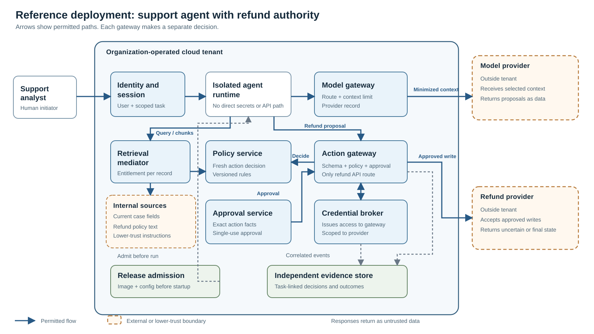

# Agentic AI Security Reference Architecture

This architecture places security decisions and enforcement around **one agent run by the organization**. It shows which component controls a crossing, who operates that component, and what record proves the control ran. The [[agentic-ai-security-cmm-2026|Agentic AI Security Capability Maturity Model]] grades the organization's capability; the [[agentic-ai-security-cmm-measurement-protocol|CMM: Measurement Protocol (Assessor's Handbook)]] specifies how to examine it. A diagram or product purchase alone establishes neither.

## Purpose and reference deployment

This worked example uses a customer-refund agent. A support analyst who holds refund authority through an approved human workflow asks the agent to resolve a customer's case. The agent retrieves the customer's case record and internal refund policy, consults an externally hosted model, and proposes a refund. The analyst approves the exact customer, amount, and reason before an action gateway calls the external refund API. The analyst needs the business right to authorize that refund, but does not need the gateway's API credential. The organization operates the agent, corpus, policy service, gateways, credential broker, and audit store in its cloud tenant. The model provider and refund provider operate beyond that tenant. The example assumes structured tool calls and an isolated agent process; it does not grant the agent code execution or general internet access.

The protected assets are the customer's record, internal policy, refund authority, service credentials, and the action trail. The human initiator is authenticated, but their request does not confer every permission they hold on the agent. The organization sets a narrower task scope and a refund limit. The model returns text and proposed actions; it does not decide its own authority. Retrieved records, model output, and refund API responses may contain instructions or malformed fields and enter the agent as data.

The architecture is a logical design for this deployment, not a prescribed product stack. [[azure-rag-chatbot-security-profile|Azure-Native RAG Chatbot Security Profile (Copilot Studio)]] and [[google-cloud-agentic-security-profile|Google Cloud Agentic Security Profile]] apply its boundaries to named deployment routes. The [[agentic-ai-security-ra-gaps|Agentic AI Security RA Gaps]] page tracks unresolved implementation properties. The contracts below remain useful when products or provider interfaces change.

## Protection objectives and trust assumptions

The design must make these properties testable:

- **Bounded action.** A refund is authorized for the initiating analyst, the agent workload, the active task, the customer, the amount, and the destination. The gateway repeats the decision immediately before the write.
- **Bounded data.** Retrieval checks the analyst's entitlement for each returned record. The model gateway sends only the case facts needed for the task, under an approved provider data-handling agreement.
- **Bounded output.** The model response is screened for restricted content before display or tool routing, and the application encodes displayed text for its rendering context.
- **Separated authority.** The model and agent process receive no refund credential. The credential broker supplies one to the gateway for the approved API call.
- **Contained execution.** The agent process starts inside its isolation boundary before it reads task data or tool configuration. Network rules permit only the named mediators.
- **Reconstructable result.** Independent records bind the user request, retrieved sources, model version, proposal, policy decision, approval, API request, and outcome to one task identifier.
- **Controlled failure.** The organization can stop new writes on policy, approval, credential, or audit failure and can reconcile an uncertain external API outcome.

These properties depend on administrative controls outside the agent process. A tenant administrator can change policy, corpus access, and release configuration. Those changes require separate authorization and audit. A compromised model provider, authorized analyst, or refund provider can still cause harm within its own authority. The design limits what such a party can induce through the agent path. It cannot attest to a provider's internal operation from customer side logs alone. The [OWASP AI Exchange agentic overview](https://owaspai.org/go/agenticaioverview/) supports placing access control and containment in surrounding systems because multi-step tool use creates execution paths that prompts cannot enumerate or enforce.

## Logical components and trust boundaries

The solid boundary in the diagram encloses services the organization operates. Dashed boundaries mark content and services whose output must be validated on entry. The action gateway requests scoped API access from the credential broker. The broker returns it to the gateway, which uses it to authenticate the approved write to the refund provider. An internal document may be access controlled and still carry hostile instructions. An authenticated response from the refund provider establishes its network origin under the agreed protocol; it does not make response text an instruction to the agent.

| Component | Operator | Enforceable responsibility |
|---|---|---|
| Identity and session service | Identity team | Authenticate the analyst; bind task, workload identity, and expiry. |
| Agent runtime | Application team | Run the approved agent image with confined storage, process, and network access. |
| Retrieval mediator | Data owner and application team | Check entitlements; return current case state and source-identified document chunks. |
| Model gateway | Application team | Limit provider route and context. |
| Model gateway | Application team | Identify the model version. |
| Model gateway | Application team | Screen returned content. |
| Policy service | Security architecture team | Version action rules and decide from actor, task, resource, amount, and risk. |
| Action gateway | Application team | Validate proposal schema, obtain a fresh permit, enforce approval, and issue the write. |
| Approval service | Business owner | Present canonical action facts and issue a single-use approval bound to them. |
| Credential broker | Identity team | Hold the external API credential and release scoped access only to the action gateway. |
| Evidence store | Security operations team | Accept correlated events through a path the agent cannot alter or delete. |
| Release admission | Engineering team | Admit approved image, model route, tool registry, policy version, and configuration. |

The **policy service decides** and the **action gateway enforces**. A runtime hook can observe or block a proposed call, but the gateway remains the enforcement point because the agent cannot be allowed an alternate route to the refund API. The retrieval mediator separately enforces data access. The evidence store receives events from these mediators rather than trusting an agent-authored narrative. This separation follows the policy decision and enforcement roles in [NIST SP 800-207](https://nvlpubs.nist.gov/nistpubs/SpecialPublications/NIST.SP.800-207.pdf#page=14) and the agent scope limits in the [OWASP AI Exchange's least privilege control](https://owaspai.org/go/leastmodelprivilege/). The particular component split is this architecture's synthesis.

### Boundary inventory

The design crosses five distinct authority boundaries. The analyst's authenticated session enters the application tenant. The retrieval mediator returns source-system case fields for business checks and document text as lower-trust content. A minimized prompt leaves the tenant for the model provider. A proposed action crosses from model-influenced runtime into the gateway's deterministic authorization path. The gateway sends an approved write to the refund provider and receives a lower-trust result. Admission and audit run beside this request path: admission controls what may start, and audit preserves what happened.

No direct route joins the runtime to the refund provider, corpus store, secret store, or audit store's administrative interface. Network reach is a necessary constraint, though it does not prove a permitted endpoint cannot relay or serve an unintended destination. The [[agentic-ai-security-ra-gaps|Agentic AI Security RA Gaps]] page records that transitive egress question. The [OWASP AI Exchange's sandboxing control](https://owaspai.org/go/agentsandboxing/) also identifies shared inference, policy, and credential services as channels that a process sandbox alone cannot isolate.

## Startup and action flows

### Admission and startup

The engineering team builds the agent image and a release manifest identifying its model route, tool endpoints, policy version, and configuration. The release decision uses a secure design review, first-party implementation checks, component provenance, and a test of the assembled agent. Release admission verifies the approved artifact and configuration before it starts a process. A model, tool, prompt, or connector change that alters authority creates a new release decision. The [OWASP AI Exchange supply-chain control](https://owaspai.org/go/supplychainmanage/) treats models, data, hosted services, and supplied abilities as provenance and provider-risk subjects; [NIST SP 800-218A](https://csrc.nist.gov/pubs/sp/800/218/a/final) supplies the secure development frame. The exact checks and their evidence belong to the D8 deep dive.

The platform then creates a confined runtime and attaches its workload identity. It loads only the admitted tool registry and policy reference. If a harness reads workspace files, hooks, or connector settings before confinement, the claimed isolation starts too late. The operator tests initialization order and blocks startup when confinement or admission fails. The application records image digest, configuration digest, policy version, workload identity, and start time as one release-to-session chain.

### Retrieval and model consultation

The analyst's request creates a task with an expiry and customer scope. The runtime asks the retrieval mediator for case and policy material. The mediator checks source access for the analyst and purpose scope for the task. It returns current structured case state and bounded document chunks with source and entitlement decision identifiers. Index-time access control does not replace this check: a source's rights may change after indexing. The application labels document text as content and prevents it from supplying tool arguments, policy rules, or new instructions by itself.

The model gateway sends the approved subset of case facts and policy text to the vendor model. The provider receives those facts beyond the tenant boundary. Contract terms, route configuration, and provider records establish the permitted processing and retention, to the extent the provider exposes them. The gateway screens the returned response for restricted content before it reaches a person or tool, and the application encodes any displayed text for its rendering context. The response may recommend a refund, but it returns to the runtime as a proposal. The application retains the prompt and response or privacy-preserving references sufficient for investigation under its retention policy. This is a design decision balancing reconstruction with a second sensitive copy in telemetry. The [OWASP AI Exchange monitoring control](https://owaspai.org/go/monitoruse/) calls for correlated agent actions and protected logs, subject to legal and privacy constraints. The [Exchange's output-encoding control](https://owaspai.org/go/encodemodeloutput/) addresses conventional injection when model text is rendered.

### Proposed write and execution

1. The runtime submits a structured proposal: task identifier, customer identifier, amount, currency, reason code, and refund API operation. Free text cannot supply an unrecognized field, select a new endpoint, or choose the request identifier.
2. The action gateway validates the schema and asks the policy service for a decision. The policy service checks the analyst's refund authority, agent identity, task scope, customer, amount ceiling, risk tier, and current policy version. It checks refund eligibility against current case-system fields obtained through the mediator, rather than a model account of the case. A denial stops the flow before any credential is obtained.
3. For this refund action, the approval service displays the customer, amount, reason, destination, and source case to the analyst using gateway data. The analyst approves or declines. The service signs or otherwise protects a single-use approval bound to the canonical proposal, approver, and expiry. The gateway rejects an altered amount or customer even if the model reuses the approval text.
4. Immediately before execution, the gateway checks task validity, revocation, approval, policy, and current case state again. It looks up the approved task and action instance to prevent a duplicate proposal from obtaining a fresh request identifier while the first outcome is unresolved. It then fixes an identifier to that instance outside the model context and records it before sending. The credential broker supplies a refund API credential scoped to the gateway and intended provider. The runtime and model context never receive it. The gateway sends the write with that identifier so a retry can be reconciled with provider state.
5. The gateway records the provider response and a completion or uncertain-outcome status. It returns only normalized fields to the runtime. The response body remains untrusted content; a provider message cannot authorize a second refund. If the provider times out after accepting the write, the gateway holds another send until it confirms provider state by request identifier or a named owner resolves the reconciliation. A retry follows only a confirmed non-application or provider duplicate suppression for that identifier.

The gateway, policy service, approval service, broker, and provider records share the task and request identifiers. The evidence store records both successful and denied attempts. An assessor can compare the proposal with the exact approval and the API request, then inspect the policy version that authorized it. A model-generated account of the action is useful context but is not the execution record.

## Boundary contracts and verification

An operator should attempt a prohibited crossing at each boundary. The tests below specify the expected refusal and the minimum record that shows it. The assessor selects a representative sample and examines both configuration and observed behavior through the [[agentic-ai-security-cmm-measurement-protocol|CMM: Measurement Protocol (Assessor's Handbook)]]. The [OWASP AI Exchange testing guide](https://owaspai.org/go/testing/) calls for direct gateway tests and infrastructure log-integrity tests alongside model-facing attacks; this table makes those tests specific to the refund path.

| Boundary | Permitted crossing | Rejection test | Evidence | Accountable operator |
|---|---|---|---|---|
| Session to task | Authenticated analyst creates a scoped task. | Reuse an expired session or another customer's task. | Session and task records | Identity team |
| Corpus to runtime | Entitled case state and source-identified chunks. | Retrieve another customer's record through the same index. | Entitlement decision and returned IDs | Data owner |
| Tenant to model vendor | Approved route and minimized context. | Send a marked secret or use an unapproved model route. | Gateway policy and provider request log | Application team |
| Model to application | Screened response rendered as data. | Return a restricted secret or executable markup. | Screen decision and encoded display | Application team |
| Runtime to action gateway | Schema-valid refund proposal. | Add an endpoint or change amount after approval. | Gateway denial and proposal digest | Application team |
| Approval to execution | One-use approval for exact action. | Replay approval or substitute customer ID. | Approval token and gateway decision | Business owner |
| Broker to refund API | Gateway-held, audience-bound credential. | Call provider directly from runtime or reuse a token elsewhere. | Network denial and broker issuance | Identity team |
| Gateway to refund provider | One approved write with a gateway-bound request identifier. | Timeout after provider acceptance, then propose the same refund under a new identifier. | Held duplicate, provider state lookup, and reconciliation record | Application team |
| Runtime to audit | Correlated append events from mediators. | Ask the runtime to suppress or delete a denied-action record. | Independent event and access log | Security operations |
| Release to runtime | Admitted image and configuration. | Start with a modified tool registry or disabled sandbox. | Admission denial and image digest | Engineering team |

The tests have different reach. A blocked direct connection proves that the runtime lacks that network path in the tested environment. It does not prove every allowlisted service is transitively constrained. A valid token audience proves the credential is intended for the refund provider, not that the provider applies the customer's business rule. When the action gateway uses a remote Model Context Protocol server, the [current MCP authorization specification](https://modelcontextprotocol.io/specification/2026-07-28/basic/authorization/security-considerations) additionally requires the server to validate tokens issued for that server and forbids passing a client token through to an upstream API. These distinctions belong in the recorded residual risk.

## Failure behavior and trade-offs

The protected task stops when durable audit is unavailable. The write path denies new actions when policy, approval, or credential issuance fails. Confidential retrieval stops when entitlement cannot be checked. A public-information service may use a separate, preapproved path during an outage. It does not inherit the protected task's authority. An agent sandbox that fails to start blocks the agent session. Provider-model unavailability prevents a new proposal and cannot justify an unreviewed write.

Revocation stops future gateway calls and broker issuance. It cannot undo a refund already accepted by the provider. The application therefore needs a business compensation procedure, an external request identifier, and a reconciliation owner. A timeout is an uncertain result until provider state confirms it. Automatic replay of a non-idempotent write risks a duplicate refund.

Central gateways simplify policy review and evidence correlation but create a service dependency and a concentration of authority. A distributed gateway or sidecar can reduce contention, provided every route enforces the same policy version and emits equivalent evidence. Caching can help low-risk reads; the refund decision is reevaluated at execution because revocation, customer state, and approval may change between proposal and write. The model provider adds latency and a data-handling boundary. The operator should budget for policy calls, human approval work, audit retention, and incident reconstruction, then choose latency and availability targets for this deployment. The architecture assigns no universal gateway size, approval threshold, or retention period.

## Deployment-shape adaptations

These shapes change the topology and evidence owner. They do not inherit the example's approval rule or a fixed maturity target.

| Shape | Topology and control change | Evidence and owner change |
|---|---|---|
| Read-only assistant | Remove the refund write path, approval service, and refund credential. Keep entitlement, model routing, output controls, and audit. | Data owner proves answer-time entitlement. Application team proves the absence of a write route. |
| Local coding agent | Run on a managed workstation or isolated runner. Confine before reading repository configuration. Mediate file, command, Git, and network actions. | Endpoint or runner owner supplies isolation and policy evidence. Repository owner supplies configuration and dependency admission records. |
| Vendor-managed suite | The vendor may hold model, runtime, policy, and tool path. Customer configuration bounds reach but may not be an in-path enforcement point. | Customer obtains vendor boundary and audit evidence, tests tenant settings, and records unavailable evidence as an assessment limit. |
| Multi-agent system | Give each agent a separate identity and scope. Route messages through an authenticated broker; validate schema and delegation without expanding authority. | Broker owner retains per-hop decisions and correlation. Incident response must reconstruct the chain across agents. |

The [[generative-coding-deployment-shape-2026|Generative Coding Deployment Shapes]] page details coding-agent placement and approval differences. The [[productivity-assistant-deployment-shape|Productivity Assistant Deployment Shape]] traces the read, synthesis, and action threats of employee assistants across in-suite, enterprise-app, and desktop placements; the Gemini control sheets specify customer-operated controls on two of those routes. In a vendor-managed suite, an assessor should distinguish controls the customer can test from provider assertions or contractual commitments. A missing provider trace cannot be replaced by a customer diagram.

Where a multi-agent broker uses [[a2a-protocol|A2A Protocol (Agent-to-Agent)]], its task and message interfaces carry the exchange; broker authentication, per-hop authorization, and correlation records remain deployment controls.

## Assurance and provenance

The architecture decision record for a deployed agent should retain the diagram, asset and boundary inventory, permitted routes, failure decisions, control operators, and rejection-test results. It should identify the version actually deployed. The CMM deep dives own grading criteria; this page identifies where their evidence originates:

- [[agentic-ai-security-cmm-d1-governance|CMM D1: Governance and Accountability]] owns approval of the use case, risk, and residual provider dependence.
- [[agentic-ai-security-cmm-d2-identity|CMM D2: Identity and Authorization]] owns workload, user delegation, and credential lifecycle.
- [[agentic-ai-security-cmm-d3-control-least-agency|CMM D3: Control and Least-Agency]] owns action policy, task scope, and approval binding.
- [[agentic-ai-security-cmm-d4-runtime-guardrails|CMM D4: Runtime and Guardrails]] owns process isolation and runtime input handling.
- [[agentic-ai-security-cmm-d5-egress-network|CMM D5: Egress and Network]] owns permitted routes to the model, tools, and external API.
- [[agentic-ai-security-cmm-d6-data-rag|CMM D6: Data, Memory and RAG]] owns source entitlements, retrieval, and data retention.
- [[agentic-ai-security-cmm-d7-observability|CMM D7: Observability and Detection]] owns independent, correlated operational records and detection.
- [[agentic-ai-security-cmm-d8-supply-chain|CMM D8: Engineering and Supply Assurance]] owns secure design, implementation checks, component provenance, assembled-agent testing, and release admission.
- [[agentic-ai-security-cmm-d9-operations|CMM D9: Operations and Human Factors]] owns approval operations, response, reconciliation, and retirement.

The architecture method follows [NIST SP 800-160 Vol. 1 Rev. 1](https://nvlpubs.nist.gov/nistpubs/SpecialPublications/NIST.SP.800-160v1r1.pdf#page=138) in making boundaries, interfaces, and verification traceable to protection needs. [NIST SP 1800-35](https://csrc.nist.gov/pubs/sp/1800/35/final) separates zero-trust concepts from example implementations. Those publications do not prescribe this agent topology. The [OWASP AI Exchange agentic overview](https://owaspai.org/go/agenticaioverview/) and its controls for [sandboxing](https://owaspai.org/go/agentsandboxing/), [least privilege](https://owaspai.org/go/leastmodelprivilege/), [monitoring](https://owaspai.org/go/monitoruse/), and [supply-chain management](https://owaspai.org/go/supplychainmanage/) supply the agent-specific threat and control basis.

Three residual limits remain material to this deployment. The model provider receives confidential task context and must be assessed for its own processing and retention. A model alias may also hide a provider-side version change. Entitled source text can mislead the model even when access control works, so the action gateway constrains its effect. The refund provider's accepted state is authoritative after a timeout. The tenant audit trail alone cannot establish whether an uncertain write took effect. The design record names the operator who accepts each limit and the evidence available to revisit it.
