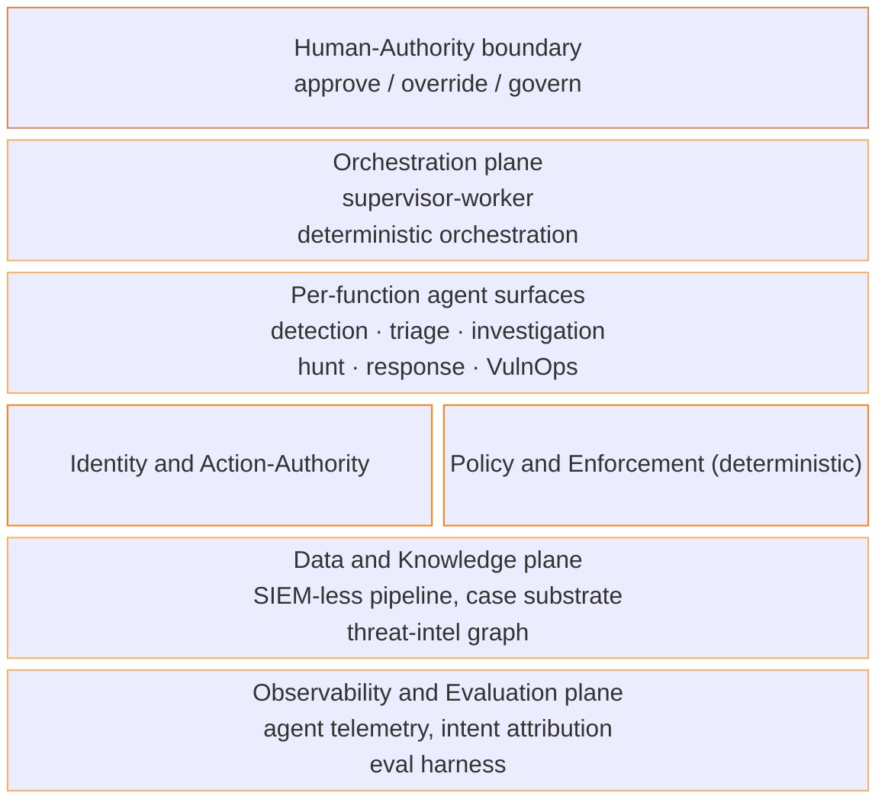

# Agentic SOC Reference Architecture

This reference architecture is the structural counterpart to the [[agentic-soc-cmm|Agentic SOC Capability Maturity Model]]. The CMM scores whether a security operations center has *earned* the autonomy it grants its agents; this RA describes *what to build* so that autonomy is enforceable. It realizes the CMM's function × autonomy grid as a set of planes and per-function agent surfaces. It is distinct from the [[agentic-ai-security-reference-architecture|Agentic AI Security RA]] that secures agentic-AI *applications*; the two overlap only where the SOC's own agents must be secured like any other non-human identity.

Its durable subject is **trusted-autonomy operations**: running detection and response at machine speed without losing control of it. The planes are mechanism-agnostic — deterministic automation and AI agents both run on them — and the design is **cloud-native and SIEM-less by default** (it does not assume centralized log storage or human-paced workflows).

## On this page

- [[#Design principles]]
- [[#The six planes]]
- [[#Per-function agent surfaces]]
- [[#The monitored attack surface]]
- [[#Recommended stacks by org profile]]
- [[#Threat-control matrix]]
- [[#Trade-offs]]
- [[#Gaps in the architecture]]
- [[#Prior work and comparison]]

**What this RA delivers.** A coordinated set of agents that run SOC functions under enforced policy, not a single autonomous system. Each plane maps to a maturity domain the CMM scores: the architecture is the implementation surface, the CMM is the measurement scaffold over it. The goal is the accountable autonomy the CMM gates. Agents act independently within bounds, and every action is identity-bound, policy-checked, observable, and reversible at the human-authority boundary.

## Design principles

1. **Supervisor-worker topology, deterministic orchestration.** An orchestrator routes work to per-function worker agents; control flow between steps is deterministic, not an open-ended autonomous chain. Salesforce's production [[beyond-the-chatbot-talk|Polyphonic supervisor-worker SOC]] is the reference instance, with max-iteration governance and an explicit Agent-Executor / Capability-Executor split.
2. **The human-authority boundary is a first-class plane.** It is the surface where the per-function autonomy level is enforced and where humans approve, override, or revoke. It is the surface every consequential action crosses, not a setting buried in a tool.
3. **Deterministic enforcement is the reliability substrate.** Policy-as-code ([[hooking-coding-agents-with-cedar-talk|Cedar]]), typed tool contracts, and [[plan-validate-execute|plan-validate-execute]] bound what an agent can do. More deterministic enforcement raises the autonomy a function can safely reach; it is the mechanism by which the identity/authority and governance domains are matured.
4. **Evaluation in the loop.** Agent decision quality is measured against ground truth before a function's autonomy is raised; the evaluation harness feeds the CMM's gating rule, not a one-off benchmark.
5. **Domain knowledge in the tooling, not the model.** Detection content, response playbooks, and threat-intel grounding live in the tools and data the agents call, so capability does not depend on model choice.
6. **Cloud-native and SIEM-less by default.** Detection runs in the pipeline and search happens where data lives (see [[security-data-pipeline-architecture|Security Data Pipeline Architecture]]); the architecture does not assume a centralized, ingest-everything store.
7. **The SOC's own agents are secured like any other non-human identity.** Per-agent identity, scoped action-authority, supply-chain integrity, and observability of the agents themselves are the shared layer with the [[agentic-ai-security-reference-architecture|application-security RA]]; the two cross-reference rather than duplicate it. The SOC is at once a defender and a defended surface.

## The six planes

Each plane is scored by a CMM domain; the shared-layer planes also secure the SOC's own agents.

### 1. Orchestration plane

The supervisor-worker control structure: an orchestrator decomposes work and routes it to per-function worker agents, with deterministic step sequencing and max-iteration limits. It carries the *mechanism* of each function — deterministic playbook, AI agent, or a hybrid where deterministic steps wrap AI decisions. No CMM domain scores orchestration directly; it is the substrate the autonomy ladder is measured on.

### 2. Identity and Action-Authority plane *(shared layer)*

Every agent has a verifiable identity that traces to a human owner, with scoped, revocable permissions and per-action authority tiers (auto / propose / approve / block). Response actions are gated by blast-radius limits and a human override path. Scored by **CMM D4 (Agent Identity and Action-Authority)**; shared with the application-security RA's identity plane.

### 3. Policy and Enforcement plane (deterministic) *(shared layer)*

The deterministic control surface: policy-as-code decision points, typed tool contracts, and plan-validate-execute gates that every consequential action crosses. It is where "act with approval" (L2) and "autonomous within bounds" (L3) are mechanically enforced rather than prompted. Scored jointly by **D4** and **CMM D8 (People and Governance)**; shared with the application-security RA's control/runtime planes.

### 4. Data and Knowledge plane

The SIEM-less data substrate: a security data pipeline (detection-in-pipeline, search-in-place, schema-on-read), the case/thread investigation substrate ("threads, not cases"), and the threat-intelligence knowledge graph that grounds the analysis functions. It also carries the ground-truth store the evaluation harness reads. Scored by **CMM D1 (Telemetry and Data Readiness)** and **D2 (Threat Intelligence and Knowledge)**; detailed in [[security-data-pipeline-architecture|Security Data Pipeline Architecture]].

### 5. Observability and Evaluation plane *(shared layer)*

Agent telemetry over OpenTelemetry `gen_ai` conventions, the intent-attribution layer that distinguishes human from agent activity ([[genai-endpoint-observability-talk|the broken-intent-attribution problem]]), full action auditability, and the evaluation harness that scores agent decisions for the gating rule. Scored by **CMM D5 (Observability and Oversight)** and **D3 (Evaluation and Ground-Truth)**; shared with the application-security RA's observability plane.

### 6. Human-authority boundary

The explicit surface where per-function autonomy is enforced and humans approve, override, govern, and are accountable. It is asymptotic by design: the top autonomy tier still terminates here, consistent with the analyst position that a fully autonomous SOC is not the goal. Scored by **CMM D8 (People and Governance)**.

## Per-function agent surfaces

Each of the CMM's eight functions runs as a worker-agent pattern on the planes above, gated by the domains the CMM names for its autonomy level.

| Function | Agent surface | Primary planes | Primary autonomy gates |
|---|---|---|---|
| Data management | Pipeline / routing / on-demand access agents | Data and Knowledge | D1 |
| Detection engineering | Detection-as-code + detection-in-pipeline; deception; control/detection validation | Data and Knowledge; Policy | D1, D3 |
| Alert triage | Triage / verdict agents | Orchestration; Observability | D1, D4, D3 |
| Investigation and case mgmt | Correlation / "threads" agents | Data and Knowledge; Observability | D1, D5 |
| Threat hunting | Hypothesis / hunt agents | Data and Knowledge; Orchestration | D1, D3, D5 |
| Incident response and containment | Response / containment agents (incl. AI-IR playbooks) | Identity and Authority; Policy; Boundary | D4, D5, D7, D8 |
| Exposure and VulnOps | Exposure / remediation agents | Data and Knowledge; Policy | D1, D4 |
| Reporting and post-incident | Reporting / lessons-to-detections agents | Observability; Data and Knowledge | D3, D5 |

Threat intelligence and continuous evaluation are cross-cutting: the first grounds the analysis surfaces from the Data and Knowledge plane, the second runs on the Observability and Evaluation plane and feeds the gating rule.

Each analysis-and-response function has a deep-dive page detailing its agent surface, its per-function autonomy progression, and the domains that gate each rung:

- [[agentic-soc-ra-detection-engineering|Detection Engineering]] — detection-as-code and detection-in-pipeline, deception, and control validation (gated by D1, D3).
- [[agentic-soc-ra-alert-triage|Alert Triage]] — verdict and prioritization agents, where delegation pays off earliest and the human boundary sits at auto-close (D1, D4, D3).
- [[agentic-soc-ra-investigation-case-management|Investigation and Case Management]] — "threads, not cases" correlation; reasoning-heavy and reversible (D1, D5).
- [[agentic-soc-ra-threat-hunting|Threat Hunting]] — hypothesis-driven hunting with an explicit automation boundary (D1, D3, D5).
- [[agentic-soc-ra-incident-response|Incident Response and Containment]] — pre-authorized containment under authority gating; the only function reaching the full L4 gate set (D4, D5, D7, D8).
- [[agentic-soc-ra-exposure-vulnops|Exposure and VulnOps]] — continuous discovery and remediation, with discovery and remediation autonomy gated separately (D1, D4).

Data management is realized as the [[security-data-pipeline-architecture|data pipeline]] on the Data and Knowledge plane rather than a separate agent deep dive, and reporting and post-incident learning wrap the analysis functions rather than standing alone.

## The monitored attack surface

The SOC's functions cover a cloud-native estate: endpoints, cloud workloads and control planes, identity, network, and SaaS. The architecture adds one asset class the traditional SOC did not model — **in-house AI applications**. Internally built GenAI and agentic apps are a monitored surface: prompt-injection campaigns, jailbreaks, RAG data exfiltration, model abuse, and agent hijacking are detected and responded to by the same functions, threat-modeled by [[mitre-atlas|MITRE ATLAS]] and carried as AI-application telemetry on the Data and Knowledge plane. AI attacks rarely leave traditional file or network signatures, so this is primarily a telemetry-readiness (D1) and tradecraft (D6) requirement. *Securing* those applications by design remains with the [[agentic-ai-security-reference-architecture|application-security RA]]; the SOC monitors and responds.

## Recommended stacks by org profile

Vendors and FOSS are named as dated, swappable examples, not endorsements. The point is concreteness; substitute freely.

| Band | Data and detection | Agents | Identity / policy / eval |
|---|---|---|---|
| Solo / small | Managed detection (MDR/MSSP) or open stack (Wazuh, Security Onion, Elastic); open pipeline + SigmaHQ content | A few well-gated agents on borrowed capability | Lean on the provider; minimum-viable-resilience floor |
| Mid | Commercial SIEM/XDR (Sentinel, Elastic, Splunk) + a data-pipeline platform (Cribl, SOC Prime) | Selective delegation on high-volume functions (triage, detection) | In-house identity + deterministic policy; evaluation on the delegated functions |
| Enterprise | Data-pipeline-native, multi-source; security data lake | Full per-function fleet (e.g. Microsoft Security Copilot agents, Google SecOps Gemini, CrowdStrike AIDR; or open-weight agents) | Per-agent identity, policy-as-code, dedicated evaluation and governance |

The small-team column is the load-bearing one: agentic AI lowers the automation barrier (no hand-built playbook or ETL engineering), so SOC-grade defense becomes reachable below the traditional cyber-poverty line. The path there is borrowing capability and gating a few agents tightly, not buying a fleet.

## Threat-control matrix

| Threat | Plane / control | CMM gate |
|---|---|---|
| AI-powered attacker at machine speed | Higher per-function autonomy on triage/detection, earned via evaluation | D3, autonomy ladder |
| Over-delegation (reckless autonomy) | Human-authority boundary + the gating rule (autonomy capped by weakest governing domain) | D8, gating rule |
| Compromise of a defender agent | Per-agent identity, scoped authority, agent supply-chain integrity | D4, D7 |
| [[prompt-injection\|Prompt injection]] / abuse of an in-house AI app | ATLAS-mapped detections; AI-app telemetry; AI-IR playbooks | D6, D1 |
| Containment action with excessive blast radius | Deterministic policy gate, blast-radius limits, approval tier | D4 |
| Data-pipeline poisoning / blind spots | Telemetry coverage + ground-truth integrity on the Data plane | D1 |
| Alert flooding / signal collapse | Detection-in-pipeline filtering; triage autonomy earned via evaluation | D1, D3 |

## Trade-offs

- **Deterministic enforcement vs. adaptability.** Policy-as-code bounds agents and is exhaustively testable, but over-tight policy caps the autonomy AI could safely reach. The mechanism attribute makes this an explicit, per-function choice rather than a global setting.
- **SIEM-less flexibility vs. operational maturity.** Decoupled pipelines and search-in-place cut cost and remove rule-scaling limits, but distribute complexity across more components; small teams should prefer managed or converged stacks.
- **Earned autonomy vs. speed pressure.** The gating rule deliberately slows autonomy advancement to the pace of evaluation and governance maturity, which can feel conservative against machine-speed attackers. That restraint is the intended discipline, not a defect.

## Gaps in the architecture

> [!gap] Open and forthcoming
> - The per-domain control and tooling detail ("how") lives in the eight [[agentic-soc-cmm#per-domain-deep-dives|CMM domain deep dives]], and the per-function agent-surface detail in the six [[#per-function-agent-surfaces|function deep dives]] linked above. Both carry wiki-internal calibration that will firm up as the model is applied.
> - The SIEM-less data plane needs the deeper treatment parked in [[security-data-pipeline-architecture|Security Data Pipeline Architecture]] (OCSF normalization, security-data-lake tier) before the Data and Knowledge plane is final.
> - D6 tradecraft scores coverage against D3FEND, which is thin on AI-era defensive techniques — a named contribution opportunity tracked in the [[d3fend-ai-defense-technique-gap|D3FEND AI-defense technique gap]].
> - Vendor current-state for the agent fleet (GA vs. preview across Microsoft, Google, CrowdStrike) is dated and should be re-verified at use.

## Prior work and comparison

The vendor agentic-SOC stacks — [[microsoft-security-copilot|Microsoft Security Copilot]] agents, [[google-agentic-soc|Google's Gemini SecOps agents]], CrowdStrike AIDR, and Salesforce's [[beyond-the-chatbot-talk|Polyphonic]] production SOC — instantiate parts of this architecture (supervisor-worker fleets under shared governance), but each is single-vendor and partial. This RA is the vendor-neutral synthesis, and it adds the explicit gating relationship to the [[agentic-soc-cmm|CMM]] that the vendor stacks leave implicit. The shared securing-the-agents layer is the [[agentic-ai-security-reference-architecture|Agentic AI Security RA]]; the program-level companion is the [[mythos-ready-security-program|Mythos-ready Security Program]].

## Relations

- Structural counterpart to [[agentic-soc-cmm|Agentic SOC CMM]]; both are anchored in [[agentic-soc-state-of-the-field|Agentic SOC: State of the Field]].
- Data plane detailed in [[security-data-pipeline-architecture|Security Data Pipeline Architecture]].
- Shares the securing-the-agents layer with [[agentic-ai-security-reference-architecture|Agentic AI Security RA]].
