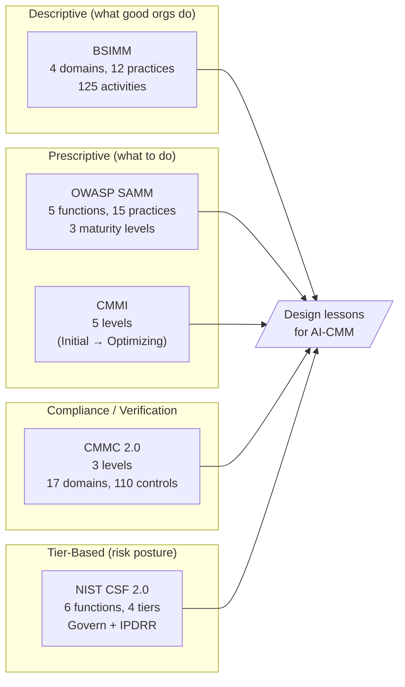
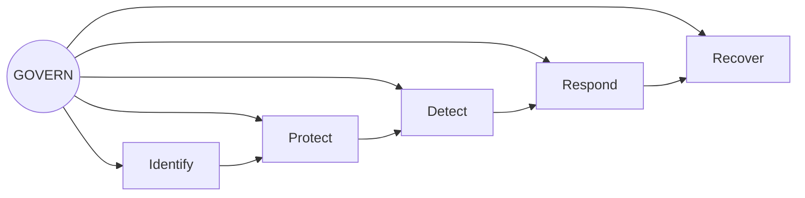

# Cybersecurity CMM Exemplars and Design Lessons

A reference catalogue of widely adopted cybersecurity Capability Maturity Models (CMMs), comparing their structure, scoring approach, and adoption signals, to extract design lessons for any new AI-security CMM.

## Purpose of a CMM

A capability maturity model lets an organization (or auditor) answer one question: **"How good are we at this, on a scale that means something to peers?"** Three properties are required for a CMM to be useful.

1. **Discrete levels** that an organization can plausibly achieve, evidence, and audit.
2. **Domains** that decompose the security surface into measurable practice areas.
3. **Evidence requirements** that distinguish "we wrote a policy" from "we operate a control."

## The five exemplars

### CMMI: the original ladder

The five-level scale almost everyone borrows: **Initial → Managed → Defined → Quantitatively Managed → Optimizing**. CMMI's strength is that the levels carry shared meaning across decades of practice. The weakness is that the original CMMI is a process-improvement model (developed at SEI/Carnegie Mellon), not a security model — security CMMs adopt the labels but redefine the level criteria.

**Adoption signal:** still the lingua franca for "what do you mean by 'mature'?" Even non-CMMI assessments use Level 1–5 vocabulary by default.

**Design lesson:** keep the five-level shape; executives recognize it.

### BSIMM: descriptive

Synopsys (now Black Duck) BSIMM is descriptive: it observes what mature software-security programs actually do and compiles those activities into a benchmark. Structure: **4 domains × 12 practices × 125 activities**. Each activity is rated as observed in a sample of N firms. There is no "pass/fail" — your firm reports which activities you do, then sees how that compares to the cohort.

**Adoption signal:** widely cited in AppSec circles; benchmark cohort updated annually; over 130 firms have published BSIMM scorecards.

**Design lesson:** descriptive grounding (build the model from real practice, not aspiration) makes the model survive contact with practitioners. The OSS-tooling-ahead-of-frameworks pattern in AI security ([[ai-security-standards-in-q1-2026|AI Security Standards in Q1 2026: Agentic Threats Outpace Frameworks]]) means a descriptive AI-CMM has more raw material than a prescriptive one in 2026.

### OWASP SAMM: prescriptive

OWASP SAMM is prescriptive: it tells you what to do. Structure: **5 business functions × 3 security practices × 3 maturity levels**. Each practice has clear progression criteria from level 1 (basic) to level 3 (optimized). Free, vendor-neutral, includes assessment toolkit.

**Adoption signal:** strong adoption in regulated industries (financial services, healthcare); 2024 SAMM-BSIMM crosswalk recognized convergence between the two.

**Design lesson:** the **3-level practice model** (basic → defined → optimized) is faster to operationalize than 5 levels for individual controls. Use 5 levels for the overall organization but 3 levels inside each practice if you want auditor-friendly criteria.

### CMMC 2.0: compliance-grade

The U.S. DoD CMMC is the rare CMM that ties to enforcement: contractors handling Controlled Unclassified Information (CUI) must achieve a certified level. Structure: **3 cumulative levels** (Foundational / Advanced / Expert) × **17 domains** × **110 controls** at Level 3. Third-party assessment by C3PAOs; self-assessment at Level 1.

**Adoption signal:** mandatory for DoD contractors; phased rollout across the defense industrial base began in 2025.

**Design lesson:** **cumulative levels** (Level N requires every Level N-1 control plus more) avoid the common CMM failure where an organization claims Level 4 in one domain while sitting at Level 1 in another. AI-CMM adoption will track AIUC-1 certification (Schellman accredited Feb 2026); cumulative levels match how AIUC-1 audits work.

### NIST CSF 2.0: risk-tiered with Govern

NIST Cybersecurity Framework 2.0 added the **Govern** function as the sixth pillar; it now sits at the center, informing the IPDRR cycle (Identify, Protect, Detect, Respond, Recover). Govern spans the most subcategories of any function.[^csf]

CSF 2.0 uses **4 Tiers** (not levels): Partial (1) → Risk Informed (2) → Repeatable (3) → Adaptive (4). Critically, NIST states explicitly that **tiers are not a maturity ladder to climb sequentially** — organizations select the tier matching their risk tolerance. Most should target Tier 3.

**Adoption signal:** voluntary but pervasive — referenced in U.S. federal acquisitions, state AI laws, and used as the default control catalogue for U.S. enterprise security programs.

**Design lesson:** **Govern at the center** is the right architectural move for an AI-CMM in 2026. Agentic AI introduces new identity, accountability, and oversight requirements (NIST CAISI Concept Paper, Feb 2026; CoSAI Principles April 2026) that don't fit neatly into any IPDRR phase — they cut across all of them.

## Comparative structure

| Model | Type | Levels | Domains | Activities | Audit | Free |
|---|---|---|---|---|---|---|
| CMMI | Process improvement | 5 | varies | varies | SCAMPI | No |
| BSIMM | Descriptive | n/a (observed activity counts) | 4 | 125 | self-report | No (membership) |
| SAMM | Prescriptive | 3 (per practice) | 5 functions × 3 practices | ~95 | self-assessment | Yes |
| CMMC 2.0 | Compliance | 3 (cumulative) | 17 | 110 controls (L3) | C3PAO | Yes |
| NIST CSF 2.0 | Risk-tiered | 4 tiers (not sequential) | 6 functions, 23 categories | 106 subcategories | self-assessment | Yes |

## Design lessons for an Agentic AI Security CMM

Distilled from the five exemplars:

1. **Use 5 levels for org-level rating** (CMMI vocabulary) but **3 levels for individual practice criteria** (SAMM model). Five-level granularity at the practice level is rarely defensible; auditors need fewer, clearer criteria per control.
2. **Make levels cumulative** (CMMC). Avoids the "Level 4 in Identity, Level 1 in Containment" pathology that produces unbalanced security postures.
3. **Put Govern at the center** (NIST CSF 2.0). Agentic AI introduces accountability, lifecycle, and identity-binding requirements that span every other domain. The AI-specific counterpart to these general cybersecurity CMMs is the [[nist-ai-rmf|NIST AI RMF]], whose GOVERN function plays the same central role across its MAP/MEASURE/MANAGE cycle; an Agentic AI Security CMM inherits its governance vocabulary from the RMF rather than from CSF alone.
4. **Anchor evidence in observable artifacts**, not policies (BSIMM). "Has a written prompt-injection policy" is Level 2 at best; "runs a quarterly red-team evaluation against production agents with results delivered to the CISO" is Level 4.
5. **Distinguish prescriptive from descriptive** (SAMM vs BSIMM) — for AI security in 2026, the field changes too fast for fully prescriptive level-5 criteria; the highest tier should describe the leading edge ("contributes to standards / publishes research"), not freeze it.
6. **Tier 5 / Level 5 must be achievable today.** The NIST CSF 2.0 lesson — most orgs should not expect to reach the top tier — applies, but the top tier itself must reference real, shippable controls (LlamaFirewall in production, Microsoft Agent 365, Okta for AI Agents, AgentGateway) so that "Optimizing" isn't science fiction.

## Open questions

- **Should an AI-CMM be its own model or an addendum to CSF 2.0?** Microsoft ZT4AI maps controls to CSF; that suggests overlay rather than replacement. ([[microsoft-rai|Microsoft Responsible AI Standard (RAI)]])
- **Cumulative vs. independent domain scoring?** CMMC's cumulative model is auditor-friendly but punishes balanced-but-young programs. Independent domain scores in the [[nist-ai-rmf|NIST AI RMF]] style — the RMF scores risk per GOVERN/MAP/MEASURE/MANAGE function rather than as a single cumulative ladder — are more honest but harder to communicate.
- **Who certifies?** AIUC-1 has Schellman; ISO 42001 has 15 accredited bodies. An open AI-CMM needs the same accreditation pipeline or it stays advisory.

## Relations

- Compares: [[clasp|CLASP]], [[red-teaming-capability-framework|Red Teaming Capability Framework]] — narrower CMMs targeting specific agentic-AI capabilities.
- Adjacent: [[soc-cmm|SOC-CMM]] — the SOC-specific incumbent maturity model; this catalog covers cross-cutting design lessons rather than SOC operations, so SOC-CMM sits beside these exemplars rather than among them.
- Informs: [[agentic-ai-security-cmm-2026|Agentic AI Security Capability Maturity Model]] — the practical CMM proposal that applies these design lessons.

[^csf]: NIST, [Cybersecurity Framework 2.0 (CSWP 29)](https://nvlpubs.nist.gov/nistpubs/CSWP/NIST.CSWP.29.pdf) (February 2024). Govern has the most subcategories of the six functions.
