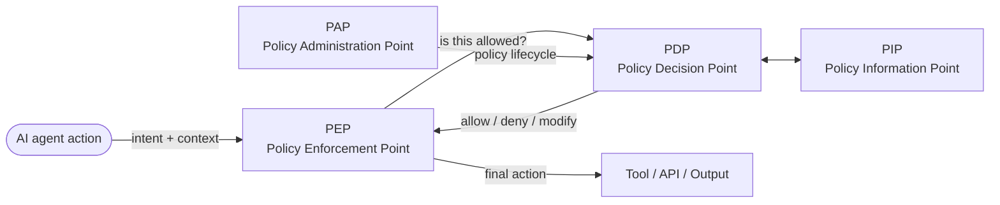

# Oversight Layer (PDP + PEP for Agentic AI)

The **oversight layer** is this wiki's architectural primary term for the system that monitors, evaluates, and intervenes on the behavior of AI agents in production. It is a layer (not a single component), built from **Policy Decision Points (PDPs)** and **Policy Enforcement Points (PEPs)**, fed by **Policy Information Points (PIPs)** and managed by **Policy Administration Points (PAPs)** — the four-role decomposition originating in the [[xacml|XACML]] policy-language lineage (now dormant) and currently codified in [[nist-sp-800-162|NIST SP 800-162]] §2.2 (NIST's Guide to Attribute Based Access Control), the wiki's preferred living-standard citation for the role vocabulary.

Other terms describe the same role from different vantage points; [§Cross-walk](#cross-walk) below sets them side by side. The wiki uses **oversight layer** in architectural and practitioner-facing pages, and [[guardian-agent|guardian agent]] in procurement-language and comparison pages.

## Basis for the term

The oversight-layer framing carries three properties the wiki uses:

1. **Architectural precision.** PDP / PEP / PIP / PAP are well-defined roles with stable semantics from XACML and zero-trust literature. Each names what a component *does*, so the vocabulary survives a rebrand.
2. **Implementation independence.** An oversight layer can be deterministic (Cedar policy, OPA rules), AI-based ([[llm-as-a-judge|LLM-as-a-judge]]), or hybrid, and the terminology admits all three.
3. **Layer shape.** The oversight role spreads across the identity, control, runtime, egress, data, and observability planes, so no single product holds it. "Layer" captures that distribution; "agent" implies a single actor.

The framing costs procurement-language gravity, which [[guardian-agent|Guardian Agent]] holds instead. The wiki keeps both terms and leads with whichever fits the audience.

## The four roles ([[xacml|XACML]] / zero-trust lineage)

| Role | Responsibility | Examples in this wiki |
|---|---|---|
| **PEP — Policy Enforcement Point** | Sits in the action path; intercepts every consequential agent action; applies the PDP's decision | LlamaFirewall (PromptGuard 2 + AlignmentCheck + CodeShield); AgentGateway; NVIDIA NeMo Guardrails; Microsoft Prompt Shields; before_tool / before_model lifecycle hooks |
| **PDP — Policy Decision Point** | Evaluates policy against context; produces an allow/deny/modify decision | Cedar (AWS); OPA/Rego; CSA ATF promotion-gate logic; capability-token / Warrant issuance |
| **PIP — Policy Information Point** | Provides context the PDP needs (identity, posture, risk score, threat intel, behavioral baselines) | [[agent-catalog\|AI Agent Catalog]]; AI-SPM; agent behavioral monitoring; OpenTelemetry `gen_ai.*` spans; [[agent-observability\|Agent Observability]] telemetry |
| **PAP — Policy Administration Point** | Manages the policy lifecycle (authoring, versioning, deployment, retirement) | Cedar policy repos in git; Kubernetes ConfigMaps; Microsoft Purview policies; CI/CD pipelines that test and deploy policy |

## Mapping to the six planes

The [[agentic-ai-security-reference-architecture|Agentic AI Security Reference Architecture]] decomposes the oversight layer into six planes. Mapping:

| Plane | XACML role | What lives here |
|---|---|---|
| Identity | PIP (subject identity) | [[spiffe\|SPIFFE]]/[[spiffe\|SPIRE]]; Okta for AI Agents; Microsoft Entra Agent ID; credential proxy |
| Control | **PDP + PAP** | Cedar/OPA evaluation; capability-token issuance; least-agency tier engine |
| Runtime | **PEP (in-process)** | Lifecycle hooks; LlamaFirewall; NeMo Guardrails; sandbox |
| Egress | **PEP (broker)** | AgentGateway; MCP/A2A proxy; tool annotation enforcement |
| Data | PIP (data context) + PEP (data egress) | RAG provenance; AI-BOM; [[cognitive-file-integrity\|cognitive file integrity]]; memory-poisoning detection |
| Observability | **PIP** (signals to PDP) | OTel `gen_ai.*`; agent behavioral monitoring; AI-SPM; SIEM |

PDP is concentrated in the Control plane. PEPs are distributed across Runtime / Egress / Data. PIPs span Identity / Data / Observability. PAP is cross-cutting (policy lifecycle).

The [[owasp-ai-exchange|OWASP AI Exchange]] states the same layering as a design constraint: security features belong outside the LLMs, in the architecture of the surrounding system, and inter-agent security is enforced at the message bus or orchestrator rather than in agent prompts ([`/go/agenticaioverview/`](https://owaspai.org/go/agenticaioverview/)).

## Mapping to Sentinels and Operatives

[[sentinels-and-operatives|Sentinels and Operatives]] is Gartner's runtime decomposition; it maps cleanly onto PIP / PDP+PEP:

| Gartner term | XACML role |
|---|---|
| **Sentinels** | PIPs (provide context, posture, situational awareness) |
| **Operatives** | PDP + PEP (decide and enforce) |

Sentinels feed Operatives. PIPs feed PDPs. Same shape, different vocabulary.

## Cross-walk

The same role goes by many names, and the last column names the audience each one fits.

| Term | Source | What it captures | When to use it |
|---|---|---|---|
| **Oversight Layer** | This wiki (architectural) | The layer-shaped role across PDPs / PEPs / PIPs / PAPs | Architectural and practitioner-facing pages |
| **PDP + PEP** | [[xacml\|XACML]], zero-trust | The decision/enforcement role split | Implementation discussions; precise component-level work |
| **Guardian Agent** | [[gartner\|Gartner]] (Feb 2026 Market Guide) | Holistic oversight: visibility + assurance + enforcement, evolving toward AI-driven supervision | Procurement, RFP structure, board-level reporting |
| **Reference Monitor** | Lampson (1971); classical security | "Always invoked, tamper-proof, verifiable" — formal-methods anchor | Threat-model writeups; formal proofs of containment |
| **Supervisory Agent** | Multi-agent systems literature | The supervising role in a multi-agent hierarchy | Academic / research contexts |
| **AI Firewall / AI Guardrail** | LlamaFirewall (Meta), Lakera, Lasso, NeMo | Input/output filtering at runtime — narrower than the full oversight layer | Component-level discussions of input filtering |
| **Agent Gateway / MCP Gateway** | AgentGateway (Linux Foundation); Solo Enterprise; Operant | Network/protocol-layer broker for tool calls + MCP — egress-plane only | Network/protocol-layer specifics |
| **Promotion Gate** | [[csa-maestro\|CSA Agentic Trust Framework]] (Feb 2026) | Staged authorization checkpoints for autonomy promotion | Autonomy-tier governance |
| **Compartmentalized LLM / [[camel-pattern\|CaMeL]]** | Google DeepMind research | Privileged-LLM-coordinates-Quarantined-LLM split — a containment *pattern* | Research-stage architectural discussions |
| **AI Watchdog / AI Auditor / AI Steward / AI Custodian** | Informal industry usage | Various — usually narrower | Informal contexts; not standardized |
| **AI Oversight / Human Oversight** | NIST AI RMF; [[eu-ai-act\|EU AI Act]] Art. 14 (effective oversight + interrupt to safe state — binding-law anchor, verified in [[standards-review-eu-ai-act-2026-Q2\|the 2026-Q2 EU AI Act review]]) | The umbrella concept; specifies no implementation | Regulatory / compliance writeups |
| **`#OVERSIGHT`** | [[owasp-ai-exchange\|OWASP AI Exchange]] control catalogue | The detective and gate-based half of blast-radius control, spanning automated detection and human approval; one clause of the Exchange's `MONITOR USE` control[^aix-oversight] | Standards-alignment writeups; evidence packages for AI Act or ISO audits |
| **`#LEAST MODEL PRIVILEGE`** | [[owasp-ai-exchange\|OWASP AI Exchange]] control catalogue | The preventative half: permissions and attack-surface reduction that bound what a manipulated model can reach, independent of whether the manipulation is detected[^aix-leastmodelpriv] | Standards-alignment writeups; procurement of policy-engine and capability-token components |

The Exchange also states a liaison contribution to ISO/IEC 27090 and prEN 18282, covering both controls; this is the source's own claim and is not independently verified here.[^aix-liaison]

**The Exchange draws the preventative/detective line where this page draws the PDP/PEP line, and the two cuts are not the same cut.** `LEAST MODEL PRIVILEGE` is preventative and `OVERSIGHT` is reactive or gate-based, and the Exchange states that both may apply to the same action tier.[^aix-oversight] A PDP evaluating a capability grant and a PDP gating a high-impact action on human approval are the same architectural role serving the two different controls, so a deployment that has stood up a policy decision point has satisfied one of the two and possibly neither. `OVERSIGHT` divides again inside itself: automated oversight (rules, monitors, policy gates) scales, and human oversight supplies accountability, judgement on ambiguous high-impact decisions, and context the automated layer does not hold, with automated detection escalating to the human layer.[^aix-oversight] In this page's vocabulary the automated half spans PIP detection and PEP enforcement, and the human half is a PEP that blocks until an approval signal arrives from outside the agent's execution path.

**Five traditions are naming the same role in real time.** Classical security calls it Reference Monitor, zero-trust PDP/PEP, multi-agent research Supervisory Agent, regulatory bodies Oversight, and commercial analysis Guardian Agent. Each carries the assumptions of its tradition. The wiki picks Oversight Layer + PDP/PEP for architectural rigor and Guardian Agent for procurement gravity, with the rest cross-referenced from this page.

## Distinction from the reference monitor

Reference Monitor carries the longest formal lineage of the options in the cross-walk: Lampson 1971, the formal-methods literature, and well-understood security semantics. Three properties keep the wiki from leading with it:

1. **Vocabulary age against threat pace.** The agentic-AI threat surface ([[prompt-injection|prompt injection]], [[lethal-trifecta|lethal trifecta]], MCP supply chain, [[tool-abuse-chains|tool-abuse chains]]) resists a clean mapping onto the system-call mediation Reference Monitor was designed for, and the fifty-year-old vocabulary has taken no term for it.
2. **Reference Monitor names a *property*, and the oversight layer is the structure that satisfies it.** "Always invoked, tamper-proof, verifiable" states what the layer must achieve and says nothing about the layer's own architecture. Conflating the two hides the layered implementation.
3. **Practitioner usage.** AI security teams in 2026 talk about gateways, guardrails, posture management, and agent identity, and a reader searching for the control in those terms finds a reference-monitor page by accident. Vocabulary aligned with practice reaches that reader; vocabulary aligned with formal lineage reaches the specifier.

The wiki keeps Reference Monitor as a property the oversight layer satisfies (see [[agent-observability|Agent Observability]] §1) and as one of the synonyms in the cross-walk above.

## Distinction from the guardian agent

[[guardian-agent|Guardian Agent]] §Why "Guardian Agent" carries the full critique. Four points summarize it:

- "Agent" does double duty, because the supervisor and the supervised are both agents.
- The term is anthropomorphic, implying a single autonomous actor where a layer of cooperating components sits.
- It conflates AI implementation with role: in Gartner's framing a deterministic policy engine doing the same job falls outside the category, whatever its function.
- Gartner coined it, so the vocabulary locks to one analyst firm's direction.

Each of these bears on architectural discussion, where the wiki therefore leads with oversight layer. Guardian Agent stays the term for procurement, RFPs, and board reports.

## Implications for the CMM

The [[agentic-ai-security-cmm-2026|Agentic AI Security CMM 2026]] domains map cleanly onto oversight-layer roles:

| CMM Domain | XACML role |
|---|---|
| D1 Governance & Accountability | PAP (policy lifecycle, ownership) |
| D2 Identity & Authorization | PIP (subject) + part of PDP (authz decisions) |
| D3 Control & Least-Agency | PDP + PAP (autonomy-tier policy) |
| D4 Runtime & Guardrails | PEP (in-process) |
| D5 Egress & Network | PEP (broker) |
| D6 Data, Memory & RAG | PIP (data context) + PEP (data egress) |
| D7 Observability & Detection | PIP (signals to PDP) |
| D8 Supply Chain & AI-BOM | PAP (policy provenance) + PIP (BOM as context) |
| D9 Operations & Human Factors | Cross-cutting |

The mapping carries CMM evidence. An L3+ claim on [[agentic-ai-security-cmm-d4-runtime-guardrails|D4]] names which PEPs are deployed and how they consume PDP decisions, and an L3+ claim on [[agentic-ai-security-cmm-d7-observability|D7]] names which PIPs emit signals and which PDPs consume them.

The human half of that split has a specification and no product enforcing it. A September 2026 canvass of twenty-one runtime-protection vendors found human approval offered as one selectable enforcement action configured per rule — Onyx's five are alert, block, mask, steer and ask — and found no product in the set implementing an approval that a clean automated check cannot skip on a defined class of high-blast-radius operations ([[agent-runtime-protection-canvass-2026-09|the canvass]]). An organization holding the non-bypassable reading builds that PEP itself, and an L3+ D4 claim resting on a vendor's approval feature records which of the two readings the product implements.

[[threat-modeling-for-ai|Threat modeling for AI]] works a multi-agent example where a PDP outside the model context is the control that downgrades the trifecta on an email-send path before any per-threat control is weighed, and the same PDP authorizes the executor agent's actions once per-agent identity (D2) is in place.

The mapping also carries a deployment order, worked through in [[threat-modeling-for-ai|Threat Modeling for AI]] against a three-agent enterprise assistant. Per-agent [[non-human-identity|identity]] (D2, the subject-side PIP) comes first, because a broker PEP resolves an intercepted action to a specific agent only where per-agent identity exists, and a runtime guardrail enforces decisions a PDP has already made. The same structural test that precedes threat enumeration also fixes the PDP's placement: the [[lethal-trifecta|lethal trifecta]] test marks the leg to remove or mediate, and the PDP goes on that leg, outside the model context, where an injected instruction cannot rewrite the decision it issues. Investment in PDP or PEP capability ahead of per-agent identity buys nothing at either role, which makes D2 the gating domain for an L3+ claim on D3, D4, or D5.

The oversight layer is the runtime mechanism by which an organization discharges the accountability the [[nist-ai-rmf|NIST AI RMF]] assigns to its GOVERN and MANAGE functions: GOVERN establishes who owns the policy and who is answerable for an agent's actions, while MANAGE requires that identified risks be responded to during operation. The PAP role carries the GOVERN-side policy lifecycle and ownership; the PDP/PEP path carries the MANAGE-side response that intervenes on a live action.

## See Also

- [[guardian-agent|Guardian Agent]] — the procurement-language synonym for this concept
- [[sentinels-and-operatives|Sentinels and Operatives]] — Gartner's runtime decomposition; maps onto PIP and PDP+PEP
- [[agentic-ai-security-reference-architecture|Agentic AI Security Reference Architecture]] — six-plane decomposition of the oversight layer
- [[agent-observability|Agent Observability]] — PIP-side telemetry primitives
- [[agent-catalog|AI Agent Catalog]] — a foundational PIP (subject inventory)
- [[guardian-agent-metagovernance|Guardian Agent Metagovernance]] — governing the oversight layer itself
- [[agentic-ai-security-cmm-2026|Agentic AI Security CMM 2026]] — maturity scoring per oversight-layer domain
- [[threat-modeling-for-ai|Threat Modeling for AI]] — worked multi-agent example using a PDP to downgrade a trifecta leg

## Notes

[^aix-liaison]: OWASP AI Exchange, ["About the AI Exchange"](https://owaspai.org/go/about/), retrieved 2026-08-17. The Exchange states 70 pages contributed to prEN 18282 and 70 pages to ISO/IEC 27090 through official liaison partnership, plus contribution to ISO/IEC 27091. These are the source's own claims and are not independently verified here.
[^aix-oversight]: [OWASP AI Exchange — OVERSIGHT](https://owaspai.org/go/oversight/), retrieved 2026-08-19. The preventative/detective distinction against `LEAST MODEL PRIVILEGE`, the automated/human oversight split, and the `MONITOR USE` nesting.
[^aix-leastmodelpriv]: [OWASP AI Exchange — LEAST MODEL PRIVILEGE](https://owaspai.org/go/leastmodelprivilege/), retrieved 2026-08-19.
