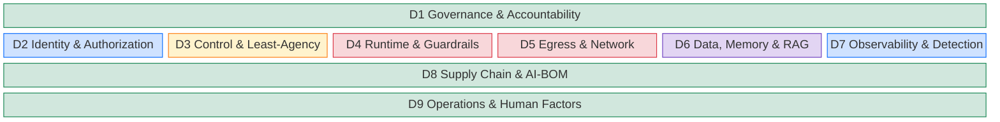

# Agentic AI Security Capability Maturity Model

An evidence-based Capability Maturity Model for agentic AI security. It applies the design lessons from CMMI, BSIMM, OWASP [[owasp-samm|SAMM]], CMMC 2.0, and NIST CSF 2.0 (see [[cybersecurity-cmms-exemplars|Cybersecurity Capability Maturity Models — Exemplars and Design Lessons]] for the per-exemplar treatment) to the threat surface and control stack in the [[agentic-ai-security-reference-architecture|Agentic AI Security Reference Architecture]].

The model is **descriptive at Levels 1–3** (controls observed in production at well-run organizations), **prescriptive at Level 4** (controls a mature program operates), and **achievable-today at Level 5** (capabilities available in shipping products and current specifications: Microsoft Agent 365, AgentGateway-LF, [[llamafirewall|LlamaFirewall]], [[aiuc-1|AIUC-1]] certification, Miggo DeepTracing). Integration across all nine domains remains rare. Research-stage and unshipped capabilities (TEE-backed guardrail attestation, multi-agent cascade-detection rule libraries, [[camel-pattern|CaMeL]] privileged/quarantined LLM split, cross-vendor AI-BOM federation, named standards contribution) sit in a separate **L5+ Leading Edge** tier that is aspirational and not required for L5. The [[cmm-calibration-stress-test-2026|CMM Calibration Stress Test (2026-05-02)]] introduced the L5 / L5+ split to keep **L5 achievable today** with shipping products.

The nine domains each carry a level summary here and full criteria in a deep dive. Read this page for the model — levels, domains, aggregation, and how to score against it; read a deep dive for the criteria, the dated control landscape, the cost model, and right-sizing by deployment shape.

## On this page

- [Foundational distinction: governance is not security](#foundational-distinction-governance-is-not-security)
- [Scope and boundaries](#scope-and-boundaries)
- [Five levels + a leading-edge tier (cumulative)](#five-levels--a-leading-edge-tier-cumulative)
- [Nine domains](#nine-domains)
- [Mapping to deployment shapes](#mapping-to-deployment-shapes)
- [Tooling map per domain](#tooling-map-per-domain)
- [Practitioners worth following](#practitioners-worth-following)
- [Implementation roadmap](#implementation-roadmap)
- [Appendix: eleven security dimensions (complementary threat-surface view)](#appendix-eleven-security-dimensions-complementary-threat-surface-view)
- [Appendix: what this CMM contributes beyond reviewed standards](#appendix-what-this-cmm-contributes-beyond-reviewed-standards)
- [Open questions and gaps](#open-questions-and-gaps)
- [Related](#related)

## Foundational distinction: governance is not security

**The CMM measures both *security* (preventing harm) and *governance* (defining authority and accountability); the two are not interchangeable.**

Security controls (firewalls, EDR, prompt filters, sandboxes, credential proxies) prevent or contain harm.

Governance defines who has the authority to act, under what justification, with what oversight, and with what record. An organization can be at L4 in security controls (D2 / D4 / D5 / D8) and still be at L1 in governance (D1 / D3 / D9), or the reverse.

Both must climb together. The [[ai-coding-agent-governance|AI Coding Agent Governance (Knostic, 2025–2026)]] page sharpens this distinction, and the [[decision-rights|Decision Rights for AI Agents]] concept operationalizes it. The coupling of the two makes [[shadow-automation|Shadow Automation]] a structurally different risk from shadow IT.

The distinction is not only this wiki's, and one external catalogue draws it in the same place. The Exchange opens its AI-program governance control by conceding that the control is arguably out of scope for cybersecurity, then keeps it because it initiates the action that gets an organization in control of AI security ([[owasp-ai-exchange|OWASP AI Exchange]], [`/go/aiprogram/`](https://owaspai.org/go/aiprogram/)). Governance sits outside the security boundary and gates what the security controls can be held to.

For agentic coding the scored unit is the deployment variant. The product name does not determine the score. The same harness produces different effective scores depending on where the process runs and whether a human sees an action before it executes; five variants are separated in [[generative-coding-deployment-shape-2026|Generative Coding Deployment Shapes]] and their controls catalogued in [[securing-agentic-coding|Securing Agentic Coding]]. The D1 through D9 deep dives carry the per-domain scoring corrections.

## Scope and boundaries

**Is:**
- A self-assessment instrument for CISOs, AI platform leads, and internal auditors.
- A cumulative maturity ladder across 9 domains, with dependency-resolved effective-score aggregation.
- An overlay on existing standards: [[nist-ai-rmf|NIST AI RMF]], [[iso-iec-42001|ISO/IEC 42001]], OWASP ASI, [[owasp-ai-exchange|OWASP AI Exchange]], [[mitre-atlas|MITRE ATLAS]], CoSAI Principles, [[microsoft-zt4ai|Microsoft ZT4AI]], [[csa-maestro|CSA Agentic Trust Framework]], [[aiuc-1|AIUC-1]], and the [[eu-ai-act|EU AI Act]]. The [[owasp-ai-exchange|AI Exchange]] contributes a named control catalogue that spans the whole AI lifecycle, development-time included, which no other overlay in this list covers end to end. The overlay is partial in one direction: neither of the Exchange's two development-programme controls has a CMM domain of its own, because the nine domains cover the deployment and operation of an agentic system and none covers development-time process. [[agentic-ai-security-cmm-crosswalk|The standards crosswalk]] names both controls and carries the control-to-domain map, that absence included.

**Is not:**
- A certification program. Certification belongs to [[iso-iec-42001|ISO/IEC 42001]] and [[aiuc-1|AIUC-1]]; this is a measurement scaffold.
- A replacement for risk assessment. The CMM measures *capability*; risk assessment measures *exposure*.
- A vendor-neutral promise. Vendors and OSS projects are named where load-bearing at a given level. Naming them buys concreteness; it carries no endorsement.
- An instrument for securing non-AI systems against AI-augmented attackers. The nine domains score the security of an agentic system. [[sdlc-in-the-ai-attacker-era|SDLC in the AI-Attacker Era]] takes the adjacent question: which SLSA, [[nist-ssdf|SSDF]], CSAF, and ISO 27001 assumptions were calibrated against a human-paced attacker and now need recalibration. That page holds open whether the ground becomes a tenth domain here or a companion model of its own.

## Five levels + a leading-edge tier (cumulative)

|Level|Name|Notes|
|---|---|---|
|L5+|Leading Edge|research-stage / standards contribution (aspirational, not required)|
|L5|Optimizing|platform-level enforcement (achievable today)|
|L4|Managed|quantitative, continuous|
|L3|Defined|org-wide standardization|
|L2|Developing|policy + inventory|
|L1|Initial|ad hoc|

Cumulative semantics (CMMC lesson, modified): Level N requires every Level N–1 control plus the new criteria at Level N. **An organization's overall rating is reported as a per-domain matrix; aggregation uses dependency-resolved effective scores rather than a single floor.**

A domain's effective score takes the lowest of its own raw score and the raw scores of its upstream-dependency domains under the active rule set. The active rule set is small and conservative; see [[agentic-ai-security-cmm-dependency-rules|Effective-Score Dependency Rules]] (v1 = 3 rules: D2→D5, D2→D7, D3→D4, all anchored to lethal-trifecta and Sondera/AgentCordon practitioner evidence). The headline reports three numbers: typical (median effective), weakest (min effective, with cap source labeled), and strongest (max raw, labeled).

This **replaces the prior single-floor rule** drawn from CMMC 2.0. The floor misreported 3 of 5 realistic archetypes per the [[cmm-calibration-stress-test-2026|stress test]] (Stripe-style architectural containment, enterprises deploying a platform-native [[agent-catalog|agent registry]] such as Agent 365, resource-constrained startups). Effective-score scoring captures cross-domain attack-path failures where they are real (weak D2 caps D5 because per-agent egress cannot be enforced without per-agent identity) without punishing unrelated weakness (weak D9 ops lag does not drag D2 identity controls down). Mandatory matrix disclosure and a strategic-rationale field prevent cherry-picking; mathematical aggregation does not. The dependency-rule registry is **scaffolding**: it grows with new attack-path evidence and practitioner architectures via the documented promotion protocol.

### Threat coverage and proportionality

The domains are calibrated to the threats the wiki documents, mapped in the [[threat-taxonomy-reconciliation|Threat Taxonomy Reconciliation]] matrix. Each OWASP ASI category lands on one primary domain: ASI03 and ASI10 on D2, ASI02 and ASI08 on D3, ASI01 and ASI05 on D4, ASI07 on D5, ASI06 on D6, ASI09 on D7, ASI04 on D8, and the [[agentic-ai-threat-classes-2026|five threat classes]] land cross-cutting: Class 1 (insider) across D2/D3/D6/D8, Class 2 (APT) across D4/D5/D7, Class 3 (collusion) across D3/D4/D7, Class 4 (model-version) across D4/D6/D8, Class 5 (jurisdictional) on D1, and every class touching D9 operations. Each domain deep dive names its threat coverage explicitly.

The dependency caps supply proportionality: each states what is reachable, because the downstream threat becomes addressable only once the upstream control is in place. Per-agent identity (D2) is a prerequisite for containing a per-agent threat, such as an APT operating one agent or a colluding pair, through egress mediation (D5) or behavioral baselining (D7). A runtime guardrail (D4) enforces the decisions a policy decision point (D3) makes, so a strong guardrail over ASI01/ASI02 requires a policy decision point that reaches the same level. Investing in the capped domain ahead of its dependency is the disproportion the model is built to surface.

Two coverage limits are deliberate. Multi-agent **cascade containment** (ASI08) and **collusion** (Class 3) detection are research-stage, so the relevant evidence bars sit at D3/D7 L4+ rather than claiming a shipping control. **Model-layer attacks** and **Class 5 jurisdictional** risk resolve to the eval-harness delta (D6/D8) and governance (D1/D9) respectively, because no runtime control mitigates a trojaned weight or a legal cutoff. Both limits are scoped in [[agentic-ai-threat-classes-2026|the threat-classes page]] and the RA Gaps section.

### L5 vs L5+ semantics

L5 is a **maturity tier**: every L5 criterion in this CMM points to a shipping product, an open-source project at v1.0+, or a documented capability deployable with currently available components. L5+ is a **leading-edge tier**: it requires L5 across all 9 domains *plus* research-stage capabilities and active named contribution to one or more standards bodies. A sufficiently resourced 2026 program can clear L5; only a frontier-lab or research-shop program clears L5+. The [[agentic-ai-security-cmm-measurement-protocol|measurement protocol]]'s per-domain matrix view reports both.

### Global evidence rule

Applies at L3 and above: all findings, gaps, eval results, and incident artifacts MUST be tagged with the standards-anchor IDs they relate to:

- OWASP Agentic AI Top 10 — `ASI01`–`ASI10` (the agentic risk taxonomy)
- [[owasp-llm-top-10|OWASP LLM Top 10]] (2025) — `LLM01:2025`–`LLM10:2025` (still apply to non-agentic and agent-as-LLM surfaces); the full code range is verified against the 2025 source by [[standards-review-owasp-llm-top-10-2026-Q2|the LLM Top 10 standards review]]
- OWASP [[owasp-aivss|AIVSS]] v0.8 — full vector with the ten Agentic Risk Amplification Factors (Execution Autonomy, External Tool Control Surface, Natural Language Interface, Contextual Awareness, Behavioral Non-Determinism, Opacity & Reflexivity, Persistent State Retention, Dynamic Identity, Multi-Agent Interactions, Self-Modification)
- MITRE ATLAS v5.6.0 — `AML.T####` techniques and `AML.M####` mitigations
- NIST SP 800-53 control IDs (via NIST IR 8605A COSAiS overlay) where compliance evidence is needed
- For incidents: CVE IDs and [[mcp-cves-q1-2026|MCP CVEs Q1 2026]]-class references
- The [[agentic-ai-threat-classes-2026|five threat classes]] (insider, APT, collusion, model-version, jurisdictional) where a finding addresses a cross-cutting adversary model the ASI list does not name

Without ID tagging, a finding is L2-grade evidence at best. ID-tagging is the boundary between a CMM that *maps to* standards and one that *operates on* them, and it enables downstream automation: machine-checkable findings, cross-domain query, and longitudinal trend analysis.

### Level 1: Initial

Reactive and ad hoc: AI agents run in production with no inventory, no identity, and no platform-level controls. 

**Auditor evidence:** none / point-in-time interview.

### Level 2: Developing

A written AI security policy exists; the agent inventory is manual; some prompt-level guardrails are in place; identity is delegated through the human user only.

**Auditor evidence:** policy doc + spreadsheet inventory + sample agent design review.

### Level 3: Defined

Practice is standardized org-wide: every agent has its own identity; platform-level hooks intercept tool calls; an AI-BOM exists for production agents; an AI-specific incident-response playbook is documented. 

**Auditor evidence:** identity graph for all agents + Cedar/OPA policy repo + AI-BOM artifact + IR runbook.

### Level 4: Managed

Quantitative metrics are tracked continuously; agent behavioral monitoring detects drift; a red-team eval program runs at least quarterly; a credential proxy is in use; high-risk tasks run in a sandbox.

**Auditor evidence:** dashboard with KPIs + red-team report + cred-proxy traffic logs + sandbox config.

### Level 5: Optimizing

Every control was reachable with shipping products at the May 2026 snapshot this page was written against: platform-level enforcement everywhere across all 9 domains; current independent third-party assurance of the governance program, scheme-neutral per the [[aiuc-1-critical-evaluation|AIUC-1 critical evaluation]] — [[iso-iec-42001|ISO/IEC 42001]] preferred, AIUC-1 at its latest quarterly refresh or a reviewed internal equivalent accepted; real-time AI-BOM (Miggo DeepTracing or equivalent shipping product); capability tokens / Warrants per task; a mesh AgentGateway sidecar per agent; at least two quarters of stable L4 operation; bus-factor ≥2 with a documented continuity test.

**Auditor evidence:** per-domain matrix at L5 across all 9 domains + most-recent cert dated within the last quarter + ≥2-quarter L4 history + continuity-test report.

The reachability claim is the perishable part of this page. It was verified against the shipping landscape in May 2026 and has not been re-verified since; the nine deep dives carry the dated control landscape per domain and are the current reading. Treat the level criteria as durable and the product names as a snapshot.

### Level 5+: Leading Edge

All of L5, plus research-stage primitives in production: cryptographic guardrail attestation in a TEE (Nitro Enclaves-class); a CaMeL-style privileged/quarantined LLM split for trifecta-positive workloads; a cascade-detection rule library with tuned thresholds for ASI07/08/10 multi-agent risk; cross-vendor AI-BOM federation with reconciliation; sigstore-for-MCP cross-tenant signing; and an active named contributor to one or more of CoSAI / OWASP / AIVSS / NIST CAISI / OASIS / Linux Foundation AAIF AI working groups (PR, RFC, or spec authorship — membership alone does not count).

**Auditor evidence:** TEE attestation logs + cascade-rule registry with thresholds + cross-vendor AI-BOM reconciliation report + named contributor list with PR/RFC/spec links.

**Reaching L5 from a stable L4 takes quarters of sustained operation.**

Before claiming L5, the program MUST show: (a) ≥2 quarters of stable L4 operation across all 9 domains (no regression in the per-domain matrix); (b) a readiness assessment scheduled against a recognized assurance scheme with an accredited auditor (ISO/IEC 42001, AIUC-1, or a documented internal equivalent); (c) bus-factor ≥2 with a documented continuity test ([[anti-patterns-and-failure-modes|anti-pattern I3]] recovery); (d) gap-closure plan from the floor-domain to L5. This gate applies in addition to per-domain L5 criteria. A program that meets every per-domain L5 row without the gate evidence scores **L4-stable**. Adopted from [[cmm-calibration-stress-test-2026|stress-test §Change 5]].

## Nine domains

The CMM uses 9 domains, derived from the 6 reference-architecture planes plus 3 cross-cutting concerns (governance, supply chain, and operations/human factors). That derivation sets a scope boundary. The nine domains cover the deployment and operation of an agentic system, and none of them anchors its secure development. The Exchange's two development-programme controls, per the Scope section above, therefore have no cell to map into, and [[agentic-ai-security-cmm-crosswalk|the crosswalk]] names them. The 9-domain breakdown sharpens focus on agentic-specific controls and adds a domain for the operational and human-factors gaps that no surveyed standard covers as a coherent set ([[agentic-cmm-vs-standards-validation|per the 11-standard validation]] §3).

Cross-cutting domains (D1, D8, D9) wrap the per-plane domains as bands top and bottom. Per-plane domains (D2–D7) sit in a single row matching the [[agentic-ai-security-reference-architecture|RA]]'s plane order, with the same [[xacml|XACML]] / [[nist-sp-800-162|NIST SP 800-162]] §2.2 four-role color palette (PIP blue, PDP yellow, PEP red, mixed purple, cross-cutting green).

### D1. Governance & Accountability

The Governance & Accountability domain fixes who is accountable for agent behavior, with what authority, and on what auditable record. It spans AI security policy, executive ownership, the agent and NHI inventory, decision-rights matrices, and certification readiness. It treats accountability as a first-class security principle alongside Confidentiality, Integrity, and Availability: the **CIAA augmentation** of the classical CIA triad, introduced by [[maais-multilayer-agentic-ai-security|Arora & Hastings (MAAIS, 2025)]] for agentic systems.

Maps to: NIST AI RMF Govern, ISO/IEC 42001 §5–§9, EU AI Act Art. 9 risk management, CoSAI Shared Accountability principle, [[maais-multilayer-agentic-ai-security|MAAIS]] Layer 5 (Accountability and Trustworthiness), [[operational-xai-for-gating|Operational XAI for Action Gating]] (justification-capture as the runtime accountability artifact); Microsoft ZT4AI Governance — [[microsoft-rai|Responsible AI Standard]], Purview Compliance Manager AI templates, Agent 365 registry (control-level anchors in [[standards-review-microsoft-zt4ai-2026-Q2|the ZT4AI review]]).

See [[agentic-ai-security-cmm-d1-governance|the D1 deep dive]] for capability-decoupled criteria, the cost model, and right-sizing by deployment shape. The material change: **L5 no longer mandates a single certification.**

L5 now requires scheme-neutral third-party assurance, ISO/IEC 42001 preferred and AIUC-1 or a reviewed internal-equivalent accepted, per the [[aiuc-1-critical-evaluation|AIUC-1 critical evaluation]].

L3 also grades what the organization withholds about its own system. Technical details — the model type, the model implementation, and the technical content of material published about the system — are carried as classified assets in the information-security asset inventory, and technical publication passes a documented review that sets what is withheld against the disclosure `AI TRANSPARENCY` asks for ([[owasp-ai-exchange|OWASP AI Exchange]], [`/go/discrete/`](https://owaspai.org/go/discrete/)). The artifacts are the classification entry and the review record. The Exchange supplies a direction for the trade-off and no threshold, so the rung grades that the decision was taken and recorded.

| Level | Capability | Auditor evidence |
|---|---|---|
| L1 | No AI governance role; agents deploy without security review | none |
| L2 | Named accountable owner; published AI-use policy; agent risk-tier scheme; signed RACI | policy doc; RACI; risk-tier scheme |
| L3 | Cross-functional AI risk body, fixed cadence; risk tiers gate deployment; per-agent [[decision-rights\|decision rights]] and prohibited actions; shadow-agent reaper SLA; provider responsibility matrix | charter and minutes; decision-rights matrix; prohibited-action list; reaper SLA report; responsibility matrix with residue; technical-detail classification entry; publication review record |
| L4 | Board-level governance metrics with `ASI##` / AIVSS rollups; maintained standards crosswalk; readiness assessment against a recognized assurance scheme | board pack; crosswalk; readiness-assessment report |
| L5 | Current, independent, third-party assurance of the governance program — scheme-neutral, [[iso-iec-42001\|ISO/IEC 42001]] preferred | current certification or reviewed attestation; board-attested metrics; committee minutes ≥1 year; refreshed crosswalk |
| L5+ | Named contribution to a governance or standards body (PR, RFC, or spec authorship); externally published governance or risk-observability artifact | contributor evidence; published research artifact; external observability dataset |

### D2. Identity & Authorization

The Identity & Authorization domain assigns every agent a per-agent (non-human) identity and governs its credential lifecycle: issuance, scoping, rotation, and revocation. The target state is zero-credentials-in-agent-context operation, with explicit treatment of coupled-credential workflows where credential and identity cannot be separated.

Maps to: OWASP ASI03, NIST CAISI Concept Paper (Feb 2026), ISO 27090 (FDIS Mar 2026); Microsoft ZT4AI Identity — [[microsoft-entra-agent-id|Entra Agent ID]], the three access patterns, attribute/blueprint Conditional Access, ID Protection for agents, Entra PIM time-limited active role assignment for agents (auto-expiring; agents cannot be PIM-*eligible*, so no agent self-activation — surfaced by the ZT4AI adversarial pass) (control-level anchors in [[standards-review-microsoft-zt4ai-2026-Q2|the ZT4AI review]]).

See [[agentic-ai-security-cmm-d2-identity|the D2 deep dive]]. Per-agent identity is now GA platform-native on all three hyperscalers (Entra Agent ID, AWS AgentCore, GCP Agent Identity). **Per-task capability tokens move to L5+:** no platform ships them, and the only implementation is an early-stage OSS primitive. D2-L3 raises the D5 and D7 effective-score ceilings (the D2→D5 and D2→D7 caps), which reaches further than any other single rung in the model. L4 also grades the construction of a delegated credential — signed, naming delegator and delegatee, scope, task and expiry, and linked to the delegation it descends from — which is the artifact property that makes D3 L4's full-chain validation possible and closes chain splicing.

| Level | Capability | Auditor evidence |
|---|---|---|
| L1 | Agents share human credentials or service accounts; no inventory | none |
| L2 | Distinct service-account identities in a manual inventory; delegation runs only through the human user | inventory artifact |
| L3 | Verifiable per-agent identity; OAuth 2.1 token exchange; NHI lifecycle bound to the deploy pipeline, not HR events; [[identity-credential-coupling\|coupling]] recorded; human owner mandatory | identity graph; audit-trail sample; CI/CD-registered NHI list; owner-field coverage |
| L4 | Zero credentials in agent context (credential proxy); per-agent policy at a PDP; tested orphaned-agent kill switch; automated rotation per credential class; per-NHI behavioral baseline | cred-proxy logs; policy repo; kill-switch tabletop; rotation-cadence report; migration plan; delegation-token sample (delegator, delegatee, scope, expiry, parent link) |
| L5 | Unified agent-governance program in production (registry, lifecycle API, identity graph, scoped RBAC, audit integration); cryptographic identity attestation; zero coupled credentials | registry export; ISPM dashboard; attestation chain; migration report; `ASI03`-tagged finding log |
| L5+ | Per-task capability tokens with holder-binding ([[tenuo-warrant\|Warrant]]-class, OSS-only); multi-vendor identity federation with graph reconciliation; SPIFFE or OIDC working-group participation | reconciliation report; standards-WG contribution evidence |

### D3. Control & Least-Agency

The Control & Least-Agency domain authorizes agent actions (their scope, timing, human-in-the-loop coverage, and segregation of duties) at a [[oversight-layer|Policy Decision Point]] outside the model context. It adds progressive-autonomy promotion gates and time-bounded elevation.

Maps to: OWASP ASI02 (Tool Misuse and Exploitation — least-privilege tool profiles, Intent Gate PEP/PDP) and the OWASP Least-Agency principle (ASI09 in the published 2026 list covers Human-Agent Trust Exploitation, a separate concern from autonomy control), [[least-agency-principle|Least Agency Principle]], [[aws-agentic-ai-security-scoping-matrix|AWS Agentic AI Security Scoping Matrix]] (anchor for the agency-vs-autonomy distinction used throughout this domain), CSA Agentic Trust Framework progressive autonomy gates, CoSAI risk-based governance; Microsoft ZT4AI least-privilege — deny-by-default least-action design and the Agent Governance Toolkit policy decision point (control-level anchors in [[standards-review-microsoft-zt4ai-2026-Q2|the ZT4AI review]]). ZT4AI defines no progressive-autonomy tier model — that comes from the CSA ATF.

The four action-risk tiers the L3 row names are auto, notify, confirm and block, from [[emerging-cybersecurity-practices-for-agentic-ai-applications|Emerging Cybersecurity Practices for Agentic AI Applications]] §3.2; the OWASP ASI Top 10 names the least-agency principle and supplies no tiers.

See [[agentic-ai-security-cmm-d3-control-least-agency|the D3 deep dive]]. Platform-native PDPs now sit at L3/L4 (AWS Bedrock AgentCore Policy, GA Mar 2026; Microsoft Agent Governance Toolkit, OSS). The L5+ formal-verification line is reframed: Cedar Analysis ships as OSS, so the leading-edge residual narrows to the MCP-wired, trajectory-aware extension of it. One prerequisite sits below every level: confirm the guard is consulted under each autonomy mode the deployment permits, then grade what it matches. [[gemini-cli-workspace-trust-rce|GHSA-wpqr-6v78-jr5g]] is the case — an autonomy flag suppressed the tool allowlist outright, so a deployment presenting enumerated permissions as evidence had none.

| Level | Capability | Auditor evidence |
|---|---|---|
| L1 | No tool-call policy; agents may call any tool | none |
| L2 | Per-agent tool allowlist; [[hitl\|HITL]] on destructive actions defined informally | allowlist config |
| L3 | A synchronous, fail-closed PDP outside the model context mediates every tool call (Cedar/OPA, deny-by-default); the four action-risk tiers implemented; each action's risk tier documented | PDP config; tier assignments; PDP-unreachability test showing deny; direct-gateway invocation test showing deny |
| L4 | 4-stage autonomy promotion; per-action HITL; trifecta breaker; JIT elevation; SoD; sessions non-transferable, task-bound; ledger blocks aggregates; delegation full-chain, subset-only, capped depth | promotion runbook; HITL telemetry; trifecta log; JIT expiry log; SoD policy; session-replay test; agent-escape log; session-ledger sample (aggregate block); delegation-chain log (depth, subset) |
| L5 | Per-task capability tokens and per-request approval tokens, cryptographically bound; D7-driven risk-adaptive step-up; deny-by-default policy compiled each release, no drift; cryptographic SoD | Warrant samples; step-up logs; per-release policy-compile artifact; cryptographic SoD evidence; approval-token sample (bound approver identity, parameters, expiry) |
| L5+ | [[camel-pattern\|CaMeL]]-style privileged/quarantined LLM split in production; formal verification of policy contradictions and vacuity over MCP; temporal-logic trajectory-aware policy | CaMeL production evidence; formal-verification reports; temporal-logic policy artifact |

### D4. Runtime & Guardrails

The Runtime & Guardrails domain defends against [[prompt-injection|prompt injection]], jailbreak, grounding failure, and output-safety violations at runtime. It instruments each guardrail with latency and cost budgets and fails closed on critical paths.

Maps to: OWASP ASI01, ASI02; MITRE ATLAS `AML.T0051` (LLM Prompt Injection — incl. `.000` Direct / `.001` Indirect / `.002` Triggered) and `AML.T0054` (LLM Jailbreak); CoSAI Maximize Oversight; Microsoft ZT4AI runtime — Prompt Shields (GA), Groundedness Detection + Task Adherence (preview), Defender AI-agent runtime protection (preview), per [[standards-review-microsoft-zt4ai-2026-Q2|the ZT4AI review]] (the preview status confirms the L4-spine grading below); [[model-layer-attacks|Model-Layer Attacks]] (output-randomization and query-pattern-monitoring controls applicable at L4); [[agent-availability-threats|Agent Availability Threats]] (runtime step / token / recursion budgets at L3+); EU AI Act Art. 15 (cybersecurity) names the attack classes (data poisoning, model poisoning, adversarial examples / model evasion, confidentiality attacks, model flaws) as outcomes but specifies no control, threshold, or test procedure — a gap this domain's per-level evidence rubric and the ATLAS mitigation anchors fill for prompt injection and output safety, leave open for adversarial examples and model evasion, and cover confidentiality attacks partially ([[standards-review-eu-ai-act-2026-Q2|2026-Q2 EU AI Act review]] claim 3).

The [[owasp-ai-exchange|OWASP AI Exchange]] names five controls against evasion ([`/go/evasion/`](https://owaspai.org/go/evasion/)). Three act at development time on a model the deploying organization trains. The two that run at runtime state limits bounding their own coverage: a detector that an adversarial sample may be crafted to evade, and a distortion defense that exempts zero-knowledge evasion and requires retraining the model with its transformations in place. D4 therefore grades no evasion criterion by design, and an assessor answering an Art. 15 question about adversarial examples reports the domain's coverage as partial with that reason.

The Exchange's runtime control for disclosure of exposure-restricted data in output is `SENSITIVE OUTPUT HANDLING` ([`/go/sensitiveoutputhandling/`](https://owaspai.org/go/sensitiveoutputhandling/)). [[agentic-ai-security-cmm-d4-runtime-guardrails|D4]] requires the output classifier's data-class scope to be recorded at L3, because content safety and exposure-restricted data are separate detections, and grades encoding-aware response-leak scanning at L5; its recitation-detection mechanism is graded nowhere. The Exchange's own controls for model inversion, membership inference, and model exfiltration act at training time or produce post-theft evidence, and it states that model exfiltration is typically hard to protect against where an attacker can reach the model and the model allows intensive use ([`/go/modelexfiltration/`](https://owaspai.org/go/modelexfiltration/)). An assessor answering an Art. 15 question about confidentiality attacks reports output-side coverage as graded and model-recovery coverage as bounded by that statement.

See [[agentic-ai-security-cmm-d4-runtime-guardrails|the D4 deep dive]]. The L2/L3 input-and-output safety layer is GA and largely inside Azure entitlements, but the **L4 spine rests on preview and experimental controls: chain-of-thought auditing and groundedness checking have not reached GA** (Task Adherence preview; Groundedness Detection preview and English-only; AlignmentCheck experimental). Report D4 as raw + effective: the D3→D4 cap pulls effective D4 down wherever the PDP is weak. Sandbox coverage carries two questions rather than one — what the boundary contains, and when it starts. The first is now graded against a specification at L3: OS-level confinement with separate namespaces, a mandatory access control profile with unneeded capabilities dropped, clean termination of transient state and in-sandbox credentials, and platform-enforced compute and wall-clock ceilings. The second has no published answer for any harness the wiki tracks and is recorded as an open vendor question, per [[gemini-cli-workspace-trust-rce|the Gemini CLI advisory]], where isolation was correctly implemented and initialized after the harness had already executed attacker-supplied configuration.

| Level | Capability | Auditor evidence |
|---|---|---|
| L1 | No runtime guardrails, or only system-prompt instructions | none |
| L2 | A provider default safety filter on input and a content-safety classifier on output | provider config |
| L3 | In-path classifier detects direct and indirect [[prompt-injection\|prompt injection]]; platform lifecycle hooks intercept the agent loop; high-risk actions run in a per-task sandbox | hook code; firewall logs; sandbox and MAC profile config; indirect-injection test routed through the augmentation path |
| L4 | CoT audit; code scan; groundedness check; injection-resistant boundary; semantic tool validation (dry-run, cross-family judge, session guardrails); human approval mandatory, high-blast-radius ops | AlignmentCheck logs; code-scan findings; grounding scores; dry-run records; judge findings (model family); guardrail config (session-cumulative); check-clean high-blast-radius approval |
| L5 | Every L4 control enforced platform-level with no opt-out; multi-language bypass coverage measured against a current library; egress response-leak scanning; fail-closed latency and cost budgets | zero-opt-out coverage report; multi-language eval log; classifier refresh receipts; latency dashboard |
| L5+ | Cryptographic TEE attestation that guardrails executed in an enclave; CaMeL split in production; measurable bypass-class evidence with vendor-acknowledged remediation cycles | TEE attestation logs; CaMeL deployment evidence; bypass-class results with remediation timeline |

### D5. Egress & Network

The Egress & Network domain mediates agent egress at the network layer. An agent-aware gateway enforces the MCP, A2A, and LLM protocols; per-task egress capability tokens bind to upstream resources; SSRF is closed at the network layer so the gateway is the only path out.

Maps to: OWASP ASI02, ASI07; CoSAI Model Context Protocol (MCP) Security (2026-01-20; the "12 categories / 40 threats" figure was not re-verifiable in [[standards-review-saif-cosai-2026-Q2|the 2026-Q2 SAIF/CoSAI review]] and is flagged for a deeper-source check); CSA MAESTRO Layer 4 (Deployment and Infrastructure) + Layer 7 (Agent Ecosystem) per [[standards-review-csa-maestro-atf-2026-Q2|the 2026-Q2 review]]; Microsoft ZT4AI network — Entra Internet Access prompt-injection protection (GA), APIM AI Gateway with MCP brokering (GA), MCP tool-integrity guidance-only with no single Azure service (control-level anchors in [[standards-review-microsoft-zt4ai-2026-Q2|the ZT4AI review]]).

See [[agentic-ai-security-cmm-d5-egress-network|the D5 deep dive]]. Five of eight D5 capabilities are GA platform-native for a Microsoft shop (Azure API Management AI Gateway; MCP brokering with Entra/OAuth/JWT; Entra Internet Access prompt-injection + Shadow-AI; per-agent network policy; identity-scoped tokens). The three genuine off-stack residuals — MCP tool-integrity/rug-pull, per-task tokens, A2A authorization beyond identity — sit at L4–L5+ and do not block an L3 target. D5 investment is wasted ahead of D2 (the D2→D5 cap).

| Level | Capability | Auditor evidence |
|---|---|---|
| L1 | Agents have unrestricted network egress | none |
| L2 | Per-agent outbound allowlist (DNS or proxy-level), with the egress reach of each allowlisted internal destination recorded | proxy config |
| L3 | An agent-aware gateway sits in-path enforcing per-tool authorization; MCP calls brokered with OAuth/JWT; [[a2a-protocol\|A2A]] over TLS 1.3 with a documented profile; tool fingerprinting | gateway config; certs; A2A enforcement profile; CVE-tagged finding log |
| L4 | Per-tool-call OAuth 2.1 token exchange; rug-pull and tool-poisoning detection; A2A content scanning; MCP CVE feed integrated; no direct orchestrator egress | token-exchange logs; detection rule sets; orchestrator network policy showing no outbound path |
| L5 | Mesh-deployed proxy per agent with zero bypass; per-task egress tokens bound to the upstream resource; SSRF and direct-egress closed at the network layer; CVE feed auto-quarantines without HITL | mesh topology with zero-bypass proof; token samples; SSRF closure verification; auto-quarantine log |
| L5+ | sigstore-for-MCP cross-tenant signing (proposal stage); behavioral A2A drift detection (research-stage); cross-cloud egress federation across two or more agent-aware proxies | verifier deployment; A2A drift rule library; cross-cloud reconciliation report |

### D6. Data, Memory & RAG

The Data, Memory & RAG domain attributes trust and enforces integrity for everything the agent ingests, retrieves, or persists: its own system prompts and identity files ([[cognitive-file-integrity|cognitive file integrity]]), retrieval corpora, and per-session memory.

Maps to: OWASP ASI06 (Memory & Context Poisoning); the MITRE ATLAS poisoning and context-poisoning techniques; [[nist-sp-800-218a|NIST SP 800-218A]] training-data integrity and protection — the federal build-time anchor, which carries no RAG or runtime-memory content ([[standards-review-nist-sp-800-218a-2026-Q2|2026-Q2 review]]); CoSAI MCP server data threats; PoisonedRAG / ConfusedPilot literature; the [[owasp-ai-exchange|OWASP AI Exchange]] development-time poisoning group (§3.1) for the data-poisoning class split and the ingest-scan detection set; [[differential-privacy|Differential Privacy]]; [[model-layer-attacks|Model-Layer Attacks]]; Microsoft ZT4AI data — Purview answer-time entitlement, DSPM for AI oversharing remediation, and label-aware DLP, all GA ([[standards-review-microsoft-zt4ai-2026-Q2|the ZT4AI review]]). Clause-level IDs are in the [[agentic-ai-security-cmm-crosswalk|standards crosswalk]].

See [[agentic-ai-security-cmm-d6-data-rag|the D6 deep dive]] for capability-decoupled criteria, dated tooling-maturity grades, and the cost model. The material change: for a closed-corpus member- or customer-facing RAG bot, the live risk is **oversharing and [[inference-exposure|inference exposure]]** (over-permissioned content surfaced or reconstructed for an unentitled asker). **Answer-time entitlement enforcement is now the L3 spine**; poisoning controls move to L4/L5 and to open / multi-writer corpora. L3 also brings the validation corpus inside the protection scope: it is held apart from the training data and the model artifacts and under an access model at least as restrictive, so a compromise of the model does not reach the baseline the model is measured against and the test data's own confidentiality is protected alongside it, a leak the [[owasp-ai-exchange|OWASP AI Exchange]] scopes to train **or test** data at §3.2.1. The ingest poisoning scan at L3 also gains a method and a threshold discipline: the scan names the detection method it runs, establishes that method's fitness against a poisoned-dataset benchmark rather than asserting it, and carries two thresholds rather than one, the higher filtering a sample out of the corpus and the lower raising an alert, which the [[owasp-ai-exchange|OWASP AI Exchange]] sets out at §3.1.1. The artifact is the recorded method and its thresholds; [[agentic-ai-security-cmm-d6-data-rag|the D6 deep dive]] names the methods and the residual.

L3 and L4 now grade the Exchange's sensitive-data-limitation controls, L3 stating the scope and L4 showing that scope held across the derived copies ([`/go/datalimit/`](https://owaspai.org/go/datalimit/)). At L3 the retrieval corpus and any data the organization supplies for fine-tuning are scoped to the fields and records the application needs, with identifiers retained only to service data-removal requests or lifecycle management listed and excluded from training; the artifacts are the scope decision and the retained-identifier exception list. At L4 a removal decision is justified against measured effect on model performance rather than asserted, and deletions and corrections applied upstream propagate into the derived training and augmentation datasets, on a record linking a source record to the corpus entries and embeddings derived from it. Where the organization fine-tunes, exposure-restricted fields that cannot be removed are obfuscated, the mapping tables of any token-based approach are held under an access model at least as restrictive as the data they reverse, and the Exchange's two stated residuals are recorded. The L4 artifacts are the removal justification, that linkage record, and the recorded residuals.

| Level | Capability | Auditor evidence |
|---|---|---|
| L1 | No corpus provenance; no memory integrity; retrieval inherits source-system permissions unreviewed | none |
| L2 | Retrievals carry source labels; skills and plugins reviewed manually; sensitivity-labeling scheme on paper; a first oversharing assessment has run | labeling sample; oversharing-assessment report |
| L3 | Per-source trust attribution; RAG-injection and poisoning scanning; [[cognitive-file-integrity\|cognitive file integrity]] over prompt and identity files; **answer-time entitlement enforcement** | scan results; CFI baseline; oversharing-remediation record; entitlement config; validation-corpus policy; corpus scope decision; retained-identifier exception list; scan-method and threshold record |
| L4 | Trust-weighted retrieval; context-poisoning detector wired to the SIEM; documented PoisonedRAG-class defense; continuous oversharing posture management with label-aware DLP; rollback tested | provenance-scoring config; detector-to-SIEM wiring; DLP response-gating policy; rollback drill; measured removal justification; source-to-derived linkage record; recorded obfuscation residuals |
| L5 | Real-time corpus-drift detection; a documented poisoning-rate bound; cross-source contradiction detection; system-prompt confidentiality; answer-time semantic-boundary enforcement | drift dashboard; threshold-justification memo; canary-token log; quarterly rollback drill with RTO |
| L5+ | Per-document signing and hash chain at ingest (no shipping product); formal taint lattice for cross-source contradiction (research-stage); zero-knowledge proofs for sensitive retrievals | attestation chain; taint-lattice evidence; ZK-proof verifier logs |

### D7. Observability & Detection

The Observability & Detection domain provides telemetry, detection, and continuous evaluation of running agents. Agents emit under OpenTelemetry `gen_ai.*` semantic conventions; behavioral-drift and AI-SPM monitoring run continuously; red-team evaluation spans distinct attack categories with multiple tools; analyst-actionable alerting wires back to closed-loop controls updates.

Maps to: NIST CSF 2.0 Detect, MITRE ATLAS detection layer, [[agent-observability|Agent Observability]], OWASP ASI08 / ASI10, [[agent-availability-threats|Agent Availability Threats]] (anomaly detection for runaway / recursive / resource-exhausting patterns); Microsoft ZT4AI observability — Agent 365 lifecycle telemetry (GA), Defender XDR AI-agent detections and Sentinel agentic-SOC tooling (preview), per [[standards-review-microsoft-zt4ai-2026-Q2|the ZT4AI review]] (preview status confirms the behavioral-detection grading below).

See [[agentic-ai-security-cmm-d7-observability|the D7 deep dive]]. D7 carries the heaviest run-rate cost of the nine domains: high agent-log volume into the SIEM makes **log tiering** (route low-fidelity trace spans to a cheaper data-lake tier; reserve the analytics tier for detections that fire) the primary cost lever. The OTel `gen_ai.*` conventions remain experimental, and behavioral-detection products such as Defender XDR AI-agent detection are preview-stage and require platform licensing. Effective D7 is capped by D2 (the D2→D7 cap), so per-agent identity is the prerequisite that the monitoring product cannot substitute for.

> [!contradiction] Tension with the Stripe/Bullen architectural-containment view (mostly resolved)
> [[breaking-the-lethal-trifecta-talk|Andrew Bullen's Unprompted talk]] presents a production agent platform with **no D7-style behavioral observability layer at all** — Stripe's defense is architectural containment ([[smokescreen|Smokescreen]] + agent-tag CI + [[toolshed|Toolshed]] + `ToolAnnotations` + HITL on sensitive writes). In Q&A Bullen explicitly says detective controls "have a place, especially for customer-facing products" but Stripe leans on "more deterministic, architectural controls." Implication for the CMM: a sophisticated practitioner with strong D3/D4/D5 may legitimately score lower on D7 and still have a sound program. The L4 row below requires behavioral monitoring + AI-SPM + quarterly multi-tool red-team — a Stripe-tier architecture would meet the CMM's safety bar without all of those, and forcing them would be controls-for-controls'-sake.
>
> **Resolution (2026-05-04 revision):** the new [[agentic-ai-security-cmm-dependency-rules|effective-score aggregation]] now reports D7 raw + the strategic-rationale field rather than dragging the headline rating down to D7's level. Stripe's matrix reads "L4 typical / L2 D7 (intentional trade-off — D3+D5 architectural containment)" instead of "L1 overall." A future candidate rule (DR-C002 in the dependency-rules registry) considers whether D5 strength can *raise* the D7 ceiling for architectural-containment archetypes; that's a v2+ design decision (negative-rules / floor-relaxation) parked as an open question on the dependency-rules page.

| Level | Capability | Auditor evidence |
|---|---|---|
| L1 | No agent-specific telemetry; only the vendor console | none |
| L2 | A tool-call audit log records action history with user attribution | sample log |
| L3 | Agents emit OpenTelemetry `gen_ai.*` spans; a trace backend sits in-path; logs carry per-agent identity multiplexing; every tool call meets a minimum action-log schema with a rollback reference | trace samples; span-schema validation; action-log conformance check |
| L4 | Behavioral baselines/drift in SIEM/SOAR; AI-SPM; multi-category red-team eval; session-drift signal, routed disposition; control-state-change monitoring (HITL, self-relax); log integrity under attack | behavioral dashboards; multi-tool eval reports, `AML.T####`/AIVSS tags; session-drift disposition log (routed or suspended); control-state-change alert samples; adversarial log-integrity test record |
| L5 | Agent-aware SIEM playbooks in production; baselines hold a documented [[prompt-volume-to-alert-ratio\|prompt-volume-to-alert ratio]] for ≥1 quarter; every alert wires to a controls update within SLA | playbook samples; ratio dashboard ≥1 quarter; actionable-rate report; SLA-bounded update log |
| L5+ | Cascade-detection rule library with tuned thresholds for multi-agent risk (research-stage); cross-agent joint-distribution baselines; model forward-pass activation monitoring | cascade rule registry with thresholds; joint-baseline statistics; activation-monitor evidence |

### D8. Supply Chain & AI-BOM

The Supply Chain & AI-BOM domain establishes provenance, integrity, and disclosure for the model, skill, dependency, and tool artifacts that compose an agent's runtime. It works through build-time and runtime AI-BOM, signed releases, registry and pre-install scanning, ML-VEX disclosure, and SLSA-graded provenance.

Maps to: OWASP ASI04, [[nist-sp-800-218a|NIST SP 800-218A]] (SSDF AI Profile) — model provenance, verification of acquired models, and weight protection; the Profile names SBOM and SLSA but specifies no AI-BOM artifact schema ([[standards-review-nist-sp-800-218a-2026-Q2|2026-Q2 review]] claim 3), EU AI Act Art. 11 / Annex IV — the closest binding instrument to an AI-BOM mandate, but a prose disclosure schema, not a machine-readable BOM format ([[standards-review-eu-ai-act-2026-Q2|2026-Q2 EU AI Act review]] claim 5); CycloneDX ML-BOM (v1.7 current), SPDX 3.0; Microsoft ZT4AI supply chain — Defender for Cloud AI-SPM generative AI-BOM discovery across Azure/Bedrock/Vertex (GA), extended to MCP-server and AI-model-provider catalog coverage in Defender for Cloud Apps, and AI model scanning in CI/CD (preview), per [[standards-review-microsoft-zt4ai-2026-Q2|the ZT4AI review]].

See [[agentic-ai-security-cmm-d8-supply-chain|the D8 deep dive]]. D8 splits along the **model-consumer vs model-producer axis**: producer-grade controls (build-time ML-BOM generation, training-data provenance, weight protection, ML-VEX publishing) are producer-only, so a model consumer reaches L4/L5 on verification-and-reconciliation of *acquired* artifacts alone. A model-consumer persona scores L1 against the old D8 criteria, which measured producer controls it never operates; crediting consumer controls (lockfile SCA, signature verification, malicious-model scanning, mostly in E5 / GitHub entitlements) lifts it to L3. CycloneDX ML-BOM is version-agnostic here (v1.7 current); SLSA Build has no Level 4 in v1.0 (L1–L3 only). The consumer ladder now inventories acquired datasets alongside acquired artifacts, since the [[owasp-ai-exchange|OWASP AI Exchange]] counts data among the four supplied assets its supply-chain control governs and puts data provenance inside that control (§3.0). Two L3 criteria sharpen with it. A malicious-serialization scan becomes a pre-execution assessment covering the whole artifact and its behaviour under isolation, scoped by the Exchange to models from less trusted sources. And the supplier itself is assessed against a recorded dimension set rather than credited on a model card. [[agentic-ai-security-cmm-d8-supply-chain|The D8 deep dive]] carries both criteria in full, and the residual the Exchange states for them.

| Level | Capability | Auditor evidence |
|---|---|---|
| L1 | No model, skill, or dependency provenance; no AI-BOM | none |
| L2 | Model and library versions tracked; model cards collected; an AI-component and dataset inventory with source, version, hash, maintainer, date; model and development documentation access-controlled | inventory incl. dataset provenance records; documentation register |
| L3 | AI-BOM generated at build in a standard format; SCA in CI with lockfiles; acquired models assessed pre-execution or Safetensors-only loading; pre-install and supplier assessment; own artifacts signed | AI-BOM artifact; sigstore log; lockfile policy; model-assessment report; supplier assessment record |
| L4 | Every artifact signature-verified at load; SLSA Build L2–L3 for own artifacts; runtime AI-BOM reconciles against build; cognitive-file integrity baselines; disclosures acted on within SLA | sig-verified registry; reconciliation report; ID-tagged ML-VEX feed |
| L5 | Closed loop in production — provenance, AI-BOM, and posture reconcile, and every finding produces a controls update within a published SLA; SLSA Build L3; deploy gating blocks unverified artifacts | closed-loop diagram with SLA evidence; SLSA L3 attestation; reconciliation report; ML-VEX feed |
| L5+ | Cross-vendor AI-BOM federation (aspirational); hermetic reproducible builds beyond SLSA Build L3 (unspecified for stochastic weights); cryptographic name→binary signing for MCP servers | federation reconciliation; named-contributor evidence |

### D9. Operations & Human Factors

The Operations & Human Factors domain collects the cross-cutting operational and human-factor controls that no surveyed AI security standard mandates as a coherent set ([[agentic-cmm-vs-standards-validation|per the 11-standard validation]]): HITL-fatigue monitoring, decommission and rotation lifecycle, latency / cost discipline, system-prompt confidentiality, federated incident sharing, and model deprecation policy.

Maps to: [[nist-ai-800-4|NIST AI 800-4]] post-deployment monitoring (human factors flagged as biggest blind spot); EU AI Act Art. 12 logging, Art. 14 human oversight; OWASP `LLM07:2025` System Prompt Leakage; CoSAI AI Incident Response Framework (2025-10-30, per [[standards-review-saif-cosai-2026-Q2|the 2026-Q2 SAIF/CoSAI review]]); CSA ATF Incident Response element (kill switch, demotion-to-Intern on critical incident) per [[standards-review-csa-maestro-atf-2026-Q2|the 2026-Q2 review]]; Microsoft ZT4AI operations — Entra ID Governance sponsors with automatic manager-transfer and time-bound access packages (GA), per [[standards-review-microsoft-zt4ai-2026-Q2|the ZT4AI review]], which also confirms ZT4AI ships no HITL-fatigue / human-factors tooling.

See [[agentic-ai-security-cmm-d9-operations|the D9 deep dive]]. D9 is process- and labor-heavy and largely product-free: **HITL-fatigue measurement and bus-factor continuity have no product on any stack**, which is a market gap rather than a Microsoft one. Its dependencies are stable standards (CoSAI AI Incident Response Framework (2025-10-30), OTel/canary patterns, the GA Entra Agent ID lifecycle), so it is cadence-safe, and right-sizing matters most here: a contained low-autonomy bot targets a narrow L3 rather than mesh-grade incident response. The multi-quarter gate into L5 lives substantially inside D9 (the continuity test + two-quarter stable-L4 history), so every other domain's L5 claim depends on D9's continuity evidence.

**D9 exists because seven operational gaps sit outside every surveyed standard.**

The validation page ([[agentic-cmm-vs-standards-validation|Validation: Agentic AI Security CMM vs Widely Adopted Standards]] §3) surfaced seven operational gaps that no surveyed standard mandates as a coherent set but a credible agentic-AI program must operate: guardrail latency / cost budgets, non-adversarial drift, agent decommission lifecycle, human-factors monitoring, federated incident sharing, model deprecation, system-prompt confidentiality. D9 packages these into one cross-cutting domain which the assessor measures and improves independently of the per-plane domains.

L3 also grades what the program tells its users. A published disclosure informs users that an AI model is involved, and each of the five properties `AI TRANSPARENCY` lists is either covered in that disclosure or recorded as omitted ([`/go/aitransparency/`](https://owaspai.org/go/aitransparency/)). The artifacts are the published disclosure and that coverage record. Depth stays ungraded: the Exchange states no measure of sufficiency for an individual property, so a one-line answer and a ten-page answer score alike, and the bound this rung sets on the withholding review at D1 reaches coverage only.

| Level | Capability | Auditor evidence |
|---|---|---|
| L1 | No guardrail SLAs, decommission procedure, HITL-fatigue tracking, or system-prompt confidentiality controls | none |
| L2 | A runbook documents guardrail fail behavior, agent decommission and credential rotation on owner departure, HITL queue monitoring, and basic system-prompt protection | runbook artifact |
| L3 | Guardrail budgets, tested fail-mode; orphan reaper (SLA); HITL rate/queue-age; deprecation policy; high-risk categories defined; tamper-evident approval record; min delay + SoD, highest-risk | latency/cost dashboard; reaper logs; HITL telemetry; canary proof; community participation; high-risk category definition; tamper-evident audit extract; delay-and-multi-approver config |
| L4 | HITL-fatigue metrics; benign vs adversarial drift; decommission drills; version-pinning; dependency map; involvement measure + method; oversight-path test across techniques; approval-rate limits | fatigue KPIs; benign-drift dashboard; drill report; AI-VEX feed; involvement-measure record (method stated); oversight red-team report; approval-rate-limit config with baseline-exceedance alerts |
| L5 | Closed-loop improvement with a published SLA per severity; two attested quarters of zero orphaned credentials, prompt leaks, and undeprecated models; quarterly continuity test | SLA-bounded update log; clean-state attestations; continuity-test report; fatigue within thresholds |
| L5+ | Externally published organization-level AI risk-observability metrics; named contribution of drift patterns and bypass classes to standards bodies; coordinated-disclosure leadership | external dataset; named contribution evidence; disclosure leadership artifacts |

## Mapping to deployment shapes

A small organization with one chatbot will not pursue Level 5 across all 9 domains, and almost none will pursue L5+ at all. L5+ is intentionally bleeding-edge and unachievable without category-creation work. Apply the CMM per agent application; an enterprise-wide score averages away the exposure it exists to surface. **The default expectation for a sufficiently resourced 2026 program is L4 across all domains, with selective L5 where deployment exposure justifies it.**

L5+ ambitions are appropriate for frontier labs, hyperscalers' own platforms, and dedicated AI-security research shops.

| Application                                                   | Realistic target (most enterprises) | Domains where Level 5 is justified                                                                                                                                                                                                                                                                                                                                                                                                                                                                                                                                                                                                                                                                                                                                                                                                                                                                                          |
| ------------------------------------------------------------- | ----------------------------------- | --------------------------------------------------------------------------------------------------------------------------------------------------------------------------------------------------------------------------------------------------------------------------------------------------------------------------------------------------------------------------------------------------------------------------------------------------------------------------------------------------------------------------------------------------------------------------------------------------------------------------------------------------------------------------------------------------------------------------------------------------------------------------------------------------------------------------------------------------------------------------------------------------------------------------- |
| Web/desktop chatbot (no tools)                                | L3 across all                       | D4 (if processing high-stakes content), D9 (system-prompt confidentiality)                                                                                                                                                                                                                                                                                                                                                                                                                                                                                                                                                                                                                                                                                                                                                                                                                                                  |
| Generative coding tool (Cursor / Copilot / Claude Code class) | L4 across all                       | D2, D4, D8 (skill/MCP supply-chain risk), D9 (decommission cadence, prompt leakage); see coding-agent note below                                                                                                                                                                                                                                                                                                                                                                                                                                                                                                                                                                                                                                                                                                                                                                                |
| Data-science copilot                                          | L3 → L4                             | D2 (data scope), D6 (data integrity), D9 (operational drift in long-running notebooks)                                                                                                                                                                                                                                                                                                                                                                                                                                                                                                                                                                                                                                                                                                                                                                                                                                      |
| RAG application                                               | L3 → L4 in D6 + D7                  | D6 (closed corpus: [[inference-exposure\|inference exposure]]; open corpus: PoisonedRAG / ConfusedPilot), D9 (model deprecation, embedding versioning)                                                                                                                                                                                                                                                                                                                                                                                                                                                                                                                                                                                                                                                                                                                                                                                                                                  |
| MCP server (provider)                                         | L4 in D5 + D8                       | D8 (consumed by many; signing is critical), D9 (federated CVE disclosure)                                                                                                                                                                                                                                                                                                                                                                                                                                                                                                                                                                                                                                                                                                                                                                                                                                                   |
| Agent skill (publisher)                                       | L4 across all                       | D8, D2, D9 (skill deprecation policy)                                                                                                                                                                                                                                                                                                                                                                                                                                                                                                                                                                                                                                                                                                                                                                                                                                                                                       |
| Multi-agent mesh                                              | L4 minimum                          | D5, D7 (cascade / rogue-agent detection), D9 (HITL-fatigue at scale)                                                                                                                                                                                                                                                                                                                                                                                                                                                                                                                                                                                                                                                                                                                                                                                                                                                        |

Per [[ai-coding-agent-governance|AI Coding Agent Governance (Knostic)]], a coding-tool deployment adds four evidence items at Level 3 and above:

- **Agent rules-file integrity** — Cursor `.cursorrules`, Copilot Workspace rules, and Claude `IDENTITY.md` carry a baseline and drift detection, extending [[supply-chain-security-for-agents|cognitive file integrity]] to rules files.
- **IDE extension provenance** — an extension allowlist with sigstore-equivalent verification.
- **Typosquat / dependency-hijack defense** at install time (Aguara Watch / Kirin / equivalent).
- **Destructive-action classification** — force-push, branch deletion, mass refactor, and prod-config write auto-route to the `confirm` or `block` tier per the [[decision-rights|Decision Rights for AI Agents]] matrix.

## Tooling map per domain

Three categories: **Standards / Specs** = formally governed specifications, frameworks, or guidance documents (IETF, CNCF, OWASP, NIST, CSA, etc.); **OSS tools** = open-source software with an Apache / MIT / similar license; **COTS / SaaS** = commercial off-the-shelf or managed cloud service. A single capability may appear in multiple categories when standards define the protocol and both OSS and commercial implementations exist. See [[agentic-ai-security-reference-architecture|Agentic AI Security Reference Architecture]] §Recommended stacks for opinionated per-profile selections.

| Domain | Standards / Specs | OSS tools | COTS / SaaS |
|---|---|---|---|
| D1 Governance | [[owasp-agentic-ai-top-10\|OWASP ASI Top 10]], NIST AI RMF, ISO 42001, EU AI Act, AIUC-1 six pillars, CoSAI Principles | OWASP ASI Top 10 templates, AIUC-1 self-assessment checklists | KPMG / Schellman audits, RSAC governance services |
| D2 Identity | [[spiffe\|SPIFFE]] (CNCF standard); OAuth 2.1 (IETF RFC 9700); OIDC (OpenID Foundation); NIST CAISI Concept Paper (Feb 2026) | [[spiffe\|SPIRE]] (CNCF OSS); AgentKeys; Keychains.dev; Aegis; OneCLI; AgentSecrets | Okta for AI Agents (Early Access; GA expected FY27); Microsoft Entra Agent ID; Microsoft Agent 365 (GA May 1 2026); Aembit; Astrix; CyberArk Conjur |
| D3 Control & Least-Agency | OWASP ASI least-agency principle; action-risk tiers from [[emerging-cybersecurity-practices-for-agentic-ai-applications\|Emerging Practices §3.2]]; CSA Agentic Trust Framework 5-gate model | [[opa\|OPA/Rego]] (CNCF OSS); [[cedar\|Cedar]] (Apache 2.0, AWS); [[tenuo-warrant\|Tenuo Warrants]] (OSS); [[agentshield\|AgentShield]] permission rules (MIT) | AWS Cedar managed (Mar 2026 AI release); Anthropic Compliance API; Permit.io; Topaz |
| D4 Runtime & Guardrails | — | [[llamafirewall\|LlamaFirewall]] (PromptGuard 2, AlignmentCheck, CodeShield); NeMo Guardrails; Guardrails AI; Microsoft Agent Governance Toolkit; [[agentshield\|AgentShield]] | Lakera Guard; Lasso; HiddenLayer; Microsoft Prompt Shields; NeMo NIMs (commercial); Robust Intelligence |
| D5 Egress & Network | A2A v1.0 spec (Linux Foundation); CoSAI Model Context Protocol (MCP) Security (2026-01-20) | [[agentgateway\|AgentGateway]] (Linux Foundation, Apache 2.0); Oktsec; mTLS via Istio or Linkerd (both CNCF OSS); [[agentshield\|AgentShield]] MCP remote-transport rules (MIT) | Solo Enterprise for AgentGateway; Operant MCP Gateway; Natoma; Cloudflare AI Gateway; Kong AI Gateway |
| D6 Data, Memory & RAG | CycloneDX ML-BOM (OWASP); SPDX 3.0 AI extensions (Linux Foundation) | OWASP AIBOM Generator; sigstore / cosign; LangChain PII Middleware. *Research-grade, not deployable controls:* RAGShield, TrustRAG, Brain Git (SlowMist), SecureClaw | **GA, answer-time:** Purview DSPM for AI; DLP for M365 Copilot; Azure Groundedness (English-only); Restricted SharePoint Search. ReversingLabs; JFrog. See [[agentic-ai-security-cmm-d6-data-rag\|D6]] |
| D7 Observability & Detection | [[opentelemetry-gen-ai\|OTel gen_ai.* SemConv]] v1.37+ (CNCF); MITRE ATLAS detection layer | Langtrace; Traceloop; Helicone; [[promptfoo\|Promptfoo]]; [[pyrit\|PyRIT]] (Microsoft OSS); [[garak\|Garak]] (NVIDIA OSS) | LangSmith; Wiz AI-SPM; Palo Alto Prisma AIRS; Orca AI-SPM; Reco; [[mindgard-cart\|Mindgard CART]]; Vectra AI; Miggo Security |
| D8 Supply Chain & AI-BOM | CycloneDX ML-BOM (v1.7); SPDX 3.0 AI ext; NIST SP 800-218A SSDF AI Profile; EU AI Act Art. 11 / Annex IV; GitHub Artifact Attestations (SLSA L2/L3) | OWASP AIBOM Generator; sigstore / cosign; Aguara Watch; SecureClaw 55-check audit; [[agentshield\|AgentShield]] MCP-package-provenance + skill-marketplace rules (MIT) | Anchore; Snyk AI; JFrog AI Catalog; ReversingLabs; IBM Granite disclosures; Lineaje |
| D9 Operations & Human Factors | NIST AI 800-4 monitoring categories; OWASP `LLM07:2025` test cases; CoSAI IR Framework v1.0; MITRE ATLAS coordinated-disclosure templates | [[opentelemetry-gen-ai\|OTel]] latency / cost spans; canary-token tooling; [[agentshield\|AgentShield]] baseline-drift gate + time-bound policy-exception lifecycle audit (MIT) | DataDog AI Monitoring; New Relic AI Monitoring; Sentry AI Tracing; AI-VEX disclosure platforms (emerging); Schellman / Coalfire AI risk-observability services |

> [!note] AgentShield placement rationale
> [[agentshield|AgentShield]] (Feb 2026, MIT, Knostic-adjacent — actually Affaan M and the *Everything Claude Code* ecosystem) treats the agent harness configuration tree as its unit of analysis, a control surface that application-code scanners and network-traffic tools do not cover. It appears in five rows above because its **102 rules across Secrets / Permissions / Hooks / MCP Servers / Agents** map cleanly to multiple CMM domains: D3 (permission rules), D4 (hook + agent + prompt-injection rules + the MiniClaw reference sandbox), D5 (MCP remote-transport and network-exposure rules), **D8 (MCP-package-provenance and skill-marketplace controls — the most distinctive contribution)**, and D9 (baseline-drift gate + time-bound exception-lifecycle audit). The provenance-aware `runtimeConfidence` discipline and the corpus-gate-with-prioritized-improvement-plan instrument are captured separately as [[harness-config-as-supply-chain-artifact|Harness Config as Supply-Chain Artifact]] and [[control-efficacy-gate|Control-Efficacy Gate]] candidate primitives parked for the next CMM revision pass. The promotion criterion for the provenance-label weighting scheme is stated at [[agentic-ai-security-cmm-measurement-protocol|the measurement protocol]] §Open gaps in this protocol, item 5.

> [!note] Application-code vuln-discovery tools are not in this map
> [[openant|OpenAnt]] (Knostic OSS), [[codex-security|Codex Security]] / Aardvark (OpenAI), [[claude-code-security|Claude Code Security]] (Anthropic), [[mdash|MDASH]] (Microsoft), [[big-sleep|Big Sleep]] + [[codemender|CodeMender]] (Google), and [[xbow|XBOW]] × [[mythos|Mythos]] (offensive evaluation) are intentionally *not* listed in the per-domain tooling map. These tools target *application-code vulnerability discovery* — finding bugs in the codebase — rather than *agent-security maturity capabilities* — controls protecting the agent itself. They are tracked instead on the [[frontier-ai-for-vuln-discovery|Frontier AI for Vulnerability Discovery]] thesis page, which catalogs the six current production paths and the FP-control-as-architectural-primary discipline that converges across them. An org with a mature `ai-vuln-discovery` capability and an immature CMM posture is a normal observation; the two surfaces grade different things. If the CMM evolves to include "AI-driven secure-SDLC" as an evidence dimension at D8 — alongside the existing supply-chain controls — these tools would gain a placement; that is a candidate for a future CMM revision pass.

## Practitioners worth following

These individuals and organizations have shipped substantive work on the controls in this CMM, cited where their output directly informed it.

| Person / org                              | Contribution                                                                                                                      | Relevant page                                                   |
| ----------------------------------------- | --------------------------------------------------------------------------------------------------------------------------------- | --------------------------------------------------------------- |
| **Simon Willison**                        | Lethal Trifecta (Jun 2025); CaMeL coverage; structural test for prompt-injection vulnerability                                    | [[simon-willison\|Simon Willison]]                              |
| **Johann Rehberger**                      | Embrace The Red; Month of AI Bugs (Aug 2025); Jules AI kill chain                                                                 | [[johann-rehberger\|Johann Rehberger]]                          |
| **Bill McIntyre**                         | *Securing Your Agents* (2026, AIE / RMAIIG); 40-slide layered playbook                                                            | [[bill-mcintyre\|Bill McIntyre]]                                |
| **Jason Clinton** (Anthropic Deputy CISO) | AIVSS Distinguished Review Board; CISO's Guide to Agentic AI webinar                                                              | (entity stub candidate)                                         |
| **Apostol Vassilev** (NIST)               | [[nist-ai-600-1\|NIST AI 600-1]] lead; CAISI early contributor                                                                                       | [[apostol-vassilev\|Apostol Vassilev]]                          |
| **Ken Huang**                             | OWASP AIVSS lead                                                                                                                  | (entity stub candidate)                                         |
| **Meta Purple Llama team**                | LlamaFirewall (PromptGuard 2 / AlignmentCheck / CodeShield)                                                                       | [[llamafirewall\|LlamaFirewall]]                                |
| **Solo.io / Linux Foundation AAIF**       | AgentGateway → LF (July 2025); Solo Enterprise distribution                                                                       | [[agentgateway\|AgentGateway]]                                  |
| **Microsoft Security Research**           | FIDES (zero successful PI on AgentDojo); ZT4AI; Agent 365; M365 memory-injection detector                                         | [[microsoft-rai\|Microsoft Responsible AI Standard (RAI)]]      |
| **Google DeepMind**                       | CaMeL privileged/quarantined LLM split                                                                                            | [[google\|Google]]                                              |
| **NIST NCCoE**                            | CAISI AI Agent Standards Initiative; Concept Paper Feb 2026                                                                       | [[nist\|NIST — National Institute of Standards and Technology]] |
| **CoSAI / OASIS**                         | Model Context Protocol (MCP) Security (2026-01-20); Principles for Secure-by-Design Agentic Systems; Agentic Identity and Access Management (2026-04-17) | [[cosai\|CoSAI — Coalition for Secure AI]]                      |
| **OWASP Gen AI Project**                  | ASI Top 10; AIVSS v0.8; AIBOM Generator; Practical Guide for Secure MCP                                                           | [[owasp\|OWASP — Open Worldwide Application Security Project]]  |
| **CSA**                                   | MAESTRO threat model; Agentic Trust Framework with 5 promotion gates (Feb 2, 2026)                                                | [[csa\|CSA — Cloud Security Alliance]]                          |
| **AIUC**                                  | AIUC-1 standard; quarterly updates; Schellman accredited Feb 2026                                                                 | (entity stub candidate)                                         |

## Implementation roadmap

The roadmap runs four phases in order — Foundation, Standardization, Measurement, Optimization — with an optional fifth for organizations targeting L5+.

| Phase | Months | Focus | Target by end of phase |
|---|---|---|---|
| **1. Foundation** | 1–3 | Inventory + identity + operational baseline | D1 L2, D2 L2, D8 L2, D9 L2 |
| **2. Standardization** | 4–9 | Platform-level enforcement (the critical inflection) + system-prompt confidentiality | D2 L3, D3 L3, D4 L3, D5 L3, D7 L3, D9 L3 |
| **3. Measurement** | 10–18 | Behavioral monitoring + red-team + AI-BOM + HITL fatigue + decommission drills | D6 L3+, D7 L4, D8 L4, D9 L4 |
| **4. Optimization** | 18+ | AIUC-1 / ISO 42001 cert; ≥2-quarter L4 stability; closed-loop ops improvement; bus-factor ≥2 with continuity test | D1 L5, selective L5 in domains tied to deployment exposure, D9 L5 |
| 5. Leading Edge (optional) | 24+ | Research-stage primitives in production (TEE attestation, CaMeL split, cascade-detection); active named standards contribution; cross-vendor federation | L5+ in 2–4 selected domains aligned to org's research / product portfolio |

The critical inflection in this roadmap is **end of Phase 2 (month ~9)**: Level 3 across D2–D5 + D7 marks the boundary between platform-level enforcement and prompt-level reliance. Below that boundary, an organization remains structurally vulnerable to prompt injection per the [[lethal-trifecta|Lethal Trifecta]] test.

## Appendix: eleven security dimensions (complementary threat-surface view)

The CMM's nine domains are organized **by where to enforce** controls (governance, identity, control plane, runtime, egress, data, observability, supply chain, ops). The eleven dimensions below are organized **by what to defend against**. One view drives architecture; the other drives threat modeling. The mapping back into CMM domains shows where each anchor threat lands.

| # | Dimension | Anchor threat | CMM domain(s) |
|---|---|---|---|
| 1 | Adversarial resilience | Prompt injection, jailbreaking, multilingual / leetspeak bypass; evasion by adversarial example, ungraded ([[owasp-ai-exchange\|Exchange]] §2.1) | D4 Runtime |
| 2 | Data integrity | Training, fine-tuning, RAG, MCP-tool-metadata poisoning | D6 Data + D8 Supply Chain |
| 3 | Model security | Extraction (API scraping, distillation, side-channel/TPUXtract); model exfiltration by input-output harvesting | D2 Identity + D4 Runtime + D5 Egress + D7 Observability |
| 4 | Privacy protection | Membership inference, embedding inversion | D6 Data |
| 5 | Supply chain security | Hugging Face / npm / model-registry compromise; ClawHavoc-class | D8 Supply Chain |
| 6 | RAG and vector security | Corpus poisoning, ConfusedPilot, embedding leakage | D6 Data |
| 7 | Agentic AI governance | MCP, tool poisoning, memory poisoning, autonomy creep | D2 + D3 + D5 |
| 8 | Output safety | Content filtering, hallucination, misuse prevention | D4 Runtime + D9 Ops |
| 9 | Lifecycle management | Training env, deployment hardening, monitoring, retirement | D1 + D8 + D9 |
| 10 | AI incident response | IR for prompt injection / poisoning / agent containment | D7 + D9 |
| 11 | Availability and cost control | AI resource exhaustion: sponge / energy-latency input, denial of wallet, runaway agent loops ([[owasp-ai-exchange\|Exchange]] §2.5) | D4 Runtime + D5 Egress (D7) |

Dimension 3 spans four domains because the Exchange lists five general input controls against the query-based route to a replica and they anchor across all four: `MODEL ACCESS CONTROL` at D2, `ANOMALOUS INPUT HANDLING` and `UNWANTED INPUT SERIES HANDLING` at D4, `RATE LIMIT` at D5, and `MONITOR USE` at D7. The [[owasp-ai-exchange|OWASP AI Exchange]] states that where an attacker can reach the model and the model allows intensive use, this threat is typically hard to protect against, and that detection always requires further analysis because the same usage pattern can be benign ([`/go/modelexfiltration/`](https://owaspai.org/go/modelexfiltration/)). The four-domain spread records that no single domain grades the threat; it is not a measure of coverage depth.

Dimension 11 carries the availability axis that D1's CIAA adoption makes first-class. The [[owasp-ai-exchange|OWASP AI Exchange]] names two threat-specific controls for AI resource exhaustion, one validating input and one capping resource use ([`/go/airesourceexhaustion/`](https://owaspai.org/go/airesourceexhaustion/)); [[agentic-ai-security-cmm-crosswalk|the crosswalk]] anchors the first at D4 and the second at D5. D4 is primary because input validation acts before the cost is incurred, and D5 grades the gateway ceilings that bound cost already being incurred. D7 is secondary and carries fleet-wide consumption correlation; the nearest graded capability is [[agentic-ai-security-cmm-d7-observability|D7]]'s L5+ cross-agent joint-distribution baseline, which that domain marks research-stage, and no rung grades consumption as a signal. The dimension also carries a harm the other ten do not reach: the Exchange files depletion of funds under this row, and a denial-of-wallet attack succeeds while the system stays available.

Use this lens when reasoning about *what kinds of AI threats* a deployment is exposed to; use the CMM's nine domains when deciding *where in the stack* to enforce the response.

## Appendix: what this CMM contributes beyond reviewed standards

The contributions below were checked against eleven widely-adopted AI-security standards ([[nist-ai-rmf|NIST AI RMF]] / 600-1 / 800-4 / IR 8605A; [[iso-iec-42001|ISO 42001]] Annex A + 27090 + 42006; [[mitre-atlas|MITRE ATLAS]] v5.6.0; OWASP ASI / AIVSS / LLM Top 10; Google [[google-saif|SAIF]]; CoSAI primaries; Microsoft RAI / ZT4AI; [[csa-maestro|CSA MAESTRO + ATF]]; [[eu-ai-act|EU AI Act]]; [[aiuc-1|AIUC-1]]) on 2026-05-06 via primary-source agent fetches. The check was keyword-level evidence collection; see [[agentic-cmm-vs-standards-validation|Validation page §3 / §4]] for per-claim tags and primary-source citations, and the audit backlog in [[standards-validation-methodology-2026-05|Standards Validation Methodology]] for the deeper clause-by-clause reviews still pending. The items below are load-bearing pending deeper audit, and their "no reviewed standard does X" claims are bounded to that surveyed set.

1. **Cross-domain aggregation discipline (dependency-resolved effective scores).**

No reviewed AI security standard enforces cross-domain aggregation. CMMC 2.0 uses cumulative levels; the CMM imports the discipline but uses [[agentic-ai-security-cmm-dependency-rules|dependency-resolved effective scores]] (v1 = 3 caps: D2→D5, D2→D7, D3→D4) that capture real cross-domain attack-path failures without punishing strategic trade-offs. This prevents the "L4 in governance, L1 in egress" cherry-picking that plagues self-assessments.
2. **Cognitive File Integrity scoped to system prompts and identity files.**

AIUC-1 B008.6 mandates cryptographic checksums for *model-artifact* tamper detection, the closest near-miss in any reviewed standard. The CMM's D6 L3+ extends the same primitive to **system prompts and identity files** (`SOUL.md` / `IDENTITY.md`), which no reviewed standard names. The file-discovery layer is not yet standardized; see [[cmm-known-limitations|CMM Known Limitations]] §5.
3. **Credential proxy at D2 L4 as a hard line.**

"Zero credentials in agent context" with named tooling (AgentKeys / Keychains.dev / Aegis). CoSAI [[mcp-security|MCP Security]] recommends token exchange and "do not pass through OAuth tokens" as a principle; CoSAI Agentic IAM and Google SAIF discuss credential management at principle level. None gates credential proxy by maturity tier.
4. **Lethal Trifecta as a structural test.**

D3 L4 "lethal-trifecta breaker active" makes [[simon-willison|Simon Willison]]'s structural argument (untrusted input + sensitive data access + external communication) auditable. A verbatim search across CoSAI / SAIF / AIUC-1 / CSA ATF returned zero hits for "trifecta" or any structural naming. SAIF Focus on Agents describes the chain in prose under Rogue Actions framing without naming the pattern. See [[lethal-trifecta|Lethal Trifecta]].
5. **Real-time AI-BOM at L5** (Miggo DeepTracing or equivalent).

CycloneDX ML-BOM treats `machine-learning-model` as a static build-time component with no runtime reconciliation fields. EU AI Act Annex IV item 9 requires documentation OF a post-market monitoring system (per Article 72), not runtime reconciliation between deployed system and AI-BOM. Only the CMM grades runtime reconciliation as a level criterion.
6. **Multi-agent cascade detection at L5+.**

MITRE ATLAS v5.6.0 cross-check: zero matches for "multi-agent / agent-to-agent / A2A / inter-agent / cascade / sub-agent" across the full canonical YAML. AML.T0108 "AI Agent" and AML.T0103 "Deploy AI Agent" treat the agent as a single Persona-actor, not as a member of an inter-agent graph. [[standards-review-mitre-atlas-2026-Q2|The 2026-Q2 ATLAS review]] narrows that claim. Its adversarial pass surfaced one near-miss, `AML.T0061` (LLM Prompt Self-Replication), which models a prompt that replicates in its own output to propagate to other LLMs — worm-style propagation through a data channel. ATLAS therefore covers inter-LLM propagation, and the absence claim is bounded to agent-trust topology and cascade failure. CSA MAESTRO has only partial coverage. The CMM names the gap and points at the rule-library shape that would close it (cascade-detection rule library is research-stage; lives at L5+ explicitly aspirational).

These six are the load-bearing positive contributions. For known *limitations* of the same CMM, see [[cmm-known-limitations|CMM Known Limitations (current state)]].

[[wiki-novelty-and-counterarguments-2026|Wiki Novelty and Counter-Arguments]] audits the same ground from the other side. It sorts the wiki's contributions into originated, sharpened, and borrowed, states the strongest counter-argument a peer reviewer would raise against each load-bearing thesis, and records where the wiki's answer is unsettled. It classes the aggregation discipline and D9 as originated, and it leaves open whether the D7 bar should be relaxable where D3 and D5 are strong.

## Open questions and gaps

> [!gap] Remaining gaps
> 1. **Agent-archetype tailoring — partially addressed**
> The **generative coding tool** archetype now has specific evidence (rules-file integrity, IDE extension provenance, typosquat defense, destructive-action classification) per the [[ai-coding-agent-governance|AI Coding Agent Governance]] ingest. The **customer-support / member-service chatbot** archetype is now substantially addressed via the [[agentic-cmm-regulated-fi-stress-test|regulated-FI stress test]] and the D1 and D6 recalibration deep-dives (oversharing / [[inference-exposure|inference exposure]] as the D6 spine; scheme-neutral assurance in D1). **Still TBD**: data-science copilot, multi-agent mesh, MCP-server-as-provider archetypes.
> 2. **Multi-agent governance depth**
> D5 + D7 + D9 acknowledge ASI07/08/10. As of the 2026-05-04 calibration, the cascade-detection rule library now lives explicitly at L5+ rather than being an under-specified L5 requirement — "how many agents in your mesh, with what cascade-detection coverage" is the open quantitative question for L5+ adoption rather than a qualitative L5 gap.
> 3. **AIUC-1 Society pillar**
> The CMM has no analogue for catastrophic-misuse / national-security externalities. Acknowledged in [[agentic-ai-security-cmm-crosswalk|Agentic AI Security CMM — Standards Crosswalk Matrix]].
> 4. **Quantitative thresholds at L4**
> "Quantitative HITL-fatigue indicators" lacks specific thresholds (rubber-stamp rate < X%, queue age p95 < Y minutes) — TBD pending early-adopter production data.
> 5. **Synthetic incident library**
> Stage 2 of the measurement protocol calls for synthetic incidents (PoisonedRAG corpus injection, ClawHavoc-class skill swap, prompt-injection via retrieved doc, A2A impersonation) but no curated library exists.

## Related

- Defined by: [[agentic-ai-security-reference-architecture|Agentic AI Security Reference Architecture]] (the planes the CMM measures).
- Designed using: [[cybersecurity-cmms-exemplars|Cybersecurity Capability Maturity Models — Exemplars and Design Lessons]] (CMMI/BSIMM/SAMM/CMMC/NIST CSF 2.0 design lessons).
- Validated by: [[agentic-cmm-vs-standards-validation|Validation: Agentic AI Security CMM vs Widely Adopted Standards]] (independent gap analysis vs widely adopted standards).
- Reviewed against: [[standards-review-saif-cosai-2026-Q2|Google SAIF and CoSAI standards review]] — verified the SAIF taxonomy and the CoSAI workstream names/deliverable dates that anchor D1/D2/D4/D5/D8/D9. **Neither SAIF nor CoSAI supplies graded level criteria**: SAIF names control categories without acceptance thresholds and CoSAI ships workstream papers without a maturity model, so both ground a domain's threat model and control vocabulary rather than its per-level evidence rubric — the gap this CMM exists to fill.
- **Companions**:
  - [[agentic-ai-security-cmm-crosswalk|Agentic AI Security CMM — Standards Crosswalk Matrix]] — domain-by-standard anchor map
  - [[agentic-ai-security-cmm-measurement-protocol|Agentic AI Security CMM — Measurement Protocol (Assessor's Handbook)]] — three-stage assessor's handbook
  - [[owasp-state-of-agentic-ai-security-governance|OWASP State of Agentic AI Security and Governance]] — a parallel two-dimensional model that scores Governance Maturity (Levels 0–4) against an Adoption Tier (AT0–AT8, what the organization has deployed). It is orthogonal to this CMM: this CMM scores per-domain control capability across nine domains, while the OWASP model scales required governance to the deployment shape an organization runs. The two read together — the OWASP adoption tier sizes how much governance a deployment needs, this CMM measures whether the controls reach that bar.
- Defender-operations counterpart: [[agentic-soc-cmm|Agentic SOC Capability Maturity Model]] (with the [[agentic-soc-reference-architecture|Agentic SOC RA]]) — measures whether a security operations center has earned the autonomy it grants its agents. This CMM secures agentic-AI *applications*; the SOC CMM scores running an agentic SOC. They share only the securing-the-agents layer (per-agent identity, action-authority, observability, supply chain — this CMM's D2/D4/D5/D8 ↔ the SOC CMM's D4/D5/D7/D8), where the SOC's own agents are secured like any other non-human identity.
- Anchored to incidents: [[clawhavoc|ClawHavoc — Agentic Skill Marketplace Supply Chain Attack]], [[sandworm-mode-npm-worm|SANDWORM_MODE npm worm — AI Toolchain Poisoning]], [[meta-sev-1-agent-breach|Meta Sev 1 AI Agent Breach]], [[mcp-cves-q1-2026|MCP CVEs Q1 2026]], [[unit-42-prompt-injection-observations|Unit 42 In-the-Wild Prompt Injection Observations]].
- Qualified by: [[adversarial-reflexion|Adversarial Reflexion]] — generalizes a scoring consequence across five vendors and six sourced instruments: the agreeable-judge failure mode is structural to any agentic verification stage, so prompting will not remove it. An assessor therefore asks how the false-positive class is controlled architecturally before crediting an L3+ detector, guardrail, or classifier.
