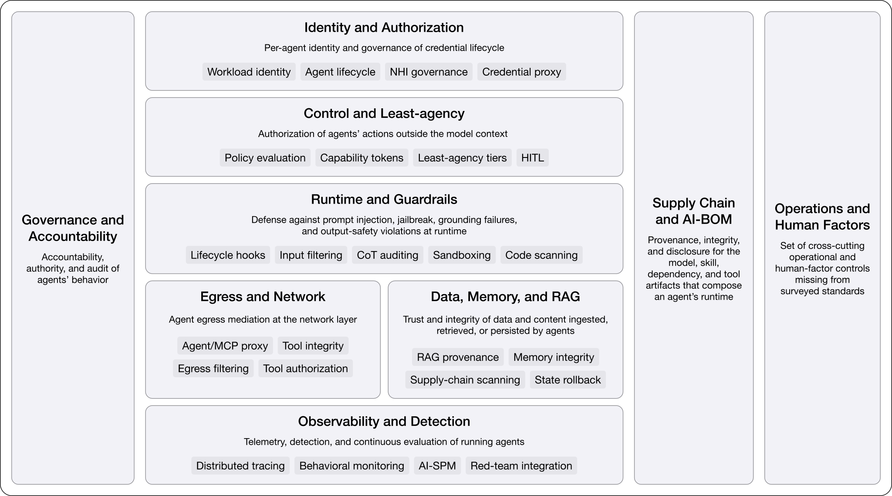

# Agentic AI Security Capability Maturity Model

An evidence-based Capability Maturity Model for agentic AI security. It applies the design lessons from CMMI, BSIMM, OWASP [[owasp-samm|SAMM]], CMMC 2.0, and NIST CSF 2.0 (see [[cybersecurity-cmms-exemplars|Cybersecurity Capability Maturity Models — Exemplars and Design Lessons]] for the per-exemplar treatment) to the threat surface and control stack in the [[agentic-ai-security-reference-architecture|Agentic AI Security Reference Architecture]].

The model is **descriptive at Levels 1–3** (controls observed in production at well-run organizations), **prescriptive at Level 4** (controls a mature program operates), and **achievable-today at Level 5** (capabilities available in shipping products and current specifications: Microsoft Agent 365, AgentGateway-LF, [[llamafirewall|LlamaFirewall]], [[aiuc-1|AIUC-1]] certification, Miggo DeepTracing). Integration across all nine domains remains rare. Research-stage and unshipped capabilities (TEE-backed guardrail attestation, [[camel-pattern|CaMeL]] privileged/quarantined LLM split, cross-vendor AI-BOM federation, named standards contribution) sit in a separate **L5+ Leading Edge** tier that is aspirational and not required for L5. Multi-agent cascade-detection rule libraries sit there as well, because none is generally available: Google's Agent Anomaly Detection ships its cascade detectors in allowlisted preview ([Google Cloud — Agent Anomaly Detection overview](https://docs.cloud.google.com/gemini-enterprise-agent-platform/agent-anomalies-overview)). The L5 / L5+ split keeps **L5 achievable today** with shipping products, per the [[cmm-calibration-stress-test-2026|CMM Calibration Stress Test (2026-05-02)]].

The nine domains each carry a level summary here and full criteria in a deep dive. Read this page for the model — levels, domains, aggregation, and how to score against it; read a deep dive for the criteria, the dated control landscape, the cost model, and right-sizing by deployment shape.

## On this page

- [Governance and security as separate measures](#governance-and-security-as-separate-measures)
- [Scope and boundaries](#scope-and-boundaries)
- [Five cumulative levels and a leading-edge tier](#five-cumulative-levels-and-a-leading-edge-tier)
- [Nine domains](#nine-domains)
- [Mapping to deployment shapes](#mapping-to-deployment-shapes)
- [Tooling map per domain](#tooling-map-per-domain)
- [Practitioners worth following](#practitioners-worth-following)
- [Implementation roadmap](#implementation-roadmap)
- [Appendix: eleven security dimensions (complementary threat-surface view)](#appendix-eleven-security-dimensions-complementary-threat-surface-view)
- [Appendix: contributions beyond reviewed standards](#appendix-contributions-beyond-reviewed-standards)
- [Open questions and gaps](#open-questions-and-gaps)
- [Related](#related)

## Governance and security as separate measures

**The CMM measures *security* (preventing harm) and *governance* (defining authority and accountability) as two separate properties.**

Security controls (firewalls, EDR, prompt filters, sandboxes, credential proxies) prevent or contain harm.

Governance defines who has the authority to act, under what justification, with what oversight, and with what record. An organization can be at L4 in security controls (D2 / D4 / D5 / D8) and still be at L1 in governance (D1 / D3 / D9), or the reverse.

Both must climb together. Knostic's [[ai-coding-agent-governance|AI Coding Agent Governance]] sharpens this distinction, and the [[decision-rights|Decision Rights for AI Agents]] concept operationalizes it. The coupling of the two makes [[shadow-automation|Shadow Automation]] a structurally different risk from shadow IT.

One external catalogue draws the same distinction in the same place. The Exchange opens its AI-program governance control by conceding that the control is arguably out of scope for cybersecurity, then keeps it because it initiates the action that gets an organization in control of AI security ([[owasp-ai-exchange|OWASP AI Exchange]], [/go/aiprogram/](https://owaspai.org/go/aiprogram/)). Governance sits outside the security boundary and gates what the security controls can be held to.

For agentic coding the scored unit is the deployment variant. The product name does not determine the score. The same harness produces different effective scores depending on where the process runs and whether a human sees an action before it executes; five variants are separated in [[generative-coding-deployment-shape-2026|Generative Coding Deployment Shapes]] and their controls catalogued in [[securing-agentic-coding|Securing Agentic Coding]]. The D1 through D9 deep dives carry the per-domain scoring corrections.

## Scope and boundaries

The CMM is three things:
- A self-assessment instrument for CISOs, AI platform leads, and internal auditors.
- Cumulative maturity levels across 9 domains, with dependency-resolved effective-score aggregation.
- An overlay on existing standards: [[nist-ai-rmf|NIST AI RMF]], [[iso-iec-42001|ISO/IEC 42001]], OWASP ASI, [[owasp-ai-exchange|OWASP AI Exchange]], [[mitre-atlas|MITRE ATLAS]], CoSAI Principles, [[microsoft-zt4ai|Microsoft ZT4AI]], [[csa-maestro|CSA Agentic Trust Framework]], [[aiuc-1|AIUC-1]], and the [[eu-ai-act|EU AI Act]]. The [[owasp-ai-exchange|AI Exchange]] contributes a named control catalogue that spans the whole AI lifecycle, development-time included, which no other overlay in this list covers end to end. The overlay is partial in one direction: neither of the Exchange's two development-programme controls has a CMM domain of its own, because the nine domains grade the assets and the enforcement points of a running system and none grades engineering practice. The development environment falls on the graded side of that line. The Exchange routes its protection to `DEV SECURITY`, whose controls the crosswalk anchors across six of the nine domains, so what stays unclaimed is AI threat modelling, secure coding practice and pre-deployment testing. [[agentic-ai-security-cmm-crosswalk|The standards crosswalk]] names both controls and carries the control-to-domain map, that split included.

Four adjacent instruments fall outside it:
- A certification program. Certification belongs to [[iso-iec-42001|ISO/IEC 42001]] and [[aiuc-1|AIUC-1]]; this is a measurement scaffold.
- A replacement for risk assessment. The CMM measures *capability*; risk assessment measures *exposure*.
- A vendor-neutral promise. Vendors and OSS projects are named where load-bearing at a given level. Naming them makes a level concrete and carries no endorsement.
- An instrument for securing non-AI systems against AI-augmented attackers. The nine domains score the security of an agentic system. [[sdlc-in-the-ai-attacker-era|SDLC in the AI-Attacker Era]] takes the adjacent question: which SLSA, [[nist-ssdf|SSDF]], CSAF, and ISO 27001 assumptions were calibrated against a human-paced attacker and now need recalibration. That page holds open whether the ground becomes a tenth domain here or a companion model of its own.

## Five cumulative levels and a leading-edge tier

|Level|Name|Notes|
|---|---|---|
|L5+|Leading Edge|research-stage / standards contribution (aspirational, not required)|
|L5|Optimizing|platform-level enforcement (achievable today)|
|L4|Managed|quantitative, continuous|
|L3|Defined|org-wide standardization|
|L2|Developing|policy + inventory|
|L1|Initial|ad hoc|

Cumulative semantics (CMMC lesson, modified): Level N requires every Level N–1 control plus the new criteria at Level N. **Each deployment is rated in a per-domain matrix, beside a table of the organization criteria graded once; aggregation uses dependency-resolved effective scores rather than a single floor.** [[cmm-vocabulary-and-notation|CMM Vocabulary and Notation]] defines the notation the model scores in, the `L3 → L4` target range and the `L0` score included.

A domain's effective score takes the lowest of its own raw score and the raw scores of its upstream-dependency domains under the active rule set. The active rule set is small and conservative; see [[agentic-ai-security-cmm-dependency-rules|Effective-Score Dependency Rules]] (v1 = 3 rules: `D2→D5`, `D2→D7`, `D3→D4`, all anchored to lethal-trifecta and Sondera/AgentCordon practitioner evidence). Each deployment's headline reports three numbers: typical (median effective), weakest (min effective, with cap source labeled), and strongest (max raw, labeled).

The model **departs from the single-floor rule** of CMMC 2.0, because the floor misreported 3 of 5 realistic archetypes per the [[cmm-calibration-stress-test-2026|stress test]] (Stripe-style architectural containment, enterprises deploying a platform-native [[agent-catalog|agent registry]] such as Agent 365, resource-constrained startups). Effective-score scoring captures cross-domain attack-path failures where they are real (weak D2 caps D5 because per-agent egress cannot be enforced without per-agent identity) without punishing unrelated weakness (weak D9 ops lag does not drag D2 identity controls down). Mandatory matrix disclosure and a strategic-rationale field prevent cherry-picking; mathematical aggregation does not. The dependency-rule registry is **scaffolding**: it grows with new attack-path evidence and practitioner architectures via the documented promotion protocol.

### Threat coverage and proportionality

The domains are calibrated to the threats the wiki documents, mapped in the [[threat-taxonomy-reconciliation|Threat Taxonomy Reconciliation]] matrix. Each OWASP ASI category lands on one primary domain: ASI03 and ASI10 on D2, ASI02 and ASI08 on D3, ASI01 and ASI05 on D4, ASI07 on D5, ASI06 on D6, ASI09 on D7, ASI04 on D8, and the [[agentic-ai-threat-classes-2026|five threat classes]] land cross-cutting: Class 1 (insider) across D2/D3/D6/D8, Class 2 (APT) across D4/D5/D7, Class 3 (collusion) across D3/D4/D7, Class 4 (model-version) across D4/D6/D8, Class 5 (jurisdictional) on D1, and every class touching D9 operations. Each domain deep dive names its threat coverage explicitly.

The dependency caps supply proportionality: each states what is reachable, because the downstream threat becomes addressable only once the upstream control is in place. Per-agent identity (D2) is a prerequisite for containing a per-agent threat, such as an APT operating one agent or a colluding pair, through egress mediation (D5) or behavioral baselining (D7). A runtime guardrail (D4) enforces the decisions a policy decision point (D3) makes, so a strong guardrail over ASI01/ASI02 requires a policy decision point that reaches the same level. Investing in the capped domain ahead of its dependency is the disproportion the model is built to surface.

Two coverage limits are deliberate. Multi-agent **cascade** (ASI08) and **collusion** (Class 3) detection has no generally available product: Google's Agent Anomaly Detection ships its cascade detectors in allowlisted preview ([Google Cloud — Agent Anomaly Detection overview](https://docs.cloud.google.com/gemini-enterprise-agent-platform/agent-anomalies-overview)), and the collusion detectors remain research-stage. D7 therefore grades cascade rules under D7-CASCADE and joint baselines of interacting agents under D7-JOINT at L5+, rather than claiming a shipping control. **Model-layer attacks** and **Class 5 jurisdictional** risk resolve to the eval-harness delta (D6/D8) and governance (D1/D9) respectively, because no runtime control mitigates a trojaned weight or a legal cutoff. Both limits are scoped in [[agentic-ai-threat-classes-2026|the threat-classes page]] and the RA Gaps section.

### L5 and L5+ semantics

L5 is a **maturity tier**: every L5 criterion in this CMM points to a shipping product, an open-source project at v1.0+, or a documented capability deployable with currently available components. L5+ is a **leading-edge tier**. A program rated L5+ holds L5 across all 9 domains *plus* research-stage capabilities and active named contribution to one or more standards bodies; the all-domain condition governs that program rating, and a domain row scores L5+ against its own levels, where cumulative grading already requires that domain's L5. A sufficiently resourced 2026 program can clear L5; only a frontier-lab or research-shop program clears L5+. The [[agentic-ai-security-cmm-measurement-protocol|measurement protocol]]'s per-domain matrix view reports both.

**A domain scored L5 and a program rated L5 are different claims.** The level descriptions below state what a program at that level operates across all nine domains, so a whole-program L5 rating requires L5 in all nine and an L5+ rating adds its own tier criteria on top of that. The per-domain matrix scores each domain against its own levels, so one domain reaches L5 while the program's rating stays lower. The prerequisite gate into L5 states which of its conditions an assessor checks once per domain scored L5 and which once for the whole program.

### Level 1: Initial

Reactive and ad hoc: AI agents run in production with no inventory, no identity, and no platform-level controls.

**Auditor evidence:** a record or an interview answer about the domain.

### Level 2: Developing

A Level 2 program shows four properties:

- A written AI security policy exists.
- The agent inventory is manual.
- Some prompt-level guardrails are in place.
- Identity is delegated through the human user only.

**Auditor evidence:** policy doc + spreadsheet inventory + sample agent design review.

### Level 3: Defined

Practice is standardized org-wide:

- Every agent has its own identity.
- Platform-level hooks intercept tool calls.
- Every command and piece of code an agent executes runs in a sandbox that covers the whole run.
- An AI-BOM exists for production agents.
- An AI-specific incident-response playbook is documented.

**Auditor evidence:** identity graph for all agents + Cedar/OPA policy repo + sandbox config + AI-BOM artifact + AI incident playbook.

### Level 4: Managed

Level 4 adds measurement and containment:

- Quantitative metrics are tracked continuously.
- Agent behavioral monitoring detects drift.
- A red-team eval program runs at least quarterly.
- A credential proxy is in use.

**Auditor evidence:** dashboard with KPIs + red-team report + cred-proxy traffic logs.

### Level 5: Optimizing

Every control was reachable with shipping products at the May 2026 snapshot this page was written against:

- Platform-level enforcement everywhere across all 9 domains.
- Current independent third-party assurance of the governance program, graded in D1 under D1-ASSURE and scheme-neutral per the [[aiuc-1-critical-evaluation|AIUC-1 critical evaluation]]: [[iso-iec-42001|ISO/IEC 42001]] under active surveillance preferred, and an AIUC-1 certificate within its one-year validity, with each quarterly red-teaming round completed, or a reviewed internal equivalent accepted, each evidenced at the cadence its own scheme runs.
- A runtime AI-BOM reconciled against each release within a documented drift tolerance, graded in D8 under D8-AIBOM-DRIFT.
- A mesh AgentGateway sidecar per agent.
- At least two quarters of stable L4 operation.
- Bus-factor ≥2 with a documented continuity test.

**Auditor evidence:** per-domain matrix at L5 across all 9 domains + third-party assurance current or scheduled, evidenced at the cadence its scheme runs + ≥2-quarter L4 history + continuity-test report.

The reachability claim was verified against the shipping landscape in May 2026 and has not been re-verified since. The nine deep dives carry the dated control landscape per domain and are the current reading. Treat the level criteria as durable and the product names as a snapshot.

### Prerequisite gate into L5

**Reaching L5 from a stable L4 takes quarters of sustained operation.**

The gate applies in addition to the per-domain L5 criteria. One of its four conditions is graded per domain, and the assessor repeats it for each domain scored L5: (a) ≥2 quarters of stable L4 in that domain, with no regression in that domain's row of the per-domain matrix across the look-back window. The other three are graded once for the program, whatever the domain:

- (b) Independent third-party assurance current or scheduled against a recognized assurance scheme: an ISO/IEC 42001 surveillance cycle, an AIUC-1 readiness assessment with an accredited auditor, or a documented internal equivalent under independent review.
- (c) Bus-factor ≥2 with a documented continuity test ([[anti-patterns-and-failure-modes|anti-pattern I3]] recovery).
- (d) A gap-closure plan naming, for each domain below L5, the work that would take it there or the reason the program is not pursuing it, and for each domain at L5, the L5+ work the program is or is not pursuing.

A domain that meets every per-domain L5 criterion without the gate evidence scores **L4-stable**. [[agentic-ai-security-cmm-measurement-protocol|The measurement protocol]] states what *stable* means as a window, an observation count and a regression test.

Weakness in a domain the L5 claim does not rest on leaves the claim standing. Cross-domain weakness reaches an L5 claim along the dependency paths the model records, and nowhere else. [[agentic-ai-security-cmm-dependency-rules|The dependency rules]] cap a domain's effective score at the raw scores of the domains it depends on, so a raw L5 whose upstream dependency sits lower reports at the capped effective score with the cap source named. A program that holds a domain at L2 by a recorded architectural-containment trade-off therefore still reaches L5 in a domain that trade-off does not touch. Adopted from [[cmm-calibration-stress-test-2026|stress-test §Change 5]], with the stable-L4 condition graded per domain.

### Level 5+: Leading Edge

L5+ requires all of L5, plus research-stage or [preview](https://docs.cloud.google.com/gemini-enterprise-agent-platform/agent-anomalies-overview) primitives in production:

- Per-task capability tokens bound to one task and one holder.
- Cryptographic guardrail attestation in a TEE (Nitro Enclaves-class).
- A CaMeL-style privileged/quarantined LLM split for trifecta-positive workloads.
- A cascade-detection rule library with tuned thresholds for ASI07/08/10 multi-agent risk.
- Cross-vendor AI-BOM federation with reconciliation.
- Sigstore-for-MCP cross-tenant signing.
- An active named contributor to one or more of CoSAI / OWASP / AIVSS / NIST CAISI / OASIS / Linux Foundation AAIF AI working groups (PR, RFC, or spec authorship; membership alone does not count).

**Auditor evidence:** per-task capability-token sample + TEE attestation logs + cascade-rule registry with thresholds + cross-vendor AI-BOM reconciliation report + named contributor list with PR/RFC/spec links.

## Nine domains

The CMM uses 9 domains, derived from the 6 reference-architecture planes plus 3 cross-cutting concerns (governance, supply chain, and operations/human factors). The Data plane is graded in two domains: [[agentic-ai-security-cmm-d8-supply-chain|D8]] grades the plane's supply-chain rows and [[agentic-ai-security-cmm-d6-data-rag|D6]] the rest. Supply chain counts as a cross-cutting concern because D8's procurement and vendor criteria have no plane row. The derivation sets a scope boundary. The nine domains cover the deployment and operation of an agentic system, and none of them anchors its secure development. The OWASP AI Exchange's two development-programme controls therefore have no cell to map into, and [[agentic-ai-security-cmm-crosswalk|the crosswalk]] names them. The 9-domain breakdown sharpens focus on agentic-specific controls and adds a domain for the operational and human-factors gaps that no surveyed standard covers as a coherent set ([[agentic-cmm-vs-standards-validation|per the 11-standard validation]] §3).

Each level entry below states what one domain adds at that level, graded from that domain's deep dive, and lists item by item the criteria an assessor grades and the auditor evidence collected for the level.

### Global evidence rule

Applies at L3 and above: all findings, gaps, eval results, and incident artifacts must be tagged with the standards-anchor IDs they relate to:

- OWASP Agentic AI Top 10 — `ASI01`–`ASI10` (the agentic risk taxonomy)
- [[owasp-llm-top-10|OWASP LLM Top 10]] (2025) — `LLM01:2025`–`LLM10:2025` (still apply to non-agentic and agent-as-LLM surfaces); the full code range is verified against the 2025 source by [[standards-review-owasp-llm-top-10-2026-Q2|the LLM Top 10 standards review]]
- OWASP [[owasp-aivss|AIVSS]] v0.8 — full vector with the ten Agentic Risk Amplification Factors (Execution Autonomy, External Tool Control Surface, Natural Language Interface, Contextual Awareness, Behavioral Non-Determinism, Opacity & Reflexivity, Persistent State Retention, Dynamic Identity, Multi-Agent Interactions, Self-Modification)
- MITRE ATLAS v5.6.0 — `AML.T####` techniques and `AML.M####` mitigations
- NIST SP 800-53 control IDs (via NIST IR 8605A COSAiS overlay) where compliance evidence is needed
- For incidents: CVE IDs and [[mcp-cves-q1-2026|MCP CVEs Q1 2026]]-class references
- The [[agentic-ai-threat-classes-2026|five threat classes]] (insider, APT, collusion, model-version, jurisdictional) where a finding addresses a cross-cutting adversary model the ASI list does not name

An untagged finding is L2-grade evidence at best, and [[agentic-ai-security-cmm-measurement-protocol|the measurement protocol]]'s per-domain scoring rubric applies that cap as a per-domain gate at scores 3 and 4. ID-tagging moves a CMM from *mapping to* standards to *operating on* them, and it makes findings machine-checkable, queryable across domains, and comparable over time.

### Assurance class of the evidence

The class of evidence settles a criterion, and the party operating the control does not. A control the customer tests, a control whose operating state the customer reads out of vendor tooling or out of a record the organization keeps, and a control the vendor attests to in a document the customer holds each carry a met or not-met verdict, so a vendor-operated control is graded on the evidence the vendor produces. An attestation settles a criterion only where its own scope statement names the control. One that does not counts as no attestation, so where the customer can run no test and keeps no record of the control's state, and the vendor supplies no inspectable output either, the criterion is unanswerable and the assessment names what would close it.

The three classes are tested, inspected and attested, and a record the organization keeps, such as an inventory, an owner field or a plan, is inspected evidence. The assessment records one beside each verdict and names the artifact behind it; [[agentic-ai-security-cmm-measurement-protocol|the measurement protocol]] defines the classes and the fields each record carries, along with the four verdicts a criterion takes: met, not met, not applicable and unanswerable. The class is recorded and never folded into the score, so the per-domain matrix shows which controls the organization exercised and which its providers attest to.

### D1. Governance & Accountability

The Governance & Accountability domain fixes who is accountable for agent behavior, with what authority, and on what auditable record. It spans the AI policy and the role accountable for it, the AI register, the risk body and its deployment gate, each agent type's decision rights, the allocation of threats to the parties that supply a deployment, and certification readiness. It treats accountability as a first-class security principle alongside Confidentiality, Integrity, and Availability: the **CIAA augmentation** of the classical CIA triad, introduced by [[maais-multilayer-agentic-ai-security|Arora & Hastings (MAAIS, 2025)]] for agentic systems.

Maps to:

- NIST AI RMF Govern
- ISO/IEC 42001 §5–§9
- EU AI Act Art. 9 risk management
- CoSAI Shared Accountability principle
- [[maais-multilayer-agentic-ai-security|MAAIS]] Layer 5 (Accountability and Trustworthiness)
- [[operational-xai-for-gating|Operational XAI for Action Gating]] (justification-capture as the runtime accountability artifact)
- Microsoft ZT4AI Governance: [[microsoft-rai|Responsible AI Standard]], Purview Compliance Manager AI templates, Agent 365 registry (control-level anchors in [[standards-review-microsoft-zt4ai-2026-Q2|the ZT4AI review]])

See [[agentic-ai-security-cmm-d1-governance|the D1 deep dive]] for capability-decoupled criteria, the cost model, and right-sizing by deployment shape.

D1-ASSURE requires scheme-neutral third-party assurance at L5: an ISO/IEC 42001 certificate, which is preferred, an AIUC-1 certificate, or a reviewed internal-equivalent attestation, per the [[aiuc-1-critical-evaluation|AIUC-1 critical evaluation]]. It asks more than condition (b) of the prerequisite gate into L5, which accepts assurance that is only scheduled: D1-ASSURE's assurance is current on the assessment date, and its scope covers the deployment.

L3 also grades what the organization withholds about its own system, under the Exchange's `DISCRETE` control ([[owasp-ai-exchange|OWASP AI Exchange]], [/go/discrete/](https://owaspai.org/go/discrete/)). D1-DETAIL carries each deployment's model type, model implementation and published items as classified assets, and D1-DETAIL-RULE and D1-DETAIL-REVIEW require each technical publication to pass a review that sets what is withheld against the disclosure `AI TRANSPARENCY` asks for. The Exchange supplies a direction for the trade-off and no threshold, so the review is graded on the decision it records.

D1 grades one deployment at a time, and the organization once, on the scope the assessment graded [[agentic-ai-security-cmm-d2-identity|D2]] on. Each criterion carries a unit tag. An organization criterion is graded once and reported once, in a table beside the deployment matrices, and a deployment criterion is graded in each deployment's row. A deployment reaches a level only where every organization criterion at that level and below is met, so an organization criterion not met or unanswerable at L3 holds every deployment at L2. A record whose scope names part of a deployment counts for that part, so a scope that leaves out one of the deployment's agents fails D1-READINESS and D1-ASSURE. D1-REGISTER-TIER reads the tier of the deployment as a whole, so a record that scores the rule's inputs for the deployment meets it even where its scope names part of the deployment, and the assessment reports the part left out beside the deployment's result. Each criterion below carries the name the deep dive gives it, and the deep dive states it in full, with the evidence it names and any not-applicable condition.

- **D1-L1 (Initial):** Nobody is accountable for AI governance, an approved policy, tier scheme or RACI is missing, or the deployment lacks a register entry, a current accountable person or a tier scored under the scheme's rule.
    - **Capability.** No role is accountable for AI governance, the approved policy, tier scheme or RACI is missing, or the deployment has no register entry, current accountable person or scored risk tier.
    - **Auditor evidence.** A record or an interview answer about the domain.
- **D1-L2 (Developing):** The organization names the role accountable for AI governance and keeps an approved AI policy, risk-tier scheme and RACI, and each deployment carries a register entry with an accountable owner and a risk tier.
    - **Capability.**
        - **D1-ACCOUNTABLE.** *Organization.* An approved document names one role accountable for AI governance, in whatever words the document uses, and a person holds it.
        - **D1-POLICY.** *Organization.* An approved AI policy applies to every AI system the organization builds, buys or uses, and is published to everyone it applies to.
        - **D1-SCHEME.** *Organization.* An approved risk-tier scheme assigns each AI system a tier by a stated rule that reads how far the system acts without review.
        - **D1-RACI.** *Organization.* An approved RACI names one accountable party each for model accountability, data accountability and risk governance.
        - **D1-REGISTER.** *Deployment.* The AI register holds an entry covering each of the deployment's agents and naming a current accountable person.
        - **D1-REGISTER-TIER.** *Deployment.* The entry records the tier the scheme's rule assigns, with the rule's inputs scored for the deployment.
    - **Auditor evidence.**
        - Approved document naming the accountable role, with the personnel record of its holder (D1-ACCOUNTABLE).
        - Approved AI policy with its scope statement and its place of publication (D1-POLICY).
        - Approved risk-tier scheme with its rule, and the policy or standard that applies it to AI systems (D1-SCHEME).
        - Approved RACI, each of the three responsibilities matched to its row (D1-RACI).
        - Register entry for the deployment, with the personnel record of the person it names (D1-REGISTER).
        - Register entry's tier, with the record that scored the rule's inputs (D1-REGISTER-TIER).
- **D1-L3 (Defined):** A cross-functional risk body meets on a fixed cadence and gates each deployment by tier, discovery finds unregistered agents, and a review governs technical publication. Each deployment records its agents' decision rights and data handling, allocates its threats and their residue and classifies its technical details, and a coding deployment runs its harness under locked, reviewed managed settings.
    - **Capability.**
        - **D1-BODY.** *Organization.* A chartered AI risk body counts members from security, legal, privacy and engineering.
        - **D1-BODY-CADENCE.** *Organization.* The body meets in each interval of the cadence its charter fixes, over the last twelve months.
        - **D1-GATE-RULE.** *Organization.* An approved rule names each risk tier's production approver, the risk body for the highest tier, and requires approval before production.
        - **D1-GATE.** *Deployment.* The approver the rule names for the deployment's tier, or a body the rule places above it, approved the deployment before it entered production.
        - **D1-GATE-CONDITION.** *Deployment.* Each condition the approval set was met by its date, or the approver recorded a decision to change it.
        - **D1-SHADOW.** *Organization.* Scheduled discovery covers every endpoint, software-as-a-service tenant, cloud account and code host, and each run is compared with the AI register.
        - **D1-SHADOW-REAP.** *Organization.* Each shadow agent found in the last twelve months was registered or removed within the time the organization sets.
        - **D1-BOUNDARY.** *Deployment.* A dated record for each agent type states which actions its agents take alone, which wait for whose approval, and which they never take, and every agent of the deployment falls under one.
        - **D1-BOUNDARY-DATA.** *Deployment.* The record states, for each agent type, the information classes its agents may read and where each class may go.
        - **D1-ALLOCATE.** *Deployment.* A responsibility matrix names every supplying party and allocates to one of them, or to the organization, each threat the deployment's threat identification selects, and the identification covers each component the deployment runs.
        - **D1-ALLOCATE-RESIDUE.** *Deployment.* Each allocated threat's residue carries a disposition made by the party the organization's rules name.
        - **D1-DETAIL.** *Deployment.* The asset inventory classifies the deployment's model type and implementation record and each item published about it.
        - **D1-DETAIL-RULE.** *Organization.* The publication rule requires a review of each item about an AI system's technical detail, set against `AI TRANSPARENCY`.
        - **D1-DETAIL-REVIEW.** *Deployment.* Each item published about the deployment's technical detail passed that review, recording what it withholds and discloses.
        - **D1-HARNESS.** *Deployment.* Each harness-configurable coding agent runs under managed settings on every device or runner that hosts it, and no local scope overrides them.
        - **D1-HARNESS-LOCK.** *Deployment.* The managed settings set each managed-only lock the harness offers.
        - **D1-HARNESS-EXTEND.** *Deployment.* A record names each managed list key a local scope can still extend, with the entries each scope may add.
        - **D1-HARNESS-RESTORE.** *Deployment.* The managed settings file returns to the published version wherever it differs.
        - **D1-HARNESS-REVIEW.** *Deployment.* Each change to the harness configuration tree passes a documented review before it takes effect.
    - **Auditor evidence.**
        - Charter membership, each member matched to a function (D1-BODY).
        - Charter cadence, with the dates of the minutes over the period (D1-BODY-CADENCE).
        - Gate rule, with the approver it names for each tier (D1-GATE-RULE).
        - Approval record with its approver and date, set against the deployment's tier and the date it entered production (D1-GATE).
        - Each condition of the approval, with the record that met it or the approver's decision (D1-GATE-CONDITION).
        - Discovery sources with their schedule and coverage, and the latest comparison with the register (D1-SHADOW).
        - Rule setting the time to register or remove, with the period's findings and the date each closed (D1-SHADOW-REAP).
        - Boundary record for each agent type, set against the deployment's agents (D1-BOUNDARY).
        - Data-handling statement for each agent type, set against the classes its agents read (D1-BOUNDARY-DATA).
        - Responsibility matrix and threat identification, set against the deployment's components and supplier agreements (D1-ALLOCATE).
        - Disposition of each residue, with the party who decided it and the rule that gives the decision (D1-ALLOCATE-RESIDUE).
        - Asset-inventory entries with their classes, set against the deployment's design records and publications (D1-DETAIL).
        - Publication rule, with the review it requires (D1-DETAIL-RULE).
        - Review record of each item published about the deployment (D1-DETAIL-REVIEW).
        - Settings as the harness resolved them on an enrolled device or runner, with the fleet record of the managed source (D1-HARNESS).
        - Lock values in the resolved managed settings, set against the locks the harness documents (D1-HARNESS-LOCK).
        - Record of the extendable list keys, set against the harness's documentation of keys that merge across scopes (D1-HARNESS-EXTEND).
        - Restore mechanism's configuration, with its log of a restore or a test (D1-HARNESS-RESTORE).
        - Review records for a sample of changes drawn from the tree's change history (D1-HARNESS-REVIEW).
- **D1-L4 (Managed):** The board receives the quarter's AI risk metrics, the organization maintains its standards crosswalk, and a recent readiness assessment against a recognized scheme covers the deployment.
    - **Capability.**
        - **D1-METRICS.** *Organization.* The board received the last quarter's AI report of incidents, escalations to the risk body, and open findings by standards-anchor identifier.
        - **D1-CROSSWALK.** *Organization.* A crosswalk maps each AI policy and standard in force to the frameworks it names, revised within its review cadence.
        - **D1-READINESS.** *Deployment.* An independent readiness assessment against a recognized scheme, completed in the last twelve months, covers the deployment and lists its gaps.
    - **Auditor evidence.**
        - Board report for the quarter, with the minutes recording its receipt (D1-METRICS).
        - Crosswalk's latest revision with its review rule, set against the AI policies and standards in force (D1-CROSSWALK).
        - Readiness report with its scheme, assessor, date, scope and gap list (D1-READINESS).
- **D1-L5 (Optimizing):** Current, independent third-party assurance covers the deployment, the board attests the risk metrics each quarter, the risk body shows a year of decisions, and the crosswalk carries a revision each quarter.
    - **Capability.**
        - **D1-ASSURE.** *Deployment.* Third-party assurance of the governance program, current on the assessment date, covers the deployment.
        - **D1-METRICS-ATTEST.** *Organization.* The board attested the quarterly AI report in each of the last four quarters.
        - **D1-BODY-HISTORY.** *Organization.* The risk body's minutes span at least the last twelve months and record each decision it took.
        - **D1-CROSSWALK-REFRESH.** *Organization.* The crosswalk carries a revision in each of the last four quarters.
    - **Auditor evidence.**
        - Certificate or reviewed attestation, with its scope, its route and the record that keeps it current (D1-ASSURE).
        - Board attestation for each of the four quarters (D1-METRICS-ATTEST).
        - Risk-body minutes over the period, with each decision they record (D1-BODY-HISTORY).
        - Crosswalk's revision history over the four quarters (D1-CROSSWALK-REFRESH).
- **D1-L5+ (Leading Edge):** The organization contributes to a governance or standards body and publishes a governance artifact of its own.
    - **Capability.**
        - **D1-STANDARDS.** *Organization.* A named member contributed to a governance or standards body's AI governance work in the last twelve months, by pull request, RFC or specification.
        - **D1-PUBLISH.** *Organization.* The organization published a governance artifact of its own in the last twelve months.
    - **Auditor evidence.**
        - Links to the contributions, with their dates (D1-STANDARDS).
        - The publication (D1-PUBLISH).

### D2. Identity & Authorization

The Identity & Authorization domain assigns every agent a per-agent (non-human) identity and governs its credential lifecycle: issuance, scoping, rotation, and revocation. The target state is zero-credentials-in-agent-context operation, with explicit treatment of coupled-credential workflows where credential and identity cannot be separated.

Maps to:

- OWASP ASI03
- NIST CAISI Concept Paper (Feb 2026)
- ISO 27090 (FDIS Mar 2026)
- Microsoft ZT4AI Identity: [[microsoft-entra-agent-id|Entra Agent ID]], the three access patterns, attribute/blueprint Conditional Access, ID Protection for agents, Entra PIM time-limited active role assignment for agents (auto-expiring; agents cannot be PIM-*eligible*, so no agent self-activation) (control-level anchors in [[standards-review-microsoft-zt4ai-2026-Q2|the ZT4AI review]])

See [[agentic-ai-security-cmm-d2-identity|the D2 deep dive]]. Per-agent identity is GA platform-native on all three hyperscalers (Entra Agent ID, AWS AgentCore, GCP Agent Identity). **Per-task capability tokens sit at L5+:** no platform in D2's control landscape ships them, and the only implementation it carries is an early-stage OSS primitive. D2-L3 raises the D5 and D7 effective-score ceilings (the `D2→D5` and `D2→D7` caps), which reaches further than any other single level in the model. D2 grades one deployment at a time: an agent application, or a vendor's agent platform with the agents the organization runs on it. Each criterion below carries the name the deep dive gives it, and the deep dive states it in full, with the evidence it names and any not-applicable condition. D2-DELEGATE-TOKEN and D2-DELEGATE-LINK grade the construction of a delegated credential, the artifact property that makes D3 L4's full-chain validation possible and closes chain splicing.

- **D2-L1 (Initial):** Agents share human credentials or service accounts.
    - **Capability.** No inventory of agent identities exists.
    - **Auditor evidence.** A record or an interview answer about the domain.
- **D2-L2 (Developing):** Each agent holds an identity of its own and acts for a human only within that human's access.
    - **Capability.**
        - **D2-IDENTITY.** Each agent authenticates as a non-human identity no other party can use.
        - **D2-INVENTORY.** An inventory, kept by hand or by the pipeline, records each agent and its identities.
        - **D2-DELEGATE.** An agent acting for a human exercises no access beyond that human's own.
    - **Auditor evidence.**
        - Identity-provider record of each agent identity and the principals able to use each credential (D2-IDENTITY).
        - Inventory export reconciled against the identity provider (D2-INVENTORY).
        - Effective-access comparison, agent against a sampled human it acts for (D2-DELEGATE).
- **D2-L3 (Defined):** An agent's identity is verifiable and follows the pipeline, and every action traces to an accountable human.
    - **Capability.**
        - **D2-IDENTITY-VERIFY.** An identity provider issues each agent's identity, and called services verify it from a signed assertion.
        - **D2-DELEGATE-EXCHANGE.** Every delegation hop is a token exchange naming both parties.
        - **D2-LIFECYCLE.** The deploy pipeline issues, rotates and revokes the identity, independent of HR events.
        - **D2-COUPLING.** The inventory classes each credential as coupled or decoupled ([[identity-credential-coupling|coupling]]).
        - **D2-OWNER.** Every agent and NHI names a current human owner.
        - **D2-TRACE.** Every action traces to the agent and to the human accountable for it.
    - **Auditor evidence.**
        - Identity-provider configuration and signed-assertion sample (D2-IDENTITY-VERIFY).
        - Exchanged-token sample naming both parties (D2-DELEGATE-EXCHANGE).
        - Pipeline definition that issues, rotates and revokes the identity (D2-LIFECYCLE).
        - Coupled/decoupled credential classification (D2-COUPLING).
        - Owner-field coverage checked against personnel records (D2-OWNER).
        - Re-traced action sample (D2-TRACE).
- **D2-L4 (Managed):** No stored credential sits in agent context, and each session, token and delegated grant binds to one identity and one task.
    - **Capability.**
        - **D2-NOCRED.** Zero credentials sit in agent context, enforced by a broker or vault, or by a credential-less identity model.
        - **D2-AUTHZ.** The decision point's rules name the calling agent.
        - **D2-KILL.** An orphaned-agent kill switch revokes one agent in one operation, and its execution is recorded.
        - **D2-TASKBIND.** Sessions and tokens bind to one identity and one task.
        - **D2-MUTUAL.** Agent-to-service authentication is mutual and cryptographic.
        - **D2-DELEGATE-TOKEN.** A delegated credential is signed and names delegator, delegatee, scope, task and expiry.
        - **D2-DELEGATE-LINK.** A credential one agent issues to another links to its parent.
        - **D2-ROTATE.** Rotation is automated per credential class.
        - **D2-ROTATE-MAP.** A documented consumer-dependency map covers each credential.
        - **D2-BASELINE.** Each NHI carries a behavioral baseline and a detection.
        - **D2-COUPLING-MIGRATE.** An active migration plan covers each coupled credential.
    - **Auditor evidence.**
        - Deployment specification with broker or vault logs, or the credential-less identity configuration (D2-NOCRED).
        - Per-agent policy export and decision-log sample (D2-AUTHZ).
        - Kill-switch execution record (D2-KILL).
        - Session and token sample with a token refused after its task (D2-TASKBIND).
        - Service authentication configuration (D2-MUTUAL).
        - Delegation-token sample showing delegator, delegatee, scope, task and expiry (D2-DELEGATE-TOKEN).
        - Second-hop token sample with its parent link (D2-DELEGATE-LINK).
        - Rotation-cadence report (D2-ROTATE).
        - Consumer-dependency map (D2-ROTATE-MAP).
        - Baseline record and detection rule per NHI (D2-BASELINE).
        - Coupled-credential migration plan (D2-COUPLING-MIGRATE).
- **D2-L5 (Optimizing):** One governance program runs the deployment's agents and identities over a pipeline-maintained registry, and identity binding carries a cryptographic attestation.
    - **Capability.**
        - **D2-REGISTRY.** A registry the pipeline writes through an API holds each agent's identity graph.
        - **D2-OWNER-TRANSFER.** An owner's departure passes each agent and identity to a named successor.
        - **D2-ADMIN.** Roles scope administrative rights over agents.
        - **D2-AUDIT.** Every identity lifecycle event writes an audit record.
        - **D2-DISCOVER.** Scheduled discovery reports every unregistered agent and closes each finding.
        - **D2-CONDITIONAL.** Risk and conditional access applies to agent identities where the platform offers it.
        - **D2-IDENTITY-ATTEST.** Identity binding carries cryptographic attestation.
        - **D2-COUPLING-ZERO.** No coupled credential remains in the deployment.
    - **Auditor evidence.**
        - Registry export with the pipeline step that writes it (D2-REGISTRY).
        - Ownership-transfer records (D2-OWNER-TRANSFER).
        - Administrative role assignments (D2-ADMIN).
        - Lifecycle audit-log sample (D2-AUDIT).
        - Discovery report with each finding's outcome (D2-DISCOVER).
        - Conditional-access policy and sign-in evaluation sample (D2-CONDITIONAL).
        - Attestation chain, such as a SPIFFE JWT-SVID chain (D2-IDENTITY-ATTEST).
        - Coupled-credential migration report (D2-COUPLING-ZERO).
- **D2-L5+ (Leading Edge):** Each token binds to one task and one holder and narrows at each hop, and identity reconciles across vendors.
    - **Capability.**
        - **D2-TASKTOKEN.** Per-task capability tokens carry holder-binding, of the [[tenuo-warrant|Warrant]] class and available only as OSS.
        - **D2-TASKTOKEN-ATTENUATE.** A token passed on carries a subset of its holder's capabilities.
        - **D2-FEDERATE.** Agent identity federates across two or more vendors' identity platforms.
        - **D2-FEDERATE-RECONCILE.** A reconciliation joins each agent's identities into one graph.
        - **D2-STANDARDS.** The organization contributes to a SPIFFE, OAuth or OIDC agent-extension working group.
    - **Auditor evidence.**
        - Per-task capability-token sample with holder binding (D2-TASKTOKEN).
        - Two-hop token sample showing attenuation (D2-TASKTOKEN-ATTENUATE).
        - Federation configuration (D2-FEDERATE).
        - Cross-platform reconciliation report (D2-FEDERATE-RECONCILE).
        - Working-group contribution record (D2-STANDARDS).

### D3. Control & Least-Agency

The Control & Least-Agency domain authorizes agent actions (their scope, timing, human-in-the-loop coverage, and segregation of duties) at a [[oversight-layer|Policy Decision Point]] outside the model context. It adds progressive-autonomy promotion gates and time-bounded elevation.

Maps to:

- OWASP ASI02 (Tool Misuse and Exploitation: least-privilege tool profiles, Intent Gate PEP/PDP)
- The OWASP Least-Agency principle (ASI09 in the published 2026 list covers Human-Agent Trust Exploitation, a separate concern from autonomy control)
- [[least-agency-principle|Least Agency Principle]]
- [[aws-agentic-ai-security-scoping-matrix|AWS Agentic AI Security Scoping Matrix]] (anchor for the agency-vs-autonomy distinction used throughout this domain)
- CSA Agentic Trust Framework progressive autonomy gates
- CoSAI risk-based governance
- Microsoft ZT4AI least-privilege: deny-by-default least-action design and the Agent Governance Toolkit policy decision point (control-level anchors in [[standards-review-microsoft-zt4ai-2026-Q2|the ZT4AI review]])

ZT4AI defines no progressive-autonomy tier model; the CSA ATF supplies it.

The four action-risk tiers L3 names are auto, notify, confirm and block, from [[emerging-cybersecurity-practices-for-agentic-ai-applications|Emerging Cybersecurity Practices for Agentic AI Applications]] §3.2; the OWASP ASI Top 10 names the least-agency principle and supplies no tiers.

See [[agentic-ai-security-cmm-d3-control-least-agency|the D3 deep dive]]. Platform-native PDPs sit at L3/L4 (AWS Bedrock AgentCore Policy, GA Mar 2026; Microsoft Agent Governance Toolkit, OSS). **Per-task capability tokens sit at L5+ in D3 and D5, matching D2:** the production-maturity qualifier holds a capability at the leading-edge tier until a production-hardened implementation path exists, and the only implementation the D3 and D5 tooling maps carry is an open-source primitive with no independent production evidence. L5 keeps the approval token bound to the parameters a human approved. Cedar Analysis has shipped as open source since June 2025, so D3-POLICY-FORMAL grades running it over every release of the policies that govern MCP tool calls, and temporal policy, which AWS AgentCore Policy has offered since 2026-08-06, stays at L5+ under the same qualifier until it clears the two-quarter window. D3 grades one deployment at a time: an agent application, or a vendor's agent platform with the agents the organization runs on it. Each criterion below carries the name the deep dive gives it, and the deep dive states it in full, with the evidence it names and any not-applicable condition.

D3-ALLOW and D3-MEDIATE both hold under every autonomy mode the deployment permits, so the assessor confirms the guard is consulted under each mode before D3-MEDIATE-EXACT asks what it matches. The [[gemini-cli-workspace-trust-rce|Gemini CLI Workspace-Trust RCE]] is the case: an autonomy flag suppressed the tool allowlist outright, so a deployment presenting enumerated permissions as evidence had none.

**D3-MEDIATE-OUTSIDE tests whether content reaching the model context can rewrite the decision the enforcement point issues**, which a decision point inside the runtime hosting the model can satisfy; that shape meets the criterion on the substitute evidence [[agentic-ai-security-cmm-measurement-protocol|the measurement protocol]] names, the remaining L3 criteria are graded as written, and the assessment records that one vendor's code both runs the model and enforces the policy.

- **D3-L1 (Initial):** No tool-call policy governs the agents, and an agent can call any tool.
    - **Capability.** No component outside the model decides which tools an agent calls.
    - **Auditor evidence.** A record or an interview answer about the domain.
- **D3-L2 (Developing):** Tool access is enumerated per agent, and a human approves each destructive action.
    - **Capability.**
        - **D3-ALLOW.** A component outside the model enforces each agent's tool allowlist, under every autonomy mode.
        - **D3-APPROVE.** Each destructive action waits for a human's approval or is refused.
    - **Auditor evidence.**
        - Enforced allowlist per agent, with a refusal under the most permissive autonomy mode (D3-ALLOW).
        - Approval step or refusal for each destructive action, with a record of each operating (D3-APPROVE).
- **D3-L3 (Defined):** A decision point outside the model context settles every tool call against documented tiers and a decision-rights matrix.
    - **Capability.**
        - **D3-MEDIATE.** Every tool call reaches the decision point, under every autonomy mode.
        - **D3-MEDIATE-OUTSIDE.** No content reaching the model changes the decision or the policy behind it.
        - **D3-MEDIATE-SYNC.** A call runs only after the decision point returns a permit.
        - **D3-MEDIATE-FAILCLOSED.** An unreachable decision point or a malformed policy source denies.
        - **D3-MEDIATE-EXACT.** The decision reads the action as the executor carries it out.
        - **D3-DENY.** The policy denies by default.
        - **D3-POLICY-LOCK.** Neither the agent nor the principal it acts for can widen the policy.
        - **D3-TIER.** Each action carries a documented tier: auto, notify, confirm or block.
        - **D3-TIER-DESTRUCT.** Each destructive action sits in the confirm or the block tier.
        - **D3-TIER-ENFORCE.** The decision point enforces each action's tier.
        - **D3-APPROVE-GATE.** A confirm-tier action waits outside the model for its approver.
        - **D3-RIGHTS.** A decision-rights matrix covers every action class, and the decision path applies it.
    - **Auditor evidence.**
        - Tool inventory reconciled against the decision point's coverage (D3-MEDIATE).
        - Direct-invocation test with its decision-log entry, or the in-process substitute set, with the policy's source scope (D3-MEDIATE-OUTSIDE).
        - Enforcement code per tool, with a trace showing the decision before the call (D3-MEDIATE-SYNC).
        - Failure-behaviour configuration with a test record, or the documented malformed-policy behaviour in-process (D3-MEDIATE-FAILCLOSED).
        - Rules compared with what the executor receives, with a compound command refused (D3-MEDIATE-EXACT).
        - Policy default and unmatched-call handling at the running revision (D3-DENY).
        - Policy source scopes, with the principals able to change each (D3-POLICY-LOCK).
        - Dated tier record per agent (D3-TIER).
        - Destructive-action classification with each action's tier (D3-TIER-DESTRUCT).
        - Policy rules per tier compared with the tier record, with a decision-log entry per tier in use (D3-TIER-ENFORCE).
        - Gate configuration, confirm-tier approval records and a gate fire (D3-APPROVE-GATE).
        - Decision-rights matrix with the rule applying each row, and a routed approval (D3-RIGHTS).
- **D3-L4 (Managed):** The policy engine decides on task, session and delegation state as well as on the action.
    - **Capability.**
        - **D3-PROMOTE.** Autonomy is promoted through four stages on documented criteria.
        - **D3-APPROVE-COVERAGE.** Human-approval coverage is measured per action class.
        - **D3-TRIFECTA.** A continuous lethal-trifecta breaker lowers autonomy when all three legs are present.
        - **D3-ELEVATE.** An elevated grant is issued just in time and expires.
        - **D3-SOD.** The proposer, approver and deployer of an agent-proposed change are distinct.
        - **D3-NOREPLAY.** No other agent, the delegatee included, can replay an agent's authorization.
        - **D3-TASKSCOPE.** Each invocation is authorized against the current task scope.
        - **D3-TASKSCOPE-RECORD.** A denied out-of-scope call is recorded as an agent-escape event.
        - **D3-LEDGER.** A session ledger denies a write that would cross its per-session limit.
        - **D3-CHAIN.** The decision point validates the whole delegation chain.
        - **D3-CHAIN-DEPTH.** Delegation is capped at a configured depth.
        - **D3-CHAIN-SUBSET.** A downstream agent holds a subset of its delegator's grants.
        - **D3-ORCHESTRATE.** An orchestrator holds coordination grants only.
    - **Auditor evidence.**
        - Promotion rubric with each agent's stage and promotion records (D3-PROMOTE).
        - HITL coverage report per action class, with its review (D3-APPROVE-COVERAGE).
        - Trifecta-breaker configuration with the transitive external leg, and a downgrade record (D3-TRIFECTA).
        - Elevation configuration and expiry log (D3-ELEVATE).
        - Pipeline role assignments, with a change sample showing three principals (D3-SOD).
        - Replay-test record for another agent and a delegatee (D3-NOREPLAY).
        - Task-scope policy input, with a denied out-of-scope call (D3-TASKSCOPE).
        - Agent-escape record of a denied call (D3-TASKSCOPE-RECORD).
        - Per-session write limits, with a ledger denial (D3-LEDGER).
        - Chain-validation rule, with a splice test refused (D3-CHAIN).
        - Configured maximum depth, with a delegation refused past it or no delegation tool granted at the last depth (D3-CHAIN-DEPTH).
        - Delegation sample, downstream grants against the delegator's (D3-CHAIN-SUBSET).
        - Orchestrator grants compared with the tier record (D3-ORCHESTRATE).
- **D3-L5 (Optimizing):** Cryptography carries each approval and the separation of duties, anomaly scores move an agent's tiers, and every policy release is compiled, reviewed and held against drift.
    - **Capability.**
        - **D3-APPROVE-TOKEN.** A per-request approval token is cryptographically bound to the parameters approved.
        - **D3-ADAPT.** D7 anomaly scores step each agent's tiers up and its grants down, and back.
        - **D3-POLICY-COMPILE.** Each policy release is compiled before it ships.
        - **D3-POLICY-REVIEW.** Each policy release is reviewed by someone other than its author.
        - **D3-POLICY-DRIFT.** The running policy is checked against the reviewed release.
        - **D3-SOD-CRYPTO.** Segregation of duties is enforced cryptographically.
    - **Auditor evidence.**
        - Approval-token sample (bound approver identity, parameters, expiry), with a deviating execution refused (D3-APPROVE-TOKEN).
        - Anomaly-score policy input, with adaptation records showing a step-up, a step-down and their reversal (D3-ADAPT).
        - Per-release policy-compile artifact (D3-POLICY-COMPILE).
        - Per-release policy review record (D3-POLICY-REVIEW).
        - Drift-check results over the period (D3-POLICY-DRIFT).
        - Key assignment per role, with a deployment refused for a deploying-key approval (D3-SOD-CRYPTO).
- **D3-L5+ (Leading Edge):** A grant binds to one task and one holder, formal analysis proves the policy, and the policy reads the order of a session's actions.
    - **Capability.**
        - **D3-TASKTOKEN.** The decision point authorizes each call from a per-task, holder-bound capability token.
        - **D3-CHAIN-ATTENUATE.** A token passed on narrows at each delegation hop.
        - **D3-QUARANTINE.** A [[camel-pattern|CaMeL]]-style privileged/quarantined split runs in production for trifecta-positive workloads.
        - **D3-POLICY-FORMAL.** Formal analysis proves each policy release, MCP tool-call policies included.
        - **D3-LEDGER-SEQUENCE.** The policy decides on the order and timing of a session's actions.
    - **Auditor evidence.**
        - Token-verification configuration, with refusals by another holder and after task close (D3-TASKTOKEN).
        - Two-hop token sample showing attenuation, with a widened token refused (D3-CHAIN-ATTENUATE).
        - CaMeL split production configuration with its information-flow policy (D3-QUARANTINE).
        - Per-release formal-analysis reports covering MCP tool-call policies (D3-POLICY-FORMAL).
        - Sequence rules in the running policy, with a call they refused (D3-LEDGER-SEQUENCE).

### D4. Runtime & Guardrails

The Runtime & Guardrails domain defends against [[prompt-injection|prompt injection]], jailbreak, grounding failure, and output-safety violations at runtime. It screens what reaches and leaves the model, checks the intent and effect of an agent's calls, and confines the code an agent executes.

Maps to:

- OWASP ASI01, ASI02
- MITRE ATLAS `AML.T0051` (LLM Prompt Injection, incl. `.000` Direct / `.001` Indirect / `.002` Triggered) and `AML.T0054` (LLM Jailbreak)
- CoSAI Maximize Oversight
- Microsoft ZT4AI runtime: Prompt Shields (GA), Groundedness Detection and Task Adherence (preview), and Defender's agent protection, whose real-time protection for Agent 365 tooling servers has been GA since 2026-07-27 while agent threat detection stays in preview, both under an Agent 365 licence since 2026-07-01 ([Microsoft TechCommunity](https://techcommunity.microsoft.com/blog/microsoft-security-blog/securing-ai-agents-at-runtime-real-time-protection-and-threat-detection-for-micr/4541255), [Microsoft Learn](https://learn.microsoft.com/en-us/defender-xdr/security-for-ai/transition-agent-security-to-agent-365)), mapped in [[standards-review-microsoft-zt4ai-2026-Q2|the ZT4AI review]]
- [[model-layer-attacks|Model-Layer Attacks]] (output-randomization and query-pattern-monitoring controls applicable at L4)
- [[agent-availability-threats|Agent Availability Threats]] (the CPU, memory and wall-clock limits on each sandbox at L3, under D4-SANDBOX-LIMITS; [[agentic-ai-security-cmm-d5-egress-network|D5]] grades the call, token and invocation ceilings)
- EU AI Act Art. 15 (cybersecurity), which names the attack classes (data poisoning, model poisoning, adversarial examples / model evasion, confidentiality attacks, model flaws) as outcomes and specifies no control, threshold, or test procedure, a gap this domain's per-level evidence rubric and the ATLAS mitigation anchors fill for prompt injection and output safety, leave open for adversarial examples and model evasion, and cover confidentiality attacks partially ([[standards-review-eu-ai-act-2026-Q2|2026-Q2 EU AI Act review]] claim 3)

The [[owasp-ai-exchange|OWASP AI Exchange]] names five controls against evasion ([/go/evasion/](https://owaspai.org/go/evasion/)). Three act at development time on a model the deploying organization trains. The two that run at runtime state limits bounding their own coverage: a detector that an adversarial sample may be crafted to evade, and a distortion defense that exempts zero-knowledge evasion and requires retraining the model with its transformations in place. D4 therefore grades no evasion criterion by design, and an assessor answering an Art. 15 question about adversarial examples reports the domain's coverage as partial with that reason.

The Exchange's runtime control for disclosure of exposure-restricted data in output is `SENSITIVE OUTPUT HANDLING` ([/go/sensitiveoutputhandling/](https://owaspai.org/go/sensitiveoutputhandling/)). [[agentic-ai-security-cmm-d4-runtime-guardrails|D4]] requires the output classifier's data-class scope to be recorded at L3 under D4-OUTPUT-SCOPE, because content safety and exposure-restricted data are separate detections, and grades credential-leak scanning measured against encoded forms at L5 under D4-OUTPUT-LEAK; no D4 criterion grades its recitation-detection mechanism. The Exchange's own controls for model inversion, membership inference, and model exfiltration act at training time or produce post-theft evidence, and it states that model exfiltration is typically hard to protect against where an attacker can reach the model and the model allows intensive use ([/go/modelexfiltration/](https://owaspai.org/go/modelexfiltration/)). An assessor answering an Art. 15 question about confidentiality attacks reports output-side coverage as graded and model-recovery coverage as bounded by that statement.

See [[agentic-ai-security-cmm-d4-runtime-guardrails|the D4 deep dive]]. The L2 and L3 input-and-output safety layer is generally available on Azure and AWS, largely inside Azure entitlements, and on AWS the prompt-attack filter screens user input marked with input tags and does not evaluate tool results ([AWS — Detect prompt attacks with Amazon Bedrock Guardrails](https://docs.aws.amazon.com/bedrock/latest/userguide/guardrails-prompt-attack.html)). Most platform-native L4 controls are preview or experimental: chain-of-thought auditing ships as an experimental open-source component (AlignmentCheck), and Microsoft's Task Adherence, which checks planned tool calls against user intent, and its Groundedness Detection, English-only, are preview. AWS's contextual grounding check has been generally available since 2024-07-10 ([AWS — Use contextual grounding check to filter hallucinations in responses](https://docs.aws.amazon.com/bedrock/latest/userguide/guardrails-contextual-grounding-check.html)). Report D4 as raw + effective: the `D3→D4` cap pulls effective D4 down wherever the PDP is weak. Sandbox coverage carries two questions: what the boundary contains, and when it starts. D4-SANDBOX grades the first, D4-SANDBOX-CONFINE, D4-SANDBOX-MAC, D4-SANDBOX-CREDS, D4-SANDBOX-CLEAN and D4-SANDBOX-LIMITS grade what the boundary enforces, and D4-SANDBOX-FIRST grades the second. The second has a published answer for one harness: [[claude-code|Claude Code]]'s documentation states which repository content a headless run in a folder never trusted uses, and that hooks and MCP servers run outside its per-command sandbox ([Anthropic — Configure permissions](https://code.claude.com/docs/en/permissions#what-runs-before-you-trust-a-folder), [Choose a sandbox environment](https://code.claude.com/docs/en/sandbox-environments#sandboxed-bash-tool)). For the other harnesses the wiki tracks, D4-SANDBOX-FIRST is read from a test the customer runs, and the case behind it is the [[gemini-cli-workspace-trust-rce|Gemini CLI Workspace-Trust RCE]], in which the isolation worked as built and started only after the harness had executed attacker-supplied configuration.

D4 grades one deployment at a time: an agent application, or a vendor's agent platform with the agents the organization runs on it, on the scope the assessment graded D3 on, because the cap reads D3's score for the same deployment. Each criterion below carries the name the deep dive gives it, and the deep dive states it in full, with the evidence it names and any not-applicable condition.

- **D4-L1 (Initial):** Nothing outside the prompt constrains the model at runtime.
    - **Capability.** No runtime guardrail runs, or only system-prompt instructions do.
    - **Auditor evidence.** A record or an interview answer about the domain.
- **D4-L2 (Developing):** A safety filter screens each prompt, and a content-safety classifier screens every response.
    - **Capability.**
        - **D4-INPUT.** A safety filter screens each prompt before the model reads it.
        - **D4-OUTPUT.** A content-safety classifier screens every response, tool-call content included.
    - **Auditor evidence.**
        - Input filter configuration with the setting that applies it to each model call, or the vendor document or a result record for a vendor-run filter (D4-INPUT).
        - Output classifier configuration or vendor document covering replies and tool-call content, or a test blocking each (D4-OUTPUT).
- **D4-L3 (Defined):** Injection detection sits in the request path on canonicalized text, and the code an agent executes runs confined.
    - **Capability.**
        - **D4-INJECT-DIRECT.** An in-path classifier detects direct prompt attacks in each prompt.
        - **D4-INJECT-INDIRECT.** Each route of untrusted content passes an in-path classifier, evidenced route by route.
        - **D4-INJECT-CANON.** Content reaches each injection classifier canonicalized in four steps.
        - **D4-OUTPUT-SCOPE.** A dated record states the output classifier's data-class scope.
        - **D4-SANDBOX.** Every command and piece of code runs in a sandbox that covers the whole run, under every autonomy mode.
        - **D4-SANDBOX-FIRST.** The sandbox is in place before the run reads workspace configuration.
        - **D4-SANDBOX-CONFINE.** The sandbox refuses outside processes, host files outside the workspace, configuration changes and host interaction.
        - **D4-SANDBOX-MAC.** A mandatory access control profile applies, and unneeded capabilities are removed.
        - **D4-SANDBOX-CREDS.** No credential the run uses is readable inside the sandbox.
        - **D4-SANDBOX-CLEAN.** Each sandbox serves one task and is destroyed at its end or on a forced stop.
        - **D4-SANDBOX-LIMITS.** The platform enforces CPU, memory and wall-clock limits on each sandbox.
    - **Auditor evidence.**
        - Injection classifier configuration on the request path, with a blocked direct attack, or the vendor document or a detection record (D4-INJECT-DIRECT).
        - Route list per agent, with an attack test or a recorded detection for each route that carries untrusted content (D4-INJECT-INDIRECT).
        - Canonicalization configuration set against each prompt path and route the classifier screens, or the vendor's stated canonicalization or a variant test (D4-INJECT-CANON).
        - Dated data-class scope record set against the classifier's configuration or the vendor's statement (D4-OUTPUT-SCOPE).
        - Sandbox scope set against each tool and process of the run, with the autonomy modes and the blocked-command retry setting (D4-SANDBOX).
        - Vendor statement of the order in which the harness reads workspace configuration and starts the sandbox, or a workspace-hook test record (D4-SANDBOX-FIRST).
        - Sandbox profile, with a staging demonstration of each of the four refusals (D4-SANDBOX-CONFINE).
        - Mandatory access control profile and capability set reported for a running sandbox's processes (D4-SANDBOX-MAC).
        - Environment and mounts of a sandboxed process showing no credential, with the store or proxy holding each (D4-SANDBOX-CREDS).
        - Sandbox lifecycle configuration, with teardown on completion and on a forced stop (D4-SANDBOX-CLEAN).
        - CPU, memory and wall-clock limit configuration per sandbox, with the component enforcing each (D4-SANDBOX-LIMITS).
- **D4-L4 (Managed):** Runtime checks reach the agent's intent and the effect of its calls.
    - **Capability.**
        - **D4-ALIGN.** An alignment monitor checks each tool call against the task before it runs.
        - **D4-CODESCAN.** Static analysis holds generated code before it runs outside a sandbox or merges.
        - **D4-GROUND.** A groundedness check scores each answer against its sources before delivery.
        - **D4-CONTEXT.** Once untrusted content enters a session, a rule outside the model holds its outbound sends.
        - **D4-VALIDATE-DRYRUN.** A dry-run computes a high-impact call's change where the tool offers one.
        - **D4-VALIDATE-JUDGE.** A judge from a different model family compares the stated intent with a high-impact call.
        - **D4-VALIDATE-IMPACT.** Deterministic rules hold a high-impact call past its per-call impact limit.
    - **Auditor evidence.**
        - Alignment monitor configuration before tool execution, with a call it held or blocked (D4-ALIGN).
        - Scanner configuration with its blocking severity and coverage, and a finding that held agent-generated code (D4-CODESCAN).
        - Groundedness check configuration with its threshold, and scores for a sample of answers (D4-GROUND).
        - Session rule with the calls it names, and a call held after untrusted content entered (D4-CONTEXT).
        - Dry-run records for sampled high-impact calls, each with its proposed change (D4-VALIDATE-DRYRUN).
        - Judge findings for sampled high-impact calls, naming the judge's and the agent's model families (D4-VALIDATE-JUDGE).
        - Parsed-impact rules with their per-call limits, and a call they refused or held (D4-VALIDATE-IMPACT).
- **D4-L5 (Optimizing):** The platform applies every L4 control to every agent, injection detection and credential-leak scanning are measured, and each guardrail carries an enforced budget.
    - **Capability.**
        - **D4-PLATFORM.** Each L4 control runs on every agent in scope it applies to, with no opt-out.
        - **D4-INJECT-LANG.** Injection-classifier miss rates are measured per language.
        - **D4-INJECT-BYPASS.** Injection-classifier miss rates are measured per bypass class against a current library.
        - **D4-INJECT-REFRESH.** Each injection classifier is refreshed on a stated cadence, with receipts.
        - **D4-OUTPUT-LEAK.** Credential-leak scanning on output is measured against encoded forms.
        - **D4-BUDGET.** Each guardrail carries an enforced latency and cost budget.
        - **D4-SHARED.** A register records each service agents share, with a decision on each.
    - **Auditor evidence.**
        - Coverage report of each L4 control across the agents in scope with zero opt-outs, and the lock on each (D4-PLATFORM).
        - Injection-classifier evaluation log by language, with each language's test set and date (D4-INJECT-LANG).
        - Injection-classifier evaluation log by bypass class, with the library's revision and date (D4-INJECT-BYPASS).
        - Refresh receipts per classifier over the period, with the stated cadence (D4-INJECT-REFRESH).
        - Output-path credential scanner configuration, with test results per encoded form (D4-OUTPUT-LEAK).
        - Latency and cost budget configuration per guardrail, with a breach record showing enforcement (D4-BUDGET).
        - Shared-service register set against each agent's configuration, with the decision on each service (D4-SHARED).
- **D4-L5+ (Leading Edge):** An enclave attestation shows that the guardrails ran, and each missed bypass class closes with its supplier.
    - **Capability.**
        - **D4-ATTEST.** A TEE attests that the guardrails ran in an enclave.
        - **D4-INJECT-REMEDIATE.** Each missed bypass class reaches the classifier's supplier and closes in a recorded remediation.
    - **Auditor evidence.**
        - TEE attestation chain for the guardrails, with its verification record (D4-ATTEST).
        - Bypass-class results, each missed class with its supplier report, acknowledgement and remediation date (D4-INJECT-REMEDIATE).

### D5. Egress & Network

The Egress & Network domain mediates agent egress at the network layer. An agent-aware gateway enforces the MCP, A2A, and LLM protocols, and SSRF is closed at the network layer so all outbound traffic leaves through the gateway.

Maps to:

- OWASP ASI02, ASI07
- CoSAI Model Context Protocol (MCP) Security (2026-01-20), whose "12 categories / 40 threats" figure [[standards-review-saif-cosai-2026-Q2|the 2026-Q2 SAIF/CoSAI review]] could not re-verify
- CSA MAESTRO Layer 4 (Deployment and Infrastructure) + Layer 7 (Agent Ecosystem) per [[standards-review-csa-maestro-atf-2026-Q2|the 2026-Q2 review]]
- Microsoft ZT4AI network: Entra Internet Access prompt-injection protection (GA), APIM AI Gateway with MCP brokering (GA), MCP tool-integrity guidance-only with no single Azure service (control-level anchors in [[standards-review-microsoft-zt4ai-2026-Q2|the ZT4AI review]])

See [[agentic-ai-security-cmm-d5-egress-network|the D5 deep dive]]. Three of the eight capabilities its control landscape tracks ship GA platform-native for a Microsoft shop, and a fourth ships in part:

- Azure API Management AI Gateway
- MCP brokering with Entra/OAuth/JWT
- Entra Internet Access prompt-injection protection and shadow-AI discovery, under an Entra Suite or standalone license
- Per-agent network policy, in part: Copilot Studio agent traffic takes one baseline profile per tenant

Four capabilities are off-stack, and none blocks an L3 target:

- MCP tool-integrity and rug-pull detection, graded at L4 by D5-MCP-RUGPULL
- The mesh-deployed proxy sidecar, graded at L5 by D5-MESH
- Per-task egress tokens, graded at L5+ by D5-TASKTOKEN
- A2A authorization beyond identity, with its content scanning graded at L4 by D5-A2A-SCREEN, its message signing at L5 by D5-A2A-SIGN, and its cross-agent access control lists by no D5 criterion

D5 investment is wasted ahead of D2 (the `D2→D5` cap). D5 grades one deployment at a time: an agent application, or a vendor's agent platform with the agents the organization runs on it, on the scope the assessment graded D2 on, because the cap reads D2's score for the same deployment. Each criterion below carries the name the deep dive gives it, and the deep dive states it in full, with the evidence it names and any not-applicable condition.

- **D5-L1 (Initial):** No control stands between an agent and the network.
    - **Capability.** Agents have unrestricted network egress.
    - **Auditor evidence.** A record or an interview answer about the domain.
- **D5-L2 (Developing):** Each agent's egress passes an enforced destination allowlist, and every destination's reach is recorded.
    - **Capability.**
        - **D5-ALLOW.** Every connection in each agent's egress passes an allowlist enforced outside the agent, under every autonomy mode.
        - **D5-REACH.** A record states what each allowlisted destination, internal or external, reaches on the agent's behalf.
    - **Auditor evidence.**
        - Enforced allowlist per agent, set against each part of the agent's egress, with an unlisted connection refused (D5-ALLOW).
        - Reach record for each allowlisted destination, set against the deployed configuration (D5-REACH).
- **D5-L3 (Defined):** An agent-aware gateway carries every model, tool and MCP call, and name resolution, MCP servers and inter-agent traffic run under enforced rules.
    - **Capability.**
        - **D5-ALLOW-LOCK.** Neither the agent, the content it reads nor its principal can add a destination to its allowlist.
        - **D5-GATEWAY.** Every model, tool and MCP call leaves through an agent-aware gateway.
        - **D5-GATEWAY-AUTHZ.** The gateway authorizes each tool call against a rule naming the agent and the tool.
        - **D5-GATEWAY-SCREEN.** The gateway screens content inline in both directions.
        - **D5-CEILING.** A ceiling outside the agent caps each agent's calls per window.
        - **D5-CEILING-TOKENS.** The gateway caps each agent's model tokens per window.
        - **D5-CEILING-TOOLS.** A ceiling outside the agent caps each agent's tool invocations per task or session.
        - **D5-DNS.** The resolver answers only names on the agent's allowlist.
        - **D5-DNS-ONLY.** The agent reaches no nameserver but that resolver.
        - **D5-MCP-BROKER.** Every MCP call passes a broker that validates an OAuth access token or signed JWT issued for that server.
        - **D5-MCP-PIN.** MCP tool definitions are fingerprinted and compared at each connection.
        - **D5-A2A-TLS.** Every inter-agent endpoint accepts TLS 1.3 only.
        - **D5-A2A-AUTH.** Both ends of each inter-agent exchange authenticate cryptographically, with no shared static key.
        - **D5-A2A-REPLAY.** A receiver refuses an inter-agent message it has already accepted.
        - **D5-A2A-CHAIN.** Each delegated message carries the delegating agent and the accountable human.
    - **Auditor evidence.**
        - Allowlist source per agent, with the principals able to change it (D5-ALLOW-LOCK).
        - Route per call class, set against the gateway configuration and its log (D5-GATEWAY).
        - Gateway policy per tool naming the agent, with a refused call (D5-GATEWAY-AUTHZ).
        - Gateway content policy with its classes and directions, and a blocked request or response (D5-GATEWAY-SCREEN).
        - Call-ceiling policy with its key and window, and a refused or held call (D5-CEILING).
        - Token policy per agent, with a model call refused past the ceiling (D5-CEILING-TOKENS).
        - Invocation ceiling per agent with its key, and a refused invocation (D5-CEILING-TOOLS).
        - Resolver policy in allow form, with a refused lookup (D5-DNS).
        - Network policy on the agent's DNS traffic, with a query to another nameserver refused (D5-DNS-ONLY).
        - Broker token-validation configuration per MCP server, with a call refused without a valid token (D5-MCP-BROKER).
        - Fingerprint registry, with the comparison record of a connection (D5-MCP-PIN).
        - TLS policy of each receiving endpoint, with an earlier-version handshake refused (D5-A2A-TLS).
        - Authentication configuration of each inter-agent endpoint, with an unauthenticated message refused (D5-A2A-AUTH).
        - Enforcement-profile replay rule, with a replayed message refused (D5-A2A-REPLAY).
        - Delegated message sample naming the delegating agent and the accountable human (D5-A2A-CHAIN).
- **D5-L4 (Managed):** Topology carries the control, and the gateway exchanges a token per tool call and rejects changed tools and drifted suppliers.
    - **Capability.**
        - **D5-GATEWAY-EXCHANGE.** The gateway exchanges a token per tool call, issued for that tool alone.
        - **D5-MCP-RUGPULL.** The gateway refuses a tool definition changed after approval.
        - **D5-MCP-POISON.** Tool definitions are screened for instructions to the model before approval and at each change.
        - **D5-MCP-CVE.** The gateway matches each MCP server against a vulnerability feed.
        - **D5-CONTRACT.** The gateway rejects a supplied service's response that departs from its pinned contract.
        - **D5-A2A-SCREEN.** Inter-agent messages are screened before they reach an agent.
        - **D5-A2A-BROKER.** Every inter-agent message transits an authenticating, validating broker, and no direct path exists.
        - **D5-SEGMENT.** Agents that take in untrusted content are segmented from sensitive internal services.
        - **D5-ORCHESTRATE.** The orchestrator holds no network path beyond its model endpoint and its sub-agents.
        - **D5-INSPECT.** Where an agent runs code or commands, egress terminates TLS and checks the host inside each request.
    - **Auditor evidence.**
        - Token-exchange logs showing a token issued for each call's tool, with a token refused by another tool (D5-GATEWAY-EXCHANGE).
        - Gateway refusal rule, with a changed tool definition refused (D5-MCP-RUGPULL).
        - Tool-definition screening rule set, with a flagged definition or a test of it (D5-MCP-POISON).
        - Feed subscription, with the gateway's CVE-tagged match log (D5-MCP-CVE).
        - Pinned contract per supplied service, with the validation rule and a rejected response (D5-CONTRACT).
        - Inter-agent screen configuration, with a blocked message (D5-A2A-SCREEN).
        - Network policy between agents showing no direct path, with the broker's authentication and validation rules (D5-A2A-BROKER).
        - Segmentation policy set against the list of sensitive internal services (D5-SEGMENT).
        - Orchestrator network policy showing no outbound path beyond its model endpoint and sub-agents (D5-ORCHESTRATE).
        - TLS-termination configuration with its certificate authority, and a fronted request refused (D5-INSPECT).
- **D5-L5 (Optimizing):** A proxy per agent and the network layer close every path around the gateway, SSRF routes and open relays are closed, and quarantine runs without a human.
    - **Capability.**
        - **D5-MESH.** An agent-aware proxy runs beside each agent.
        - **D5-GATEWAY-ONLY.** The network layer leaves no route around the gateway.
        - **D5-SSRF.** SSRF routes, a remapped allowed name included, are closed at the network layer.
        - **D5-RELAY.** Each internal service an agent reaches holds constrained egress.
        - **D5-MCP-QUARANTINE.** A vulnerability-feed match quarantines an MCP server without HITL.
        - **D5-A2A-SIGN.** Inter-agent messages and descriptors are signed under a published profile and verified.
        - **D5-A2A-SIGN-AUDIT.** Each release is audited against the signing profile.
    - **Auditor evidence.**
        - Mesh topology showing the proxy beside each agent (D5-MESH).
        - Zero-bypass proof: routes and network policy around each agent's workload, with a direct connection refused (D5-GATEWAY-ONLY).
        - SSRF closure verification from the agent's position, each route refused (D5-SSRF).
        - Egress policy of each internal service the agents reach (D5-RELAY).
        - CVE-feed auto-quarantine rule, with its log (D5-MCP-QUARANTINE).
        - Published signing profile, with a message refused for a failed signature (D5-A2A-SIGN).
        - Signing-profile audit record per release (D5-A2A-SIGN-AUDIT).
- **D5-L5+ (Leading Edge):** Egress authority narrows to one task, one holder and one resource, and signing and egress policy cross tenants and clouds.
    - **Capability.**
        - **D5-TASKTOKEN.** Per-task egress tokens bind to their holder and to the upstream resource.
        - **D5-MCP-SIGN.** MCP tool definitions carry signatures other tenants can verify.
        - **D5-A2A-BASELINE.** Drift in each agent's inter-agent messaging is detected against a baseline.
        - **D5-FEDERATE.** One egress policy governs the proxies in two or more clouds.
        - **D5-FEDERATE-RECONCILE.** A reconciliation joins those proxies' egress records.
    - **Auditor evidence.**
        - Per-task egress token sample with its holder and resource binding, and the gateway's refusals (D5-TASKTOKEN).
        - Signature verifier at the gateway, with a refused tool definition (D5-MCP-SIGN).
        - A2A drift rule library with each agent's baseline (D5-A2A-BASELINE).
        - Federation configuration (D5-FEDERATE).
        - Cross-cloud reconciliation report (D5-FEDERATE-RECONCILE).

### D6. Data, Memory & RAG

The Data, Memory & RAG domain grades what agents retrieve, remember and load as instructions: who may read each retrieved item, where it came from, and whether it is intact. Its objects are the retrieval corpora and the stores that copy them, agent memory, the files an agent loads as instructions ([[cognitive-file-integrity|cognitive file integrity]]), the validation corpus, and the data the organization supplies for fine-tuning.

Maps to:

- OWASP ASI06 (Memory & Context Poisoning)
- The MITRE ATLAS poisoning and context-poisoning techniques
- [[nist-sp-800-218a|NIST SP 800-218A]] training-data integrity and protection, the federal build-time anchor, which carries no RAG or runtime-memory content ([[standards-review-nist-sp-800-218a-2026-Q2|2026-Q2 review]])
- CoSAI MCP server data threats
- PoisonedRAG / ConfusedPilot literature
- The [[owasp-ai-exchange|OWASP AI Exchange]] development-time poisoning group (§3.1), for the data-poisoning class split and the ingest-scan detection set
- [[differential-privacy|Differential Privacy]]
- [[model-layer-attacks|Model-Layer Attacks]]
- Microsoft ZT4AI data: Purview answer-time entitlement, DSPM for AI oversharing remediation, and label-aware DLP, all GA ([[standards-review-microsoft-zt4ai-2026-Q2|the ZT4AI review]])

Clause-level IDs are in the [[agentic-ai-security-cmm-crosswalk|standards crosswalk]].

See [[agentic-ai-security-cmm-d6-data-rag|the D6 deep dive]] for the criteria in full, dated tooling-maturity grades and the cost model. For a member- or customer-facing RAG bot over internal data, the live risk is **oversharing and [[inference-exposure|inference exposure]]**: over-permissioned content surfaced or reconstructed for an asker who may not read it. D6-ENTITLE, answer-time entitlement enforcement, carries L3 beside the ingest scans for injected instructions and poisoning. Trust-weighted retrieval and runtime poisoning detection sit at L4, and drift and contradiction detection at L5, where open and multi-writer corpora need them. D6-ENTITLE grades the retrieval path: data that reaches an answer through a tool call is graded by [[agentic-ai-security-cmm-d2-identity|D2]]'s D2-DELEGATE at D2 L2, and a corpus that every principal who can ask may read in full holds no instance of D6-ENTITLE.

The deep dive defines the **authorization layer** each corpus carries: per-document entitlements for a document corpus, the asking developer's read grants for source control, per repository on GitHub, and the tenant access-control list with label-aware policy for a whole tenant. D6's L2 criteria read each corpus at the grain that layer grants on, because grading is cumulative and an L2 criterion written for one corpus shape would put L3 out of reach for the others. No product in the D6 control landscape applies a data classification to a repository, so over source control the classification record is a register the program builds.

D6 grades one deployment at a time: an agent application, or a vendor's agent platform with the agents the organization runs on it, on the scope the assessment graded D2 on, because D2-DELEGATE grades the data that reaches the same deployment's answers through tool calls. Each criterion below carries the name the deep dive gives it, and the deep dive states it in full, with the evidence it names and any not-applicable condition.

- **D6-L1 (Initial):** Retrieval inherits source-system permissions with no review, and nothing records where retrieved content came from.
    - **Capability.** No oversharing review, corpus provenance record or memory integrity control exists.
    - **Auditor evidence.** A record or an interview answer about the domain.
- **D6-L2 (Developing):** Every data source the agents read carries a class, and a first assessment sets each corpus location's reach through the agents against its intended readers.
    - **Capability.**
        - **D6-ORIGIN.** Each retrieved item carries its origin in the corpus's own terms, set by the retrieval layer.
        - **D6-EXTEND.** Each extension that adds a source to a corpus is reviewed by a named person before its first use.
        - **D6-CLASSIFY.** A record assigns a class to each data source the agents read and each memory store they write, at the grain the source's authorization layer grants on.
        - **D6-REACH.** A dated assessment covers every location of every corpus and lists each location whose reach through the agents exceeds its intended readers.
    - **Auditor evidence.**
        - Sample of retrievals, each item naming its origin (D6-ORIGIN).
        - Review record of each extension, set against the corpus's sources and the date each first served a retrieval (D6-EXTEND).
        - Classification record, set against each corpus's units, the stores, the systems the tools read and the memory stores (D6-CLASSIFY).
        - Reach-assessment report, with its scope set against each corpus's locations and its findings (D6-REACH).
- **D6-L3 (Defined):** Every retrieval is bounded by what the asker may read, corpus content is scanned at ingest, and the stores, the scope, the instruction files and the validation corpus are held.
    - **Capability.**
        - **D6-TRUST.** Each retrieved item carries its source's trust level, set outside the model.
        - **D6-SCAN.** Each item entering a corpus, and each fine-tuning dataset, is analysed for deviation by a named method with a filter threshold and a lower threshold for investigation, and held content is rescanned on a schedule.
        - **D6-SCAN-TEST.** A targeted test shows the scan's method fit, with the share of planted samples each threshold caught.
        - **D6-SCAN-INJECT.** Each item entering a corpus is scanned for instructions addressed to a model before it can be retrieved, evidenced through the ingest path.
        - **D6-INSTRUCT.** Each file an agent loads as instructions matches a reviewed baseline, checked at load by a hash baseline or an immutable digest-pinned artifact the running agent cannot write.
        - **D6-STORE-ACCESS.** Only the retrieval layer's identity and named administrators read each store directly.
        - **D6-STORE-ENCRYPT.** Each store encrypts the content and the embeddings it holds at rest.
        - **D6-STORE-RETAIN.** Each store removes a deleted source item's copy and embeddings within a stated period.
        - **D6-SCOPE.** A recorded scope decision bounds each corpus, each copy of it and each fine-tuning dataset to what the application needs.
        - **D6-SCOPE-IDENTIFIERS.** Identifiers kept only for data removal or lifecycle management are listed and excluded from training.
        - **D6-ENTITLE.** Each retrieval for an asking principal returns only items that principal can read under the corpus's authorization layer, from every copy, and a service identity passes only where the asker's grants narrow it on each retrieval.
        - **D6-ENTITLE-TASK.** Each retrieval in a run no human starts runs under a scope bound to its task.
        - **D6-REACH-REMEDIATE.** Each finding of the reach assessment closes within a stated period by a grant change, a removal or an owner's recorded exception.
        - **D6-HOLDOUT.** Each validation corpus is stored apart, and no identity that writes the training data, the model artifacts or the agent's code and instructions can write it.
        - **D6-HOLDOUT-TRANSFER.** A copy of a validation corpus leaves the organization only under a recorded transfer that binds the recipient to an access policy at least as restrictive.
    - **Auditor evidence.**
        - Trust scale, the code or configuration that attaches it, and a sample of retrieved items carrying it (D6-TRUST).
        - Scan configuration naming its method and both thresholds, with run records over new and held content (D6-SCAN).
        - Targeted test record, naming the benchmark or planted set and the result at each threshold (D6-SCAN-TEST).
        - Scan configuration on the ingest path, with a test through that path or a recorded detection on ingested content (D6-SCAN-INJECT).
        - Baseline for each instruction file, with the load-time check, and for a hash baseline its mismatch record or a test (D6-INSTRUCT).
        - Each store's access policy, set against the identities holding access (D6-STORE-ACCESS).
        - Each store's encryption configuration (D6-STORE-ENCRYPT).
        - Stated period and deletion or rebuild job, with a deleted item's copy found absent (D6-STORE-RETAIN).
        - Scope decision for each corpus and dataset, set against a sample of its content and copies (D6-SCOPE).
        - Retained-identifier exception list, set against the fields the training run excludes (D6-SCOPE-IDENTIFIERS).
        - Authorization layer named for each corpus, with a two-principal test record for each layer or the vendor's statement of enforcement (D6-ENTITLE).
        - Scope of the run's identity, set against the corpora its task reads, with the setting that binds it (D6-ENTITLE-TASK).
        - Remediation record, each finding matched to its grant change, removal or exception and its date (D6-REACH-REMEDIATE).
        - Validation corpus's storage and access policy, set against those of the training data, the model artifacts and the agent's repository (D6-HOLDOUT).
        - Register of the validation corpus's copies outside the organization's stores, each with its transfer record (D6-HOLDOUT-TRANSFER).
- **D6-L4 (Managed):** Agent memory is a governed store, retrieval is weighted by trust, poisoning detection alerts with measured coverage, labels travel with answers and gate them, and every data decision carries its own evidence.
    - **Capability.**
        - **D6-TRUST-WEIGHT.** The retrieval layer ranks or filters items by their trust level under a recorded weighting.
        - **D6-MEMORY-PARTITION.** Each memory store keys entries to partitions, and a component outside the model limits each agent's or session's reads to the partitions its policy names.
        - **D6-MEMORY-WRITE.** A component outside the model limits each agent's or session's writes to the partitions its policy names.
        - **D6-MEMORY-PROVENANCE.** Each memory entry records its source, writer, time and partition, set outside the model.
        - **D6-MEMORY-VERIFY.** Each memory entry is verified against an integrity record set at the write before it enters an agent's context.
        - **D6-MEMORY-RESET.** An agent's context is reviewed between tasks and reset where the review finds content that could steer the next task.
        - **D6-MEMORY-LOG.** Each memory store's changes go to an append-only log that no agent identity can alter.
        - **D6-DETECT.** A detection in production reads the agents' writes to memory and to corpora and raises an alert on a poisoned entry.
        - **D6-DETECT-CLASSES.** Each poisoning detection's coverage is measured apart for sabotage and targeted samples.
        - **D6-DETECT-PROTECT.** Each poisoning detection's logic, thresholds and baselines sit beyond every identity that writes the data, under an integrity check.
        - **D6-SCOPE-MEASURE.** Each field kept in or removed from a fine-tuning dataset rests on a measured effect on the model.
        - **D6-SCOPE-PROPAGATE.** A deletion or a correction at a source record reaches every derived dataset, corpus entry, copy and embedding, on a link record.
        - **D6-OBFUSCATE.** Exposure-restricted fields a fine-tuning dataset keeps are obfuscated before training.
        - **D6-OBFUSCATE-TABLES.** Token mapping tables sit under an access policy at least as restrictive as the data they reverse.
        - **D6-OBFUSCATE-RESIDUAL.** A record names the quasi-identifiers the obfuscated dataset keeps, with each one's disposition.
        - **D6-REACH-CADENCE.** The reach assessment recurs at a stated cadence and after each new corpus or extension.
        - **D6-LABEL-CARRY.** Each answer shows the highest class among the items it drew on, and content created from them carries that class.
        - **D6-LABEL-GATE.** A policy outside the model keeps the classes it names out of answers for the principals or channels it names.
        - **D6-ROLLBACK.** Each memory store, and each index or store over a corpus, can be restored to a recorded earlier state, shown by a test.
    - **Auditor evidence.**
        - Weighting configuration, with a planted lower-trust item ranked lower in a test (D6-TRUST-WEIGHT).
        - Partition key and read check for each store, with a refused cross-partition read (D6-MEMORY-PARTITION).
        - Write policy for each store, with a refused write outside the partitions (D6-MEMORY-WRITE).
        - Sample of each store's entries, read field by field (D6-MEMORY-PROVENANCE).
        - Verification step with its integrity record, and a rejected entry or a test (D6-MEMORY-VERIFY).
        - Review step between tasks and its reset rule, with a reset or a test (D6-MEMORY-RESET).
        - Change log's configuration and immutability setting, set against the agents' identities, with sampled entries (D6-MEMORY-LOG).
        - Detection rule over memory and corpus writes, with an alert or a test (D6-DETECT).
        - Coverage record, with each class's planted set and the share flagged (D6-DETECT-CLASSES).
        - Access policy over each detection's configuration and baselines, set against the writing identities, with the integrity check's record (D6-DETECT-PROTECT).
        - Removal justification with its measurements, set against the dataset's fields (D6-SCOPE-MEASURE).
        - Source-to-derived link record, with a propagated deletion traced through it (D6-SCOPE-PROPAGATE).
        - Obfuscation configuration, set against the dataset's exposure-restricted fields (D6-OBFUSCATE).
        - Mapping tables' access policy, set against the policy over the source data (D6-OBFUSCATE-TABLES).
        - Residual record, set against the dataset's fields (D6-OBFUSCATE-RESIDUAL).
        - Assessment schedule, with the run history and each run's findings and their closure (D6-REACH-CADENCE).
        - Sample of answers and created items, each set against the classes of the items it drew on (D6-LABEL-CARRY).
        - Gating policy, with an answer it gated or a test (D6-LABEL-GATE).
        - Restore test record, naming the store, the earlier state and what the restore returned (D6-ROLLBACK).
- **D6-L5 (Optimizing):** Corpus drift and contradictions are detected as they happen, scan thresholds rest on a documented bound, need-to-know holds across a session, and a quarterly drill measures recovery.
    - **Capability.**
        - **D6-SCAN-DRIFT.** A detection in production alerts when a corpus's content distribution departs from its recorded baseline.
        - **D6-SCAN-BOUND.** A documented tolerated poisoning share for each corpus and dataset sets each detection's thresholds.
        - **D6-CONTRADICT.** A detection checks each answer drawing on more than one source for contradictions before it reaches the person.
        - **D6-ENTITLE-INFER.** A need-to-know policy decides each retrieval against what the session has already returned.
        - **D6-ROLLBACK-DRILL.** A quarterly drill restores a memory store or an index and measures the time against a stated target.
    - **Auditor evidence.**
        - Corpus baseline and drift rule with its threshold, with an alert or a test (D6-SCAN-DRIFT).
        - Threshold-justification record, naming each bound and the thresholds set from it (D6-SCAN-BOUND).
        - Contradiction detection's configuration and rule, with its flags for sampled answers or a test (D6-CONTRADICT).
        - Need-to-know policy, with a session test in which combined retrievals were refused (D6-ENTITLE-INFER).
        - Drill report for each quarter, with the measured restore time and the target (D6-ROLLBACK-DRILL).
- **D6-L5+ (Leading Edge):** Each item is signed and verified before use, trust labels follow a formal lattice, and sensitive retrievals carry proofs of entitlement.
    - **Capability.**
        - **D6-ATTEST.** Each item is signed and hash-chained at ingest and verified before it enters an agent's context (no shipping product).
        - **D6-TRUST-LATTICE.** Each answer's trust label is computed from its items' labels under a formal lattice (research-stage).
        - **D6-ENTITLE-PROOF.** Each retrieval of a named class carries a zero-knowledge proof of entitlement that a verifier outside the retrieval layer checks.
    - **Auditor evidence.**
        - Attestation chain, with the retrieval layer's verification record and a refused item or a test (D6-ATTEST).
        - Lattice definition and implementation, with computed labels for sampled answers (D6-TRUST-LATTICE).
        - Verifier logs (D6-ENTITLE-PROOF).

### D7. Observability & Detection

The Observability & Detection domain provides telemetry, detection, and continuous evaluation of running agents through four practices:

- Agents emit under OpenTelemetry `gen_ai.*` semantic conventions.
- Behavioral-drift and AI-SPM monitoring run continuously.
- Red-team evaluation spans distinct attack categories with multiple tools.
- Analyst-actionable alerting wires back to closed-loop controls updates.

Maps to:

- NIST CSF 2.0 Detect
- MITRE ATLAS detection layer
- [[agent-observability|Agent Observability]]
- OWASP ASI08 / ASI10
- [[agent-availability-threats|Agent Availability Threats]] (anomaly detection for runaway / recursive / resource-exhausting patterns)
- Microsoft ZT4AI observability: Agent 365 lifecycle telemetry (GA), Defender XDR AI-agent detections and Sentinel agentic-SOC tooling (preview), per [[standards-review-microsoft-zt4ai-2026-Q2|the ZT4AI review]] (preview status confirms the behavioral-detection grading below)

See [[agentic-ai-security-cmm-d7-observability|the D7 deep dive]]. D7 carries the heaviest run-rate cost of the nine domains: high agent-log volume into the SIEM makes **log tiering** (route low-fidelity trace spans to a cheaper data-lake tier; reserve the analytics tier for detections that fire) the primary cost lever. The OTel GenAI conventions remain in Development status. Defender XDR AI-agent detection is in preview, requires an Agent 365 licence, and documents attack-class detections and no per-agent baseline, and Google's Agent Anomaly Detection is in allowlisted preview. No cascade-detection rule library is generally available. Effective D7 is capped by D2 (the `D2→D7` cap), so per-agent identity comes first and no monitoring product substitutes for it.

> [!contradiction] Tension with the Stripe/Bullen architectural-containment view (mostly resolved)
> [[breaking-the-lethal-trifecta-talk|Andrew Bullen's Unprompted talk]] presents a production agent platform with **no D7-style behavioral observability layer at all** — Stripe's defense is architectural containment ([[smokescreen|Smokescreen]] + agent-tag CI + [[toolshed|Toolshed]] + `ToolAnnotations` + HITL on sensitive writes). In Q&A Bullen explicitly says detective controls "have a place, especially for customer-facing products" but Stripe leans on "more deterministic, architectural controls." Implication for the CMM: a sophisticated practitioner with strong D3/D4/D5 may legitimately score lower on D7 and still have a sound program. The L4 criteria below require behavioral monitoring + AI-SPM + quarterly multi-tool red-team — a Stripe-tier architecture would meet the CMM's safety bar without all of those, and forcing them would be controls-for-controls'-sake.
>
> **Resolution (2026-05-04 revision):** the new [[agentic-ai-security-cmm-dependency-rules|effective-score aggregation]] now reports D7 raw + the strategic-rationale field rather than dragging the headline rating down to D7's level. Stripe's matrix reads "L4 typical / L2 D7 (intentional trade-off — D3+D5 architectural containment)" instead of "L1 overall." A future candidate rule (DR-C002 in the dependency-rules registry) considers whether D5 strength can *raise* the D7 ceiling for architectural-containment archetypes; that's a v2+ design decision (negative-rules / floor-relaxation) parked as an open question on the dependency-rules page.

D7 grades one deployment at a time: an agent application, or a vendor's agent platform with the agents the organization runs on it, on the scope the assessment graded D2 on, because the cap reads D2's score for the same deployment. Each criterion below carries the name the deep dive gives it, and the deep dive states it in full, with the evidence it names and any not-applicable condition.

- **D7-L1 (Initial):** Nothing outside the vendor console records what an agent did.
    - **Capability.** No agent-specific telemetry exists, and only the vendor console is available.
    - **Auditor evidence.** A record or an interview answer about the domain.
- **D7-L2 (Developing):** Action history becomes reviewable, attributed to the human accountable for it.
    - **Capability.**
        - **D7-LOG.** Every tool call is recorded with its time, its tool and the accountable human, in telemetry the organization holds.
    - **Auditor evidence.**
        - Tool-call records for a sample of each agent's sessions, with the store that holds them and its search or export (D7-LOG).
- **D7-L3 (Defined):** Telemetry the organization holds reconstructs every action an agent takes, for a period it states.
    - **Capability.**
        - **D7-SPANS.** Each agent emits a `gen_ai.*` span for each inference, tool execution, agent invocation and retrieval it performs.
        - **D7-SPANS-HELD.** Every span of a listed kind reaches a trace backend the organization holds, and no sampler, filter or rate limit drops one.
        - **D7-SPANS-PIN.** The convention version is named, as a release or a commit, and the instrumentation is pinned to exact versions.
        - **D7-ATTRIBUTE.** Every action record names the agent and the accountable human.
        - **D7-LOG-SCHEMA.** Tool-call records carry the arguments, the target, the outcome and a join identifier, and a write carries a reference to what it changed.
        - **D7-LOG-MEMORY.** Every memory write is recorded with its writer, session, store and entry, content hash or summary, and source.
        - **D7-FORWARD-ESCAPE.** Each sandbox forwards its three classes of escape indicator to the telemetry.
        - **D7-FORWARD-SCAN.** An ingest scan's lower-threshold alerts reach the telemetry with their corpus, run and sample.
        - **D7-RETAIN.** Each kind of record has a stated retention period, and every store keeps its records at least that long.
    - **Auditor evidence.**
        - Trace sample per agent covering each listed operation kind it performs, with the instrumentation at the running version (D7-SPANS).
        - Collector and exporter configuration with its sampling settings, and the backend's account or tenant (D7-SPANS-HELD).
        - Configuration or record naming the convention version, set against sampled spans' schema URL, with the instrumentation pins (D7-SPANS-PIN).
        - Sampled action records, each set against the agent's inventory identity and the session's human (D7-ATTRIBUTE).
        - Records of sampled calls to each tool, read field by field (D7-LOG-SCHEMA).
        - Telemetry records of sampled memory writes, set against the store's own view of the entries (D7-LOG-MEMORY).
        - Sandbox forwarding configuration, with a forwarded event of each indicator class (D7-FORWARD-ESCAPE).
        - Scan alert threshold and forwarding configuration, with a forwarded alert (D7-FORWARD-SCAN).
        - Stated retention period per kind of record, set against each store's retention setting (D7-RETAIN).
- **D7-L4 (Managed):** Detection runs on that telemetry, the pipeline watches the controls as well as the agents, and a quarterly evaluation tests each agent.
    - **Capability.**
        - **D7-BASELINE.** A detection compares each agent's tool calls with its recorded baseline and alerts on a departure.
        - **D7-DRIFT.** A detection scores each session for progressive relaxation across its turns and alerts past a threshold.
        - **D7-DRIFT-ROUTE.** Each drift alert goes to human review or session suspension.
        - **D7-CONTROL-RELAX.** A detection alerts on each relaxation of a control, whoever makes it.
        - **D7-CONTROL-APPROVE.** A detection alerts on an action run without its required approval, and on an approval step turned automatic.
        - **D7-REVIEW-EVASION.** A detection alerts on inputs timed or shaped toward the weakest review.
        - **D7-LOG-OUTSIDE.** A component outside the agent writes each tool-call record into a store no agent identity can write, change or delete.
        - **D7-LOG-TAMPER.** A test on the production log pipeline shows the agent cannot suppress, alter or delete those records.
        - **D7-POSTURE.** Posture management covers every hosting account and agent, and each finding reaches the queue or a recorded review.
        - **D7-EVAL.** Each agent is evaluated each quarter across two or more threat categories, with coverage stated first and untested categories reported.
        - **D7-EVAL-TURNS.** Each quarter's evaluations run multi-turn jailbreak and escape scenarios apart from single-turn cases.
        - **D7-EVAL-SESSIONS.** Each quarter's evaluations carry an attack across two or more sessions.
        - **D7-EVAL-TOOLS.** Each quarter's evaluations use two or more tools from different testing categories.
        - **D7-ORCHESTRATE.** A component outside the orchestrator writes its workflow into a log the orchestrator cannot change.
        - **D7-ORCHESTRATE-RECONCILE.** A reconciliation of delegated actions against the workflow log alerts on phantom steps.
    - **Auditor evidence.**
        - Baseline record per agent and the detection rule, with an alert or a test (D7-BASELINE).
        - Session scoring configuration with its threshold, and a scored session (D7-DRIFT).
        - Session-drift routing rule, with the disposition log for the period (D7-DRIFT-ROUTE).
        - Control list with each control's change record and alert rule, and a relaxation alert or a test (D7-CONTROL-RELAX).
        - Detection rule over the approval records, with an alert or a test (D7-CONTROL-APPROVE).
        - Detection rule with the review paths it compares, and an alert or a test (D7-REVIEW-EVASION).
        - Writing component's configuration and identity, and the store's access policy set against every agent identity (D7-LOG-OUTSIDE).
        - Adversarial log-integrity test record naming the pipeline, the store, the identities tried and each result (D7-LOG-TAMPER).
        - Posture tool scope set against the hosting accounts and agents, with the latest findings and their dispositions (D7-POSTURE).
        - Evaluation schedule with its category list, and each run's report with its coverage statement (D7-EVAL).
        - Scenario list with turn counts, and multi-turn results reported apart (D7-EVAL-TURNS).
        - Multi-session scenario list, with its results (D7-EVAL-SESSIONS).
        - Report from each evaluation tool in the period, with each tool's testing category (D7-EVAL-TOOLS).
        - Workflow log's writer and store, with the store's access policy set against the orchestrator's identities (D7-ORCHESTRATE).
        - Reconciliation rule with its schedule, and its results and alerts for the period (D7-ORCHESTRATE-RECONCILE).
- **D7-L5 (Optimizing):** Playbooks and measured alert quality close the loop back into the controls.
    - **Capability.**
        - **D7-PLAYBOOK.** An agent-aware playbook runs in production for each class of D7 alert.
        - **D7-ALERT-RATIO.** Each agent's [[prompt-volume-to-alert-ratio|prompt-volume-to-alert ratio]] holds a documented range for at least a quarter.
        - **D7-ALERT-ACTIONABLE.** The analyst-actionable alert rate is measured against a documented target.
        - **D7-ALERT-LOOP.** Every alert reaches a controls update, a recorded decision or a tuning record within an SLA.
    - **Auditor evidence.**
        - Agent-aware playbook per alert class, with its run history (D7-PLAYBOOK).
        - Prompt-volume-to-alert ratio per agent over at least a quarter, with the documented range (D7-ALERT-RATIO).
        - Analyst-actionable rate report per period, with the documented target (D7-ALERT-ACTIONABLE).
        - SLA and controls-update log, each alert matched to its change, decision or tuning record (D7-ALERT-LOOP).
- **D7-L5+ (Leading Edge):** Tuned cascade rules and joint baselines reach across agents, and a monitor reads the model's forward pass.
    - **Capability.**
        - **D7-CASCADE.** A cascade-detection rule library with tuned thresholds covers multi-agent risk.
        - **D7-JOINT.** Cross-agent joint-distribution baselines are held, and a detection alerts on a departure.
        - **D7-ACTIVATION.** Model forward-pass activation monitoring runs in production.
    - **Auditor evidence.**
        - Cascade rule registry with each rule's threshold and tuning record (D7-CASCADE).
        - Joint-baseline statistics with the detection rule (D7-JOINT).
        - Activation monitor configuration, with an alert or a test (D7-ACTIVATION).

### D8. Supply Chain & AI-BOM

The Supply Chain & AI-BOM domain establishes provenance, integrity, and disclosure for the models, abilities, packages, datasets and build artifacts that compose an agent's runtime. It works through a component inventory, a release AI-BOM reconciled against the running deployment, checks before a package installs or a model file loads, signed and verified artifacts, SLSA build provenance, supplier assessment and advisory handling.

Maps to:

- OWASP ASI04
- [[nist-sp-800-218a|NIST SP 800-218A]] (SSDF AI Profile) for model provenance, verification of acquired models, and weight protection; the Profile names SBOM and SLSA and specifies no AI-BOM artifact schema ([[standards-review-nist-sp-800-218a-2026-Q2|2026-Q2 review]] claim 3)
- EU AI Act Art. 11 / Annex IV, the closest binding instrument to an AI-BOM mandate, which sets a prose disclosure schema and no machine-readable BOM format ([[standards-review-eu-ai-act-2026-Q2|2026-Q2 EU AI Act review]] claim 5)
- CycloneDX ML-BOM (v1.7 current)
- SPDX 3.0
- Microsoft ZT4AI supply chain: Defender for Cloud AI-SPM generative AI-BOM discovery across Azure/Bedrock/Vertex (GA), extended to MCP-server and AI-model-provider catalog coverage in Defender for Cloud Apps, and AI model scanning in CI/CD (preview), per [[standards-review-microsoft-zt4ai-2026-Q2|the ZT4AI review]]

See [[agentic-ai-security-cmm-d8-supply-chain|the D8 deep dive]]. Graded on producer controls it never operates, a model-consumer persona scores L1. Crediting the controls a consumer operates on what it builds, installs and loads lifts it toward L3: lockfile installs, which the package manager enforces, and a dependency scan in the pipeline, which an open-source scanner carries, with GitHub's dependency review, malicious-model scanning and registry curation as bought additions. Dependabot alerts, which every GitHub plan includes, can serve as D8-DISCLOSE's advisory source for packages. CycloneDX ML-BOM is version-agnostic here (v1.7 current), and SLSA's Build Track stops at L3 in v1.2, the current version. The inventory places acquired datasets beside acquired components, since the [[owasp-ai-exchange|OWASP AI Exchange]] counts data among the four supplied assets its supply-chain control governs and puts data provenance inside that control. The model-assessment criteria follow the Exchange's pre-execution checks, the deeper two scoped to models from less trusted sources, and the supplier assessment reads the Exchange's seven evaluation items rather than crediting a model card.

D8's producer criteria range over what a deployment produces: D8-LINEAGE and D8-WEIGHTS over the models the organization trains or fine-tunes for its agents, and D8-VEX and D8-VEX-FEED over the components it publishes outside the organization. A deployment that holds neither records them not applicable, so a model consumer reaches L4 and L5 on its inventory, verification, reconciliation, supplier and disclosure controls.

D8 grades one deployment at a time: an agent application, or a vendor's agent platform with the agents the organization runs on it, on the scope the assessment graded D2 on, because its population is the components of the agents D2-INVENTORY lists. D8-STANDARDS grades the organization once under D1's unit-tag rule, and each deployment's cumulative grading reads its verdict at L5+. Each criterion below carries the name the deep dive gives it, and the deep dive states it in full, with the evidence it names and any not-applicable or unanswerable condition.

- **D8-L1 (Initial):** The component inventory lacks an entry or a field, a model's version history or card is missing, an acquired dataset carries no provenance, or model and development documentation is unregistered or unrestricted.
    - **Capability.** A component is missing from the inventory or an entry lacks a field, a model's version history or card is not held, an acquired dataset has no provenance record, or a store of model or development documentation is unregistered or unrestricted.
    - **Auditor evidence.** A record or an interview answer about the domain.
- **D8-L2 (Developing):** Every agent's components are inventoried with their versions and cards, acquired datasets carry their provenance, and model and development documentation is registered and restricted.
    - **Capability.**
        - **D8-INVENTORY.** An inventory lists each component of each agent with its source, version, maintainer, entry date and, for a file or an image, its hash, and matches what runs.
        - **D8-VERSION.** The version of each model, and of each versioned harness, platform, ability and AI framework library, is recorded for each period it ran over the last twelve months, a range or an alias included where each run's resolution is captured for the whole period.
        - **D8-MODEL-CARD.** The supplier's card for each model an agent calls is held, matching the version in use.
        - **D8-DATASET.** Each acquired dataset's record gives its sources and processing steps, with a checksum of each entry held by reference.
        - **D8-DOCS.** The asset register lists each store of the organization's agent design and development documentation, and of its model and experiment documentation for the models the agents call themselves.
        - **D8-DOCS-ACCESS.** Each such store restricts reading to the roles its owner names.
    - **Auditor evidence.**
        - Inventory, each entry read field by field and set against the running configuration, the lock files, the image digests or the device inventory (D8-INVENTORY).
        - Version history of each component over the period, set against the dates the configuration changed (D8-VERSION).
        - Saved card for each model, with its date or version, set against the version in use (D8-MODEL-CARD).
        - Provenance record of each acquired dataset, with the entry checksums of a dataset held by reference (D8-DATASET).
        - Asset-register entries, set against the stores of design, development, model and experiment documentation (D8-DOCS).
        - Access list of each documentation store, set against the roles its owner names (D8-DOCS-ACCESS).
- **D8-L3 (Defined):** Each release carries an AI-BOM and signed artifacts, what installs and loads is checked first, and each supplier is assessed.
    - **Capability.**
        - **D8-AIBOM.** Each release of an agent carries an AI-BOM in a standard format listing its models, abilities, libraries and configuration files.
        - **D8-DEPS-SCAN.** Each pipeline that builds or releases an agent scans every package and image the release installs or runs.
        - **D8-DEPS-LOCK.** Each install for an agent pins every package to an exact version and hash and fails on a mismatch.
        - **D8-DEPS-INSTALL.** Packages an agent installs or suggests resolve through a registry the organization controls, which checks name, publisher and age before serving them.
        - **D8-MODEL-SCAN.** Each model file the organization loads passes a recorded format, serialization and checksum check first, or a code-free-format load policy replaces the scan.
        - **D8-MODEL-INSPECT.** Each model file from a less trusted source is inspected layer by layer without loading it.
        - **D8-MODEL-PROBE.** Each model file from a less trusted source is first run in isolation under resource, system-call and network monitoring.
        - **D8-ABILITY-SOURCE.** Each ability comes from a source approved for that ability, and an approval of a class fails.
        - **D8-ABILITY-SCAN.** Each ability that installs on a system the organization runs is scanned before it installs.
        - **D8-SUPPLIER.** Each supplier of a model, its hosting, the harness or platform, an ability or a dataset is assessed on the Exchange's seven evaluation items within its re-assessment period, each item covered by the evidence the assessment cites or recorded as a gap with a decision.
        - **D8-SIGN.** Each artifact the organization builds for a release is signed.
    - **Auditor evidence.**
        - AI-BOM of each agent's latest release, with its format, set against the release's configuration (D8-AIBOM).
        - Scan step in each pipeline's configuration, with a recent run's results, set against the packages and images the release installs or runs (D8-DEPS-SCAN).
        - Install command and lock file of each install, with a run that failed on a mismatch or a test (D8-DEPS-LOCK).
        - Registry policy with its name, publisher and age checks, the package-manager configuration of each agent's environment, and a refused install or a test (D8-DEPS-INSTALL).
        - Check record of each model file, dated before its first load, with the enforced load policy where it replaces the scan (D8-MODEL-SCAN).
        - Inspection record of each model file from a less trusted source, dated before its first load (D8-MODEL-INSPECT).
        - Probe record of each such model file, with the environment's isolation and monitoring configuration (D8-MODEL-PROBE).
        - Approval record or enforced configuration, set against the abilities each agent uses (D8-ABILITY-SOURCE).
        - Scan result for each installed ability and version, dated before its install (D8-ABILITY-SCAN).
        - Assessment of each supplier, item by item, with the evidence each answer cites and the re-assessment period (D8-SUPPLIER).
        - Signature or attestation of each artifact of the latest release, with the key or identity that verifies it (D8-SIGN).
- **D8-L4 (Managed):** Each component and instruction file is verified before it loads, the runtime is reconciled against the release, advisories close within their deadlines, and no agent writes where another reads.
    - **Capability.**
        - **D8-VERIFY.** Each image, package, model file, ability and harness update is verified against a signature, an attestation or a pinned digest before it installs, loads or deploys.
        - **D8-VERIFY-BUNDLE.** Verification of a model covers every file it needs to initialize, from a signing manifest or a pinned list.
        - **D8-VERIFY-INSTRUCT.** Each file an agent loads as instructions, D6-INSTRUCT's object, is verified at each load against a digest its publisher signed or a release pinned, and a mismatch stops the load.
        - **D8-BUILD.** Each artifact a build produces for a release carries provenance at SLSA Build L2 or higher.
        - **D8-AIBOM-RUNTIME.** A runtime record of each agent's components is reconciled against the deployed release's AI-BOM, and each difference is a finding.
        - **D8-DISCLOSE.** Advisories for each type of component reach a triaged queue from a named source and are remediated within severity deadlines.
        - **D8-DISCLOSE-CONTAIN.** The advisory procedure names the four compensating controls, and each missed deadline carries one until its fix lands.
        - **D8-RETIRE.** A periodic review retires, replaces or excepts each deprecated or unmaintained component.
        - **D8-REPO-WRITE.** No identity an agent holds can write an internal artifact repository location that another agent or run reads, on any endpoint.
        - **D8-LINEAGE.** Each produced model carries a lineage record in a standard format.
        - **D8-VEX.** Each component published outside carries an exploitability statement for each vulnerability affecting it.
    - **Auditor evidence.**
        - Verifying step for each kind of component, with its configuration and a refused component or a test (D8-VERIFY).
        - Signing manifest or pinned list, with the verifier's check of each file it names (D8-VERIFY-BUNDLE).
        - Verification step with the signatures or digests it checks, set against each file an agent loads as instructions, and a refused load or a test (D8-VERIFY-INSTRUCT).
        - Provenance statement of each artifact of the latest release, with the build platform and its SLSA level (D8-BUILD).
        - Runtime record and release AI-BOM for each agent, with the reconciliation report and its findings (D8-AIBOM-RUNTIME).
        - Intake source per type of component, the deadlines by severity, and each affecting advisory of the last twelve months with its closure date (D8-DISCLOSE).
        - Advisory procedure naming the compensating controls, with the containment record of each advisory that missed its deadline (D8-DISCLOSE-CONTAIN).
        - Review cadence and rule, with the latest review record and the action taken on each component it found (D8-RETIRE).
        - Write permissions on each internal artifact repository, set against the identities each agent holds, with each endpoint the repository serves (D8-REPO-WRITE).
        - Lineage record of each produced model's current version (D8-LINEAGE).
        - Published exploitability statements, set against the vulnerabilities affecting each published component (D8-VEX).
- **D8-L5 (Optimizing):** Reconciliation runs in production against a published SLA, a deploy gate refuses what departs from the approved AI-BOM, and builds reach SLSA Build L3.
    - **Capability.**
        - **D8-LOOP.** A scheduled reconciliation over the inventory, the AI-BOMs and the D8 findings runs in production, and each discrepancy is a finding with an owner.
        - **D8-LOOP-SLA.** Each D8 finding reaches a control change or a recorded decision within a published SLA.
        - **D8-AIBOM-DRIFT.** Runtime-to-release differences close within a documented drift tolerance.
        - **D8-VERIFY-GATE.** Every deploy path passes a gate that refuses a release failing verification or departing from its approved AI-BOM.
        - **D8-BUILD-HARDENED.** Each artifact a build produces for a release carries provenance at SLSA Build L3.
        - **D8-WEIGHTS.** Each produced model's weights are kept apart from its data, held to least privilege, monitored and protected by hashes or signatures.
        - **D8-VEX-FEED.** Exploitability statements are served as a machine-readable feed within a published period.
    - **Auditor evidence.**
        - Reconciliation configuration and schedule, with its run history and the findings each run recorded (D8-LOOP).
        - Published SLA, with each finding of the quarter and the control change or decision that closed it (D8-LOOP-SLA).
        - Documented tolerance, with the quarter's reconciliation history and each difference's closure or finding (D8-AIBOM-DRIFT).
        - Gate policy on each deploy path, with a refused release or a test (D8-VERIFY-GATE).
        - SLSA Build L3 provenance statement of each artifact of the latest release, naming the builder (D8-BUILD-HARDENED).
        - Weight store's access policy, set against the identities that need access, with its integrity protection and monitoring configuration (D8-WEIGHTS).
        - Feed location and format, with each statement's publication date set against the vulnerability's disclosure date (D8-VEX-FEED).
- **D8-L5+ (Leading Edge):** Bills of materials link across suppliers, independent rebuilds reproduce each artifact, and a published MCP server name binds to one binary.
    - **Capability.**
        - **D8-AIBOM-FEDERATE.** Each release's AI-BOM links each supplied component to its supplier's bill of materials, and the links are reconciled.
        - **D8-BUILD-REPRODUCE.** An independent rebuild reproduces each artifact's digest.
        - **D8-SIGN-MCP.** Each MCP server an agent runs carries its author's signature, verified before the server starts.
        - **D8-STANDARDS.** *Organization.* A named member contributes to a CycloneDX, SPDX, OWASP AIBOM or MCP-registry-signing working group.
    - **Auditor evidence.**
        - Release AI-BOM with its links to the suppliers' bills of materials, and the reconciliation's latest report (D8-AIBOM-FEDERATE).
        - Both builds' records for each artifact of the latest release, with their digests (D8-BUILD-REPRODUCE).
        - Verifier configuration and its record for each MCP server, with the author's signature (D8-SIGN-MCP).
        - Links to the contributions, with their dates (D8-STANDARDS).

### D9. Operations & Human Factors

The Operations & Human Factors domain collects the cross-cutting operational and human-factor controls: guardrail latency, cost and failure behaviour, the decommission and rotation lifecycle, approval-queue and oversight measurement, system-prompt content and leak detection, AI incident response and federated incident sharing, and model deprecation and version pinning.

Maps to:

- [[nist-ai-800-4|NIST AI 800-4]] post-deployment monitoring, which names human-factors monitoring as one of its six monitoring categories and notes that the literature on human-AI feedback loops is sparse
- EU AI Act Art. 12 logging, Art. 14 human oversight
- OWASP `LLM07:2025` System Prompt Leakage
- CoSAI AI Incident Response Framework (2025-10-30, per [[standards-review-saif-cosai-2026-Q2|the 2026-Q2 SAIF/CoSAI review]])
- CSA ATF Incident Response element (kill switch, demotion-to-Intern on critical incident) per [[standards-review-csa-maestro-atf-2026-Q2|the 2026-Q2 review]]
- Microsoft ZT4AI operations: Entra ID Governance sponsors with automatic manager-transfer and time-bound access packages (GA), per [[standards-review-microsoft-zt4ai-2026-Q2|the ZT4AI review]], which also confirms ZT4AI ships no HITL-fatigue / human-factors tooling

See [[agentic-ai-security-cmm-d9-operations|the D9 deep dive]]. D9 is process- and labor-heavy and largely product-free: **HITL-fatigue measurement and bus-factor continuity have no product on any stack**, which is a market gap rather than a Microsoft one. Nothing in its L1 to L5 requires tooling that reached general availability in the last year. Its dependencies are CoSAI's AI Incident Response Framework V1.0, OpenTelemetry and canary patterns, and SCIM or NHI deprovisioning, and the Entra Agent ID lifecycle path, generally available since 2026-05-01, is one way to meet D9-REAP, so D9 is cadence-safe for a buyer who takes another path. Right-sizing matters most here: a contained low-autonomy bot targets a narrow L3 rather than mesh-grade incident response. The continuity test the gate into L5 requires is graded once for the program, so every domain's L5 claim depends on it, and D9-ROLE-CONTINUITY asks for a test in each of the last two quarters, so D9's own L5 asks more than the gate. The gate's two-quarter stable-L4 condition is graded per domain, and D9-REAP-ZERO, D9-PROMPT-ZERO and D9-MODEL-ZERO evidence D9's own.

**D9 exists because six operational gaps sit outside what the surveyed standards demand.**

The validation page ([[agentic-cmm-vs-standards-validation|Validation: Agentic AI Security CMM vs Widely Adopted Standards]] §3) lists six gaps that none of the eleven standards it surveyed demands and a credible agentic-AI CMM should: guardrail latency and cost budgets, non-adversarial drift as a level-gated metric, the agent decommission and rotation lifecycle, human-factors monitoring, federated incident sharing, and model deprecation and version pinning. It removed a seventh, system-prompt confidentiality, because `LLM07:2025` covers it. D9 packages the six, with system-prompt leak detection beside them, into one cross-cutting domain which the assessor measures and improves independently of the per-plane domains.

L3 also grades what a deployment tells its users. D9-NOTICE tells each user that an AI model is involved, at the start of the interaction or with the first content an agent sends, and D9-NOTICE-PROPERTIES records each of the five properties `AI TRANSPARENCY` lists as covered in the published disclosure or omitted from it ([/go/aitransparency/](https://owaspai.org/go/aitransparency/)). Depth stays ungraded: the Exchange states no measure of sufficiency for an individual property, so a one-line answer and a ten-page answer score alike, and the bound this level sets on D1-DETAIL-REVIEW's withholding review reaches coverage only.

D9 grades one deployment at a time, and the organization once, on the scope the assessment graded [[agentic-ai-security-cmm-d2-identity|D2]] on. Each criterion carries a unit tag. An organization criterion is graded once and reported once, in a table beside the deployment matrices, and a deployment criterion is graded in each deployment's row. A deployment reaches a level only where every organization criterion at that level and below is met, so an organization criterion not met or unanswerable at L3 holds every deployment at L2. Each criterion below carries the name the deep dive gives it, and the deep dive states it in full, with the evidence it names and any not-applicable condition.

- **D9-L1 (Initial):** No runbook states what happens when a guardrail fails, when an agent's owner leaves or while approvals wait, nothing checks what the system prompts carry, and no incident playbook covers the agents.
    - **Capability.** No runbook covers guardrail failure, owner departure or the approval queue, and no incident playbook covers the agents.
    - **Auditor evidence.** A record or an interview answer about the domain.
- **D9-L2 (Developing):** Runbooks state the operator's step when each guardrail fails, what happens to an agent and to the credentials a person held when the agent's owner leaves, and how each approval path is recorded and reviewed. No system prompt carries a credential, a database name, the users' roles or the permission structure.
    - **Capability.**
        - **D9-GUARD-RUNBOOK.** *Deployment.* A runbook states, for each guardrail, the operator's step when it fails, errors or times out, and what happens to the model call meanwhile.
        - **D9-OFFBOARD.** *Deployment.* A runbook passes each agent to a named successor or retires it when its owner leaves or moves, and names who acts and within what time. A leaver procedure that ends the departing person's own access and names no step for the agents the person owns fails the criterion.
        - **D9-OFFBOARD-CREDS.** *Deployment.* A runbook revokes or replaces each of the deployment's credentials that a departing person created, holds or can read, and names who does it.
        - **D9-QUEUE-RUNBOOK.** *Deployment.* A runbook states, for each approval path, the record each approval writes, who reviews the path and how often, and what the reviewer acts on.
        - **D9-PROMPT-CLEAN.** *Deployment.* No system prompt carries a credential or key, a database name, the users' roles or the application's permission structure.
    - **Auditor evidence.**
        - Runbook section for each guardrail, set against the deployment's guardrails (D9-GUARD-RUNBOOK).
        - Runbook's owner-departure section, with the trigger it names (D9-OFFBOARD).
        - Runbook's credential section, set against the deployment's credentials and the access policy of their store (D9-OFFBOARD-CREDS).
        - Runbook section for each approval path, with the record it names (D9-QUEUE-RUNBOOK).
        - Each agent's system prompt as the agent runs it, read against the four kinds of sensitive information (D9-PROMPT-CLEAN).
- **D9-L3 (Defined):** Each guardrail's latency and cost are tracked and its fail mode tested, orphaned agents and credentials are resolved within a set time, each approval path's approval rate and queue age are tracked, and a canary and leak probes guard each system prompt. High-risk approvals are categorized in advance and recorded tamper-evidently, the highest-risk actions wait a minimum delay and critical actions take two approvers, users are told an AI model is involved, and a record sets the disclosure against the five transparency properties. The organization names an AI security role with a deputy for each duty, reports through a disclosure community, and keeps an exercised AI incident playbook with each deployment's containment steps, its notification paths and a compromised-model scenario. A deployment that publishes components outside the organization publishes their deprecation policy.
    - **Capability.**
        - **D9-GUARD-LATENCY.** *Deployment.* The latency each guardrail adds to each agent's model calls is tracked for that agent.
        - **D9-GUARD-COST.** *Deployment.* The cost of each guardrail is tracked for each agent that uses it.
        - **D9-GUARD-FAILMODE.** *Deployment.* Each guardrail's recorded fail mode is shown by a test that made the guardrail itself, never a mock of it, error or time out, and each guardrail on an agent that can make a high-impact call fails closed.
        - **D9-REAP.** *Deployment.* A scheduled process finds orphaned agents and orphaned credentials, and each one found in the last twelve months was resolved within the time a rule sets.
        - **D9-QUEUE-RATE.** *Deployment.* The approval rate of each approval path is tracked.
        - **D9-QUEUE-AGE.** *Deployment.* The median queue age of each approval path is tracked, with the requests that expired unanswered.
        - **D9-PROMPT-CANARY.** *Deployment.* A canary token planted in each system prompt is checked for in every output and tool-call argument, and a match raises an alert.
        - **D9-PROMPT-PROBE.** *Deployment.* Leak probes built from the four risk examples `LLM07:2025` lists run before each change to a system prompt or a model reaches production.
        - **D9-MODEL-DEPRECATE.** *Deployment.* Each model, skill, MCP server or agent the deployment publishes for use outside the organization is covered by a published deprecation policy.
        - **D9-SHARE.** *Organization.* The organization belongs to a disclosure community that admits reports about AI systems, and a procedure names who reports an AI incident or vulnerability to it, and when.
        - **D9-ROLE.** *Organization.* An approved document names a role accountable for the security of AI systems in operation and lists its duties, and a person holds the role.
        - **D9-ROLE-DEPUTY.** *Organization.* An approved document names a deputy for each duty of the role, and each deputy holds the access the duty needs.
        - **D9-IR.** *Organization.* An approved AI incident playbook covers each agent in scope and adapts an AI incident-response framework's lifecycle and its sample playbooks for each incident class that can occur on the agents, among them prompt injection on an agent that reads content it did not write, memory injection on an agent that keeps agent memory, and poisoning of a corpus an agent retrieves from.
        - **D9-IR-CONTAIN.** *Deployment.* The playbook, or a runbook it names, gives the deployment's own containment steps: how to stop each agent, where its records are, and who acts.
        - **D9-IR-EXERCISE.** *Organization.* The playbook was exercised in the last twelve months, and an after-action report records each action raised, with its owner.
        - **D9-IR-NOTIFY.** *Organization.* The playbook names each regulatory-notification instrument that applies to the organization, the owner of each notification and its clock.
        - **D9-IR-SCENARIO.** *Organization.* The playbook covers the compromise of a third-party model the agents call, already acquired and in production.
        - **D9-HIGHRISK.** *Deployment.* The categories of action that need a high-risk approval are defined in advance along irreversibility, data classification, external parties and financial thresholds, and ranked.
        - **D9-HIGHRISK-RECORD.** *Deployment.* Each high-risk approval writes a tamper-evident record of the request, the parameters presented, the approver's identity and authentication method, the approver's confirmation of the key parameters, the decision and the outcome.
        - **D9-HIGHRISK-DELAY.** *Deployment.* Each of the highest-risk actions waits the minimum delay the policy sets between its approval and its execution.
        - **D9-HIGHRISK-SOD.** *Deployment.* Each critical action needs approvals from two or more people in different roles the policy names, never chosen by the agent or the requester.
        - **D9-NOTICE.** *Deployment.* Each of the deployment's users is told that an AI model is involved, at the start of the interaction or with the first content an agent sends.
        - **D9-NOTICE-PROPERTIES.** *Deployment.* A record sets the published disclosure against the five properties `AI TRANSPARENCY` lists and marks each as covered or omitted.
    - **Auditor evidence.**
        - Latency series for each guardrail and agent over the period (D9-GUARD-LATENCY).
        - Cost series for each guardrail and agent over the period (D9-GUARD-COST).
        - Recorded fail mode of each guardrail, with the record of the test that made it fail (D9-GUARD-FAILMODE).
        - Reaper schedule and scope, the rule with its time, and the period's findings with the date each was resolved (D9-REAP).
        - Approval rate of each path for each period, with the records it is computed from (D9-QUEUE-RATE).
        - Median queue age and expired requests of each path for each period (D9-QUEUE-AGE).
        - Planted token's record and the check's configuration, with an alert it raised or a test of it (D9-PROMPT-CANARY).
        - Probe set, each probe matched to its risk example, with the results of the period's runs (D9-PROMPT-PROBE).
        - Published deprecation policy, set against the components the deployment publishes (D9-MODEL-DEPRECATE).
        - Membership record, with the reporting procedure (D9-SHARE).
        - Role document with its duties, and the personnel record of the role's holder (D9-ROLE).
        - Deputy designation for each duty, with each deputy's access (D9-ROLE-DEPUTY).
        - AI incident playbook with its approval and scope, each incident class mapped to the framework's lifecycle and the sample playbook it adapts (D9-IR).
        - Containment steps for the deployment, set against its agents' stop controls and record stores (D9-IR-CONTAIN).
        - Exercise record with its scenario and participants, and the after-action report (D9-IR-EXERCISE).
        - Playbook's notification section, set against the instruments that apply to the organization (D9-IR-NOTIFY).
        - Playbook's scenario for a compromised third-party model (D9-IR-SCENARIO).
        - High-risk category definitions, each dimension matched to the rule that applies it (D9-HIGHRISK).
        - Records of a sample of high-risk approvals read field by field, with the store's write controls set against the approvers, the requesters, the agents and the approving system's administrators (D9-HIGHRISK-RECORD).
        - Delay setting in the approval path, with an action that waited it (D9-HIGHRISK-DELAY).
        - Routing rule with the roles it names, and the approvals of a sample of critical actions (D9-HIGHRISK-SOD).
        - The notice as each class of user meets it, set against each agent's channels (D9-NOTICE).
        - Coverage record, set against the disclosure (D9-NOTICE-PROPERTIES).
- **D9-L4 (Managed):** Each approval path's rubber-stamp rate, 95th-percentile queue age and involvement measure are tracked, and the path is tested adversarially with four techniques. Each approver's approvals are limited per session, and an alert fires when an approver's approval rate exceeds the baseline. Drift findings are classified benign or adversarial, a decommission drill runs each quarter, production pins each model to a fixed version, and the organization takes part in a coordinated-disclosure exercise.
    - **Capability.**
        - **D9-QUEUE-STAMP.** *Deployment.* The rubber-stamp rate of each approval path is tracked, by a method the organization states for the path.
        - **D9-QUEUE-P95.** *Deployment.* The 95th percentile of each approval path's queue age is tracked.
        - **D9-OVERSIGHT-INVOLVE.** *Deployment.* Each approval path has a named involvement measure with a stated method, taken for each period.
        - **D9-OVERSIGHT-TEST.** *Deployment.* In the last twelve months each approval path was tested adversarially with urgency-driven bypass, approval-fatigue sequences, multi-step normalisation and confusion injection.
        - **D9-OVERSIGHT-LIMIT.** *Deployment.* Each approval path limits the approvals one approver can give within one session or a window the policy sets.
        - **D9-OVERSIGHT-FLAG.** *Deployment.* A detection raises an alert when an approver's approval rate in a session exceeds a defined historical baseline by a threshold stated with its method.
        - **D9-DRIFT-TRIAGE.** *Deployment.* Each drift finding is classified benign or adversarial by a stated method that tests for an adversarial cause, and each adversarial finding reaches the security monitoring queue.
        - **D9-DRILL.** *Deployment.* A decommission drill carried out the retirement runbook against an agent on the production platform in each of the last two quarters.
        - **D9-MODEL-PIN.** *Deployment.* Each model an agent calls in production is named by a fixed version in the configuration production runs.
        - **D9-SHARE-EXERCISE.** *Organization.* In the last twelve months the organization took part in an exercise rehearsing the coordinated disclosure of an AI incident or vulnerability among organizations.
    - **Auditor evidence.**
        - Rubber-stamp method for each path, with the rate for each period (D9-QUEUE-STAMP).
        - 95th percentile of queue age for each path and period, with its source records (D9-QUEUE-P95).
        - Involvement measure's method for each path, with each period's result (D9-OVERSIGHT-INVOLVE).
        - Oversight test report for each approval path, technique by technique (D9-OVERSIGHT-TEST).
        - Approval limit's configuration in the approval path, with a request it held or routed (D9-OVERSIGHT-LIMIT).
        - Baseline definition and threshold with its method, with an alert raised or a test of it (D9-OVERSIGHT-FLAG).
        - Triage method, with each drift finding of the period, its classification and, for each adversarial one, its record in the monitoring queue (D9-DRIFT-TRIAGE).
        - Drill report for each of the two quarters (D9-DRILL).
        - Model identifier in each agent's production configuration, set against the provider's versioning scheme (D9-MODEL-PIN).
        - Exercise record naming its organizer, its scenario and the organization's part (D9-SHARE-EXERCISE).
- **D9-L5 (Optimizing):** Each operational incident reaches a control change or a recorded decision within a published SLA, the approval measures stay within published thresholds, attested counts show no orphaned credential, no prompt leak and no retired model version for two quarters, and the deputies take a continuity test each quarter.
    - **Capability.**
        - **D9-LOOP.** *Deployment.* Each operational incident of the last two quarters reached a control change or a recorded decision within the SLA the organization publishes.
        - **D9-REAP-ZERO.** *Deployment.* The deployment held no orphaned credential at the end of each of the last two quarters, and each quarter's count is attested.
        - **D9-PROMPT-ZERO.** *Deployment.* The canary check recorded no confirmed system-prompt leak in each of the last two quarters, and each quarter's count is attested.
        - **D9-MODEL-ZERO.** *Deployment.* No agent ran on a model version past its provider's announced retirement date in each of the last two quarters, and each quarter's count is attested.
        - **D9-ROLE-CONTINUITY.** *Organization.* In each of the last two quarters the deputies performed the role's duties without its holder in a continuity test that ran the AI incident playbook end to end.
        - **D9-QUEUE-THRESHOLD.** *Deployment.* Each approval path's rubber-stamp rate, 95th-percentile queue age and involvement measure stayed within the thresholds the organization publishes, or each excursion was recorded with the change that followed.
    - **Auditor evidence.**
        - SLA, with each incident of the two quarters matched to its change or decision and its date (D9-LOOP).
        - Attested orphaned-credential count for each quarter, with the reaper records behind it (D9-REAP-ZERO).
        - Attested prompt-leak count for each quarter, with the canary check's alerts and their outcomes (D9-PROMPT-ZERO).
        - Attested retired-model count for each quarter, set against the providers' retirement notices (D9-MODEL-ZERO).
        - Continuity-test report for each of the two quarters (D9-ROLE-CONTINUITY).
        - Published thresholds, with each measure's values over the two quarters and each excursion's record (D9-QUEUE-THRESHOLD).
- **D9-L5+ (Leading Edge):** The organization publishes metrics on the operation of its AI systems, contributes drift-detection patterns or bypass classes to a standards body or a public framework, and coordinates the disclosure of an AI vulnerability or incident among organizations.
    - **Capability.**
        - **D9-PUBLISH.** *Organization.* The organization published metrics on the operation of its AI systems, drawn from its own records, where readers outside the organization can read them, in the last twelve months.
        - **D9-STANDARDS.** *Organization.* A named member contributed drift-detection patterns or bypass classes to a standards body or a public framework in the last twelve months, by pull request, RFC or specification.
        - **D9-SHARE-LEAD.** *Organization.* In the last twelve months the organization coordinated a disclosure of an AI vulnerability or incident among organizations, or led a disclosure community's work on AI incidents.
    - **Auditor evidence.**
        - The publication, with the records its metrics come from (D9-PUBLISH).
        - Links to the contributions, with their dates (D9-STANDARDS).
        - Disclosure record naming the organization as coordinator, or the community's record of its lead (D9-SHARE-LEAD).

## Mapping to deployment shapes

A small organization with one chatbot will not pursue Level 5 across all 9 domains, and almost no organization pursues L5+ at all. L5+ requires category-creation work, so few programs reach for it. Apply the CMM per agent application, because an enterprise-wide score averages away the exposure it exists to surface. An organization criterion, such as [[agentic-ai-security-cmm-d1-governance|D1]]'s accountable role or its risk body, is graded once and reported beside the deployment matrices, and each deployment's level reads its verdict.

**The default expectation for a sufficiently resourced 2026 program is L4 across all domains, with selective L5 where deployment exposure justifies it.**

L5+ ambitions are appropriate for frontier labs, hyperscalers' own platforms, and dedicated AI-security research shops.

The default expectation above and the table below describe different populations. The expectation describes a program resourced to fund every domain; the **Realistic target (most enterprises)** column describes the level most enterprises reach for a given deployment shape. A program that belongs to both reads the expectation as its target and the row as the level its peers hold. A cell reading `L3 → L4` states a two-level target range, defined with the rest of this model's vocabulary in [[cmm-vocabulary-and-notation|CMM Vocabulary and Notation]].

| Application                                                   | Realistic target (most enterprises) | Domains where Level 5 is justified                                                                                                                                                                                                                                                                                                                                                                                                                                                                                                                                                                                                                                                                                                                                                                                                                                                                                          |
| ------------------------------------------------------------- | ----------------------------------- | --------------------------------------------------------------------------------------------------------------------------------------------------------------------------------------------------------------------------------------------------------------------------------------------------------------------------------------------------------------------------------------------------------------------------------------------------------------------------------------------------------------------------------------------------------------------------------------------------------------------------------------------------------------------------------------------------------------------------------------------------------------------------------------------------------------------------------------------------------------------------------------------------------------------------- |
| Web/desktop chatbot (no tools)                                | L3 across all                       | D4 (if processing high-stakes content), D9 (system-prompt leak trip-wire)                                                                                                                                                                                                                                                                                                                                                                                                                                                                                                                                                                                                                                                                                                                                                                                                                                                  |
| Generative coding tool (Cursor / Copilot / Claude Code class) | L3 → L4 (L4 in D8)                  | D2, D4, D8 (skill/MCP supply-chain risk), D9 (decommission cadence, prompt leakage); see coding-agent note below                                                                                                                                                                                                                                                                                                                                                                                                                                                                                                                                                                                                                                                                                                                                                                                |
| Data-science copilot                                          | L3 → L4                             | D2 (data scope), D6 (data integrity), D9 (operational drift in long-running notebooks)                                                                                                                                                                                                                                                                                                                                                                                                                                                                                                                                                                                                                                                                                                                                                                                                                                      |
| RAG application                                               | L3 → L4 in D6 + D7                  | D6 (closed corpus: [[inference-exposure\|inference exposure]]; open corpus: PoisonedRAG / ConfusedPilot), D9 (model deprecation, embedding versioning)                                                                                                                                                                                                                                                                                                                                                                                                                                                                                                                                                                                                                                                                                                                                                                                                                                  |
| In-suite productivity assistant (mail, files, calendar)       | L3 across all, L4 in D6 + D9, L2 → L3 in D8 | D4 (indirect-injection defense in the retrieval path), D6 (answer-time entitlement over a whole-tenant corpus), D9 (disclosure and approval integrity at headcount scale) |
| Desktop-agent productivity assistant ([[claude-cowork\|Claude Cowork]] class) | L3 across all, L4 in D6 + D9, L2 → L3 in D5 | D3 (tool-mediated writes land outside the tenant that granted the data), D5 (web fetch, web search and MCP sit outside the organization's egress setting), D8 (connectors, skills and plugins acquired per member) |
| MCP server (provider)                                         | L4 in D5 + D8                       | D8 (consumed by many; signing is critical), D9 (deprecation policy for the servers it publishes)                                                                                                                                                                                                                                                                                                                                                                                                                                                                                                                                                                                                                                                                                                                                                                                                                                                   |
| Agent skill (publisher)                                       | L4 across all                       | D8, D2, D9 (skill deprecation policy)                                                                                                                                                                                                                                                                                                                                                                                                                                                                                                                                                                                                                                                                                                                                                                                                                                                                                       |
| Multi-agent mesh                                              | L4 minimum                          | D5, D7 (cascade / rogue-agent detection), D9 (HITL-fatigue at scale)                                                                                                                                                                                                                                                                                                                                                                                                                                                                                                                                                                                                                                                                                                                                                                                                                                                        |

The generative coding tool row carries a per-domain target range rather than a flat level. [[agentic-ai-security-cmm-d8-supply-chain|D8]] holds L4 for this shape, because slopsquatting lands on the dependency channel and that channel is irreducibly external, so the lethal-trifecta lever that lowers other domains leaves this one where it is. [[agentic-ai-security-cmm-d5-egress-network|D5]] and [[agentic-ai-security-cmm-d6-data-rag|D6]] right-size to L3, and the remaining six domains each carry the same L3-to-L4 target range. The route to L4 in [[agentic-ai-security-cmm-d4-runtime-guardrails|D4]] is assembly rather than purchase: a canvass of twenty-one runtime-protection vendors in September 2026 found no commercial product covering the L4 reasoning-layer capabilities ([[agent-runtime-protection-canvass-2026-09|the canvass]]), so a program reaching that level integrates the open-source and preview components the D4 page names.

Per Knostic's [[ai-coding-agent-governance|AI Coding Agent Governance]], a coding-tool deployment adds four evidence items at Level 3 and above. Beside each item stand the deep-dive criteria that grade it and, where one exists, the part no criterion names. [[claude-code-control-sheet|Claude Code Control Sheet]] grades all four against one harness's controls:

- **Agent rules-file integrity** ([[agentic-ai-security-cmm-d6-data-rag|D6]] L3, [[agentic-ai-security-cmm-d8-supply-chain|D8]] L4): the files the harness reads as system context carry a baseline and drift detection, extending [[supply-chain-security-for-agents|cognitive file integrity]] to rules files. The file set is harness-specific: Cursor `.cursorrules`, Copilot Workspace rules, and for Claude Code the CLAUDE.md file, the settings.json file at every scope, the managed-settings directory, hooks and MCP manifests. Baseline the set the harness actually reads, per the discovery rule in [[cmm-known-limitations|CMM Known Limitations]] item 5. D6-INSTRUCT and D8-VERIFY-INSTRUCT grade the instruction files, `.cursorrules` and CLAUDE.md among them, D6 at L3 against a reviewed baseline and D8 at L4 against a digest the file's publisher signed or a release pinned. The settings files, hooks and MCP manifests are the agent's configuration: [[agentic-ai-security-cmm-d4-runtime-guardrails|D4]]'s D4-SANDBOX-CONFINE keeps sandboxed code from changing it, and [[agentic-ai-security-cmm-d3-control-least-agency|D3]]'s D3-MEDIATE-OUTSIDE keeps the agent's own tool calls from writing the policy scope it holds.
- **IDE extension provenance** (D6 L2): an extension allowlist with sigstore-equivalent verification. D6-EXTEND grades the review of each editor extension that indexes content for the harness before its first use, because such an extension adds a source to the corpus, and it grades no signature verification. D8 counts an editor extension the harness loads to extend the agent among its abilities: D8-ABILITY-SOURCE and D8-ABILITY-SCAN grade the allowlist and the scan at D8 L3, and D8-VERIFY grades the signature check at D8 L4. An editor extension that neither extends the agent nor indexes content for the harness is graded by no D6 or D8 criterion.
- **Typosquat / dependency-hijack defense** at install time (Aguara Watch / Kirin / equivalent) (D8 L3): D8-DEPS-SCAN and D8-DEPS-LOCK grade scanning and lockfile installs in the pipeline at D8 L3, and D8-DEPS-INSTALL grades the install-time check: a registry the organization controls refuses a package that fails a name, publisher and age check, which reaches a name an agent suggests or installs before any lock file holds it.
- **Destructive-action classification** ([[agentic-ai-security-cmm-d3-control-least-agency|D3]] L3): force-push, branch deletion, mass refactor, and prod-config write auto-route to the `confirm` or `block` tier per the [[decision-rights|Decision Rights for AI Agents]] matrix. D3-TIER-DESTRUCT grades the item, beside D3-TIER, which requires a tier for every action before it reaches production, and D3-RIGHTS, which requires the decision path to apply the matrix row at call time.

The in-suite productivity-assistant row covers an assistant the suite vendor operates over the tenant's own mail, files and calendar: Gemini for Google Workspace and Microsoft 365 Copilot. [[agentic-ai-security-cmm-d6-data-rag|D6]] carries L4 because retrieval spans every corpus the employee can reach, and oversharing is the recorded failure mode for the class. [[agentic-ai-security-cmm-d9-operations|D9]] carries L4 because the approval population is the whole workforce, and the vendor's own account of the class names approval-bot behavior as the expected drift ([[securing-workspace-genai-at-google-talk|Securing Workspace GenAI at Google]]). [[agentic-ai-security-cmm-d2-identity|D2]], [[agentic-ai-security-cmm-d3-control-least-agency|D3]], [[agentic-ai-security-cmm-d5-egress-network|D5]] and [[agentic-ai-security-cmm-d7-observability|D7]] hold at L3, because the controls those domains grade run inside the vendor and the customer holds no remediation path to them. [[agentic-ai-security-cmm-d8-supply-chain|D8]] is the one domain whose own target range opens a level lower, at L2 to L3, because the suite holds no instance of D8's release, signing and model-load criteria: L3 rests on the assessment of the suite vendor, the approval of each agent and connector the tenant admits, and a registry check on each package a user installs on the assistant's suggestion; L2 rests on a model version and a card only the vendor can supply.

The shape's recorded failures run along the retrieval path the product is sold for. [[geminijack-gemini-enterprise-injection|GeminiJack]] reached Gmail, Calendar and Docs content from a shared document, a calendar invite or a forwarded mail with no click at any point, and exfiltrated through an auto-loading image request. [[echoleak-copilot-zero-click|EchoLeak]] reached mailbox, OneDrive, SharePoint and Teams content in Microsoft 365 Copilot from one crafted mail, also with no click. [[cosnitch-copilot-personal-exfiltration|CoSnitch]] took one click on a crafted link, and from there reached connected mail, drive and calendar and planted instructions in persistent memory; Microsoft credits that finding as affecting Copilot Personal and not the enterprise tenant, a scope the underlying research does not itself state.

The desktop-agent row covers the same mail, file and calendar reach held through connectors each member authorizes individually, alongside connected local folders, a browser and tasks that run on a schedule. That shape is not an endpoint deployment by construction. [[claude-cowork|Claude Cowork]]'s documentation places a session in the vendor's cloud by default, with the agent loop and code execution on the vendor's servers, and records the organization setting governing cloud sessions as on for Team plans and off for Enterprise, so an assessment reads the placement off that setting rather than from the desktop application the member launches. What the customer gains over the in-suite row is administrative rather than in-path — an Enterprise role model granting each capability from a closed default, a setting on each permission category of a connector or on each individual permission, a folder selection bounding local reach, and a telemetry export carrying every tool decision and its source — which is why seven of the nine domains land on the same level as the in-suite row and differ in their evidence rather than their score: where the in-suite row grades a criterion on the vendor's documentation and on the interaction record the vendor writes into the tenant, this shape adds a telemetry and permission artifact the organization configures itself. The two that move go in opposite directions. [[agentic-ai-security-cmm-d8-supply-chain|D8]] rises to L3, because connectors, skills, plugins, MCP servers and desktop extensions are acquired components an owner gates — through connector enablement, a curated plugin marketplace, and a managed device profile that can reject an unsigned extension. [[agentic-ai-security-cmm-d5-egress-network|D5]] falls to L2 to L3, because the organization's code-execution egress setting does not reach the web fetch tool, the web search tool or MCP servers, which are the channels the assistant retrieves and acts through.

## Tooling map per domain

The map sorts tooling into four categories:

- **Standards / Specs**: formally governed specifications, frameworks, or guidance documents (IETF, CNCF, OWASP, NIST, CSA, etc.).
- **OSS tools**: open-source software with an Apache / MIT / similar license.
- **COTS / SaaS**: commercial off-the-shelf or managed cloud service, including the Microsoft and AWS platform-native services an incumbent already holds (Entra Agent ID, Prompt Shields, Purview, AWS Cedar managed).
- **Platform-native (Google)**: a Google Cloud or Google Workspace service that ships with the platform, carried in a column of its own so the Google reading stands beside the Microsoft and AWS services already in the COTS / SaaS column.

A single capability can appear in multiple categories when standards define the protocol and both OSS and commercial implementations exist. See [[agentic-ai-security-reference-architecture|Agentic AI Security Reference Architecture]] §Recommended stacks for opinionated per-profile selections.

| Domain | Standards / Specs | OSS tools | COTS / SaaS | Platform-native (Google) |
|---|---|---|---|---|
| D1 Governance | [[owasp-agentic-ai-top-10\|OWASP ASI Top 10]], NIST AI RMF, ISO 42001, EU AI Act, AIUC-1 six pillars, CoSAI Principles | OWASP ASI Top 10 templates, AIUC-1 self-assessment checklists | KPMG / Schellman audits, RSAC governance services | Compliance Manager in Security Command Center audits cloud configuration against built-in frameworks, collecting evidence on the Premium and Enterprise tiers, and lists no ISO/IEC 42001 or EU AI Act template. Assured Workloads sets data-location and support-personnel controls. Neither holds crosswalk, board-metric or readiness evidence |
| D2 Identity | [[spiffe\|SPIFFE]] (CNCF standard); OAuth 2.1 ([IETF Internet-Draft](https://datatracker.ietf.org/doc/draft-ietf-oauth-v2-1/)) and the OAuth 2.0 Security Best Current Practice ([RFC 9700](https://www.rfc-editor.org/info/rfc9700), Jan 2025); OIDC (OpenID Foundation); NIST CAISI Concept Paper (Feb 2026) | [[spiffe\|SPIRE]] (CNCF OSS); AgentKeys; Keychains.dev; Aegis; OneCLI; AgentSecrets | Okta for AI Agents; Microsoft Entra Agent ID/365; [[crowdstrike-agentic-identity-provider\|CrowdStrike Agentic IdP]]; [[ping-enterprise-personal-agent-access\|Ping EPAA]]; Aembit; Astrix; CyberArk | Agent Identity (SPIFFE IDs, 24-hour X.509 certificates); auth-manager credential vault; Workload Identity Federation. No agent-specific conditional access and no per-task capability tokens |
| D3 Control & Least-Agency | OWASP ASI least-agency principle; action-risk tiers from [[emerging-cybersecurity-practices-for-agentic-ai-applications\|Emerging Practices §3.2]]; CSA Agentic Trust Framework 5-gate model | [[opa\|OPA/Rego]] (CNCF OSS); [[cedar\|Cedar]] (Apache 2.0, AWS); [[tenuo-warrant\|Tenuo Warrants]] (OSS); [[agentshield\|AgentShield]] permission rules (MIT) | AWS Cedar managed (Mar 2026 AI release); Anthropic Compliance API; Permit.io; Topaz | IAM Unified Access Policies at Agent Gateway via Identity-Aware Proxy: CEL conditions, per-rule allow and deny, Principal Access Boundary, dry-run before enforce. No approval-gate primitive |
| D4 Runtime & Guardrails | — | [[llamafirewall\|LlamaFirewall]] (PromptGuard 2, AlignmentCheck, CodeShield); NeMo Guardrails; Guardrails AI; Microsoft Agent Governance Toolkit; [[agentshield\|AgentShield]] | Lakera Guard; Lasso; HiddenLayer; Microsoft Prompt Shields; NeMo NIMs (commercial); Robust Intelligence. Input/output filtering; no independent vendor at L4 ([[agent-runtime-protection-canvass-2026-09\|canvass]]) | Model Armor (no stated launch stage) with Sensitive Data Protection embedded; check grounding API; [[gke-agent-sandbox\|GKE Agent Sandbox]] and Vertex sandboxed execution. Agent Gateway gates tool names (GA 2026-08-31) |
| D5 Egress & Network | A2A v1.0 spec (Linux Foundation); CoSAI Model Context Protocol (MCP) Security (2026-01-20) | [[agentgateway\|AgentGateway]] (Linux Foundation, Apache 2.0); Oktsec; mTLS via Istio or Linkerd (both CNCF OSS); [[agentshield\|AgentShield]] MCP remote-transport rules (MIT) | Solo Enterprise for AgentGateway; Operant MCP Gateway; Natoma; Cloudflare AI Gateway; Kong AI Gateway | VPC Service Controls perimeters, GA for Model Armor and Agent Runtime; Agent Identity as a principal (GA); Apigee and Agent Gateway with inline Model Armor. Agent Gateway brokers MCP under IAM access policies, GA 2026-08-31 |
| D6 Data, Memory & RAG | — | LangChain PII Middleware. *Research-grade, not deployable controls:* RAGShield, TrustRAG, Brain Git (SlowMist), SecureClaw | **GA:** Purview Data Security Posture Management, the successor to DSPM for AI (May 2026), DLP for Microsoft 365 Copilot's sensitivity-label rule, and Restricted Content Discovery. **Retiring:** Restricted SharePoint Search, with new enablement blocked since 2026-07-31. See [[agentic-ai-security-cmm-d6-data-rag\|D6]] | Gemini for Workspace answers with the signed-in user's own Workspace access, so answer-time entitlement needs no separate control. DLP for Gemini stops Gemini from using a Drive file that matches a data protection rule, such as one on a classification label, and covers no other Workspace data. Sensitive Data Protection and CMEK cover the stored Google Cloud estate; neither narrows what a Gemini answer can draw from a Workspace corpus |
| D7 Observability & Detection | [[opentelemetry-gen-ai\|OTel GenAI conventions]] (CNCF), in Development, in their own repository since semantic conventions v1.42.0; MITRE ATLAS detection layer | Langtrace; Traceloop; Helicone; [[promptfoo\|Promptfoo]]; [[pyrit\|PyRIT]] (Microsoft OSS); [[garak\|Garak]] (NVIDIA OSS) | LangSmith; Wiz AI-SPM; Palo Alto Prisma AIRS; Orca AI-SPM; Reco; [[mindgard-cart\|Mindgard CART]]; Vectra AI; Miggo Security | OTel GenAI conventions into Cloud Trace, behind the experimental semantic-convention opt-in; Agent Anomaly Detection (allowlisted preview) and Agent Platform Threat Detection (preview). No generally available drift detector |
| D8 Supply Chain & AI-BOM | CycloneDX ML-BOM (v1.7); SPDX 3.0 AI ext; NIST SP 800-218A SSDF AI Profile; EU AI Act Art. 11 / Annex IV; GitHub Artifact Attestations (SLSA Build L2, L3 through reusable workflows) | OWASP AIBOM Generator; sigstore / cosign; [[agentshield\|AgentShield]] MCP-package-provenance + skill-marketplace rules (MIT). *Exploratory, not deployable controls:* Aguara Watch, SecureClaw 55-check audit | Anchore; Snyk AI; JFrog AI Catalog and AI Asset Scanning; ReversingLabs; IBM Granite disclosures; Lineaje | Cloud Build provenance at SLSA Build L3 for artifacts stored in Artifact Registry; Artifact Registry signature verification; Artifact Analysis. No first-party ML-BOM generator |
| D9 Operations & Human Factors | NIST AI 800-4 monitoring categories; OWASP `LLM07:2025` risk examples; CoSAI IR Framework v1.0; MITRE ATLAS coordinated-disclosure templates | [[opentelemetry-gen-ai\|OTel]] span durations and token-usage attributes; canary-token tooling; [[agentshield\|AgentShield]] baseline-drift gate + time-bound policy-exception lifecycle audit (MIT) | DataDog AI Monitoring; New Relic AI Monitoring; Sentry AI Tracing; Schellman / Coalfire AI risk-observability services | Google SecOps SIEM and SOAR; the agent-aware IR path stays thin. No orphan reaper. Canary trip-wires and HITL-fatigue measurement are native on no platform |

Two rows carry no Google instrument for the capability the domain grades. For D1, Compliance Manager in Security Command Center audits cloud configuration against built-in frameworks and lists no ISO/IEC 42001 or EU AI Act template ([Compliance Manager frameworks](https://docs.cloud.google.com/security-command-center/docs/compliance-manager-frameworks), retrieved 2026-09-24), and Assured Workloads sets where data sits and which support personnel can reach it, so neither holds the crosswalk, board metrics or readiness assessment D1 grades at L4. D6's row names no Google instrument for the oversharing assessment, and answer-time entitlement needs none, because Gemini inherits the signed-in user's Workspace permissions, and the access settings Google lists for Gemini act on some or all Workspace data, above any single answer ([What controls Gemini's access to Workspace data](https://support.google.com/a/users/answer/17010577), fetched 2026-09-16). DLP for Gemini acts per source, on Drive alone: a data protection rule, which can test a classification label, stops Gemini from using a matching Drive file to generate a response ([About DLP for Gemini](https://knowledge.workspace.google.com/admin/security/about-dlp-for-gemini), fetched 2026-09-25). D6-LABEL-GATE grades that gating, and the help page states no launch stage for it. The nearest Google Cloud posture product, Data Security Posture Management, covers BigQuery, Cloud Storage and Agent Platform assets and is scheduled for shutdown on 2027-02-01 ([DSPM overview](https://docs.cloud.google.com/security-command-center/docs/dspm-data-security), fetched 2026-09-16).

Google's release notes date general availability for Agent Identity on 2026-04-22 ([IAM release notes](https://docs.cloud.google.com/iam/docs/release-notes#April_22_2026)) and for Unified Access Policies on 2026-08-31 ([Agent Platform release notes](https://docs.cloud.google.com/gemini-enterprise-agent-platform/release-notes#August_31_2026)), both retrieved 2026-09-23. Google states no launch stage for the check grounding API or for the core Model Armor screening service, and for Model Armor it announces General Availability only for named features and integrations, among them the Agent Gateway integration in June 2026 ([Model Armor overview](https://docs.cloud.google.com/model-armor/overview) and [release notes](https://docs.cloud.google.com/model-armor/release-notes), both fetched 2026-09-16). Two entries carry Preview: Agent Anomaly Detection and Agent Platform Threat Detection at D7. Agent identities have been generally available as VPC Service Controls principals at D5 since 2026-06-29 ([VPC Service Controls release notes](https://docs.cloud.google.com/vpc-service-controls/docs/release-notes#June_29_2026), retrieved 2026-09-23). Agent Platform Threat Detection reports host-level and control-plane compromise such as malicious binaries, container escapes and reverse shells, and Google's agent-observability page names agent drift as a risk while documenting no detector, rule or baseline for it ([Agent observability](https://docs.cloud.google.com/stackdriver/docs/observability/agent-observability), fetched 2026-09-16).

One documented limit bounds the D3 entry, and a later release note narrows it. The Unified Access Policies page opens on the note that the feature does not support VPC Service Controls ([IAM Access policies overview](https://docs.cloud.google.com/gemini-enterprise-agent-platform/govern/policies/iam-overview-uap), fetched 2026-09-16). The Agent Platform release notes of 2026-09-09 record that Agent Gateway enforces VPC Service Controls perimeter rules for agent communications, on deployments created after 2026-09-08 that use an agent connectivity template ([Agent Platform release notes](https://docs.cloud.google.com/gemini-enterprise-agent-platform/release-notes), fetched 2026-09-24). Whether the Google policy decision point for agent actions and the Google egress perimeter compose on one deployment is therefore unresolved, and a design that needs both establishes which path each one covers. [[google-cloud-agentic-security-profile|Google Cloud Agentic Security Profile]] carries the single-stack reading behind this column.

**[[agentshield|AgentShield]] appears in five rows above because its unit of analysis is the agent harness configuration tree**, a control surface application-code scanners and network-traffic tools do not cover. Its 102 rules across secrets, permissions, hooks, MCP servers and agents reach D3 through the permission rules, D4 through the hook, agent and prompt-injection rules and the MiniClaw reference sandbox, D5 through the MCP remote-transport and network-exposure rules, D8 through MCP-package provenance and skill-marketplace controls, and D9 through the baseline-drift gate and the time-bound exception-lifecycle audit. The D8 reach is the most distinctive of the five, because no other instrument in the map grades the provenance of a skill or an MCP package. AgentShield is MIT-licensed, from [[affaan-m|Affaan M]] and the *Everything Claude Code* ecosystem. Two disciplines it implements are candidate primitives the model does not yet grade, [[harness-config-as-supply-chain-artifact|Harness Config as Supply-Chain Artifact]] and [[control-efficacy-gate|Control-Efficacy Gate]]; the promotion criterion for the provenance-label weighting scheme is item 5 of [[agentic-ai-security-cmm-measurement-protocol|the measurement protocol]] §Open gaps in this protocol.

**Application-code vulnerability-discovery tools are outside this map, and the omission is deliberate.** [[openant|OpenAnt]], [[codex-security|Codex Security]], [[claude-code-security|Claude Code Security]], [[mdash|MDASH]], [[big-sleep|Big Sleep]], [[codemender|CodeMender]] and [[xbow|XBOW]] find bugs in a codebase; the per-domain tooling map grades controls protecting the agent itself. [[frontier-ai-for-vuln-discovery|Frontier AI for Vulnerability Discovery]] tracks them instead, across the eight production paths it catalogs and the false-positive-control-as-primary-stage discipline converging over them. An organization with a mature `ai-vuln-discovery` capability and an immature CMM posture is an ordinary observation, because the two surfaces grade different things. A placement would follow only if the CMM gained an AI-driven secure-SDLC evidence dimension at D8 beside the existing supply-chain controls.

## Practitioners worth following

These individuals and organizations have shipped substantive work on the controls in this CMM, cited where their output directly informed it.

| Person / org                              | Contribution                                                                                                                      | Relevant page                                                   |
| ----------------------------------------- | --------------------------------------------------------------------------------------------------------------------------------- | --------------------------------------------------------------- |
| **Simon Willison**                        | Lethal Trifecta (Jun 2025); CaMeL coverage; structural test for prompt-injection vulnerability                                    | [[simon-willison\|Simon Willison]]                              |
| **Johann Rehberger**                      | Embrace The Red; Month of AI Bugs (Aug 2025); Jules AI kill chain                                                                 | [[johann-rehberger\|Johann Rehberger]]                          |
| **Bill McIntyre**                         | *Securing Your Agents* (2026, AIE / RMAIIG); 40-slide layered playbook                                                            | [[bill-mcintyre\|Bill McIntyre]]                                |
| **Jason Clinton** (Anthropic Deputy CISO) | AIVSS Distinguished Review Board; CISO's Guide to Agentic AI webinar                                                              | —                                                               |
| **Apostol Vassilev** (NIST)               | [[nist-ai-600-1\|NIST AI 600-1]] lead; CAISI early contributor                                                                                       | [[apostol-vassilev\|Apostol Vassilev]]                          |
| **Ken Huang**                             | OWASP AIVSS leadership team and Leader Authors (v0.8); Agentic Skills Top 10 project lead                                             | [[ken-huang\|Ken Huang]]                                        |
| **Meta Purple Llama team**                | LlamaFirewall (PromptGuard 2 / AlignmentCheck / CodeShield)                                                                       | [[llamafirewall\|LlamaFirewall]]                                |
| **Solo.io / Linux Foundation AAIF**       | AgentGateway → LF (July 2025); Solo Enterprise distribution; [[agentdesktop\|agentdesktop]] endpoint governance (Apache 2.0, Sept 2026) | [[solo-io\|Solo.io]]                                  |
| **Microsoft Security Research**           | FIDES (zero successful PI on AgentDojo); ZT4AI; Agent 365; Defender advanced-hunting queries for [AI memory poisoning](https://www.microsoft.com/en-us/security/blog/2026/02/10/ai-recommendation-poisoning/) | [[microsoft-rai\|Microsoft Responsible AI Standard (RAI)]]      |
| **Google DeepMind**                       | CaMeL privileged/quarantined LLM split                                                                                            | [[google\|Google]]                                              |
| **NIST NCCoE**                            | CAISI AI Agent Standards Initiative; Concept Paper Feb 2026                                                                       | [[nist\|NIST — National Institute of Standards and Technology]] |
| **CoSAI / OASIS**                         | Model Context Protocol (MCP) Security (2026-01-20); Principles for Secure-by-Design Agentic Systems; Agentic Identity and Access Management (2026-04-17) | [[cosai\|CoSAI — Coalition for Secure AI]]                      |
| **OWASP Gen AI Project**                  | ASI Top 10; AIVSS v0.8; AIBOM Generator; Practical Guide for Secure MCP                                                           | [[owasp\|OWASP — Open Worldwide Application Security Project]]  |
| **CSA**                                   | MAESTRO threat model; Agentic Trust Framework with 5 promotion gates (Feb 2, 2026)                                                | [[csa\|CSA — Cloud Security Alliance]]                          |
| **AIUC**                                  | AIUC-1 standard; quarterly updates; Schellman accredited Feb 2026                                                                 | —                                                               |

## Implementation roadmap

The roadmap runs four phases in order — Foundation, Standardization, Measurement, Optimization — with an optional fifth for organizations targeting L5+.

| Phase | Months | Focus | Target by end of phase |
|---|---|---|---|
| **1. Foundation** | 1–3 | Inventory + identity + operational baseline | D1 L2, D2 L2, D8 L2, D9 L2 |
| **2. Standardization** | 4–9 | Platform-level enforcement (the critical inflection) + system-prompt trip-wire | D2 L3, D3 L3, D4 L3, D5 L3, D7 L3, D9 L3 |
| **3. Measurement** | 10–18 | Behavioral monitoring + red-team + AI-BOM + HITL fatigue + decommission drills | D6 L3+, D7 L4, D8 L4, D9 L4 |
| **4. Optimization** | 18+ | third-party assurance current or scheduled, ISO/IEC 42001 preferred; ≥2-quarter L4 stability in each domain targeted for L5; closed-loop ops improvement; bus-factor ≥2 with continuity test | D1 L5, selective L5 in domains tied to deployment exposure, D9 L5 |
| 5. Leading Edge (optional) | 24+ | Research-stage or preview primitives in production (TEE attestation, CaMeL split, [cascade detection](https://docs.cloud.google.com/gemini-enterprise-agent-platform/agent-anomalies-overview)); active named standards contribution; cross-vendor federation | L5+ in 2–4 selected domains aligned to org's research / product portfolio |

The roadmap's inflection falls at **the end of Phase 2 (month ~9)**, where Level 3 across D2–D5 and D7 marks the boundary between platform-level enforcement and prompt-level reliance. Below that boundary, an organization remains structurally vulnerable to prompt injection per the [[lethal-trifecta|Lethal Trifecta]] test.

## Appendix: eleven security dimensions (complementary threat-surface view)

The CMM's nine domains are organized **by where to enforce** controls (governance, identity, control plane, runtime, egress, data, observability, supply chain, ops). The eleven dimensions below are organized **by what to defend against**. One view drives architecture; the other drives threat modeling. The mapping back into CMM domains shows where each anchor threat lands.

| # | Dimension | Anchor threat | CMM domain(s) |
|---|---|---|---|
| 1 | Adversarial resilience | Prompt injection, jailbreaking, multilingual / leetspeak bypass; evasion by adversarial example, ungraded ([[owasp-ai-exchange\|Exchange]] §2.1) | D4 Runtime |
| 2 | Data integrity | Training, fine-tuning, RAG, MCP-tool-metadata poisoning | D6 Data + D8 Supply Chain |
| 3 | Model security | Extraction (API scraping, distillation, side-channel/TPUXtract); model exfiltration by input-output harvesting | D2 Identity + D4 Runtime + D5 Egress + D7 Observability |
| 4 | Privacy protection | Membership inference, embedding inversion | D6 Data |
| 5 | Supply chain security | Hugging Face / npm / model-registry compromise; ClawHavoc-class | D8 Supply Chain |
| 6 | RAG and vector security | Corpus poisoning, ConfusedPilot, embedding leakage | D6 Data |
| 7 | Agentic AI governance | MCP, tool poisoning, memory poisoning, autonomy creep | D2 + D3 + D5 |
| 8 | Output safety | Content filtering, hallucination, misuse prevention | D4 Runtime + D9 Ops |
| 9 | Lifecycle management | Training env, deployment hardening, monitoring, retirement | D1 + D8 + D9 |
| 10 | AI incident response | IR for prompt injection / poisoning / agent containment | D7 + D9 |
| 11 | Availability and cost control | AI resource exhaustion: sponge / energy-latency input, denial of wallet, runaway agent loops ([[owasp-ai-exchange\|Exchange]] §2.5) | D4 Runtime + D5 Egress (D7) |

Dimension 3 spans four domains because the Exchange lists five general input controls against the query-based route to a replica and they anchor across all four: `MODEL ACCESS CONTROL` at D2, `ANOMALOUS INPUT HANDLING` and `UNWANTED INPUT SERIES HANDLING` at D4, `RATE LIMIT` at D5, and `MONITOR USE` at D7. The [[owasp-ai-exchange|OWASP AI Exchange]] states that where an attacker can reach the model and the model allows intensive use, this threat is typically hard to protect against, and that detection always requires further analysis because the same usage pattern can be benign ([/go/modelexfiltration/](https://owaspai.org/go/modelexfiltration/)). The four-domain spread records that no single domain grades the threat, and says nothing about coverage depth.

Dimension 11 carries the availability axis that D1's CIAA adoption makes first-class. The [[owasp-ai-exchange|OWASP AI Exchange]] names two threat-specific controls for AI resource exhaustion, one validating input and one capping resource use ([/go/airesourceexhaustion/](https://owaspai.org/go/airesourceexhaustion/)); [[agentic-ai-security-cmm-crosswalk|the crosswalk]] anchors the first at D4 and the second at D5. D4 is primary because input validation acts before the cost is incurred, and D5 grades the gateway ceilings that bound cost already being incurred. D7 is secondary and carries fleet-wide consumption correlation; the nearest graded capability is [[agentic-ai-security-cmm-d7-observability|D7]]'s L5+ cross-agent joint-distribution baseline, which that domain marks research-stage, and no level grades consumption as a signal. The dimension also carries a harm the other ten do not reach: the Exchange files depletion of funds under this row, and a denial-of-wallet attack succeeds while the system stays available.

Use this lens when reasoning about *what kinds of AI threats* a deployment is exposed to; use the CMM's nine domains when deciding *where in the stack* to enforce the response.

## Appendix: contributions beyond reviewed standards

The contributions below were checked on 2026-05-06, by primary-source fetches, against eleven widely-adopted AI-security standards:

- [[nist-ai-rmf|NIST AI RMF]] / 600-1 / 800-4 / IR 8605A
- [[iso-iec-42001|ISO 42001]] Annex A + 27090 + 42006
- [[mitre-atlas|MITRE ATLAS]] v5.6.0
- OWASP ASI / AIVSS / LLM Top 10
- Google [[google-saif|SAIF]]
- CoSAI primaries
- Microsoft RAI / ZT4AI
- [[csa-maestro|CSA MAESTRO + ATF]]
- [[eu-ai-act|EU AI Act]]
- [[aiuc-1|AIUC-1]]

The check was keyword-level evidence collection; see [[agentic-cmm-vs-standards-validation|Validation page §3 / §4]] for per-claim tags and primary-source citations, and the audit backlog in [[standards-validation-methodology-2026-05|Standards Validation Methodology]] for the deeper clause-by-clause reviews still pending. The items below are load-bearing pending deeper audit, and their "no reviewed standard does X" claims are bounded to that surveyed set.

1. **Cross-domain aggregation discipline (dependency-resolved effective scores).**

No reviewed AI security standard enforces cross-domain aggregation. CMMC 2.0 uses cumulative levels; the CMM imports the discipline but uses [[agentic-ai-security-cmm-dependency-rules|dependency-resolved effective scores]] (v1 = 3 caps: `D2→D5`, `D2→D7`, `D3→D4`) that capture real cross-domain attack-path failures without punishing strategic trade-offs. This prevents the "L4 in governance, L1 in egress" cherry-picking that self-assessments otherwise invite.
2. **Cognitive File Integrity scoped to system prompts and identity files.**

AIUC-1 B008.6 mandates cryptographic checksums for *model-artifact* tamper detection, the closest near-miss in any reviewed standard. The CMM's D6 L3 and D8 L4 extend the same primitive to **each file an agent loads as instructions**, found by that rule rather than by a list of names, with system prompts and identity files such as `SOUL.md` and `IDENTITY.md` among them, which no reviewed standard names. D6-INSTRUCT holds each file to a reviewed baseline, and D8-VERIFY-INSTRUCT verifies it against its publisher's signature, a signed revision or a release's pinned digest; see [[cmm-known-limitations|CMM Known Limitations]] §5.
3. **Credential proxy at D2 L4 as a hard line.**

"Zero credentials in agent context" with named tooling (AgentKeys / Keychains.dev / Aegis). CoSAI [[mcp-security|MCP Security]] recommends token exchange and "do not pass through OAuth tokens" as a principle; CoSAI Agentic IAM and Google SAIF discuss credential management at principle level. None gates credential proxy by maturity tier.
4. **Lethal Trifecta as a structural test.**

D3-TRIFECTA, the lethal-trifecta breaker D3 grades at L4, makes [[simon-willison|Simon Willison]]'s structural argument (untrusted input + sensitive data access + external communication) auditable. A verbatim search across CoSAI / SAIF / AIUC-1 / CSA ATF returned zero hits for "trifecta" or any structural naming. SAIF Focus on Agents describes the chain in prose under Rogue Actions framing without naming the pattern. See [[lethal-trifecta|Lethal Trifecta]].
5. **Runtime AI-BOM reconciliation at L4, with a drift tolerance at L5.**

CycloneDX ML-BOM treats `machine-learning-model` as a static build-time component with no runtime reconciliation fields. EU AI Act Annex IV item 9 requires documentation of a post-market monitoring system (per Article 72) and says nothing of runtime reconciliation between deployed system and AI-BOM. No reviewed standard grades runtime reconciliation as a level criterion. The CMM grades it at L4 under D8-AIBOM-RUNTIME and holds the drift it finds to a documented tolerance at L5 under D8-AIBOM-DRIFT.
6. **Multi-agent cascade detection at L5+.**

MITRE ATLAS v5.6.0 cross-check: zero matches for "multi-agent / agent-to-agent / A2A / inter-agent / cascade / sub-agent" across the full canonical YAML. AML.T0108 "AI Agent" and AML.T0103 "Deploy AI Agent" treat the agent as a single Persona-actor, not as a member of an inter-agent graph. [[standards-review-mitre-atlas-2026-Q2|The 2026-Q2 ATLAS review]] narrows that claim. It identifies one near-miss, `AML.T0061` (LLM Prompt Self-Replication), which models a prompt that replicates in its own output to propagate to other LLMs — worm-style propagation through a data channel. ATLAS therefore covers inter-LLM propagation, and the absence claim is bounded to agent-trust topology and cascade failure. CSA MAESTRO has only partial coverage. The CMM names the gap and points at the rule-library shape that would close it; the library sits at L5+, which is explicitly aspirational, because no cascade-detection rule library is generally available: Google's Agent Anomaly Detection ships its cascade detectors in allowlisted preview ([Google Cloud — Agent Anomaly Detection overview](https://docs.cloud.google.com/gemini-enterprise-agent-platform/agent-anomalies-overview)).

These six are the load-bearing positive contributions. For known *limitations* of the same CMM, see [[cmm-known-limitations|CMM Known Limitations (current state)]].

[[wiki-novelty-and-counterarguments-2026|Wiki Novelty and Counter-Arguments]] audits the same ground from the other side. It sorts the wiki's contributions into originated, sharpened, and borrowed, states the strongest counter-argument a peer reviewer would raise against each load-bearing thesis, and records where the wiki's answer is unsettled. It classes the aggregation discipline and D9 as originated, and it leaves open whether the D7 bar should be relaxable where D3 and D5 are strong.

## Open questions and gaps

1. **Agent-archetype tailoring — partially addressed.** The **generative coding tool** archetype has specific evidence (rules-file integrity, IDE extension provenance, typosquat defense, destructive-action classification) from [[ai-coding-agent-governance|AI Coding Agent Governance]]. The [[agentic-cmm-regulated-fi-stress-test|regulated-FI stress test]] and the D1 and D6 deep dives substantially address the **customer-support / member-service chatbot** archetype (oversharing / [[inference-exposure|inference exposure]] as the core of the D6 criteria; scheme-neutral assurance in D1). **Open**: data-science copilot, multi-agent mesh, MCP-server-as-provider archetypes.
2. **Multi-agent governance depth.** D5 + D7 + D9 acknowledge ASI07/08/10. The cascade-detection rule library sits explicitly at L5+, so the open question for L5+ adoption is quantitative: how many agents a mesh holds, and with what cascade-detection coverage.
3. **AIUC-1 Society pillar.** The CMM has no analogue for catastrophic-misuse / national-security externalities. Acknowledged in [[agentic-ai-security-cmm-crosswalk|Agentic AI Security CMM — Standards Crosswalk Matrix]].
4. **Quantitative thresholds for the approval measures.** D9-QUEUE-STAMP and D9-QUEUE-P95 track each approval path's rubber-stamp rate and the 95th percentile of its queue age at L4, and D9-QUEUE-THRESHOLD at L5 reads thresholds the organization publishes, because no source supplies a value for either. A threshold the CMM itself sets awaits early-adopter production data.
5. **Synthetic incident library.** Stage 2 of the measurement protocol calls for synthetic incidents (PoisonedRAG corpus injection, ClawHavoc-class skill swap, prompt-injection via retrieved doc, A2A impersonation) but no curated library exists.

## Related

- Defined by: [[agentic-ai-security-reference-architecture|Agentic AI Security Reference Architecture]] (the planes the CMM measures).
- Bounded by: [[agentic-ai-security-ra-gaps|Agentic AI Security RA Gaps]] — twelve items, eleven of them a control no product ships or a property most vendors leave undocumented, and the twelfth a scope decision no plane table yet enforces. Where the gap is an unshipped control, it caps the level a domain can reach on evidence, because an assessor cannot collect an artifact nobody ships.
- Designed using: [[cybersecurity-cmms-exemplars|Cybersecurity Capability Maturity Models — Exemplars and Design Lessons]] (CMMI/BSIMM/SAMM/CMMC/NIST CSF 2.0 design lessons).
- Validated by: [[agentic-cmm-vs-standards-validation|Validation: Agentic AI Security CMM vs Widely Adopted Standards]] (independent gap analysis vs widely adopted standards).
- Reviewed against: [[standards-review-saif-cosai-2026-Q2|Google SAIF and CoSAI standards review]] — verified the SAIF taxonomy and the CoSAI workstream names/deliverable dates that anchor D1/D2/D4/D5/D8/D9. **Neither SAIF nor CoSAI supplies graded level criteria**: SAIF names control categories without acceptance thresholds and CoSAI ships workstream papers without a maturity model, so both ground a domain's threat model and control vocabulary rather than its per-level evidence rubric — the gap this CMM exists to fill.
- **Companions**:
  - [[agentic-ai-security-cmm-crosswalk|Agentic AI Security CMM — Standards Crosswalk Matrix]] — domain-by-standard anchor map
  - [[agentic-ai-security-cmm-measurement-protocol|Agentic AI Security CMM — Measurement Protocol (Assessor's Handbook)]] — three-stage assessor's handbook
  - [[owasp-state-of-agentic-ai-security-governance|OWASP State of Agentic AI Security and Governance]] — a parallel two-dimensional model that scores Governance Maturity (Levels 0–4) against an Adoption Tier (AT0–AT8, what the organization has deployed). It is orthogonal to this CMM: this CMM scores per-domain control capability across nine domains, while the OWASP model scales required governance to the deployment shape an organization runs. The two read together — the OWASP adoption tier sizes how much governance a deployment needs, this CMM measures whether the controls reach that bar.
- Defender-operations counterpart: [[agentic-soc-cmm|Agentic SOC Capability Maturity Model]] (with the [[agentic-soc-reference-architecture|Agentic SOC RA]]) — measures whether a security operations center has earned the autonomy it grants its agents. This CMM secures agentic-AI *applications*; the SOC CMM scores running an agentic SOC. They share only the securing-the-agents layer (per-agent identity, action-authority, observability, supply chain — this CMM's D2/D4/D5/D8 ↔ the SOC CMM's D4/D5/D7/D8), where the SOC's own agents are secured like any other non-human identity.
- Anchored to incidents: [[clawhavoc|ClawHavoc — Agentic Skill Marketplace Supply Chain Attack]], [[sandworm-mode-npm-worm|SANDWORM_MODE npm worm — AI Toolchain Poisoning]], [[meta-sev-1-agent-breach|Meta Sev 1 AI Agent Breach]], [[mcp-cves-q1-2026|MCP CVEs Q1 2026]], [[unit-42-prompt-injection-observations|Unit 42 In-the-Wild Prompt Injection Observations]].
- Qualified by: [[adversarial-reflexion|Adversarial Reflexion]] — generalizes a scoring consequence across five vendors and six sourced instruments: the agreeable-judge failure mode is structural to any agentic verification stage, so prompting will not remove it. An assessor therefore asks how the false-positive class is controlled architecturally before crediting an L3+ detector, guardrail, or classifier.
