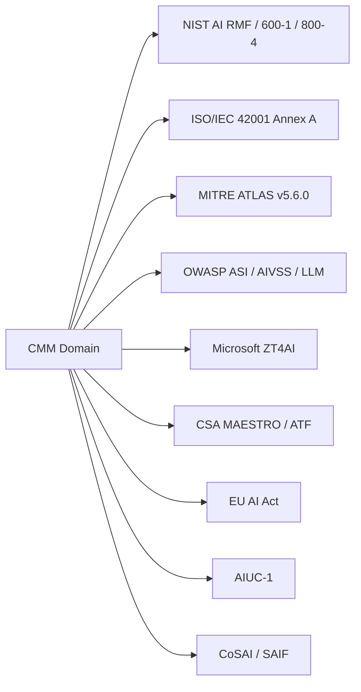
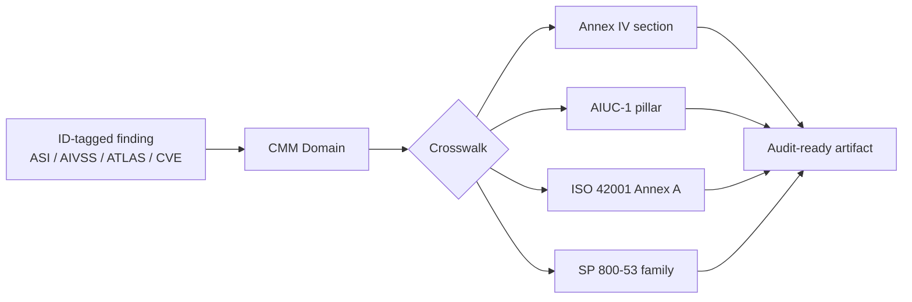

# Agentic AI Security CMM — Standards Crosswalk Matrix

This is the crosswalk matrix the validation page ([[agentic-cmm-vs-standards-validation|Validation: Agentic AI Security CMM vs Widely Adopted Standards]] §6 rec #1) called out as the single highest-leverage addition to the CMM. It is what makes `D1 L4`/`L5` and `D8 L5` falsifiable: a CMM that names standards and maps no controls produces no evidence an organization can present for AIUC-1 / ISO 42001 / EU AI Act compliance.

The matrix is intentionally lossy: it surfaces the **anchor controls** in each standard for each CMM domain. Full Annex-by-Annex maps remain future work.

The CSA MAESTRO / ATF column was corrected by [[standards-review-csa-maestro-atf-2026-Q2|the 2026-Q2 standards review]]: MAESTRO cells now cite verified layer names (Layer 1 is Foundation Models, Layer 2 is Data Operations), and the ATF cells cite the five **elements** (Identity, Behavior, Data Governance, Segmentation, Incident Response) that anchor domains rather than the numbered promotion gates, which govern level advancement and do not map one-to-one onto a domain.

The CoSAI / [[google-saif|SAIF]] column was reconciled by [[standards-review-saif-cosai-2026-Q2|the Google SAIF and CoSAI standards review]] (2026-06-22): CoSAI cells now cite the verified deliverable dates — Model Context Protocol (MCP) Security (2026-01-20), Agentic Identity and Access Management (2026-04-17), and the AI Incident Response Framework (2025-10-30) — and the four verbatim workstream names (WS1–WS4). The "40 threats / 12 categories" MCP figure is flagged as not re-verifiable in that pass.

## On this page

- [Master matrix: CMM domain × standard](#master-matrix--cmm-domain--standard)
- [OWASP AI Exchange control anchors](#owasp-ai-exchange-control-anchors)
- [Five threat classes crosswalk](#five-threat-classes-crosswalk)
- [Annex IV (EU AI Act) crosswalk](#annex-iv-eu-ai-act-crosswalk)
- [AIUC-1 six pillars crosswalk](#aiuc-1-six-pillars-crosswalk)
- [ISO/IEC 42001 Annex A 38-control crosswalk](#isoiec-42001-annex-a-38-control-crosswalk-high-leverage-subset)
- [NIST SP 800-53 control families via IR 8605A COSAiS](#nist-sp-800-53-control-families-via-ir-8605a-cosais)
- [Microsoft ZT4AI control-level crosswalk](#microsoft-zt4ai-control-level-crosswalk)
- [Mapping consumption pattern](#mapping-consumption-pattern)
- [Open gaps in the crosswalk](#open-gaps-in-the-crosswalk)
- [Relations](#relations)

**Recalibration note (2026-05-25).** The domain-to-standard mappings below remain valid after the [[agentic-ai-security-cmm-recalibration-method-2026|D1–D9 recalibration]] — a domain still anchors to the same standards. One framing change matters for this page: **AIUC-1 is no longer a D1-L5 mandate.** D1-L5 is now scheme-neutral third-party assurance with **ISO/IEC 42001 preferred**; AIUC-1 is one accepted option among several (with documented concentration and freshness caveats — see [[aiuc-1-critical-evaluation|the AIUC-1 evaluation]]). The AIUC-1 six-pillars crosswalk below serves organizations that choose that scheme; it is not the required anchor. For the recalibrated per-domain criteria, the nine deep dives (linked from the [[agentic-ai-security-cmm-2026|CMM]]) are authoritative.

## Master matrix — CMM domain × standard

Cell semantics: each cell names the **anchor control(s)** the CMM domain maps into, where evidence from the CMM (the artifacts in the level table) can be re-presented for each standard's audit. Empty cell = no clean anchor; the CMM domain is exceeding the standard's coverage there (see [[agentic-cmm-vs-standards-validation|Validation: Agentic AI Security CMM vs Widely Adopted Standards]] §4).

The Microsoft column was split by [[standards-review-microsoft-rai-agent-365-2026-Q2|the 2026-Q2 RAI / Agent 365 review]]: the [[microsoft-rai|RAI Standard]] is a responsible-AI **goals** standard (seventeen goals across six principles), distinct from the [[microsoft-zt4ai|ZT4AI]] **control catalogue**. The master matrix now carries a separate RAI-goals column alongside the ZT4AI-control column so the goals-standard-versus-catalogue distinction is visible at a glance; [[microsoft-entra-agent-id|Agent 365]] is the management plane over the ZT4AI controls rather than a separate standard.

| CMM Domain | [[nist-ai-rmf\|NIST AI RMF]] + 600-1 / 800-4 | [[iso-iec-42001\|ISO/IEC 42001]] Annex A | [[mitre-atlas\|MITRE ATLAS]] v5.6.0 | [[owasp-agentic-ai-top-10\|OWASP ASI]] / [[owasp-aivss\|AIVSS]] / LLM | [[microsoft-rai\|Microsoft RAI]] (goals) | [[microsoft-zt4ai\|Microsoft ZT4AI]] (controls) | [[csa-maestro\|CSA MAESTRO / ATF]] | [[eu-ai-act\|EU AI Act]] | [[aiuc-1\|AIUC-1]] | [[cosai\|CoSAI]] / SAIF |
|---|---|---|---|---|---|---|---|---|---|---|
| **D1 Governance** | Govern function (all 6 categories); IR 8605A SP 800-53 PM-* family | A.2 Policies; A.3 Internal organization; A.5 Impact assessment | (no anchor — ATLAS is attack-only) | (no direct anchor — ASI is risk-only) | A1 Impact Assessment; A2 Oversight; A3 Fit for purpose; A4 Data governance; T1-T2 Transparency | ZT4AI Pillar 1 (Agent governance) — exec sponsorship | ATF Gate 5 (Governance Sign-off); Incident Response element (governance overlay) | Art. 9 Risk Mgmt; Art. 17 Quality Mgmt; Art. 50 GPAI transparency | Pillar: Accountability | SAIF Foundation: Govern; CoSAI Shared Accountability principle |
| **D2 Identity & Authorization** | (AI 600-1 has no non-human-identity content — see review); NIST CAISI Concept Paper Feb 2026; SP 800-207 ZTA; SP 800-63 IAL/AAL | A.3 Internal organization (roles allocated to people, not agent/NHI identity); ISO 27090 §Identity (FDIS Mar 2026, unpublished) | `AML.T0055` (Unsecured Credentials); `AML.T0083` (Credentials from AI Agent Configuration); `AML.T0098` (AI Agent Tool Credential Harvesting) | `ASI03` Identity and Privilege Abuse; AIVSS factors: Execution Autonomy, External Tool Control Surface, Dynamic Identity; `LLM06:2025` Excessive Agency (agency facet only — names excessive permissions as a consequence, no identity/authorization control, per [[standards-review-owasp-llm-top-10-2026-Q2\|the LLM Top 10 review]]) | (no identity goal — PS1 defers to the Privacy Standard) | ZT4AI Pillar 1 (verify explicitly + least privilege); Entra Agent ID; Agent 365 Registry (management plane) | ATF Identity element ("Who are you?") | Art. 14 Human oversight (delegation chain) | Pillar: Security (identity controls subset) | SAIF Element 2 (Identity); CoSAI Agentic Identity and Access Management (2026-04-17) |
| **D3 Control & Least-Agency** | AI 600-1 refusal/disengage actions `GV-3.2-003` / `MS-2.6-006` / `MG-2.4-001`…`004` (no least-privilege control — see review); SP 800-53 AC-* family | A.9 Responsible/intended use (process framing only — no least-agency control) | `AML.T0053` (AI Agent Tool Invocation); `AML.T0081` (Modify AI Agent Configuration); `AML.T0105` (Escape to Host) | `ASI02` Tool Misuse and Exploitation (least-privilege tool profiles, Intent Gate PEP/PDP); Least-Agency principle; `ASI08` blast-radius guardrails; AIVSS factor: Execution Autonomy; `LLM06:2025` | A5 Human oversight and control (goal-level only — no least-agency control) | ZT4AI Pillar 1 (least privilege); Prompt Shields policy | ATF Segmentation element ("Where can you go?"); 4 maturity levels (Intern→Junior→Senior→Principal) gated by 5 promotion gates | Art. 14 Human oversight (HITL); Art. 13 Transparency to deployers | Pillar: Safety (autonomy boundaries) | CoSAI Maximize Oversight While Minimizing Intervention |
| **D4 Runtime & Guardrails** | [[nist-sp-800-218a\|NIST SP 800-218A]] `PW.1.1.R1` (AI threat modeling), `PW.5.2`/`PW.5.3` (input/output handling), `PO.4.1.R1` (guardrails) — build-time only, no runtime enforcement ([[standards-review-nist-sp-800-218a-2026-Q2\|review]] claim 2); AI 600-1 §2.1 (CBRN), §2.2 (Confabulation), §2.3 (Dangerous/Hateful Content); groundedness action `MS-2.5-005` ([[prompt-injection\|prompt injection]] is red-team-only `MS-2.7-007`); [[nist-ai-800-4\|AI 800-4]] post-deployment monitoring | A.6 AI system life cycle (operation/monitoring, generic); ISO 27090 §Runtime safeguards (FDIS, unpublished) | `AML.T0051` (LLM Prompt Injection); `AML.T0054` (LLM Jailbreak); `AML.T0053` (AI Agent Tool Invocation); `AML.M0020` (Generative AI Guardrails); `AML.M0030` (Restrict AI Agent Tool Invocation on Untrusted Data) | `ASI01` Goal Hijack; `ASI02` Tool Misuse; `LLM01:2025` Prompt Injection; `LLM05:2025` Improper Output Handling | RS1 Reliability and safety; RS2 Failures and remediations (outcome goals — control deferred to ZT4AI) | ZT4AI Pillar 3 (Prompt security); Microsoft Prompt Shields; Groundedness Detection; FIDES research | MAESTRO Layer 1 (Foundation Models) + Layer 3 (Agent Frameworks); ATF Behavior element ("What are you doing?") | Art. 15 Accuracy/Robustness/Cybersecurity | Pillar: Security (guardrails subset) | SAIF Element 4 (Application defense); CoSAI WS4 Secure Design |
| **D5 Egress & Network** | AI 600-1 §2.9 (Information Security — exfil as threat only, `MS-2.7-001`; no egress control — see review); SP 800-207 ZTA; SP 800-53 SC-* family | (no specific Annex A control); ISO 27090 §Inter-system (FDIS, unpublished) | `AML.T0086` (Exfiltration via AI Agent Tool Invocation); `AML.T0048` (External Harms via tool actions) | `ASI02` Tool Misuse; `ASI07` Insecure Inter-Agent Comms | (no egress goal) | ZT4AI Pillar 2 (Data security at egress); Defender for Cloud Apps | MAESTRO Layer 4 (Deployment and Infrastructure) + Layer 7 (Agent Ecosystem); ATF Segmentation element (blast radius); CoSAI [[mcp-security\|MCP Security]] (2026-01-20) | Art. 15 Cybersecurity | Pillar: Security (network/protocol subset) | SAIF Element 3 (Infrastructure); CoSAI Model Context Protocol (MCP) Security (2026-01-20) |
| **D6 Data, Memory & RAG** | [[nist-sp-800-218a\|NIST SP 800-218A]] **PW.3** (`PW.3.1` poisoning/tampering screen, `PW.3.2` provenance, `PW.3.3` adversarial samples) + `PS.1.2` (training-data protection) — training-data integrity is 218A's strongest contribution, but no RAG/runtime-memory content ([[standards-review-nist-sp-800-218a-2026-Q2\|review]]); AI 600-1 §2.4 (Data Privacy), §2.8 (Information Integrity); data/poisoning actions `MP-4.1-004`/`005`, `MS-2.7-007` (no agent-memory poisoning — see review); AI 800-4 distribution-shift/drift §3.2.1 | A.7 Data (acquisition, quality, provenance — data only) | `AML.T0080` (AI Agent Context Poisoning); `AML.T0070` (RAG Poisoning); `AML.T0020` (Poison Training Data) | `ASI06` Memory & Context Poisoning (validate memory writes, per-tenant namespaces, expire unverified memory); `LLM04:2025` Data and Model Poisoning; `LLM07:2025` System Prompt Leakage; `LLM08:2025` Vector/Embedding Weaknesses | A4 Data governance and management; PS1 Privacy Standard compliance (goal-level) | ZT4AI Pillar 2 (Data security incl. Purview tuned for AI) | MAESTRO Layer 2 (Data Operations); ATF Data Governance element ("What are you eating? What are you serving?") | Art. 10 Data and data governance; Art. 11 Technical documentation (corpus provenance) | Pillar: Data & Privacy | SAIF Element 1 (Data); CoSAI MCP server data threats |
| **D7 Observability & Detection** | NIST CSF 2.0 Detect; AI 800-4 (six monitoring categories, §3 challenge taxonomy); AI 600-1 monitoring actions `MS-2.6-005` / `MG-3.2-006` / `MG-4.1-001`…`006` | A.6 AI system life cycle (event logging, plausible); A.8 Information for interested parties (incident communication) | `AML.M0007` (Detection mitigations); ATLAS Detection Layer in Navigator | `ASI08` Cascading Failures; `ASI10` Rogue Agents; AIVSS Multi-Agent Interactions amp factor | RS3 Ongoing monitoring, feedback, and evaluation (monitoring goal) | ZT4AI Pillar 1 (assume breach) — Sentinel + Defender for Cloud Apps; Agent 365 `observe` (registry, Registry sync, Agent Map) | MAESTRO Layer 5 (Evaluation and Observability); ATF Behavior element (continuous monitoring, anomaly detection) | Art. 12 Logging and record-keeping; Art. 72 Post-market monitoring | Pillar: Reliability (monitoring subset) | SAIF Element 5 (Auto-defense / detect); OTel `gen_ai.*` |
| **D8 Supply Chain & AI-BOM** | [[nist-sp-800-218a\|NIST SP 800-218A]] `PS.3.2` (model provenance via SBOM/SLSA), `PW.4.4.R1` (verify integrity of acquired models), `PS.1.3.R4` (weight protection) — but no AI-BOM artifact schema ([[standards-review-nist-sp-800-218a-2026-Q2\|review]] claim 3); AI 600-1 §2.12 (Value Chain), third-party block `GV-6.1-001`…`010` (no AI-BOM artifact — see review) | A.4 Resources; A.10 Third-party relationships (no AI-BOM requirement); ISO 27036-* | `AML.T0010` (AI Supply Chain Compromise); `AML.T0104` (Publish Poisoned AI Agent Tool); `AML.T0109` (AI Supply Chain Rug Pull); `AML.T0019` (Publish Poisoned Datasets) | `ASI04` Supply Chain Vulnerabilities; AIVSS amp factor: Self-Modification | A4 Data governance (training-data provenance, partial — no AI-BOM goal) | ZT4AI: Microsoft ML scan in Defender for Cloud (Agent 365 inventory ≠ AI-BOM) | MAESTRO Layer 3 (Agent Frameworks) supply-chain threat — named, not a control; ATF silent; CSAI Foundation AI Risk Observatory March 2026 | Art. 11 + Annex IV (technical documentation incl. AI-BOM-like) | Pillar: Security (supply chain subset) | SAIF Element 1 (Data) supply-chain provenance; CoSAI Project CodeGuard |
| **D9 Operations & Human Factors** | AI 800-4 (human factors flagged as biggest blind spot); CSF 2.0 Govern.OS (Oversight); CoSAI AI Incident Response Framework (2025-10-30) | A.4 Resources (human); A.6 AI system life cycle (deployment, documentation); A.8 Information for interested parties | `AML.M0018` (User Training); `AML.M0029` (Human In-the-Loop); `AML.M0009` (Restrict Library Loading) | `ASI09` Human-Agent Trust Exploitation (over-reliance, automation/authority bias, oversight training); `ASI08` Cascading Failures (operator-side); `LLM07:2025` System Prompt Leakage (confidentiality) | A5 Human oversight and control; A2 Oversight of significant adverse impacts | ZT4AI Pillar 1 (continuous verification); Agent 365 lifecycle + Entra ID Governance sponsors; FIDES rate-limit / cost-budget research | ATF Incident Response element ("What if you go rogue?" — kill switch, demotion-to-Intern) | Art. 12 Logging; Art. 14 Human oversight; Art. 72 Post-market monitoring; Art. 73 Reporting of serious incidents | Pillar: Reliability + Society | CoSAI AI Incident Response Framework (2025-10-30) |

> [!note] ZT4AI column is anchor-level
> The Microsoft ZT4AI cells above stay anchor-level (one pillar reference per domain) for parity with the other standards. The **control-level** ZT4AI crosswalk — named, deep-linked controls with GA/preview status per domain — is in the dedicated section below and in [[standards-review-microsoft-zt4ai-2026-Q2|the 2026-Q2 ZT4AI review]]. Note the "700 controls / 116 groups / 33 swim lanes" figure is the whole Zero Trust Workshop, not an AI-pillar count.

## OWASP AI Exchange control anchors

The [[owasp-ai-exchange|OWASP AI Exchange]] control catalogue divides into four categories (Manage, Have resilient models, Watch, Limit) and eight sub-categories over 50+ named controls ([`/go/controlsoverview/`](https://owaspai.org/go/controlsoverview/)). Control names are cited as the Exchange writes them, in caps. Three further permalinks supply the non-catalogue anchors below: the G.U.A.R.D. steps ([`/go/organize/`](https://owaspai.org/go/organize/)), the ten numbered risk-analysis steps ([`/go/riskanalysis/`](https://owaspai.org/go/riskanalysis/)), and the agentic design constraints and memory-surface model ([`/go/agenticaioverview/`](https://owaspai.org/go/agenticaioverview/)).

| CMM domain | Exchange anchor controls |
|---|---|
| **D1 Governance** | `AI PROGRAM`, `SEC PROGRAM`, `CHECK COMPLIANCE`, `SEC EDUCATE`, `DISCRETE`; the G.U.A.R.D. Govern and Demonstrate steps; risk-analysis steps 1–5, 8, and 10. Step 5 (arrange responsibility) is graded at [[agentic-ai-security-cmm-d1-governance\|D1]] L3 as a provider responsibility matrix; D9 below carries the recurring verification of it |
| **D2 Identity & Authorization** | `MODEL ACCESS CONTROL` for machine-to-machine agent-to-service and inter-agent calls (scoped tokens, session binding, mutual auth); the agent-identity and task-bound-token elements of `LEAST MODEL PRIVILEGE` |
| **D3 Control & Least-Agency** | `LEAST MODEL PRIVILEGE` with its agentic authorization framework (deny-by-default, infrastructure policy enforcement, task-bound tokens, agent identity); the gate-based share of `OVERSIGHT`'s automated oversight — the action withheld until the policy decision point returns a permit or a deny, or until a verified human approval signal arrives from outside the agent's execution path; the design constraints "enforce at infrastructure, not in prompts" and "bound blast radius by default" |
| **D4 Runtime & Guardrails** | `PROMPT INJECTION I/O HANDLING`, `INPUT SEGREGATION`, `ANOMALOUS INPUT HANDLING`, `EVASION INPUT HANDLING`, `UNWANTED INPUT SERIES HANDLING`, `SENSITIVE OUTPUT HANDLING`, `ENCODE MODEL OUTPUT`, `RUNTIME MODEL IO INTEGRITY`, `RUNTIME MODEL INTEGRITY`, `AGENT SANDBOXING`, `DOS INPUT VALIDATION`; the detection share of `OVERSIGHT`'s automated oversight — unwanted output and suspicious action sequences recognized in model output, before execution, or after execution, plus grounding checks by a separate model where rule-based recognition is insufficient, and rollback as a response option |
| **D5 Egress & Network** | `MODEL ACCESS CONTROL` at the agent-to-service and inter-agent boundary; inter-model communication security including MCP; the no-transitive-trust position and enforcement at the message bus or orchestrator; `RATE LIMIT`, `LIMIT RESOURCES` |
| **D6 Data, Memory & RAG** | `AUGMENTATION DATA INTEGRITY`, `AUGMENTATION DATA CONFIDENTIALITY`, `MODEL INPUT CONFIDENTIALITY`, `SEGREGATE DATA`, `DATA QUALITY CONTROL`, `DATA MINIMIZE`, `ALLOWED DATA`, `SHORT RETAIN`, `OBFUSCATE TRAINING DATA`; the three memory surfaces (working memory, vector stores, cross-session stores); the data provenance and lineage practices `DEV PROGRAM` assigns to the development lifecycle |
| **D7 Observability & Detection** | `MONITOR USE`; collective-behaviour monitoring across a multi-agent system rather than per-agent actions only; comparison of stated reasoning against actual tool calls |
| **D8 Supply Chain & AI-BOM** | `SUPPLY CHAIN MANAGE` with its four supplied assets — data, models, model hosting, and abilities — and the data-provenance requirement its own-organization clause introduces; the integrity-checking share of `DEV SECURITY` (build-stage source verification and dependency auditing, deploy-stage configuration and runtime integrity monitoring, component authenticity by cryptographic signature, and dataset-entry hashing); the ready-made-model guidance; the G.U.A.R.D. Understand step's split between controls the organization implements and controls its supplier owes it; the code / configuration / training-data / model version management and traceability required by `SEC DEV PROGRAM` and `DEV PROGRAM`, discussed below. The Exchange names no AI-BOM artifact schema, the same absence this crosswalk records for ISO/IEC 42001 and NIST SP 800-218A |
| **D9 Operations & Human Factors** | `OVERSIGHT` (human oversight), `SEC EDUCATE`, `CONTINUOUS VALIDATION`, `AI TRANSPARENCY`, `EXPLAINABILITY`; risk-analysis step 6 (verify external responsibilities) and step 9 (further management of selected controls); continuous tuning of control quality parameters such as noise levels and anomaly thresholds; the staleness and concept-drift testing `DEV PROGRAM` routes to `CONTINUOUS VALIDATION` ([`/go/devprogram/`](https://owaspai.org/go/devprogram/)); `OVERSIGHT`'s human half specifically — risk-tiered oversight requirements assigned before deployment, approval tokens binding approver identity and action parameters, tamper-evident approval audit trails, segregation of duties across approvers, session-level approval rate limits, and two of the four stated downsides of human oversight — approval fatigue and the out-of-the-loop phenomenon |

`OVERSIGHT` anchors to three domains rather than one, and the split follows the control's own structure at two levels. The Exchange divides the control once, into automated and human oversight, and categorises the whole of it a runtime control.[^aix-oversight] The automated side divides again in this table, because its two mechanisms sit on different planes: recognizing unwanted output and suspicious action sequences is [[agentic-ai-security-cmm-d4-runtime-guardrails|D4]]'s plane, and withholding an action until a permit or deny returns is [[agentic-ai-security-cmm-d3-control-least-agency|D3]]'s. The human side stays whole and is graded on reviewer quality and fatigue at [[agentic-ai-security-cmm-d9-operations|D9]]. [[oversight-layer|The oversight layer]] states the same automated side in XACML terms — PIP detection and PEP enforcement — which is the D4 and D3 shares under different names. The Exchange also nests the control: `MONITOR USE` is the overarching monitoring control and `OVERSIGHT` is one clause of it, so the D7 row's `MONITOR USE` anchor is the parent of an anchor three other rows carry.[^aix-oversight] An assessor reading a single domain's row sees a fragment, which is why each of the three rows above names the share it holds.

The Exchange's own ATLAS references for `OVERSIGHT` are `AML.M0020` (Generative AI Guardrails) for the automated half, and `AML.M0030` (Restrict AI Agent Tool Invocation on Untrusted Data) with `AML.M0029` (Human In-the-Loop for AI Agent Actions) for the human half.[^aix-oversight] Of the three, `AML.M0030` was already established in [[standards-review-mitre-atlas-2026-Q2|the 2026-Q2 ATLAS review]]'s D4 row and had not reached the master matrix's D4 ATLAS cell above; it is added there as a propagation of the wiki's own review rather than as new information from §1.3. `AML.M0029` stays in the D9 cell, since the mitigation is the human gate and this crosswalk grades the human gate at D9.

Two of the six governance controls in the Exchange's §1.1 sit outside the D1 row, each for a stated reason. `DEV PROGRAM` is a general software-engineering control and not a security-governance one — "Apply general (not just security-oriented) software engineering best practices to AI development" ([`/go/devprogram/`](https://owaspai.org/go/devprogram/)) — and the Exchange draws the boundary itself: ISO/IEC 42001 extends the risk management system and covers governance, ISO/IEC 5338 extends the software lifecycle and covers engineering ([`/go/aiprogram/`](https://owaspai.org/go/aiprogram/)). Its elements distribute across the D6, D8 and D9 rows above instead, which is where its four related controls — `SEC DEV PROGRAM`, `SUPPLY CHAIN MANAGE`, `CONTINUOUS VALIDATION`, `UNWANTED BIAS TESTING` — already point. The [[agentic-ai-security-cmm-d1-governance|D1 deep dive]], authoritative for per-domain criteria under the recalibration note above, never carried it.

`SEC DEV PROGRAM` has no domain of its own, and the reason is the CMM's shape rather than the control's content. The nine domains derive from six reference-architecture planes plus governance, supply chain, and operations, so they cover deployment and operation and leave development-time process unclaimed. One of the control's particularities does distribute — version management and traceability over the combination of code, configuration, training data and model, which the D8 row above carries. The rest of it has no cell to sit in: AI threat modeling, secure coding applied to data preparation, orchestration, tool integration and policy enforcement code, development-environment security, and pre-deployment security testing ([`/go/secdevprogram/`](https://owaspai.org/go/secdevprogram/)). That absence belongs to the CMM, not to the Exchange, and it is recorded here in the same form as the AI-BOM absences the master matrix records against other standards.

§3.0's development-time control group falls in the same unclaimed space, and it is larger than the one control that paragraph names. `DEV SECURITY` protects the AI development infrastructure and the assets particular to it — training data, test data, model parameters, technical documentation — through encryption at rest, technical and centralized access control, operational security, logging and monitoring for manipulation outside office hours, and integrity checking across build, deploy and supply chain ([`/go/devsecurity/`](https://owaspai.org/go/devsecurity/)).[^aix-devsecurity] `SEGREGATE DATA` partitions that environment into five areas so the training environment can be hardened against the rest ([`/go/segregatedata/`](https://owaspai.org/go/segregatedata/)).[^aix-segregatedata] `CONF COMPUTE` hides training data and model parameters from the model engineers themselves while the data is in use ([`/go/confcompute/`](https://owaspai.org/go/confcompute/)).[^aix-confcompute] `FEDERATED LEARNING` distributes a training set across organizations so it need not be centralized ([`/go/federatedlearning/`](https://owaspai.org/go/federatedlearning/)).[^aix-federatedlearning] The integrity-checking share of `DEV SECURITY` reaches the D8 row above, since build-stage verification, deploy-stage integrity monitoring, component authenticity and dataset hashing are the acquisition-side controls that row already grades. The rest has no cell, for the reason the paragraph above gives: the nine domains cover deployment and operation, and development-time process is unclaimed.

`CONF COMPUTE` is the sharper case of that absence, because among the development-time controls in §3.0, it is the only one aimed at the engineer with legitimate access to the training environment. The five threat classes crosswalk below places Class 1, the AI-aware insider, across D2, D3, D6 and D8, all four of which grade the running system. An insider inside the training environment falls outside every one of them.

`FEDERATED LEARNING` states a countervailing risk no other control in this table states about itself. The Exchange records that it decreases the risk of all data leaking and increases the risk of some data leaking, that an active and dishonest central party can extract user data from received gradients by manipulating shared weights and computing deltas against the central weights, and that a federated network of clients creates more attack surface for poisoning because some clients may be malicious ([`/go/federatedlearning/`](https://owaspai.org/go/federatedlearning/)).[^aix-federatedlearning] The qualifications above price controls or bound their efficacy; this one records a control that redistributes a risk rather than reducing it, which is a different reading instruction for an assessor crediting it.

§3.1's poisoning controls fall on the model-engineering side of the same ownership split, apart from `DATA QUALITY CONTROL`, which the D6 row already anchors, and one exception the split does not cover. `MORE TRAIN DATA`, `TRAIN DATA DISTORTION` and the broad-poisoning control `MODEL ENSEMBLE` are set when a model is trained, and `TRAIN ADVERSARIAL` is recorded below.[^aix-moretraindata][^aix-traindatadistortion][^aix-modelensemble] `POISON ROBUST MODEL` is the exception: the Exchange states it applies to a model that has already been trained, including one obtained from an external source, and names pruning, clean-data fine-tuning, and fine-pruning as the methods ([`/go/poisonrobustmodel/`](https://owaspai.org/go/poisonrobustmodel/)).[^aix-poisonrobustmodel] A deploying organization can therefore operate it on an acquired model without training one, which is the condition every other control in this group fails. It anchors provisionally at [[agentic-ai-security-cmm-d8-supply-chain|D8]], the domain that holds acquired artifacts, and that domain grades verification of an acquired model and no repair of one, which the open gap below records.

`DISCRETE` anchors to the D1 row, and its implementation is what places it there. The Exchange's method for the control is to carry technical details of the AI system as an asset inside information security management, which it states yields asset management, data classification, awareness education, policy, and inclusion in risk analysis; its standards anchor is ISO 27002 Control 5.9, inventory of information and other associated assets, and its OpenCRE route is data classification and handling.[^aix-discrete] Those are D1 objects, and the row already carries awareness education and risk analysis through the G.U.A.R.D. steps. The control also forms the one pair in this table the Exchange states must be weighed against each other: `DISCRETE` at D1 against `AI TRANSPARENCY` at D9 in the row below.[^aix-discrete] The [[owasp-ai-exchange|OWASP AI Exchange]] page carries the trade-off and the disclosure each control asks for. What this table holds is that the pair crosses a domain boundary, so an assessor reading either row alone sees one side of it.

Two qualifications travel with this mapping. The Exchange states that many of its controls are expensive to implement and trade off against other AI properties that affect correctness and normal operation, and that controls changing the learning process or the data distribution can carry unintended downstream side effects ([`/go/controlsoverview/`](https://owaspai.org/go/controlsoverview/)). And the catalogue supplies no organizational maturity criteria: it names controls without stating what a program must show at each level, the same gap this crosswalk records for every other standard in the master matrix.

The catalogue does grade standards. Each control lists the standards relevant to it, and against some of them records a verdict — "covers this control fully" or "covers this control minimally" — twelve such verdicts across the six governance controls alone, with most listed standards carrying none ([`/go/governancecontrols/`](https://owaspai.org/go/governancecontrols/)). That is a coverage judgement about a standard rather than a maturity judgement about a program, and it grades no implementation. §1.3 adds five verdicts on the same scale: ISO/IEC 42001 B.9.3 covers `OVERSIGHT` partly, reaching human oversight and not business logic;[^aix-oversight] ISO 27002 8.2 and OpenCRE 368-633 each cover `LEAST MODEL PRIVILEGE` fully, with the particularity that privileges assigned to autonomous model decisions account for the risk of unwanted model behaviour;[^aix-leastmodelpriv] ISO/IEC 42001 B.7.2 covers `AI TRANSPARENCY` minimally, reaching only the data-management part;[^aix-aitransparency] and ISO 5338 covers `CONTINUOUS VALIDATION` fully.[^aix-continuousvalidation] Three of §1.3's seven controls carry no standards block at all.

§1.2 adds two verdicts on the same scale: ISO/IEC 23894 A.8 Privacy covers `ALLOWED DATA` fully, with a brief section on the idea,[^aix-alloweddata] and ISO 27002 Control 5.9 covers `DISCRETE` fully, with the particularity that technical data science details can be sensitive — a verdict the Exchange repeats against the OpenCRE data-classification entry.[^aix-discrete] The group's other three controls state that ISO/IEC standards do not cover them yet, which is an absence rather than a verdict.[^aix-datalimit] The two 42001 references are Annex B clauses rather than Annex A controls, so they fall outside the scope of the master matrix's ISO/IEC 42001 column above, which is why they are recorded here.

A third qualification is stronger than either, because it removes controls rather than pricing them. The Exchange treats the general input-control set as a default adjusted per threat subtype: `RATE LIMIT`, `UNWANTED INPUT SERIES HANDLING`, and `OBSCURE CONFIDENCE` are excluded by name for transferability-based evasion ([`/go/transferattack/`](https://owaspai.org/go/transferattack/)) and for evasion after data poisoning ([`/go/evasionafterpoison/`](https://owaspai.org/go/evasionafterpoison/)), on the stated grounds that all three defend against an attacker searching for adversarial samples against the target and neither subtype requires querying the target. The D4 and D5 cells above anchor two of those three controls to a domain, and a domain-level anchor carries no threat scope. An assessor reading a control out of this table checks the Exchange's own per-threat control list before treating a mapped control as in scope for a specific threat.

Two of the D4 row's eleven anchored controls are the Exchange's named answers to evasion, and both state their own ineffectiveness against it — a fourth qualification, and the first that bears on efficacy rather than scope. `ANOMALOUS INPUT HANDLING` writes that detection is often ineffective for evasion, because adversarial samples are designed to resemble normal input by definition ([`/go/anomalousinputhandling/`](https://owaspai.org/go/anomalousinputhandling/)). `EVASION INPUT HANDLING` writes that an adversarial sample may be crafted to evade both the primary model and a dedicated detector ([`/go/evasioninputhandling/`](https://owaspai.org/go/evasioninputhandling/)). The qualification above records that this catalogue sets no maturity criteria for the programs operating its controls; these two entries grade the control itself, and they grade it low. An assessor crediting a D4 level from either anchor records the control's presence and states the residual separately, because the source supplies no basis for reading presence as coverage of the threat the control is listed against.

The section's remaining controls anchor to no domain in this table. `EVASION ROBUST MODEL`, `TRAIN ADVERSARIAL` and `ADVERSARIAL ROBUST DISTILLATION` act at development time, and `INPUT DISTORTION` requires retraining the model with its transformations in place ([`/go/inputdistortion/`](https://owaspai.org/go/inputdistortion/)). Their absence from the table follows an ownership split rather than a runtime boundary: all four are model-engineering controls, setting architecture, training objective, or learned decision surface, and an organization deploying a third-party model sets none of those. The split is what keeps the D6 row's development-time data controls — `OBFUSCATE TRAINING DATA`, `DATA QUALITY CONTROL`, `SEGREGATE DATA`, `ALLOWED DATA` — anchored while the model-engineering controls are not, because a deploying organization owns the corpus it supplies for fine-tuning and retrieval even where it owns none of the model. `TRAIN ADVERSARIAL` carries a second threat scope §3.1.1 supplies: the same control defends against data-poisoning trigger attacks built from slight alterations of training data, because such triggers behave like adversarial samples.[^aix-trainadversarial] The wider scope leaves the anchoring unchanged, since the ownership split turns on who trains the model and not on which threat the training answers.

`SENSITIVE OUTPUT HANDLING`, the D4 row's output-side anchor, is the Exchange's final safeguard against exposure-restricted data reaching a user, and its Limitations block states four ([`/go/sensitiveoutputhandling/`](https://owaspai.org/go/sensitiveoutputhandling/)). Those four are the fifth qualification. Pattern matching misses sensitive data matching no known pattern; false positives can cause serious system malfunction or block legitimate output; subtle or context-dependent disclosures are difficult to detect automatically; and an attacker can obfuscate output to defeat detection, the Exchange's own example being a base64-encoded token. The entry's risk-reduction guidance adds a fifth outside that block: recitation checks reach only indexed training data and may miss shorter or paraphrased disclosures. The obfuscation limit is the one an assessor carries, because it defeats the control's primary mechanism rather than reducing its recall: a detector matching credential and identifier shapes reads the encoded form as ordinary text. An assessor credits the anchor for its detection scope and records the encoding residual separately.

Two anchors carry entries that reach past the domain holding them, which is the sixth qualification. `LIMIT RESOURCES` names three enforcement points — containers, API gateways, and orchestration — and states that the agent must not enforce its own quota ([`/go/limitresources/`](https://owaspai.org/go/limitresources/)). Containers are [[agentic-ai-security-cmm-d4-runtime-guardrails|D4]]'s sandbox, API gateways are [[agentic-ai-security-cmm-d5-egress-network|D5]]'s in-path gateway, and orchestration is [[agentic-ai-security-cmm-d3-control-least-agency|D3]]'s control plane. The anchor sits at D5 because the entry's per-agent caps on tool invocations and network egress are graded there, and D4 grades the compute, memory, and wall-clock half of the same list. `DOS INPUT VALIDATION` extends input validation to LLM-generated tool arguments, including per-tool rate limits against injection-driven execution loops ([`/go/dosinputvalidation/`](https://owaspai.org/go/dosinputvalidation/)); tool-argument validation is graded at D4 and per-tool call ceilings at D5. One requirement in the `LIMIT RESOURCES` entry has no anchor in this table: fleet-wide consumption monitoring for correlated spikes and slow exhaustion attacks. The D7 cell above anchors collective-behaviour monitoring across a multi-agent system and is the domain that would hold it; no cell names consumption or cost as a monitored signal.

The four sensitive-data-limitation anchors in the D6 row carry requirements the Exchange sets out in §1.2 ([`/go/datalimit/`](https://owaspai.org/go/datalimit/)), and they are the seventh qualification. `DATA MINIMIZE` and `SHORT RETAIN` are one control and its special case, because the Exchange states that limiting a retention period can be seen as a special form of data minimization,[^aix-shortretain] so an assessor crediting both anchors credits one capability at two time horizons. `ALLOWED DATA` limits purpose rather than volume: remove data prohibited for the intended purpose, which the Exchange singles out where consent was not given and the data holds personal information collected for a different purpose. Its entry runs to a Description, an Objective and a References block with no Implementation section, so that anchor carries a requirement and no method.[^aix-alloweddata] `OBFUSCATE TRAINING DATA` is the only one of the group's five controls the Exchange files as a development-time AI engineer control, while the other four are development-time and runtime controls,[^aix-datalimit] which is the distinction the ownership argument above turns on. That entry and `DATA MINIMIZE` each state an exception to it: the deployer may implement part of the control where better positioned, provided the provider communicates the requirement.[^aix-dataminimize][^aix-obfuscate] The exception refines the ownership split rather than reversing it, and [[agentic-ai-security-cmm-d6-data-rag|the D6 deep dive]] grades the four anchors at L3 and L4.

Two further D6 anchors carry §3.0 and §3.1.1 entries that reach past what the domain grades, which is the eighth qualification. `DATA QUALITY CONTROL` is anchored here on the ownership argument above, and §3.1.1 states that ownership directly: implementation "may be more suitable for the deployer of the AI system in environments where training data pipelines or supply chains are externally managed", which is the deployer case this crosswalk assumes throughout.[^aix-dataqualitycontrol] `SEGREGATE DATA` is anchored here and is a development-environment control in the source. Its implementation is five areas — external, application development, data engineering, training, and operational — with the training environment carrying controls against access from the less-protected areas around it, which is where the Exchange places its data-poisoning mitigation (§3.0).[^aix-segregatedata] [[agentic-ai-security-cmm-d6-data-rag|The D6 deep dive]] grades the augmentation store, the corpus and agent memory, and it grades no environment boundary, so this anchor names a control the domain holds and does not measure. `TRAIN DATA DISTORTION`, which the poisoning-control group above leaves unanchored, depends on that boundary: the Exchange states the control has no effect against an attacker with access to the training data after distortion, so a separated training environment is what makes it reach poisoning introduced elsewhere in the development environment.[^aix-traindatadistortion]

The §2.3 and §2.4 controls fall on the model-engineering side of the same ownership split. `SMALL MODEL` constrains model capacity to limit overfitting ([`/go/smallmodel/`](https://owaspai.org/go/smallmodel/)) and `MODEL WATERMARKING` embeds an ownership marker at training time ([`/go/modelwatermarking/`](https://owaspai.org/go/modelwatermarking/)). Both act on a model the organization trains, and neither anchors to a domain here. Watermarking carries a second reason beyond the ownership split: its stated objective is post-theft ownership verification for legal, contractual, and regulatory use rather than prevention or detection of an attack in progress, so it produces evidence for a dispute rather than a control an assessor grades.

One §2.3 control sits outside the split and outside this table for a different reason. `OBSCURE CONFIDENCE` is a runtime output-shaping control the Exchange lists against [[model-layer-attacks|model inversion and membership inference]] ([`/go/obscureconfidence/`](https://owaspai.org/go/obscureconfidence/)), and a deploying organization sets it, so the ownership split does not account for its absence. It is unanchored here because no domain grades the data class it acts on, which is a gap in this table rather than a boundary of the CMM. The surface is claimed: [[agentic-ai-security-cmm-d4-runtime-guardrails|D4]] grades an output classifier with a recorded data-class scope at L3 and encoding-aware response-leak scanning at L5, and the two classes that scope names are content safety and the exposure-restricted data `SENSITIVE OUTPUT HANDLING` covers. Confidence scores and probabilities fall in neither. One share of `DISCRETE` sits in the same unclaimed space: the third example the Exchange gives for it is minimizing technical details in model output,[^aix-discrete] a runtime output-shaping requirement on the same claimed surface, and detail about the system itself is a data class no domain in this CMM has claimed.

The residual reaches the guardrail classifiers themselves. A classifier is a model performing a task, and the Exchange's own evasion examples include bypassing an LLM-based content filter by altering a few words of an offensive message ([`/go/evasion/`](https://owaspai.org/go/evasion/)). A detection control anchored to D4 is therefore in scope for the threat class it is credited against, which is the reason a guardrail's grade rests on its measured miss rate under adversarial pressure, a stricter test than its presence in the path.

The D2 cell's anchor states its own limit. `MODEL ACCESS CONTROL` writes under its agentic limitations that authentication confirms identity and not intent, so a prompt-injected authenticated agent still passes its auth checks ([`/go/modelaccesscontrol/`](https://owaspai.org/go/modelaccesscontrol/)). Scoped tokens, session binding, and mutual authentication bound what an agent may reach; they do not establish that the reaching was intended, which is why [[agentic-ai-security-cmm-d2-identity|D2]] caps [[agentic-ai-security-cmm-d5-egress-network|D5]] and [[agentic-ai-security-cmm-d7-observability|D7]] rather than substituting for them.

## Five threat classes crosswalk

The master matrix maps published standards to domains. The wiki's [[agentic-ai-threat-classes-2026|five threat classes]] are the expansion the standards under-serve, and they map to domains on a different axis: cross-cutting adversary models rather than per-component risks. The authoritative threat-to-domain mapping for every taxonomy, including these classes, is the [[threat-taxonomy-reconciliation|Threat Taxonomy Reconciliation]] matrix. The per-class summary below is the CMM-side view.

| Threat class | Primary CMM domains | Highest-leverage control |
|---|---|---|
| Class 1 — AI-aware insider | D2, D3, D6, D8 (D9) | Customer-owned, version-pinned eval harness over every artifact ([[ai-bom\|AI-BOM]] + always-on eval) |
| Class 2 — Long-running APT campaign | D4, D5, D7 (D9) | Cross-version eval continuity + sustained AI-workload threat hunting |
| Class 3 — Collusion | D3, D4, D7 (D9) | Monitor isolation + output canonicalization + deception probes |
| Class 4 — Model-version degradation | D4, D6, D8 (D9) | Customer eval suite versioned independently of the vendor; pin-by-hash |
| Class 5 — Jurisdictional adversary | D1 (D9) | Multi-vendor abstraction; jurisdiction tagging; vendor-cutoff playbook |

D9 Operations is the shared denominator across all five, which is why its bus-factor and continuity prerequisites gate every other domain's L5 claim. Classes 1, 2, and 4 collapse to a single observable — the eval-harness delta against a trusted baseline — so D6 and D8 carry the load-bearing control for three of the five.

## Annex IV (EU AI Act) crosswalk

EU AI Act Annex IV requires technical documentation for high-risk AI systems. Mapping the items most relevant to agentic AI, plus one obligation that sits outside Annex IV and is carried in the last row for the reason stated below it. The Annex IV point and sub-point labels below were corrected against the verified Annex IV structure in the [[standards-review-eu-ai-act-2026-Q2|EU AI Act standards review]]: Annex IV has nine top-level points; point 2 carries sub-points (a)-(h), with cybersecurity at 2(h) and validation/testing at 2(g); the risk management system is point 5 (per Art. 9), and changes through the lifecycle is point 6.[^annexiv]

| Annex IV Item | CMM evidence at L3+ | CMM domain |
|---|---|---|
| 1. General description (purpose, intended use) | Agent Card / system manifest | D1 + D2 |
| 2. Detailed description (architecture) | Reference architecture instance per agent | D1 + reference to [[agentic-ai-security-reference-architecture\|Agentic AI Security Reference Architecture]] |
| 2(c). System architecture / computational resources used | Latency / cost dashboard | D9 |
| 2(d). Data requirements / datasheets / provenance | Per-source attribution; AI-BOM | D6 + D8 |
| 2(e). Human oversight measures | HITL coverage telemetry; least-agency tier register | D3 + D9 |
| 2(g). Validation and testing procedures | Red-team / eval reports; acceptance-test records | D1 + D4 |
| 2(h). Cybersecurity measures | Cred-proxy logs; gateway config; sandbox; firewall | D2 + D4 + D5 |
| 3. Detailed monitoring information | Behavioral-monitoring dashboards; OTel `gen_ai.*` traces; AI-SPM | D7 |
| 5. Risk management system (per Art. 9) | Risk Committee minutes; incident register; ID-tagged finding registry (ASI / AIVSS / ATLAS) | D1 + D7 + D8 |
| 6. Changes through the lifecycle | Decommission lifecycle artifacts; version pinning policy | D9 |
| Provider conversion / substantial modification (Art. 3(23), Art. 25) | (none — no CMM domain grades it) | (none) |

The last row is an acknowledged absence rather than an omission, and the absence belongs to the field rather than to this crosswalk. The Exchange's own AI regulatory mapping lists the same obligation and records a dash in its "Exchange security hook (if any)" column, assigning the whole of it to the compliance program ([[owasp-ai-exchange|OWASP AI Exchange]], [`/go/checkcompliance/`](https://owaspai.org/go/checkcompliance/)). An organization that fine-tunes a purchased model or rebrands a third-party agent can become the legal provider of a high-risk system, and no CMM level produces the evidence that classification turns on. Deployers should route the question to legal and compliance and not expect a D1 artifact to answer it.

## AIUC-1 six pillars crosswalk

AIUC-1 organizes safeguards under six pillars (Security / Safety / Reliability / Accountability / Data & Privacy / Society). This mapping applies when an organization chooses AIUC-1 as its assurance scheme; after the recalibration it is one option among several for D1-L5 rather than the mandated anchor (ISO/IEC 42001 preferred).

For a requirement-level view of how AIUC-1 lines up against the OWASP ASI agentic threat taxonomy, see [[owasp-asi-aiuc1-crosswalk|the OWASP ASI to AIUC-1 crosswalk]]. It records eight AIUC-1 coverage gaps against the ASI prevention guidelines (inter-agent authentication, agent identity attestation, cascading-failure containment, tool-call observability, runtime monitoring, resource-abuse controls, supply-chain attestation, and I/O schema controls) that the six-pillar mapping below does not surface.

| AIUC-1 Pillar | Primary CMM domains | Notes |
|---|---|---|
| Security | D2, D4, D5, D8 | Largest overlap — credential isolation, guardrails, egress, supply chain |
| Safety | D3, D4 | Least-agency tiers, alignment-check, content safety |
| Reliability | D7, D9 | Behavioral drift detection, latency budgets, decommission cadence |
| Accountability | D1, D2 | Identity binding, action-to-human tracing, governance committee |
| Data & Privacy | D6 | RAG provenance, memory poisoning, system-prompt confidentiality |
| Society | (gap — see CMM §"Open questions") | The CMM has no analogue for catastrophic-misuse / national-security externalities. Acknowledged. |

## ISO/IEC 42001 Annex A 38-control crosswalk (high-leverage subset)

Mapping the ISO 42001 Annex A control objectives (~38 controls) to CMM domains. Cells show which CMM domain provides primary evidence; controls map to multiple domains where applicable. The control-objective IDs use the **public Annex A objective scheme** (A.2-A.10) verified in the [[standards-review-iso-42001-27090-2026-Q2|2026-Q2 ISO/IEC 42001 + 27090 review]]; an earlier version of this table mislabelled the management-system clauses 5-10 under `A.` prefixes (`A.5.* Leadership`, `A.6.* Planning`, `A.7.1-A.7.9`), conflating clauses with Annex A controls.

> [!gap] Summary-sourced, paywall-bounded
> The ISO 42001 normative text is paywalled and was not read. The objective IDs and titles below are the public Annex A objective scheme; the full per-control 38-item map remains **summary-sourced** (isms.online, cyberzoni.com) and is **not verified against the primary Annex**. Treat the mapping as the public skeleton, not as read clauses.

| Annex A objective | CMM domain | Notes |
|---|---|---|
| A.2 Policies related to AI | D1 | AI policy framework |
| A.3 Internal organization (roles & responsibilities) | D1 | Role/accountability allocation — to **people**, not non-human/agent identity |
| A.4 Resources (data, tooling, compute, human) | D8, D6 | Resource inventory; model/data registry scope |
| A.5 AI system impact assessment | D1 | Impact/risk assessment process |
| A.6 AI system life cycle | D6, D9 | Development, deployment, documentation, operation — no decommission/version-lifecycle control |
| A.7 Data for AI systems | D6 | Data acquisition, quality, provenance (data only — not model/artifact provenance) |
| A.8 Information for interested parties | D9 | Documentation + incident communication |
| A.9 Responsible/intended use | D3 | Process framing of intended use only — no least-agency or HITL technical control |
| A.10 Third-party relationships | D8 | Supplier/customer responsibility allocation — no AI-BOM requirement |

The full 38-control map remains summary-sourced and paywall-bounded; a control-by-control mapping from the primary Annex is the next iteration, contingent on acquiring the normative text.

## NIST SP 800-53 control families via IR 8605A COSAiS

For organizations mapping to NIST SP 800-53 (federal compliance), the IR 8605A COSAiS overlay is the bridge. Primary control families per CMM domain:

| CMM Domain | SP 800-53 control families |
|---|---|
| D1 | PM (Program Management), PL (Planning), CA (Assessment) |
| D2 | AC (Access Control), IA (Identification and Authentication), AU (Audit) |
| D3 | AC, AC-2, AC-3, AC-6 (least privilege) |
| D4 | SI (System and Information Integrity), SA (System and Services Acquisition) |
| D5 | SC (System and Communications Protection), SC-7 (boundary), SC-8 (transmission) |
| D6 | MP (Media Protection), SI-7 (integrity), SC-28 (at-rest) |
| D7 | AU (Audit and Accountability), SI-4 (monitoring), IR (Incident Response) |
| D8 | SR (Supply Chain Risk Management), SA (Acquisition) |
| D9 | IR (Incident Response), CP (Contingency Planning), AT (Awareness and Training) |

## Microsoft ZT4AI control-level crosswalk

Named Microsoft controls per CMM domain, from [[standards-review-microsoft-zt4ai-2026-Q2|the 2026-Q2 ZT4AI review]] (deep links and primary-source dates there). Status reflects May 2026 Microsoft documentation. The control-level evidence validated the [[agentic-ai-security-cmm-recalibration-method-2026|2026-05 recalibration]]: the controls Microsoft ships as preview or guidance match the rungs the recalibration graded preview or off-stack.

| CMM domain | Named ZT4AI / Microsoft controls | Zero Trust pillar | Status |
|---|---|---|---|
| **D1 Governance** | [[microsoft-rai\|Responsible AI Standard]] (impact assessments, named owners); Purview Compliance Manager AI templates; Agent 365 registry | Verify explicitly | Guidance + GA |
| **D2 Identity** | [[microsoft-entra-agent-id\|Entra Agent ID]]; three access patterns (OBO / app-only / agent's-user-account); attribute + blueprint Conditional Access; ID Protection for agents; Entra PIM time-limited active role assignment for agents (auto-expiring; agents cannot be PIM-*eligible*) | Verify explicitly + least privilege | GA |
| **D3 Control & Least-Agency** | Deny-by-default least-action design; Agent Governance Toolkit PDP (OPA/Cedar/YAML, trust decay, kill switch). No progressive-autonomy tier model (that comes from CSA ATF) | Least privilege + assume breach | Guidance + OSS |
| **D4 Runtime & Guardrails** | Prompt Shields (direct + indirect); Protected Material; Groundedness + Task Adherence (preview); Defender AI-agent runtime protection (preview) | Assume breach | GA + preview |
| **D5 Egress & Network** | Entra Internet Access prompt-injection protection (GA); APIM AI Gateway token limits + inline Content Safety + MCP brokering. MCP tool-integrity / rug-pull is guidance-only — no single Azure service | Assume breach + least privilege | GA + guidance |
| **D6 Data, Memory & RAG** | Purview answer-time entitlement (VIEW + EXTRACT); DSPM for AI oversharing remediation; label-aware DLP; Risky AI Usage insider-risk template | Least privilege + assume breach | GA |
| **D7 Observability & Detection** | Defender XDR AI-agent detections + `AIAgentsInfo` / `CloudAppEvents` hunting tables (preview); Sentinel data-lake MCP server, Entity Analyzer, Playbook Generator (preview); Agent 365 telemetry (GA) | Assume breach | GA + preview |
| **D8 Supply Chain & AI-BOM** | Defender for Cloud AI-SPM generative AI-BOM discovery across Azure/Bedrock/Vertex (GA), extended to MCP-server and AI-model-provider catalog coverage in Defender for Cloud Apps; AI model scanning in CI/CD (preview); Intune app inventory + [[shadow-ai\|Shadow AI]] dashboard | Verify explicitly | GA + preview |
| **D9 Operations & Human Factors** | Entra ID Governance sponsors with automatic manager-transfer; time-bound access packages; decommission/disable. No HITL-fatigue / human-factors tooling | Verify explicitly + least privilege | GA (human-factors absent) |

## Mapping consumption pattern

Adopting org workflow:
1. Tag every finding with the appropriate ID (ASI/AIVSS/ATLAS/CVE).
2. Look up the CMM domain via the architecture mapping.
3. Use this crosswalk to surface the corresponding Annex IV / AIUC-1 / ISO 42001 / SP 800-53 anchor.
4. Re-present the same evidence under the format each standard expects.

Step 1 is where the workflow breaks. Anti-pattern E2 in [[anti-patterns-and-failure-modes|RA and CMM Anti-Patterns and Failure Modes]] records the observed shape: the matrix is built once and filed, L4+ findings reach the report carrying no Annex IV item, AIUC-1 safeguard, ISO 42001 Annex A control, or SP 800-53 ID, and nothing enters steps 2 through 4, so the crosswalk produces no compliance evidence. The matrix is an instrument consumed once per finding, and the [[agentic-ai-security-cmm-2026|CMM]] §Global evidence rule makes that consumption mandatory: an untagged finding scores L2 at best.

## Open gaps in the crosswalk

> [!gap] Known unfilled spots in this crosswalk
> 1. **Full 38-control ISO 42001 Annex A map.** Current map shows control families and high-leverage anchors; a control-by-control mapping is next iteration.
> 2. **AIUC-1 Society pillar.** The CMM has no analogue for catastrophic-misuse / national-security externalities. This is a real gap, not a mapping bug.
> 3. **EU AI Act high-risk classification trigger.** The crosswalk assumes high-risk classification; for limited-risk and minimal-risk systems Annex IV does not apply and the crosswalk simplifies.
> 4. **CSF 2.0 subcategory map.** A finer-grained NIST CSF 2.0 subcategory mapping (106 subcategories) would help organizations using CSF as their primary control catalogue.
> 5. **AIUC-1 quarterly drift.** AIUC-1 updates quarterly. The crosswalk shows the Q2 2026 state; refresh required after each quarterly drop.
> 6. **L5+ Leading Edge tier (added 2026-05-04).** This crosswalk maps to the CMM's **L5 (Optimizing — achievable today)** tier only. L5+ research-stage capabilities (TEE-backed guardrail attestation, [[camel-pattern|CaMeL]] split, multi-agent cascade-detection rule libraries, cross-vendor AI-BOM federation, sigstore-for-MCP) do not yet have standards anchors because they predate the relevant specs. As CoSAI / OWASP / NIST CAISI publish leading-edge guidance through 2026–2027, this crosswalk will gain an L5+ column; until then, L5+ is anchored to the underlying research literature, not to formal standards.
> 7. **Series-level detection has no settled domain (added 2026-08-18).** The D4 cell anchors `UNWANTED INPUT SERIES HANDLING`, whose implementation is clustering, pairwise similarity, and frequency analysis across a time window that is not limited to consecutive requests ([`/go/unwantedinputserieshandling/`](https://owaspai.org/go/unwantedinputserieshandling/)). [[agentic-ai-security-cmm-d4-runtime-guardrails|D4]]'s ladder grades no series-level detector, and [[agentic-ai-security-cmm-d7-observability|D7]] L4 grades a session-scoped drift signal over the same trajectory, so a D4 rung would collide with it at the boundary. The anchor stands and the grading domain is unresolved.
> 8. **Post-acquisition model remediation has an anchor and no rung (added 2026-08-20).** `POISON ROBUST MODEL` is the one model-engineering control in the Exchange a deploying organization can apply to a model it did not train (§3.1.1). The poisoning-control paragraph above anchors it provisionally at D8, and [[agentic-ai-security-cmm-d8-supply-chain|the D8 deep dive]] grades verification of acquired artifacts rather than remediation of one. Whether the criterion belongs at D8 or at [[agentic-ai-security-cmm-d6-data-rag|D6]] is unresolved.

## Relations

- Companion to: [[agentic-ai-security-cmm-2026|Agentic AI Security Capability Maturity Model]] — provides the standards-anchor evidence map the CMM `D1 L4`/`L5` requires.
- Resolves: [[agentic-cmm-vs-standards-validation|Validation: Agentic AI Security CMM vs Widely Adopted Standards]] §6 recommendation #1.
- Built from: framework summaries in [[wiki/frameworks/_index|Frameworks Index]].
- Complemented by: [[owasp-asi-aiuc1-crosswalk|the OWASP ASI to AIUC-1 crosswalk]] — a requirement-level AIUC-1 ↔ OWASP ASI map with eight observed AIUC-1 coverage gaps.
- Corrected by: [[standards-review-mitre-atlas-2026-Q2|MITRE ATLAS standards review]] — fixed the ATLAS technique IDs carried in this crosswalk's ATLAS column.

[^aix-oversight]: [OWASP AI Exchange — OVERSIGHT](https://owaspai.org/go/oversight/), retrieved 2026-08-19. Category statement (runtime control), the automated/human split, the nesting under `MONITOR USE`, the OpenCRE and MITRE ATLAS references, and the ISO/IEC 42001 B.9.3 `Gap:` verdict.
[^aix-leastmodelpriv]: [OWASP AI Exchange — LEAST MODEL PRIVILEGE](https://owaspai.org/go/leastmodelprivilege/), retrieved 2026-08-19. The ISO 27002 8.2 and OpenCRE 368-633 coverage verdicts and the autonomous-decision particularity.
[^aix-aitransparency]: [OWASP AI Exchange — AI TRANSPARENCY](https://owaspai.org/go/aitransparency/), retrieved 2026-08-19. The ISO/IEC 42001 B.7.2 minimal-coverage verdict.
[^aix-continuousvalidation]: [OWASP AI Exchange — CONTINUOUS VALIDATION](https://owaspai.org/go/continuousvalidation/), retrieved 2026-08-19. The ISO 5338 full-coverage verdict.
[^aix-datalimit]: [OWASP AI Exchange — General controls for sensitive data limitation](https://owaspai.org/go/datalimit/), retrieved 2026-08-20. The group thesis, the five controls it holds, and the category line of each: `DATA MINIMIZE`, `ALLOWED DATA`, `SHORT RETAIN` and `DISCRETE` as development-time and runtime controls, `OBFUSCATE TRAINING DATA` as a development-time AI engineer control. `DATA MINIMIZE`, `SHORT RETAIN` and `OBFUSCATE TRAINING DATA` each state that ISO/IEC standards do not cover them yet.
[^aix-dataminimize]: [OWASP AI Exchange — DATA MINIMIZE](https://owaspai.org/go/dataminimize/), retrieved 2026-08-20. The exception where the deployer is better positioned to implement part of the control and the provider communicates the requirement.
[^aix-shortretain]: [OWASP AI Exchange — SHORT RETAIN](https://owaspai.org/go/shortretain/), retrieved 2026-08-20. The statement that limiting the retention period of data can be seen as a special form of data minimization.
[^aix-alloweddata]: [OWASP AI Exchange — ALLOWED DATA](https://owaspai.org/go/alloweddata/), retrieved 2026-08-20. The purpose-limitation requirement and its consent case, the absence of an Implementation section, and the ISO/IEC 23894 A.8 Privacy `Gap:` verdict of full coverage with a brief section on the idea.
[^aix-obfuscate]: [OWASP AI Exchange — OBFUSCATE TRAINING DATA](https://owaspai.org/go/obfuscatetrainingdata/), retrieved 2026-08-20. The development-time AI engineer category and the deployer exception.
[^aix-discrete]: [OWASP AI Exchange — DISCRETE](https://owaspai.org/go/discrete/), retrieved 2026-08-20. The implementation statement placing technical details as an asset in information security management, yielding asset management, data classification, awareness education, policy and inclusion in risk analysis; the note that the control is weighed against `AI TRANSPARENCY`; the three stated examples, of which the third is minimizing technical details in model output; and the ISO 27002 Control 5.9 and OpenCRE data-classification `Gap:` verdicts.
[^aix-devsecurity]: [OWASP AI Exchange — DEV SECURITY](https://owaspai.org/go/devsecurity/), retrieved 2026-08-20. The AI-specific asset list (training data, test data, model parameters, technical documentation); the build-stage, deploy-stage and supply-chain integrity-check sets; the statement that a model comprises associated artifacts of varying formats — tokenizers, vocab files, configs, inference code — so signing must cover all of them, with no standard yet existing and the OpenSSF Model Signing SIG working on a specification; and the dataset-by-reference integrity problem, where a dataset holding URL pointers such as LAION-400M is exposed to manipulation or removal of the referenced content, answered by hashing dataset entries.
[^aix-segregatedata]: [OWASP AI Exchange — SEGREGATE DATA](https://owaspai.org/go/segregatedata/), retrieved 2026-08-20. Storage of sensitive development data — training or test data, model parameters, technical documentation — in separated areas with restricted access; the five example areas (external, application development, data engineering, training, operational); the statement that the training environment can carry controls against access from the less-protected development areas, mitigating data poisoning; and the ISO 27002 8.31 partial-coverage verdict with the particularity that an AI development environment holds the sensitive data where a conventional production environment holds it instead.
[^aix-confcompute]: [OWASP AI Exchange — CONF COMPUTE](https://owaspai.org/go/confcompute/), retrieved 2026-08-20. Use of data-science execution-environment features to hide training data and model parameters from model engineers while in use, and the statement that ISO/IEC standards do not cover it yet.
[^aix-federatedlearning]: [OWASP AI Exchange — FEDERATED LEARNING](https://owaspai.org/go/federatedlearning/), retrieved 2026-08-20. The decentralized architecture and its four steps (server-to-client broadcast, local update, return to server, aggregation); the stated benefits of regulatory compliance, confidentiality, scalability and data diversity; and the challenges — remaining disclosure risk through the model, insufficient protection against an active and dishonest central party extracting user data from received gradients, added poisoning attack surface across a client network, device heterogeneity, broadcast latency and security, and the query risk that motivates secure multi-party computation with its privacy-utility trade-off.
[^aix-dataqualitycontrol]: [OWASP AI Exchange — DATA QUALITY CONTROL](https://owaspai.org/go/dataqualitycontrol/), retrieved 2026-08-20. The Objective of identifying anomalous or manipulated samples before they influence model behaviour; the Applicability statement that the control cannot be applied retroactively to a trained model and may be more suitable for the deployer where training-data pipelines or supply chains are externally managed; the five named detection methods; the filter-versus-alert threshold split; and the Limitations on false positives, false negatives, and poisoned samples designed to blend into the normal distribution.
[^aix-traindatadistortion]: [OWASP AI Exchange — TRAIN DATA DISTORTION](https://owaspai.org/go/traindatadistortion/), retrieved 2026-08-20. Distortion by noise, smoothing, or JPEG compression to render inserted triggers unrecognizable; complete removal of input fields as a special form; the statement that the control applies only during training; and the Risk-Reduction Guidance that it has no effect against an attacker with access to the training data after distortion, so under zero trust in the engineering environment it reaches only poisoning originating outside it unless a separated training environment is created.
[^aix-trainadversarial]: [OWASP AI Exchange — TRAIN ADVERSARIAL](https://owaspai.org/go/trainadversarial/), retrieved 2026-08-20. The statement that adversarial training is a control against evasion attacks and also helps against data-poisoning trigger attacks based on slight alterations of training data, with the altered-stop-sign example.
[^aix-moretraindata]: [OWASP AI Exchange — MORE TRAIN DATA](https://owaspai.org/go/moretraindata/), retrieved 2026-08-20. Increasing benign data, including through data augmentation, to outnumber poisoned samples; the stated risks of catastrophic forgetting and overfitting; and the statement that the control applies only during training, with fine-tuning on additional benign data as the variant for an already-trained model.
[^aix-modelensemble]: [OWASP AI Exchange — MODEL ENSEMBLE](https://owaspai.org/go/modelensemble/), retrieved 2026-08-20. The category line "development-time AI engineer control - including specific runtime implementation"; deployment as an ensemble over a randomly split training set so a deviating output signals possible manipulation; and the stated effectiveness bound that the approach weakens as the share of poisoned samples rises.
[^aix-poisonrobustmodel]: [OWASP AI Exchange — POISON ROBUST MODEL](https://owaspai.org/go/poisonrobustmodel/), retrieved 2026-08-20. The Applicability statement that the control can be applied to an already-trained model including one obtained from an external source; pruning and clean-data fine-tuning as the two strategies and fine-pruning as their combination; and Selective Amnesia's two steps, its ~0.1%-of-training-data requirement, and its independence from prior knowledge of the trigger pattern.
[^annexiv]: Annex IV structure verified against the primary source ([artificialintelligenceact.eu/annex/4/](https://artificialintelligenceact.eu/annex/4/), retrieved 2026-06-22) in the [[standards-review-eu-ai-act-2026-Q2|EU AI Act standards review]]. The prior version of this table mislabelled three points: cybersecurity measures (2(h), previously "point 5"), the risk management system (point 5 / Art. 9, previously "2(g)"), and changes through the lifecycle (point 6, previously "risk register").
