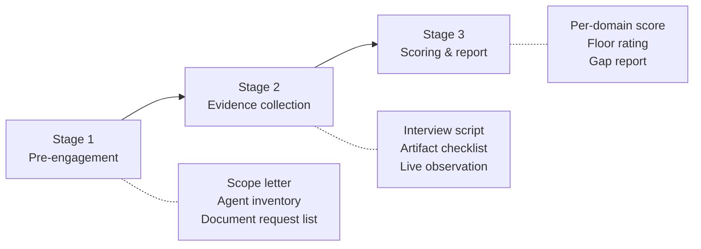

# Agentic AI Security CMM — Measurement Protocol (Assessor's Handbook)

> Companion to [[agentic-ai-security-cmm-2026|Agentic AI Security Capability Maturity Model]]. Supplies the assessment instrument the model lacked.

This protocol is the assessment instrument the validation page ([[agentic-cmm-vs-standards-validation|Validation: Agentic AI Security CMM vs Widely Adopted Standards]] §6 rec #2) flagged as missing. It fixes the evidence bar, so two assessors auditing the same organization reach the same verdict.

The protocol is modeled on **BSIMM's observation/assertion structure** (descriptive: record what is actually done) layered with **CMMC 2.0's three-level assessment guide pattern** (prescriptive: match observed state against documented criteria). It applies to all 9 CMM domains.

This protocol measures deployments; [[standards-validation-methodology-2026-05|the Standards Validation Methodology]] measures documents. That methodology's per-standard reviews compare published text against published text, audit no production deployment, and assign the question of whether organizations implement the clauses they anchor to this protocol's audit backlog. An assessor who reads a standards anchor out of the [[agentic-ai-security-cmm-crosswalk|crosswalk]] at Stage 3 therefore inherits a verified reading of the published text and no evidence that the control operates anywhere.

## On this page

- [Three-stage assessment](#three-stage-assessment) — pre-engagement, evidence collection, scoring
- [Stage 1 — pre-engagement](#stage-1--pre-engagement-12-weeks)
- [Stage 2 — evidence collection](#stage-2--evidence-collection-24-weeks) — interview script, cross-domain questions, artifact checklist, live observation
- [Stage 3 — scoring & report](#stage-3--scoring--report-1-week) — rubric, aggregation rule, gap report
- [Sample assessment timeline](#sample-assessment-timeline)
- [Assessor competence requirements](#assessor-competence-requirements)
- [Differences from existing audit programs](#differences-from-existing-audit-programs)
- [Open gaps in this protocol](#open-gaps-in-this-protocol)
- [Relations](#relations)

**Recalibrated against the D1–D9 deep dives (2026-05-25).** The per-domain level criteria were recalibrated under the [[agentic-ai-security-cmm-recalibration-method-2026|recalibration method]]; the nine companion deep dives ([[agentic-ai-security-cmm-d1-governance|D1]], [[agentic-ai-security-cmm-d2-identity|D2]], [[agentic-ai-security-cmm-d3-control-least-agency|D3]], [[agentic-ai-security-cmm-d4-runtime-guardrails|D4]], [[agentic-ai-security-cmm-d5-egress-network|D5]], [[agentic-ai-security-cmm-d6-data-rag|D6]], [[agentic-ai-security-cmm-d7-observability|D7]], [[agentic-ai-security-cmm-d8-supply-chain|D8]], [[agentic-ai-security-cmm-d9-operations|D9]]) are the authoritative current criteria. Assessors score against them. Six changes bear on this protocol.

- **D1-L5 assurance is scheme-neutral** — ISO/IEC 42001 preferred, [[aiuc-1|AIUC-1]] or a reviewed internal equivalent accepted, with no single mandate.
- **D6's L3 spine is answer-time entitlement enforcement against oversharing / [[inference-exposure|inference exposure]]**, distinct from corpus attestation.
- **D8 splits model-consumer from model-producer.** Producer-grade AI-BOM generation, training-data provenance, and ML-VEX are not required of a consumer, and SLSA Build has no Level 4 in v1.0.
- **Per-task capability tokens are L5 with a regulated-buyer L5+ caveat**, because no platform-native implementation ships.
- **D4/D7 reasoning-layer controls — CoT auditing, groundedness, behavioral detection — sit at preview or experimental status, short of GA**, so a defensible L4 may be assembled from preview and OSS components with a documented production date.
- **`LEAST MODEL PRIVILEGE` and `OVERSIGHT` add graded criteria across four domains.** Per [[owasp-ai-exchange|OWASP AI Exchange]]: D3 L3 grades a synchronous fail-closed gate, D3 L4 grades a cumulative-session ledger and depth-limited subset-only delegation, D3 L5 grades per-request approval tokens alongside capability tokens, D4 L4 grades semantic tool validation on high-impact calls (evidenced in-house, since the dry-run and cross-family-judge specifications have no named product), D7 L4 grades a routed disposition on the session-drift signal plus control-state-change monitoring, D9 L3 grades the high-risk approval record, and D9 L4 grades a stated involvement measure and an adversarially tested oversight path.

## Three-stage assessment

### Stage 1 — Pre-engagement (1–2 weeks)

The org under assessment delivers:

1. **Scope letter** identifying which agents are in-scope. Each agent gets an Agent Card (system manifest) with: name, owner (human), purpose, data classifications touched, tools/MCP servers used, deployment shape (chatbot / RAG / MCP server / mesh, and for coding agents the specific variant — interactive local, unattended local, delegated cloud, CI-runner, or fleet, per [[generative-coding-deployment-shape-2026|Generative Coding Deployment Shapes]], since the variants differ in which plane carries enforcement), production status, downstream consumers.
2. **Agent inventory** export — the full registry, even if some agents are out-of-scope for this assessment. Required so the assessor can detect shadow agents.
3. **Document request list response.** Standard requests: AI security policy, IR runbook, last red-team report, AI-BOM artifact, gateway config, identity graph export, latest decommission drill report, last quarterly board AI-risk pack, and the current [[threat-modeling-for-ai|threat model]]. The input surfaces, trust boundaries, and agents that threat model enumerates set the coverage baseline for Stage 2's evidence collection and Stage 3's coverage statement.
4. **AI impact assessment** for each in-scope agent, with the signatory and the conclusion recorded. The Exchange makes impact analysis a first-class program element and lists what it must consider, including whether the required transparency can be provided, whether privacy rights can be achieved, whether unwanted bias can be sufficiently mitigated, whether the data may be used for the purpose, and whether AI is needed to solve the problem at all ([[owasp-ai-exchange|OWASP AI Exchange]], [`/go/aiprogram/`](https://owaspai.org/go/aiprogram/)). ISO/IEC 42001 A.5 already anchors D1 in [[agentic-ai-security-cmm-crosswalk|the crosswalk]]; this request makes that anchor assessable.
5. **AI-initiative inventory** covering deployed *and* proposed uses, distinct from the agent-registry export at item 2. The registry holds what was built; the Exchange's first governance iteration surveys current AI use, AI ideas, concerns, and where the AI expertise sits ([`/go/aiprogram/`](https://owaspai.org/go/aiprogram/)). An initiative that has not reached deployment appears in one and not the other.

A document missing from item 3 scores automatic L1 in the relevant domain. Items 4 and 5 carry no such rule yet: the D1 ladder grades neither the impact assessment nor the initiative inventory at any rung, so the assessor collects both as context and records their absence as a finding rather than scoring it. Closing that gap is a change to [[agentic-ai-security-cmm-d1-governance|the D1 criteria]], not to this protocol.

### Stage 2 — Evidence collection (2–4 weeks)

Three parallel tracks: interviews, artifacts, live observation. The interview track runs a per-domain block and a cross-domain block.

#### Interview script (per domain)

Each domain has a structured interview block. Sample questions are not exhaustive; the assessor follows up on every "yes we do that" with "show me." Pure verbal evidence is L2 at best; L3+ requires artifact corroboration. The cross-domain questions that follow these blocks are asked on top of them, in every domain scored on a guard, a sandbox, a detector, or a classifier.

**D1 Governance**
- Who chairs the AI Risk Committee? When did it last meet? Show the minutes.
- How is an agent's risk tier assigned? Show the rubric.
- Who can approve a high-risk agent for production? Show one approval.
- Does the board get AI-risk reporting? Show the most recent pack.
- Show me the impact assessment for agent `[X]`. Who signed it, and what did it conclude about whether AI was needed at all?
- Show me the responsibility matrix allocating each identified threat between this organization and every party supplying part of the system — its hosting, model, extension and infrastructure providers, and the internal departments supplying data, models or fine-tuning artifacts. Where a supplier would not disclose its mitigation, show the recorded decision.

**D2 Identity & Authorization**
- Show me the identity for agent `[X]`. Trace one of its actions back to the human owner.
- What happens when the human owner of agent `[X]` leaves the company? Walk me through.
- Show me a credential proxy log for agent `[X]`. Confirm the agent process never sees the underlying credential.
- How is agent `[X]`'s identity attested? ([[spiffe|SPIFFE]] / OAuth 2.1 / OIDC / Microsoft Entra Agent ID / Okta for AI Agents.)
- Show me a credential agent `[X]` issued to a downstream agent. Which fields name the delegator, the delegatee, and the delegation it descends from? Present it at a different step of the chain and show it rejected.

**D3 Control & Least-Agency**
- Show me agent `[X]`'s action-risk tier (auto / notify / confirm / block) per tool. Who decides?
- Show me the PDP config in production. What happens if the PDP is unreachable? (L3 now grades the answer: an unreachable PDP must deny.)
- Trigger a synthetic high-risk-tier action for agent `[X]` — does HITL fire?
- Show me a lethal-trifecta detection event from the last 30 days.
- Show me a sequence of individually permitted actions that your policy engine blocked in aggregate.
- Send a crafted tool invocation directly to the access-control or API gateway layer, bypassing the LLM entirely. Show it denied. A restriction that exists only in the system prompt is not enforced against an injected instruction.

**D4 Runtime & Guardrails**
- What guardrails sit in front of agent `[X]`'s LLM call? In-line, sidecar, or external?
- What's the bypass-class coverage of your input filter? (English-only? Multilingual? Leetspeak?)
- Show me an AlignmentCheck firing on a real agent run.
- What's your sandbox grain — per-call, per-task, per-agent? Show the sandbox config.
- For a high-impact tool, show me what the call would have done before it ran, and show me who or what compared that to the user's request.
- Which operations require a human approval that no automated check can discharge? Show one approval recorded on a call that passed every automated check.
- Present a crafted instruction through the same route untrusted data actually takes into the agent — a retrieved document, a tool output — rather than through the user channel. Show it filtered. A vendor's indirect-mode flag states the capability exists, not that this deployment's augmentation route reaches it.

**D5 Egress & Network**
- What proxy / gateway sits between agent `[X]` and external tools?
- How does agent `[X]` get a token to call MCP server `[Y]`? Show the exchange.
- Show me a tool-poisoning detection event. What does the gateway do when it fires?
- Where does agent `[X]`'s outbound traffic actually go? Show the egress allowlist.
- Show me the orchestrator's own network policy. Which outbound paths does it hold, and which sub-agent carries the external access it needs?
- Which of your MCP servers has been tested as a web service — SSRF, injection, and cross-site scripting — rather than only as a prompt surface? Show the report.

**D6 Data, Memory & RAG**
- For a closed-corpus bot (the common shape): when user `[A]` and user `[B]` ask the same question, does the agent trim answers to each one's entitlements? Show answer-time enforcement under the *querying* user's identity, not a service identity. Show the last oversharing assessment and the remediation record on the reachable corpus.
- For RAG: show me document attestation at ingest. Show a poisoned-document detection.
- For memory: how do you detect memory poisoning? Show a recent detection.
- Show me the [[cognitive-file-integrity|cognitive file integrity]] baseline for agent `[X]`'s `IDENTITY.md` / system prompt.
- Where is the corpus you validate the model against stored, and who can read or write to it? Show that reaching the model or its training data does not reach that corpus.
- Are canary tokens deployed in the system prompt? When was the last leak alert?

**D7 Observability & Detection**
- Show me OTel `gen_ai.*` traces for an agent run end-to-end.
- Show me the behavioral-drift alert from the agent behavioral monitoring system, from the last quarter.
- Walk me through a multi-tool red-team eval — which tools were used ([[promptfoo|Promptfoo]] / [[pyrit|PyRIT]] / [[garak|Garak]] / [[mindgard-cart|Mindgard CART]])?
- Show me a [[mcp-cves-q1-2026|MCP CVEs Q1 2026]]-class CVE alert flowing through your detection pipeline.
- Show me an alert that fired because a control was relaxed rather than because an agent misbehaved.
- Show me the result of a test in which the agent attempted to suppress or alter its own action records. What did the log store do?

**D8 Supply Chain & AI-BOM**
- First establish scope: is the org a model *consumer* or a model *producer* for agent `[X]`? Producer-grade evidence (build-time ML-BOM generation, training-data provenance, weight protection, ML-VEX publishing) is required only of producers; a consumer is scored on verification and reconciliation of acquired artifacts.
- Show me the AI-BOM for agent `[X]` (build-time and runtime).
- Show me a sigstore signature for one of your skills / models.
- Show me a registry-scan finding from Aguara Watch / SecureClaw / equivalent.
- Walk me through how you detect a `ClawHavoc`-class supply-chain event.

**D9 Operations & Human Factors**
- What's the p99 latency budget for your guardrail stack? Show the dashboard.
- What's your fail-mode for a guardrail timeout — fail-closed or fail-open? Show the test.
- When was the last decommission drill? Show the report.
- What's your HITL approval-rate? Show the rubber-stamp metric (approval-rate without comment).
- How do you know your approvers still understand what they are approving? Show the measure itself, rather than the rate.
- When did you last run an urgency-driven bypass against your own approval gate?
- Show me a system-prompt leak test result and your canary-token deployment.
- What's your model-deprecation policy? Show the version-pin register for agent `[X]`.

#### Cross-domain questions

These questions apply to every domain scored on a guard, a sandbox, a detector, or a classifier, and are asked in addition to the per-domain blocks above.

**Enforcement-artifact equivalence.** Two questions, both applying to any domain scored on a guard or a sandbox:

1. *"Does the enforcement mechanism evaluate the same artifact the executor acts on?"* A check that inspects a string a shell, filesystem, or tool server rewrites before acting is advisory rather than preventive — see [[guard-canonicalization-gap|Guard Canonicalization Gap]]. Ten of eleven surveyed coding agents failed this test in [[guardfall-shell-injection-audit|the GuardFall audit]]. A control failing it should not carry a D3 policy-decision-point claim.
2. *"What does your sandbox cover?"* Isolation scoped to shell subprocesses leaves in-process file tools, MCP servers, and hooks outside the boundary; the [[claude-code-github-action-credential-exposure|June 2026 CI credential exposure]] used exactly that gap. Record the covered surface as evidence rather than accepting "sandboxed" as a state.

Both questions belong in Stage 2 for every deployment shape, coding agents included: the underlying failure is representational mismatch and partial boundary coverage, which recur wherever a policy layer sits above a transforming executor.

**False-positive-class control.** The assessor asks, on every L3+ detector, guardrail, or classifier: *"How is the false-positive class controlled — by architectural constraint, by post-hoc filtering, or by prompt tuning?"* Architectural constraint is the production-grade answer, and five sourced instruments implement it five ways: [[adversarial-reflexion|Adversarial Reflexion]] constrained personas in [[openant|OpenAnt]], sandboxed exploit-trigger validation in [[codex-security|Codex Security]] (announced as Aardvark), self-critique prove/disprove in [[claude-code-security|Claude Code Security]], an ensemble and prover stage in [[mdash|MDASH]], and provenance-aware `runtimeConfidence` weighting in [[agentshield|AgentShield]]. Post-hoc filtering and prompt tuning are signals of an immature control.

#### Artifact checklist (required per level)

| Domain | L2 artifacts | L3 artifacts | L4 artifacts | L5 artifacts (achievable today) | L5+ artifacts (leading-edge) |
|---|---|---|---|---|---|
| D1 | Policy doc; RACI | Risk Committee minutes; deployment-gate evidence; decision-rights matrix per agent type; prohibited-action and oversight-tier list; reaper SLA report; provider responsibility matrix with residue | KPI dashboard; board pack; gap report; **standards crosswalk matrix**; readiness assessment against a recognized scheme | Current third-party assurance (ISO/IEC 42001 preferred, or AIUC-1, or reviewed internal-equivalent); board-attested risk metrics; ≥1-year committee minutes | Named-contributor evidence; published research; external observability dataset |
| D2 | Agent inventory | Identity graph; sample audit trail; OIDC tokens | Cred-proxy logs; Cedar/OPA repo; tabletop drill report; delegation-token sample (delegator, delegatee, scope, expiry, parent link) | Registry export; ISPM dashboard; SPIFFE-JWT-SVID chain; coupled-credential migration report | NIST CAISI participation; cross-platform identity federation report |
| D3 | Tool allowlist config | PDP config; tier assignments per agent; PDP-unreachability test showing deny; direct-gateway invocation test showing deny | Promotion-gate runbook (org-authored); HITL telemetry; trifecta-detection log; session-replay test; agent-escape log; session-ledger sample (aggregate block); delegation-chain log (depth, subset) | Warrant samples; step-up logs; per-release policy-compile artifact; cryptographic SoD evidence; approval-token sample (bound approver identity, parameters, expiry) | [[camel-pattern\|CaMeL]] production deployment evidence; formal-verification reports; temporal-logic policy artifact |
| D4 | Provider safety config | Hook code; firewall logs; sandbox config; indirect-injection test routed through the augmentation path | AlignmentCheck logs; CodeShield findings; grounding scores; dry-run records; judge findings (model family); guardrail config (session-cumulative); check-clean high-blast-radius approval | Platform-enforcement coverage report (zero opt-outs); multi-language eval log; classifier refresh receipts; response-leak alert log; latency/cost dashboard with fail-closed proof | TEE attestation chain; CaMeL split production evidence; bypass-class eval with remediation timeline |
| D5 | Outbound proxy config | Gateway config; certs; A2A enforcement profile | Token-exchange logs; rule sets; CVE-tagged log; orchestrator network policy showing no outbound path | Mesh topology with zero-bypass proof; per-task token samples; SSRF closure verification; CVE-feed auto-quarantine log | Sigstore-for-MCP verifier; A2A drift rule library; cross-cloud reconciliation report |
| D6 | Source labels | Scan results; CFI baseline; validation-corpus storage and access policy; corpus scope decision; retained-identifier exception list | Attestation logs; rollback drill report; removal justification measured against model performance; source-to-derived linkage record; recorded obfuscation residuals | Drift dashboard; threshold-justification memo; conflict-flagging logs; canary-token deployment log; rollback drill RTO report | Per-doc attestation chain; taint-lattice implementation; ZK-proof verifier logs |
| D7 | Tool-call audit log | Trace samples; span schema validation | Behavioral-monitoring dashboards; multi-tool eval reports with ID tags; session-drift disposition log (routed or suspended); control-state-change alert samples; adversarial log-integrity test record | DeepTracing graph; agent-aware playbook samples; prompt-volume-to-alert dashboard ≥1 quarter; analyst-actionable rate report | Cascade rule registry with thresholds; multi-agent joint-baseline statistics; forward-pass activation monitor |
| D8 | Inventory (consumer + producer); model and development documentation register | AI-BOM artifact; sigstore log; lockfile/SCA evidence | Sig-verified registry; reconciliation report; ID-tagged ML-VEX `[P]` | Closed-loop diagram with SLA evidence; SLSA Build L3 attestation; runtime/build AI-BOM reconciliation; ML-VEX feed `[P]` | hermetic/reproducible-build evidence beyond SLSA L3 (research-stage — SLSA v1.0 has no L4); cross-vendor AI-BOM federation; MCP name-to-binary signing; standards-WG named contribution |
| D9 | Runbook artifact | Latency/cost dashboard; reaper logs; canary proof; IR runbook naming notification instrument, owner, clock; high-risk category definition; tamper-evident audit extract; highest-risk delay + SoD config | HITL-fatigue KPIs; benign-drift dashboard; drill reports; AI-VEX feed; involvement-measure record (method stated); oversight red-team report; approval-rate-limit config with baseline-exceedance alerts | SLA-bounded controls-update log; clean-state attestations; quarterly continuity-test report; HITL-fatigue dashboard within thresholds | External observability dataset; named contributions to CoSAI IR / OWASP / ATLAS; coordinated-disclosure leadership artifacts |

**The D1 and D9 disclosure rungs add four artifacts to the L3 column.** D1 L3 requires the entry classifying the AI system's technical details as an asset, and the record of the publication review that set what was withheld against the disclosure `AI TRANSPARENCY` asks for. D9 L3 requires the published user disclosure, and the record showing each of the five properties `AI TRANSPARENCY` lists as covered in it or omitted from it. The two rungs read one property list from opposite sides — the D1 record states what was withheld, the D9 record states what was published — so an assessor grading either collects both.

#### Live observation requirements

The assessor MUST observe at least one live action per high-risk-tier agent in the assessed scope. Specifically:

- One L3+ assessment requires: live OTel trace + live PDP decision + live HITL gate fire (synthetic if necessary; where D3 scores L5, the fire is checked against a bound approval token).
- One L4 assessment requires the above plus: live behavioral-drift event from the agent behavioral monitoring system + live red-team eval run.
- One L5 assessment requires the above plus: live closed-loop incident replay (an alert fires and controls update, closing the loop within SLA) and verification of the prerequisite gate into L5 (≥2-quarter L4 evidence, AIUC-1/ISO 42001 cert dated within last quarter, continuity-test execution proof).
- One L5+ assessment requires the above plus: live attestation chain verification (TEE-backed guardrail execution proof) OR live cascade-detection rule fire OR live cross-vendor AI-BOM reconciliation, AND verification of the named-contributor artifact.

Static configs alone do not satisfy live-observation requirements at L3+.

### Stage 3 — Scoring & report (1 week)

#### Per-domain scoring rubric

For each of the 9 domains, the assessor scores the organization Level 0 (no evidence at L1) through Level 5. The rubric per cell:

| Score | Criterion |
|---|---|
| 0 | No evidence the L1 baseline exists. |
| 1 | L1 verbal evidence; no policy or artifact. |
| 2 | L1 + L2 artifacts present and verifiable. |
| 3 | L1 + L2 + L3 artifacts present, **AND ID tagging is operational** for findings in this domain (`ASI##` / [[owasp-aivss\|AIVSS]] / `AML.T####` / CVE), AND live observation requirement met. |
| 4 | L3 + L4 artifacts AND quantitative metrics are tracked AND multi-tool eval is operational AND ID tagging is comprehensive (no untagged findings in last 90 days). |
| 5 | L4 + L5 artifacts AND closed-loop evidence over ≥2 quarters AND **L4→L5 prerequisite gate met** (see below). |
| 5+ | L5 + L5+ artifacts AND research-stage primitives in production with documented exit criteria AND active named contribution to one or more standards bodies (PR / RFC / spec authorship). |

**Auditability begins at Level 3.** Below L3, the org is structurally vulnerable and the assessment is largely about whether evidence supports L2 over L1. At L3+, the assessor checks platform-level enforcement, ID tagging, and live behavior.

**Reaching L5 from a stable L4 takes quarters of sustained operation.** Before scoring an organization L5 in any domain, the assessor MUST verify the prerequisite gate (per [[cmm-calibration-stress-test-2026|stress-test §Change 5]] and the CMM page level table):

1. **≥2 quarters of stable L4 operation** across all 9 domains — no regression in the per-domain matrix during the look-back window. Evidence: prior assessment reports OR continuous-monitoring artifacts (KPIs, drift telemetry, red-team results, AI-BOM reconciliation) covering the period.
2. **Independent third-party assurance scheduled or current** against a recognized scheme — ISO/IEC 42001 surveillance cycle (preferred), an AIUC-1 readiness assessment with an accredited auditor, or a documented internal-equivalent attestation under independent review. The scheme is the org's choice; no single certification is mandated (see [[aiuc-1-critical-evaluation|the AIUC-1 evaluation]] and [[agentic-ai-security-cmm-d1-governance|D1 deep dive]]). Evidence: signed engagement letter, surveillance-audit report, or reviewed attestation.
3. **Bus-factor ≥2** with documented continuity test — a deputy has executed the runbook end-to-end at least once in the look-back window ([[anti-patterns-and-failure-modes|anti-pattern I3]] recovery). Evidence: continuity-test report.
4. **Gap-closure plan from floor-domain to L5** — even if the floor is L5, the program must document what L5+ work it is or is not pursuing in each domain.

Meeting every per-domain L5 row without the gate evidence scores **L4-stable** rather than L5. The gate is asymmetric: claiming L4 from L3 does not require it, because that jump is a single step rather than a sustained campaign.

**L5+ Leading Edge tier.** A separate, optional tier that requires L5 across all 9 domains *plus* (a) at least one research-stage primitive in production deployment with documented exit criteria back to L5 if the pilot fails, and (b) active named contribution to one or more standards bodies (PR / RFC / spec authorship, not membership only). L5+ is bleeding-edge and unachievable without category-creation work. Most assessments terminate at L5; L5+ scoring is appropriate for frontier labs, hyperscaler platforms, and dedicated AI-security research shops.

#### Aggregation rule — dependency-resolved effective scores

The organization's overall rating is reported as a **per-domain matrix** (raw + effective scores). Aggregation uses **dependency-resolved effective scores** under the active rule set documented in [[agentic-ai-security-cmm-dependency-rules|Effective-Score Dependency Rules]]. A domain's effective score = `min(raw, min over upstream-dependency raw scores)`.

**Headline format** (replaces the prior single-floor headline):

- **Typical** = median of effective scores across all 9 domains
- **Weakest** = min of effective scores, with the cap source labeled (which upstream domain set the cap, if any)
- **Strongest** = max of raw scores, with the domain labeled
- **Strategic rationale** field for any domain whose raw score is intentionally below its peers (architectural-containment trade-offs)

**Mandatory matrix disclosure** prevents cherry-picking: any rating claim must publish the full per-domain matrix (raw + effective) and the active rule-set version. Reports that cite a single domain's score without the matrix are non-compliant. This replaces the prior single-floor rule (CMMC import) which misreported 3 of 5 realistic archetypes per the [[cmm-calibration-stress-test-2026|stress test]] (Stripe-style architectural-containment, Microsoft Agent 365-driven, resource-constrained startup all under-reported).

Active rule set (v1, 2026-05-04): DR-001 D2 caps D5 (per-agent identity required for per-agent egress enforcement), DR-002 D2 caps D7 (per-agent identity required for behavioral attribution), DR-003 D3 caps D4 (PDP decisions required for runtime guardrail enforcement). See [[agentic-ai-security-cmm-dependency-rules|dependency-rules page]] for promotion criteria, candidate registry, and revision protocol.

#### Gap report structure

Final report contains, at minimum:

1. **Executive summary** — three-number headline (typical / weakest / strongest), three-sentence framing, active rule-set version cited.
2. **Per-domain matrix** — 9 rows (D1–D9) × per-row columns: `raw level`, `effective level`, `cap source` (which upstream-dependency rule fired, if any), `verdict per L1–L5+ criterion`. The L5+ column may be left as "n/a" if the engagement does not target L5+.
3. **Weakest-domain explanation** — which domain holds the weakest effective score, whether a dependency cap fired, and the strategic rationale (if any) for an intentional trade-off (Stripe-style architectural-containment).
4. **ID-tagged finding registry** — every finding with `ASI##` / AIVSS score / `AML.T####` / CVE.
5. **Test-coverage statement** — for each of the four agentic test layers (LLM reasoning, tool execution, infrastructure, inter-agent communication), which was exercised, to what depth, and against what corpus size. A threat category the programme did not test is reported as a finding rather than omitted.
6. **Reproduction rate per finding** — each finding carries reproduction steps and the rate at which the attack succeeded across runs. A single successful run and a run that succeeds nine times in ten are different findings, and a pass/fail verdict records neither.
7. **Crosswalk extract** — for each L4+ finding, the corresponding Annex IV / AIUC-1 / ISO 42001 anchor (per [[agentic-ai-security-cmm-crosswalk|Agentic AI Security CMM — Standards Crosswalk Matrix]]).
8. **Top 5 prioritized recommendations** — what would move the weakest effective score up by one level (and any candidate dependency-rule promotions to monitor).
9. **Re-assessment cadence** — recommendation for next assessment date (tied to AIUC-1 quarterly cadence at L5).
10. **Active rule-set version** — must be cited (e.g. "scored under dependency-rules v1, 2026-05-04"). When the rule set is revised, prior assessments retain their original version; re-scoring under a new version is a separate engagement.

## Sample assessment timeline

For a mid-size enterprise with ~30 agents in scope:

| Week | Activity |
|---|---|
| -2 | Scope letter signed; document request list issued |
| -1 | Documents received; initial gap scan |
| 1 | Kickoff; D1 + D2 interviews; identity-graph review |
| 2 | D3 + D4 interviews; live PDP / guardrail observation |
| 3 | D5 + D6 + D7 interviews; behavioral-monitoring / RAG attestation review |
| 4 | D8 + D9 interviews; AI-BOM reconciliation; decommission drill |
| 5 | Synthetic incidents fired across 3 agents (if scope permits) |
| 6 | Scoring synthesis; gap report draft |
| 7 | Report review with org; final report delivered |

## Assessor competence requirements

Borrowed from ISO/IEC 42006:2025 (auditor competence) and CMMC C3PAO licensing patterns. The assessor MUST demonstrate:

1. Operational experience with at least 4 of the 9 domains.
2. Working knowledge of: [[owasp-agentic-ai-top-10|OWASP ASI Top 10]], OWASP AIVSS v0.8, [[mitre-atlas|MITRE ATLAS]] v5.6.0, [[nist-ai-rmf|NIST AI RMF]] + 600-1, [[iso-iec-42001|ISO/IEC 42001]], [[eu-ai-act|EU AI Act]] high-risk classification.
3. Experience reading and validating: OTel `gen_ai.*` traces, AI-BOM (CycloneDX/SPDX), Cedar/OPA policies, MCP server configs, sigstore signatures.
4. No conflict of interest (the assessor's firm did not architect or operate any agent in scope within the last 12 months).

## Differences from existing audit programs

| Existing program | Difference vs this protocol |
|---|---|
| ISO/IEC 42001 audit | Governance-heavy; weak on technical AI controls. This protocol pulls technical evidence into stage 2 live observation. |
| AIUC-1 (Schellman) | 4–8 week scope; six pillars. This protocol's 9 domains are more granular and require multi-tool eval at L4. |
| BSIMM | Descriptive only; no levels. This protocol uses BSIMM-style observation but adds CMMC-style cumulative levels. |
| CMMC 2.0 | Three levels; defense-contractor scope. This protocol uses five levels and is AI-specific. |
| SOC 2 | Type 1 / Type 2 Trust Services Criteria. This protocol's scope is narrower (agentic AI) and deeper. |

## Open gaps in this protocol

> [!gap] Known unfilled spots
> 1. **Quantitative metric thresholds at L4.** "Quantitative HITL-fatigue indicators" lacks specific thresholds (rubber-stamp rate < X%, queue age p95 < Y minutes) — TBD pending production data from early adopters.
> 2. **Synthetic incident library.** Stage 2 calls for synthetic incidents and no library exists yet. Document 5 of the [[owasp-ai-exchange|Exchange]] supplies the procedure for one of the four candidates without supplying the corpus: its prompt-injection procedure specifies, for the prompt-injection-via-retrieved-doc candidate, how an attack set is assembled, tailored, paired with detections, routed through the augmentation path, and varied. That candidate's gap is now the corpus and its curation rather than the method. Document 5 also publishes an evasion procedure — feasibility criteria and the four search types — for a threat outside this candidate list. Remaining candidates with no published procedure: PoisonedRAG corpus injection, ClawHavoc-class skill swap, A2A impersonation.
> 3. **Self-attestation form.** Some orgs will start with a self-assessment before engaging an external assessor. A self-attestation form would mirror this protocol but with relaxed live-observation requirements.
> 4. **Continuous-assessment mode.** Some orgs will want continuous (vs annual) assessment — what does the protocol look like in always-on mode? Mindgard CART is the closest model on the testing side.
> 5. **Provenance-labeled evidence records.** The evidence schema carries no field distinguishing a finding observed in active runtime from one read out of a template, a doc example, or a declarative manifest, so a single template catalog can weigh as heavily as a running control. The [[agentshield|AgentShield]] design is the only sourced instance and stays parked:
>     - **Weighting by source kind.** Same finding, different weight by source kind (`active-runtime` / `project-local-optional` / `template-example` / `docs-example` / `plugin-manifest` / `hook-code`), with per-source per-category deduction caps so a single template catalog cannot dominate.
>     - **Generalizable label, single-vendor weighting.** The discipline generalizes to *"evidence records should carry a provenance label distinguishing active runtime from template / docs / declarative manifest / referenced implementation."* The specific weighting scheme remains a single-vendor design.
>     - **The parked addition.** A provenance field in the evidence schema, at Stage 2 §Interview script (per domain) and Stage 3 §Per-domain scoring rubric, plus a section-cap rule analogous to AgentShield's per-file deduction cap.
>     - **Promotion criterion.** A second sourced instrument applying the same source-kind weighting scheme — a harness-config audit tool for a non-Claude-Code harness, or a CMM-adjacent assessment instrument that adopts the same labeling discipline.
>     - **Anchors.** [[control-efficacy-gate|Control-Efficacy Gate]] and [[harness-config-as-supply-chain-artifact|Harness Config as Supply-Chain Artifact]]. The parent [[agentic-ai-security-cmm-2026|CMM]] page parks the same pair in its AgentShield placement-rationale callout.

## Relations

- Companion to: [[agentic-ai-security-cmm-2026|Agentic AI Security Capability Maturity Model]] — supplies the assessment instrument the CMM lacked.
- Companion to: [[agentic-ai-security-cmm-crosswalk|Agentic AI Security CMM — Standards Crosswalk Matrix]] — assessor uses crosswalk in stage 3 step 5.
- Resolves: [[agentic-cmm-vs-standards-validation|Validation: Agentic AI Security CMM vs Widely Adopted Standards]] §6 recommendation #2.
