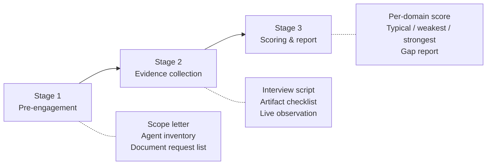

# Agentic AI Security CMM — Measurement Protocol (Assessor's Handbook)

> Companion to [[agentic-ai-security-cmm-2026|Agentic AI Security Capability Maturity Model]].

This protocol fixes the evidence bar for scoring an organization against the CMM, so two assessors auditing the same organization reach the same verdict. It supplies the assessment instrument that [[agentic-cmm-vs-standards-validation|Validation: Agentic AI Security CMM vs Widely Adopted Standards]] names as missing in its sixth section, recommendation 2.

The protocol is modeled on **BSIMM's observation/assertion structure** (descriptive: record what is actually done) layered with **CMMC 2.0's three-level assessment guide pattern** (prescriptive: match observed state against documented criteria). It applies to all 9 CMM domains.

This protocol measures deployments; [[standards-validation-methodology-2026-05|the Standards Validation Methodology]] measures documents. That methodology's per-standard reviews compare published text against published text, audit no production deployment, and assign to this protocol's audit backlog the question of whether organizations implement the clauses they anchor. An assessor who reads a standards anchor out of the [[agentic-ai-security-cmm-crosswalk|crosswalk]] at Stage 3 therefore inherits a verified reading of the published text and no evidence that the control operates anywhere.

[[ai-coding-agent-governance|AI Coding Agent Governance (Knostic)]] names the controls a coding-tool deployment adds and states no assessment method, which is the gap Stage 3 fills for that shape.

## On this page

- [Three-stage assessment](#three-stage-assessment) — pre-engagement, evidence collection, scoring
- [Stage 1 — pre-engagement](#stage-1--pre-engagement-12-weeks)
- [Stage 2 — evidence collection](#stage-2--evidence-collection-24-weeks) — assurance classes, interview script, cross-domain questions, artifact checklist, live observation
- [Stage 3 — scoring & report](#stage-3--scoring--report-1-week) — rubric, aggregation rule, gap report
- [Sample assessment timeline](#sample-assessment-timeline)
- [Assessor competence requirements](#assessor-competence-requirements)
- [Differences from existing audit programs](#differences-from-existing-audit-programs)
- [Open gaps in this protocol](#open-gaps-in-this-protocol)
- [Relations](#relations)

**Recalibrated against the D1–D9 deep dives (2026-05-25).** The per-domain level criteria were recalibrated under the [[agentic-ai-security-cmm-recalibration-method-2026|recalibration method]]; the nine companion deep dives ([[agentic-ai-security-cmm-d1-governance|D1]], [[agentic-ai-security-cmm-d2-identity|D2]], [[agentic-ai-security-cmm-d3-control-least-agency|D3]], [[agentic-ai-security-cmm-d4-runtime-guardrails|D4]], [[agentic-ai-security-cmm-d5-egress-network|D5]], [[agentic-ai-security-cmm-d6-data-rag|D6]], [[agentic-ai-security-cmm-d7-observability|D7]], [[agentic-ai-security-cmm-d8-supply-chain|D8]], [[agentic-ai-security-cmm-d9-operations|D9]]) are the authoritative current criteria. Assessors score against them. Six changes bear on this protocol.

- **D1-L5 assurance is scheme-neutral** — ISO/IEC 42001 preferred, [[aiuc-1|AIUC-1]] or a reviewed internal equivalent accepted, with no single mandate.
- **D6's L3 spine is answer-time entitlement enforcement against oversharing / [[inference-exposure|inference exposure]]**, distinct from corpus attestation, and it grades the resolution of the asking principal's read authorization. The **authorization layer** follows the corpus: a document corpus carries per-document entitlements, a source repository carries the repository and branch grants of the asking developer with a path-scoped retrieval, and a whole-tenant corpus carries the tenant access-control list with label-aware policy. **D6's L2 takes its grain from the same layer**, so the classification scheme an assessor collects is sensitivity labels over a document corpus or a tenant, and over a source repository a register of the repositories the agent reaches, each carrying a data classification and the paths excluded from retrieval. Grading is cumulative, so an L2 artifact a shape cannot produce leaves L3 ungradable for it.
- **D8 splits model-consumer from model-producer.** Producer-grade AI-BOM generation, training-data provenance, and ML-VEX are not required of a consumer, and SLSA Build has no Level 4 in v1.0.
- **Per-task capability tokens are L5+ in D2, D3 and D5**, because the D3 and D5 tooling maps record no platform-native implementation and one early-stage open-source implementation. D3 and D5 graded the capability at L5 until September 2026, so an assessor now collects its artifact in the L5+ column of the checklist below and grades no L5 rung against it.
- **D4/D7 reasoning-layer controls — CoT auditing, groundedness, behavioral detection — sit at preview or experimental status, short of GA**, so a defensible L4 may be assembled from preview and OSS components with a documented production date.
- **`LEAST MODEL PRIVILEGE` and `OVERSIGHT` add graded criteria across four domains.** Per [[owasp-ai-exchange|OWASP AI Exchange]], the added criteria are these.
    - D3 L3 grades a synchronous fail-closed gate.
    - D3 L4 grades a cumulative-session ledger and depth-limited subset-only delegation.
    - D3 L5 grades per-request approval tokens.
    - D3 L5+ grades per-task capability tokens.
    - D4 L4 grades semantic tool validation on high-impact calls, evidenced in-house, since no product in D4's September 2026 canvass implements the dry-run and cross-family-judge specifications.
    - D7 L4 grades a routed disposition on the session-drift signal plus control-state-change monitoring.
    - D9 L3 grades the high-risk approval record.
    - D9 L4 grades a stated involvement measure and an adversarially tested oversight path.

## Three-stage assessment

### Stage 1 — Pre-engagement (1–2 weeks)

The organization under assessment delivers:

1. **Scope letter** identifying which agents are in-scope. Each agent gets an Agent Card (system manifest) with: name, owner (human), purpose, data classifications touched, tools/MCP servers used, deployment shape (chatbot / RAG / productivity assistant / MCP server / mesh), production status, downstream consumers. Two cases carry a sub-value. A **productivity assistant** holds tools over a tenant's or a user's mail, files and calendar, either inside the suite (Gemini for Workspace, Microsoft 365 Copilot class) or as a desktop agent with local file access and connectors (the [[claude-cowork|Claude Cowork]] class, whose control surface spans the organization console, the Enterprise custom-role model, each connector's own authorization scope and, on a third-party deployment, a managed device profile). A **coding agent** also names its variant — interactive local, unattended local, delegated cloud, CI-runner, or fleet, per [[generative-coding-deployment-shape-2026|Generative Coding Deployment Shapes]] — because the variants differ in which plane carries enforcement.
2. **Agent inventory** export — the full registry, even if some agents are out-of-scope for this assessment. The assessor needs the full registry to detect shadow agents.
3. **Document request list response.** Standard requests: AI security policy, IR runbook, last red-team report, AI-BOM artifact, gateway config, identity graph export, latest decommission drill report, last quarterly board AI-risk pack, and the current [[threat-modeling-for-ai|threat model]]. The input surfaces, trust boundaries, and agents that threat model enumerates set the coverage baseline for Stage 2's evidence collection and Stage 3's coverage statement.
4. **AI impact assessment** for each in-scope agent, with the signatory and the conclusion recorded. The Exchange makes impact analysis a first-class program element and lists what it must consider, including whether the required transparency can be provided, whether privacy rights can be achieved, whether unwanted bias can be sufficiently mitigated, whether the data may be used for the purpose, and whether AI is needed to solve the problem at all ([[owasp-ai-exchange|OWASP AI Exchange]], [`/go/aiprogram/`](https://owaspai.org/go/aiprogram/)). ISO/IEC 42001 A.5 already anchors D1 in [[agentic-ai-security-cmm-crosswalk|the crosswalk]]; this request makes that anchor assessable.
5. **AI-initiative inventory** covering deployed *and* proposed uses, distinct from the agent-registry export at item 2. The registry holds what was built; the Exchange's first governance iteration surveys current AI use, AI ideas, concerns, and where the AI expertise sits ([`/go/aiprogram/`](https://owaspai.org/go/aiprogram/)). An initiative that has not reached deployment appears in one and not the other.

A document missing from item 3 scores automatic L1 in the relevant domain. Items 4 and 5 carry no such rule yet: the D1 ladder grades neither the impact assessment nor the initiative inventory at any rung, so the assessor collects both as context and records their absence as a finding rather than scoring it. Closing that gap belongs to [[agentic-ai-security-cmm-d1-governance|the D1 criteria]], and this protocol follows whatever they grade.

### Stage 2 — Evidence collection (2–4 weeks)

Evidence collection runs three parallel tracks: interviews, artifacts and live observation. The interview track runs a per-domain block and a cross-domain block. The assurance class below records the kind of evidence behind a verdict and the track it came from.

#### Assurance classes

The class of evidence settles a criterion, and the party operating the control does not. A control the customer tests, a control the vendor attests to in a document the customer holds, and a control whose operating state the customer reads out of vendor tooling each carry a **met** or **not met** verdict. A vendor-operated control is graded on the evidence the vendor produces, and vendor operation alone puts no criterion out of reach.

| Assurance class | Evidence | Track |
|---|---|---|
| **Tested** | The assessor or the customer exercised the control and recorded what it did | Live observation |
| **Inspected** | Vendor tooling the customer can reach reports the control's operating state in this tenant: an audit-log entry, an administrative console view, a configuration or policy export | Artifacts |
| **Attested** | The vendor states the control in a document the customer holds: an assurance or compliance report under a recognized scheme, a contractual commitment, or product documentation | Artifacts |

Inspected and attested separate on whether the artifact's content depends on this tenant's runtime. An audit record, a console view and a configuration export each read differently in a tenant where the control ran and in one where it did not; an assurance report, a contract clause and a documentation page read the same either way.

**A verdict on inspected or attested evidence names the artifact.** Five fields make the record re-checkable by a second assessor: the issuer, the artifact's title with its report or version identifier, the date it was issued or extracted, the service and tenant it covers, and the period it covers. A record naming only the document class, such as the vendor's compliance report or the administrative console, leaves a re-assessment nothing to refresh, so the assessor collects the five fields before recording the verdict.

Verbal assurance from a vendor carries no class, because a verdict on inspected or attested evidence names an artifact and a conversation produces none. **Unanswerable** is the verdict where the customer can run no test and the vendor supplies neither an attestation nor inspectable output.

#### Interview script (per domain)

Each domain has a structured interview block. Sample questions are not exhaustive; the assessor follows up on every "yes we do that" with "show me." Pure verbal evidence is L2 at best; L3+ requires artifact corroboration. The cross-domain questions that follow these blocks are asked on top of them, in every domain scored on a guard, a sandbox, a detector, or a classifier. Each criterion the answers bear on takes one of four verdicts: **met**, **not met**, **not applicable** or **unanswerable**. The Stage 3 per-domain scoring rubric below defines the four, and the assessor records them from Stage 2 onward, each **met** or **not met** verdict carrying the assurance class above.

**D1 Governance**
- Who chairs the AI Risk Committee? When did it last meet? Show the minutes.
- How is an agent's risk tier assigned? Show the rubric.
- Who can approve a high-risk agent for production? Show one approval.
- Does the board get AI-risk reporting? Show the most recent pack.
- Show me the impact assessment for agent `[X]`. Who signed it, and what did it conclude about whether AI was needed at all?
- Show me the responsibility matrix allocating each identified threat between this organization and every party supplying part of the system — its hosting, model, extension and infrastructure providers, and the internal departments supplying data, models or fine-tuning artifacts. Where a supplier would not disclose its mitigation, show the recorded decision.
- Show me the managed settings your coding agents run under, as resolved on an enrolled device. Which managed-only locks are set, and which list keys can a developer still extend locally? Show the review record for the last change to a hook, MCP manifest, subagent, skill or instruction file.

**D2 Identity & Authorization**
- Show me the identity for agent `[X]`. Trace one of its actions back to the human owner.
- What happens when the human owner of agent `[X]` leaves the company? Walk me through.
- Show me a credential proxy log for agent `[X]`. Confirm the agent process never sees the underlying credential.
- How is agent `[X]`'s identity attested? ([[spiffe|SPIFFE]] / OAuth 2.1 / OIDC / Microsoft Entra Agent ID / Okta for AI Agents.)
- Show me a credential agent `[X]` issued to a downstream agent. Which fields name the delegator, the delegatee, and the delegation it descends from? Present it at a different step of the chain and show it rejected.

**D3 Control & Least-Agency**
- Show me agent `[X]`'s action-risk tier (auto / notify / confirm / block) per tool. Who decides?
- Show me the PDP config in production. What happens if the PDP is unreachable? (L3 now grades the answer: an unreachable PDP must deny.)
- Trigger a synthetic high-risk-tier action for agent `[X]` — does HITL fire?
- Show me a lethal-trifecta detection event from the last 30 days.
- Show me a sequence of individually permitted actions that your policy engine blocked in aggregate.
- Send a crafted tool invocation directly to the access-control or API gateway layer, bypassing the LLM entirely. Show it denied. A restriction that exists only in the system prompt is not enforced against an injected instruction. Where the decision point is in-process and exposes no such interface, the question below replaces this one.
- Where the runtime that hosts the model holds the decision: show me the policy as that runtime resolved it on an enrolled device, name the scope it came from, and show that a developer's own settings cannot widen it. Show me that the agent cannot write that scope, and the audit record of the last in-session change to it. Then run a denied action under the most permissive autonomy mode this deployment allows, and show me what the enforcement point does when its policy source is malformed.

**D4 Runtime & Guardrails**
- What guardrails sit in front of agent `[X]`'s LLM call? In-line, sidecar, or external?
- What's the bypass-class coverage of your input filter? (English-only? Multilingual? Leetspeak?)
- Show me a chain-of-thought or alignment audit firing on a real agent run — AlignmentCheck, Task Adherence, or the deployment's own auditor. Record which one.
- What's your sandbox grain — per-call, per-task, per-agent? Show the sandbox config.
- For a high-impact tool, show me what the call would have done before it ran, and show me who or what compared that to the user's request.
- Which operations require a human approval that no automated check can discharge? Show one approval recorded on a call that passed every automated check.
- Present a crafted instruction through the same route untrusted data actually takes into the agent — a retrieved document, a tool output — rather than through the user channel. Show it filtered. A vendor's indirect-mode flag states the capability exists, not that this deployment's augmentation route reaches it.

**D5 Egress & Network**
- What proxy / gateway sits between agent `[X]` and external tools?
- How does agent `[X]` get a token to call MCP server `[Y]`? Show the exchange.
- Show me a tool-poisoning detection event. What does the gateway do when it fires?
- Where does agent `[X]`'s outbound traffic actually go? Show the egress allowlist.
- Show me the orchestrator's own network policy. Which outbound paths does it hold, and which sub-agent carries the external access it needs?
- Which of your MCP servers has been tested as a web service — SSRF, injection, and cross-site scripting — rather than only as a prompt surface? Show the report.

**D6 Data, Memory & RAG**
- Before the entitlement questions below: show the classification scheme over the corpus this agent reaches, at the grain its authorization layer grants on, and the first assessment of what the agent reaches and for whom. Over a document corpus or a tenant these are the sensitivity-labeling scheme and the oversharing assessment. Over a source repository they are a register of the repositories the agent reaches, each carrying a data classification and the paths excluded from retrieval, and a review of which repositories and branches that reach spans against the developers who can read them. Grading is cumulative, so a shape producing neither does not reach L3 whatever its enforcement does; record the missing artifact rather than reading the clause as document-corpus-only and passing over it.
- For a closed-corpus bot (the common shape): when user `[A]` and user `[B]` ask the same question, does the agent trim answers to each one's entitlements? Show answer-time enforcement under the *querying* user's identity, not a service identity. Show the last oversharing assessment and the remediation record on the reachable corpus.
- For a productivity assistant over a whole tenant (mail, files, calendar): name the corpora the assistant reaches for user `[A]`, then show that a document, message or calendar entry which `[A]` can open and `[B]` cannot is absent from `[B]`'s answer to the same question. The tenant ACL and the data-loss-prevention rule are the authorization layer here, as a corpus scope is elsewhere, so record which of the two produced the trim. Show the last oversharing assessment over the reachable tenant and the remediation record. The enforcement runs inside the vendor and this comparison runs from the customer's own tenant, so record the verdict from what it shows. Where the comparison cannot be run, grade on the vendor's documented statement of answer-time entitlement enforcement and record the assurance class.
- For a desktop agent of the [[claude-cowork|Claude Cowork]] class, run the same two-principal comparison twice, because the corpus carries two authorization layers. Over a connector, the assistant inherits each member's permissions in the source system, so the trim is the source system's and the record names the connector and the permission categories an owner set on it. Over a connected folder, the reach is whatever the member's operating-system account can open inside it, so the folder selection is the whole of the local scope and the record names the selected paths, from the telemetry's `workspace.host_paths` or from the allowed-workspace-folders key in a managed device profile. The oversharing assessment covers the connected folders alongside the tenant.
- For a coding agent over a repository: name the repositories and branches the agent reaches for developer `[A]`, then run the same retrieval for developer `[B]`, who cannot read a branch or path `[A]` can, and show that branch or path absent from `[B]`'s result and present in `[A]`'s. One transcript proves nothing, because a branch that was never cloned into the working copy is absent for everyone. The developer's repository and branch grants and the path scope of the working copy are the authorization layer here, as per-document entitlements are elsewhere, so record which of the two produced the trim. Where a developer asks and the agent retrieves under a service or bot identity, the criterion is **not met** unless that developer's grants narrow the identity's reach. Where the run carries no asking principal, as in an event-triggered build or a scheduled job, the assessor records the scope that non-human identity holds and what binds it to the task. A scope covering the repositories the task reads satisfies the criterion; the reach of the whole estate does not.
- For RAG: show me document attestation at ingest. Show a poisoned-document detection.
- For memory: how do you detect memory poisoning? Show a recent detection.
- Show me the [[cognitive-file-integrity|cognitive file integrity]] baseline for agent `[X]`'s `IDENTITY.md` / system prompt.
- Where is the corpus you validate the model against stored, and who can read or write to it? Show that reaching the model or its training data does not reach that corpus.
- Are canary tokens deployed in the system prompt? When was the last leak alert?

**D7 Observability & Detection**
- Show me OTel `gen_ai.*` traces for an agent run end-to-end.
- Show me the behavioral-drift alert from the agent behavioral monitoring system, from the last quarter.
- Walk me through a multi-tool red-team eval — which tools were used ([[promptfoo|Promptfoo]] / [[pyrit|PyRIT]] / [[garak|Garak]] / [[mindgard-cart|Mindgard CART]])?
- Show me a [[mcp-cves-q1-2026|MCP CVEs Q1 2026]]-class CVE alert flowing through your detection pipeline.
- Show me an alert that fired because a control was relaxed rather than because an agent misbehaved.
- Show me the result of a test in which the agent attempted to suppress or alter its own action records. What did the log store do?

**D8 Supply Chain & AI-BOM**
- First establish scope: is the organization a model *consumer* or a model *producer* for agent `[X]`? Producer-grade evidence (build-time ML-BOM generation, training-data provenance, weight protection, ML-VEX publishing) is required only of producers; a consumer is scored on verification and reconciliation of acquired artifacts.
- Show me the AI-BOM for agent `[X]` (build-time and runtime).
- Show me a sigstore signature for one of your skills / models.
- Show me a registry-scan finding from Aguara Watch / SecureClaw / equivalent.
- Walk me through how you detect a `ClawHavoc`-class supply-chain event.

**D9 Operations & Human Factors**
- What's the p99 latency budget for your guardrail stack? Show the dashboard.
- What's your fail-mode for a guardrail timeout — fail-closed or fail-open? Show the test.
- When was the last decommission drill? Show the report.
- What's your HITL approval-rate? Show the rubber-stamp metric (approval-rate without comment).
- How do you know your approvers still understand what they are approving? Show the measure itself, rather than the rate.
- When did you last run an urgency-driven bypass against your own approval gate?
- Show me a system-prompt leak test result and your canary-token deployment.
- What's your model-deprecation policy? Show the version-pin register for agent `[X]`.

#### Cross-domain questions

These questions apply to every domain scored on a guard, a sandbox, a detector, or a classifier, and are asked in addition to the per-domain blocks above.

**Enforcement-artifact equivalence.** Two questions apply to any domain scored on a guard or a sandbox.

1. *"Does the enforcement mechanism evaluate the same artifact the executor acts on?"* A check that inspects a string a shell, filesystem, or tool server rewrites before acting is advisory rather than preventive — see [[guard-canonicalization-gap|Guard Canonicalization Gap]]. Ten of eleven surveyed coding agents failed this test in [[guardfall-shell-injection-audit|the GuardFall audit]]. A control failing it should not carry a D3 policy-decision-point claim.
2. *"What does your sandbox cover?"* Isolation scoped to shell subprocesses leaves in-process file tools, MCP servers, and hooks outside the boundary; the [[claude-code-github-action-credential-exposure|June 2026 CI credential exposure]] used exactly that gap. Record the covered surface as evidence rather than accepting "sandboxed" as a state.

Both questions belong in Stage 2 for every deployment shape, coding agents included: the underlying failure is representational mismatch and partial boundary coverage, which recur wherever a policy layer sits above a transforming executor.

**False-positive-class control.** The assessor asks, on every L3+ detector, guardrail, or classifier: *"How is the false-positive class controlled — by architectural constraint, by post-hoc filtering, or by prompt tuning?"* Architectural constraint is the production-grade answer, and five sourced instruments implement it five ways: [[adversarial-reflexion|Adversarial Reflexion]] constrained personas in [[openant|OpenAnt]], sandboxed exploit-trigger validation in [[codex-security|Codex Security]] (announced as Aardvark), self-critique prove/disprove in [[claude-code-security|Claude Code Security]], an ensemble and prover stage in [[mdash|MDASH]], and provenance-aware `runtimeConfidence` weighting in [[agentshield|AgentShield]]. Post-hoc filtering and prompt tuning are signals of an immature control.

#### Artifact checklist (required per level)

| Domain | L2 artifacts | L3 artifacts | L4 artifacts | L5 artifacts (achievable today) | L5+ artifacts (leading-edge) |
|---|---|---|---|---|---|
| D1 | Policy doc; RACI | Risk Committee minutes; deployment-gate evidence; decision-rights matrix per agent type; prohibited-action and oversight-tier list; reaper SLA report; provider responsibility matrix with residue; resolved managed harness settings with lock values and harness-configuration review record (coding agents only) | KPI dashboard; board pack; gap report; **standards crosswalk matrix**; readiness assessment against a recognized scheme | Current third-party assurance (ISO/IEC 42001 preferred, or AIUC-1, or reviewed internal-equivalent); board-attested risk metrics; ≥1-year committee minutes | Named-contributor evidence; published research; external observability dataset |
| D2 | Agent inventory | Identity graph; sample audit trail; OIDC tokens; coupled/decoupled credential classification; CI/CD-registered NHI list; owner-field coverage | Cred-proxy logs; tabletop drill report; delegation-token sample (delegator, delegatee, scope, expiry, parent link) | Registry export; ISPM dashboard; SPIFFE-JWT-SVID chain; coupled-credential migration report | NIST CAISI participation; cross-platform identity federation report |
| D3 | Tool allowlist config | PDP config; tier assignments per agent; PDP-unreachability test showing deny; direct-gateway invocation test showing deny; for an in-process decision point, the substitutes below | Promotion-gate runbook (org-authored); policy repo (Cedar/OPA/equivalent); HITL telemetry; trifecta-detection log; session-replay test; agent-escape log; session-ledger sample; delegation-chain log | Step-up logs; per-release policy-compile artifact; cryptographic SoD evidence; approval-token sample (bound approver identity, parameters, expiry) | Per-task capability-token sample (holder-binding, task scope, attenuation at each delegation hop); [[camel-pattern\|CaMeL]] production deployment evidence; formal-verification reports; temporal-logic policy artifact |
| D4 | Provider safety config | Hook code; firewall logs; sandbox config; indirect-injection test routed through the augmentation path | CoT/alignment-audit logs; CodeShield findings; grounding scores; dry-run records; judge findings (model family); guardrail config (session-cumulative); check-clean high-blast-radius approval | Platform-enforcement coverage report (zero opt-outs); multi-language eval log; classifier refresh receipts; response-leak alert log; latency/cost dashboard with fail-closed proof | TEE attestation chain; CaMeL split production evidence; bypass-class eval with remediation timeline |
| D5 | Outbound proxy config | Gateway config; certs; A2A enforcement profile | Token-exchange logs; rule sets; CVE-tagged log; orchestrator network policy showing no outbound path | Mesh topology with zero-bypass proof; SSRF closure verification; CVE-feed auto-quarantine log | Per-task egress capability-token sample (holder-binding, upstream-resource scope); Sigstore-for-MCP verifier; A2A drift rule library; cross-cloud reconciliation report |
| D6 | Corpus classification scheme, at the grain the authorization layer grants on; retrieval origin labels; first reach-assessment report | Scan results; CFI baseline; authorization-layer record; oversharing-remediation record; validation-corpus access policy; corpus scope decision; retained-identifier exceptions | Governed-memory policy; provenance-weighted retrieval; poisoning alert to SIEM; label gate; rollback drill; removal justification vs performance; source-to-derived linkage; obfuscation residuals | Drift dashboard; threshold-justification memo; conflict-flagging logs; canary-token deployment log; rollback drill RTO report | Per-doc attestation chain; taint-lattice implementation; ZK-proof verifier logs |
| D7 | Tool-call audit log | Trace samples; span schema validation | Behavioral-monitoring dashboards; multi-tool eval reports with ID tags; session-drift disposition log (routed or suspended); control-state-change alert samples; adversarial log-integrity test record | Runtime AI-BOM dependency graph from a shipping product; agent-aware playbook samples; prompt-volume-to-alert dashboard ≥1 quarter; analyst-actionable rate report | Cascade rule registry with thresholds; multi-agent joint-baseline statistics; forward-pass activation monitor |
| D8 | Inventory (consumer + producer); model and development documentation register | AI-BOM artifact; sigstore log; lockfile/SCA evidence | Sig-verified registry; reconciliation report; ID-tagged ML-VEX `[P]` | Closed-loop diagram with SLA evidence; SLSA Build L3 attestation; runtime/build AI-BOM reconciliation; ML-VEX feed `[P]` | hermetic/reproducible-build evidence beyond SLSA L3 (research-stage — SLSA v1.0 has no L4); cross-vendor AI-BOM federation; MCP name-to-binary signing; standards-WG named contribution |
| D9 | Runbook artifact | Latency/cost dashboard; reaper logs; canary proof; IR runbook naming notification instrument, owner, clock; high-risk category definition; tamper-evident audit extract; highest-risk delay + SoD config | HITL-fatigue KPIs; benign-drift dashboard; drill reports; AI-VEX feed; involvement-measure record (method stated); oversight red-team report; approval-rate-limit config with baseline-exceedance alerts | SLA-bounded controls-update log; clean-state attestations; quarterly continuity-test report; HITL-fatigue dashboard within thresholds | External observability dataset; named contributions to CoSAI IR / OWASP / ATLAS; coordinated-disclosure leadership artifacts |

**The D1 and D9 disclosure rungs add four artifacts to the L3 column.** D1 L3 requires the entry classifying the AI system's technical details as an asset, and the record of the publication review that set what was withheld against the disclosure `AI TRANSPARENCY` asks for. D9 L3 requires the published user disclosure, and the record showing each of the five properties `AI TRANSPARENCY` lists as covered in it or omitted from it. The two rungs read one property list from opposite sides — the D1 record states what was withheld, the D9 record states what was published — so an assessor grading either collects both.

**Two of the D3 L3 artifacts assume a decision point a tester can address over an interface.** A deployment whose enforcement point sits inside the runtime hosting the model, such as a coding harness or a desktop agent resolving its own permission policy, produces neither the direct-gateway invocation test nor the unreachability test, because no gateway carries the call and no reachability can be interrupted. [[agentic-ai-security-cmm-d3-control-least-agency|D3]] L3 records the direct-invocation test as **not applicable** where the decision point is in-process and exposes no tester interface, and grades the criterion from the deployed configuration. Four artifacts carry that grading. The first is the policy as the enforcement point resolved it, read from an enrolled device rather than as authored, with the administrative scope it arrived from named, because settings scopes rank and, on the keys that merge across them, a lower scope can widen what a managed one sets. The second is the record that the model cannot write that scope: the write-deny the enforcement point holds over its own settings files and over the administrative directory, with symbolic links resolved, and the audit record of in-session policy changes. The third is a denied action observed under the most permissive autonomy mode the deployment permits, which tests both that an injected instruction cannot rewrite the decision and that the enforcement point is consulted at all under that mode. The fourth stands in for the unreachability test by reading the same property off the policy input: the behavior the enforcement point documents when its policy source is absent or malformed, which meets the fail-closed criterion where that behavior denies and fails it where the action proceeds. [[securing-agentic-coding|Securing Agentic Coding]] names the instrument behind each one for a single harness.

**Two limits hold the substitution shut.** Where a decision point outside the hosting runtime exists anywhere on the call path — an API gateway, a tool-execution proxy, an inference gateway carrying policy, or a hook set routing decisions to a policy engine — the substitution is unavailable for the calls that cross it and the two original tests are required there, because the verdict turns on whether a reachable interface exists at all. Where the vendor operates the enforcement point and supplies no test the customer can run, no attestation, and no inspectable record of the resolved policy and its decisions, the verdict is **unanswerable** on the definition above: the rung stays open and the assessment names what would close it.

**The substitution records a circularity and removes none.** One vendor's software both runs the model and enforces a policy the customer administers, so vendor code interprets the customer's policy file and every artifact above comes from the code path that policy governs. Injection resistance survives that, because an instruction reaching the model's context still cannot write the administrative scope. The independence of the evidence does not, and three records the harness does not hold narrow it: the administration system's own copy of the deployed policy, the effect of a deny read on the target system rather than in the harness's report, and session telemetry exported to a store outside the harness. Each covers a different part, namely what was deployed, what the deny prevented, and whether the record can be revised afterwards. The assessment names the harness version beside each artifact, because every behavior above is a property of a release.

#### Live observation requirements

The assessor must observe at least one live action per high-risk-tier agent in the assessed scope. Specifically:

- One L3+ assessment requires: live OTel trace + live PDP decision + live HITL gate fire (synthetic if necessary; where D3 scores L5, the fire is checked against a bound approval token). The gate fire alone takes a **not applicable** verdict where the deployment places no action in the `confirm` tier; the trace and the decision stay required.
- One L4 assessment requires the above plus: live behavioral-drift event from the agent behavioral monitoring system + live red-team eval run.
- One L5 assessment requires the above plus: live closed-loop incident replay (an alert fires and controls update, closing the loop within SLA) and verification of the prerequisite gate into L5 (≥2-quarter L4 evidence for the domain being scored L5, third-party assurance current or scheduled against a recognized scheme and evidenced at the cadence that scheme runs, continuity-test execution proof).
- One L5+ assessment requires the above plus: live attestation chain verification (TEE-backed guardrail execution proof) OR live cascade-detection rule fire OR live cross-vendor AI-BOM reconciliation, AND verification of the named-contributor artifact.

**A deployment that runs no approval queue cannot produce the L3 gate fire.** [[agentic-ai-security-cmm-d3-control-least-agency|D3]] L3 grades four action-risk tiers — auto, notify, confirm, block — and requires the tier assignment for every action the agent can invoke to be documented ahead of runtime, so tier assignments placing no action in `confirm` record a deployment with no approval queue to watch. [[agentic-ai-security-cmm-2026|The CMM]] right-sizes a chatbot with no tools to L3 across all nine domains, and [[agentic-ai-security-cmm-d9-operations|D9]] records that a read-only retrieval bot has no approval queue to fatigue, so the model targets that shape at L3. The assessor records the gate fire **not applicable**, names those tier assignments as the reason, and drops the criterion from the denominator under the four-verdict scheme the scoring rubric states. Two limits hold the verdict shut. Where any action sits in `confirm`, or where the deployment operates a human approval path its tier assignments do not record, a deployment producing no fire has not met the requirement, whatever its shape, because the verdict turns on whether an approval queue exists at all. Where the vendor operates the approval path and exposes no test against it, the verdict is **unanswerable**: it counts against the vendor and leaves the rung open.

**The L5 assurance evidence is read at the cadence of the scheme that issues it.** Condition 2 of the prerequisite gate below asks for independent third-party assurance scheduled or current, and the schemes it names run on different clocks. [[iso-iec-42001|ISO/IEC 42001]], the preferred path, runs an annual surveillance cycle, where [[aiuc-1|AIUC-1]] re-tests each quarter; [[aiuc-1-critical-evaluation|the AIUC-1 critical evaluation]] sets the two cadences side by side. A certificate dated within the last quarter is unobtainable on the preferred path, so the observation checks the assurance at its own scheme's cadence, which is what condition 2 already asks for.

Static configs alone do not satisfy live-observation requirements at L3+.

### Stage 3 — Scoring & report (1 week)

#### Per-domain scoring rubric

For each of the 9 domains, the assessor scores the organization Level 0 (no evidence at L1) through Level 5. The rubric defines each score as follows.

| Score | Criterion |
|---|---|
| 0 | No evidence the L1 baseline exists. |
| 1 | L1 verbal evidence; no policy or artifact. |
| 2 | L1 + L2 artifacts present and verifiable. |
| 3 | L1 + L2 + L3 artifacts present, **AND ID tagging is operational** for findings in this domain (`ASI##` / [[owasp-aivss\|AIVSS]] / `AML.T####` / CVE), AND live observation requirement met. |
| 4 | L3 + L4 artifacts AND quantitative metrics are tracked AND multi-tool eval is operational AND ID tagging is comprehensive (no untagged findings in last 90 days). |
| 5 | L4 + L5 artifacts AND closed-loop evidence over ≥2 quarters AND **L4→L5 prerequisite gate met** — condition 1 in this domain, conditions 2 to 4 for the program (see below). |
| 5+ | L5 + L5+ artifacts AND research-stage primitives in production with documented exit criteria AND active named contribution to one or more standards bodies (PR / RFC / spec authorship). |

**Auditability begins at Level 3.** Below L3 the organization is structurally vulnerable, and the assessment turns largely on whether the evidence supports L2 over L1. At L3 and above the assessor checks platform-level enforcement, ID tagging, and live behavior.

**Each criterion takes one of four verdicts.** The domain deep dives grade on **met**, **not met**, **not applicable** and **unanswerable** (each of the nine deep dives states the scheme, [[agentic-ai-security-cmm-d1-governance|D1]] included; [[agentic-ai-security-cmm-d8-supply-chain|D8]] states *not applicable* in advance for its producer-only `[P]` items, and [[agentic-ai-security-cmm-d4-runtime-guardrails|D4]] records *unanswerable* where the instance exists and the vendor supplies nothing that settles the question). A score in the rubric above counts only the **met** criteria. A **met** or **not met** verdict carries its assurance class — tested, inspected or attested, per Stage 2 — recorded beside the verdict and kept out of the score, so the matrix shows which controls the organization exercised and which its providers attest to. A **not applicable** verdict removes the criterion from the denominator and carries a recorded reason. An **unanswerable** verdict is recorded where the customer can run no test and the vendor supplies neither an attestation nor inspectable output; it is a finding against the vendor rather than against the organization, and it never counts as met. [[cmm-vocabulary-and-notation|CMM Vocabulary and Notation]] states the four verdicts and the three assurance classes in one line each, beside the rest of the vocabulary the two maturity models share.

**Reaching L5 from a stable L4 takes quarters of sustained operation.** Before scoring an organization L5 in a domain, the assessor must verify the prerequisite gate (per [[cmm-calibration-stress-test-2026|stress-test §Change 5]] and the CMM page level table). Condition 1 is graded per domain and the assessor repeats it for each domain scored L5. Conditions 2 to 4 are graded once for the program and carry over to every domain in the same assessment.

1. **≥2 quarters of stable L4 operation in the domain being scored L5** — no regression in that domain's row of the per-domain matrix during the look-back window. Evidence: prior assessment reports, continuous-monitoring artifacts (KPIs, drift telemetry, red-team results, AI-BOM reconciliation), or clean-state attestations covering the period.
2. **Independent third-party assurance scheduled or current** against a recognized scheme — ISO/IEC 42001 surveillance cycle (preferred), an AIUC-1 readiness assessment with an accredited auditor, or a documented internal-equivalent attestation under independent review. The scheme is the org's choice; no single certification is mandated (see [[aiuc-1-critical-evaluation|the AIUC-1 evaluation]] and [[agentic-ai-security-cmm-d1-governance|D1 deep dive]]). Evidence: signed engagement letter, surveillance-audit report, or reviewed attestation.
3. **Bus-factor ≥2** with documented continuity test — a deputy has executed the runbook end-to-end at least once in the look-back window ([[anti-patterns-and-failure-modes|anti-pattern I3]] recovery). Evidence: continuity-test report.
4. **Gap-closure plan to L5** — for each domain below L5 the plan names the work that would take it there or the reason the program is not pursuing it, and for each domain already at L5 it names the L5+ work the program is or is not pursuing.

**Stable is a window, an observation count and a regression test**, each checkable from the evidence condition 1 already names. The window is the two most recent complete calendar quarters before the assessment start date. Across it the assessor collects at least four dated observation points — a prior assessment report, a continuous-monitoring extract, or a clean-state attestation — the first dated on or before the window opens, the last dated within 30 days of the assessment start date, and no more than 60 days between consecutive points. Two endpoints evidence two states and no continuity, which is why the count sits at four. A regression is an observation point that records the domain below L4, or an L4 criterion met at one point and not met at a later one; one regression fails condition 1 for that domain, and condition 1 is next met in an assessment whose window opens on or after the date the domain returned to L4. A lapse that the program's own monitoring detected and recorded, that the program closed inside its published remediation SLA, and that the next observation point shows met, is a recorded lapse and scores no regression; a lapse the assessor finds and the monitoring missed is a regression whatever its duration. Evidence covering fewer points, or leaving a wider gap, scores condition 1 **not met**, because the record does not cover the window.

A domain that meets every per-domain L5 row without the gate evidence scores **L4-stable** rather than L5. The gate is asymmetric: claiming L4 from L3 does not require it, because that jump is a single step rather than a sustained campaign.

**The gate grades no domain other than the one being scored L5.** The aggregation rule below handles cross-domain weakness instead: [[agentic-ai-security-cmm-dependency-rules|the dependency rules]] cap a domain's effective score at the raw scores of the domains it depends on, and the report names the cap source. A domain held at L2 by a recorded architectural-containment trade-off, carried in the strategic-rationale field, therefore blocks no L5 claim in a domain that depends on nothing it supplies. An L5 raw score whose upstream dependency sits lower still reports at the capped effective score.

**L5+ Leading Edge tier.** A separate, optional tier graded on the whole program rather than on one domain, requiring L5 across all 9 domains *plus* (a) at least one research-stage primitive in production deployment with documented exit criteria back to L5 if the pilot fails, and (b) active named contribution to one or more standards bodies through PR, RFC or spec authorship, where membership alone falls short. L5+ requires category-creation work, so most assessments terminate at L5. L5+ scoring suits frontier labs, hyperscaler platforms, and dedicated AI-security research shops.

#### Aggregation rule — dependency-resolved effective scores

The organization's overall rating is reported as a **per-domain matrix** (raw + effective scores). Aggregation uses **dependency-resolved effective scores** under the active rule set documented in [[agentic-ai-security-cmm-dependency-rules|Effective-Score Dependency Rules]]. A domain's effective score is `min(raw, min over upstream-dependency raw scores)`.

**Headline format:**

- **Typical** = median of effective scores across all 9 domains
- **Weakest** = min of effective scores, with the cap source labeled (which upstream domain set the cap, if any)
- **Strongest** = max of raw scores, with the domain labeled
- **Strategic rationale** field for any domain whose raw score is intentionally below its peers (architectural-containment trade-offs)

**Mandatory matrix disclosure** prevents cherry-picking: any rating claim must publish the full per-domain matrix (raw + effective) and the active rule-set version. Reports that cite a single domain's score without the matrix are non-compliant. This replaces the prior single-floor rule (CMMC import) which misreported 3 of 5 realistic archetypes per the [[cmm-calibration-stress-test-2026|stress test]] (Stripe-style architectural-containment, Microsoft Agent 365-driven, resource-constrained startup all under-reported).

The active rule set (v1, 2026-05-04) holds three rules.

- DR-001: D2 caps D5 (per-agent identity required for per-agent egress enforcement).
- DR-002: D2 caps D7 (per-agent identity required for behavioral attribution).
- DR-003: D3 caps D4 (PDP decisions required for runtime guardrail enforcement).

See [[agentic-ai-security-cmm-dependency-rules|dependency-rules page]] for promotion criteria, candidate registry, and revision protocol.

#### Gap report structure

The final report contains, at minimum:

1. **Executive summary** — three-number headline (typical / weakest / strongest), three-sentence framing, active rule-set version cited.
2. **Per-domain matrix** — 9 rows (D1–D9) × per-row columns: `raw level`, `effective level`, `cap source` (which upstream-dependency rule fired, if any), `verdict per L1–L5+ criterion` (met / not met / not applicable / unanswerable, per the four-verdict scheme in Stage 3), `assurance class per met and not-met verdict` (tested / inspected / attested, with the artifact named). The L5+ column may be left as "n/a" if the engagement does not target L5+.
3. **Weakest-domain explanation** — which domain holds the weakest effective score, whether a dependency cap fired, and the strategic rationale (if any) for an intentional trade-off (Stripe-style architectural-containment).
4. **ID-tagged finding registry** — every finding with `ASI##` / AIVSS score / `AML.T####` / CVE.
5. **Test-coverage statement** — for each of the four agentic test layers (LLM reasoning, tool execution, infrastructure, inter-agent communication), which was exercised, to what depth, and against what corpus size. A threat category the programme did not test is reported as a finding rather than omitted.
6. **Reproduction rate per finding** — each finding carries reproduction steps and the rate at which the attack succeeded across runs. A single successful run and a run that succeeds nine times in ten are different findings, and a pass/fail verdict records neither.
7. **Crosswalk extract** — for each L4+ finding, the corresponding Annex IV / AIUC-1 / ISO 42001 anchor (per [[agentic-ai-security-cmm-crosswalk|Agentic AI Security CMM — Standards Crosswalk Matrix]]), plus the anchor in the jurisdictional crosswalk that applies to the assessed entity where one exists: [[agentic-ai-security-cmm-crosswalk-canada-fi|the Canadian FRFI crosswalk]] for an OSFI-supervised institution, [[agentic-ai-security-cmm-crosswalk-us-fi|the US crosswalk]] for an FFIEC- or NCUA-examined one. A jurisdictional anchor is additional to the scheme anchors above and does not substitute for them.
8. **Top 5 prioritized recommendations** — what would move the weakest effective score up by one level (and any candidate dependency-rule promotions to monitor).
9. **Re-assessment cadence** — recommendation for next assessment date (tied to AIUC-1 quarterly cadence at L5).
10. **Active rule-set version** — must be cited (e.g. "scored under dependency-rules v1, 2026-05-04"). When the rule set is revised, prior assessments retain their original version; re-scoring under a new version is a separate engagement.

## Sample assessment timeline

For a mid-size enterprise with ~30 agents in scope, the engagement runs nine calendar weeks end to end. Read the stage durations in the headings above as working effort and this table as elapsed time. Stage 1 starts two weeks before kickoff, Stage 2's three parallel tracks run across weeks 1 to 5 with interview scheduling between them, and Stage 3's one week of effort spreads over weeks 6 and 7, because the scoring synthesis and the gap-report draft precede the report review with the organization.

| Week | Activity |
|---|---|
| -2 | Scope letter signed; document request list issued |
| -1 | Documents received; initial gap scan |
| 1 | Kickoff; D1 + D2 interviews; identity-graph review |
| 2 | D3 + D4 interviews; live PDP / guardrail observation |
| 3 | D5 + D6 + D7 interviews; behavioral-monitoring / RAG attestation review |
| 4 | D8 + D9 interviews; AI-BOM reconciliation; decommission drill |
| 5 | Synthetic incidents fired across 3 agents (if scope permits) |
| 6 | Scoring synthesis; gap report draft |
| 7 | Report review with org; final report delivered |

## Assessor competence requirements

The requirements borrow from ISO/IEC 42006:2025 (auditor competence) and CMMC C3PAO licensing patterns. The assessor must demonstrate:

1. Operational experience with at least 4 of the 9 domains.
2. Working knowledge of: [[owasp-agentic-ai-top-10|OWASP ASI Top 10]], OWASP AIVSS v0.8, [[mitre-atlas|MITRE ATLAS]] v5.6.0, [[nist-ai-rmf|NIST AI RMF]] + 600-1, [[iso-iec-42001|ISO/IEC 42001]], [[eu-ai-act|EU AI Act]] high-risk classification.
3. Experience reading and validating: OTel `gen_ai.*` traces, AI-BOM (CycloneDX/SPDX), Cedar/OPA policies, MCP server configs, sigstore signatures.
4. No conflict of interest (the assessor's firm did not architect or operate any agent in scope within the last 12 months).

## Differences from existing audit programs

| Existing program | Difference vs this protocol |
|---|---|
| ISO/IEC 42001 audit | Governance-heavy; weak on technical AI controls. This protocol pulls technical evidence into stage 2 live observation. |
| AIUC-1 (Schellman) | 4–8 week scope; six pillars. This protocol's 9 domains are more granular and require multi-tool eval at L4. |
| BSIMM | Descriptive only; no levels. This protocol uses BSIMM-style observation but adds CMMC-style cumulative levels. |
| CMMC 2.0 | Three levels; defense-contractor scope. This protocol uses five levels and is AI-specific. |
| SOC 2 | Type 1 / Type 2 Trust Services Criteria. This protocol's scope is narrower (agentic AI) and deeper. |

## Open gaps in this protocol

> [!gap] Known unfilled spots
> 1. **Quantitative metric thresholds at L4.** "Quantitative HITL-fatigue indicators" lacks specific thresholds (rubber-stamp rate < X%, queue age p95 < Y minutes) — TBD pending production data from early adopters.
> 2. **Synthetic incident library.** Stage 2 calls for synthetic incidents and no library exists yet. Document 5 of the [[owasp-ai-exchange|Exchange]] supplies the procedure for one of the four candidates without supplying the corpus: its prompt-injection procedure specifies, for the prompt-injection-via-retrieved-doc candidate, how an attack set is assembled, tailored, paired with detections, routed through the augmentation path, and varied. That candidate's gap is now the corpus and its curation rather than the method. Document 5 also publishes an evasion procedure — feasibility criteria and the four search types — for a threat outside this candidate list. Remaining candidates with no published procedure: PoisonedRAG corpus injection, ClawHavoc-class skill swap, A2A impersonation.
> 3. **Self-attestation form.** Some orgs will start with a self-assessment before engaging an external assessor. A self-attestation form would mirror this protocol but with relaxed live-observation requirements.
> 4. **Continuous-assessment mode.** Some orgs will want continuous (vs annual) assessment — what does the protocol look like in always-on mode? Mindgard CART is the closest model on the testing side.
> 5. **Provenance-labeled evidence records.** The evidence schema carries no field distinguishing a finding observed in active runtime from one read out of a template, a doc example, or a declarative manifest, so a single template catalog can weigh as heavily as a running control. The [[agentshield|AgentShield]] design is the only sourced instance and stays parked:
>     - **Weighting by source kind.** Same finding, different weight by source kind (`active-runtime` / `project-local-optional` / `template-example` / `docs-example` / `plugin-manifest` / `hook-code`), with per-source per-category deduction caps so a single template catalog cannot dominate.
>     - **Generalizable label, single-vendor weighting.** The discipline generalizes to *"evidence records should carry a provenance label distinguishing active runtime from template / docs / declarative manifest / referenced implementation."* The specific weighting scheme remains a single-vendor design.
>     - **The parked addition.** A provenance field in the evidence schema, at Stage 2 §Interview script (per domain) and Stage 3 §Per-domain scoring rubric, plus a section-cap rule analogous to AgentShield's per-file deduction cap.
>     - **Promotion criterion.** A second sourced instrument applying the same source-kind weighting scheme — a harness-config audit tool for a non-Claude-Code harness, or a CMM-adjacent assessment instrument that adopts the same labeling discipline.
>     - **Anchors.** [[control-efficacy-gate|Control-Efficacy Gate]] and [[harness-config-as-supply-chain-artifact|Harness Config as Supply-Chain Artifact]]. The parent [[agentic-ai-security-cmm-2026|CMM]] page parks the same pair in its AgentShield placement-rationale callout.
> 6. **Comparability of a reasoning-trace observation across model generations.** The D4 interview script records which chain-of-thought or alignment auditor fired, and the record ends at the auditor's identity. Monitorability, meaning how much misbehavior a monitor can catch from the trace, is a property of the model that the vendor controls, and it is reported as declining across generations, so a D4 score taken against one model generation does not compare cleanly with one taken after an upgrade ([[chain-of-thought-monitorability|Chain-of-Thought Monitorability]]).

## Relations

- Companion to: [[agentic-ai-security-cmm-2026|Agentic AI Security Capability Maturity Model]] — supplies the assessment instrument the CMM lacked.
- Companion to: [[agentic-ai-security-cmm-crosswalk|Agentic AI Security CMM — Standards Crosswalk Matrix]] — the assessor uses the crosswalk in the Stage 3 gap report, item 7.
- Resolves: [[agentic-cmm-vs-standards-validation|Validation: Agentic AI Security CMM vs Widely Adopted Standards]] §6 recommendation #2.
