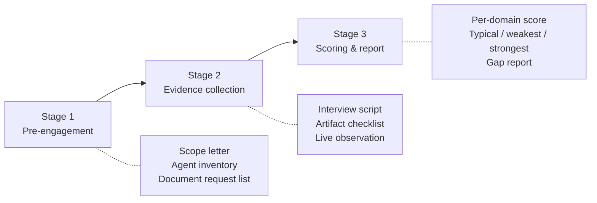

# Agentic AI Security CMM — Measurement Protocol (Assessor's Handbook)

> Companion to [[agentic-ai-security-cmm-2026|Agentic AI Security Capability Maturity Model]].

This protocol fixes the evidence bar for scoring an organization against the CMM, so two assessors auditing the same organization reach the same verdict. It supplies the assessment instrument that [[agentic-cmm-vs-standards-validation|Validation: Agentic AI Security CMM vs Widely Adopted Standards]] names as missing in its sixth section, recommendation 2.

The protocol is modeled on **BSIMM's observation/assertion structure** (descriptive: record what is actually done) layered with **CMMC 2.0's three-level assessment guide pattern** (prescriptive: match observed state against documented criteria). It applies to all 9 CMM domains.

This protocol measures deployments; [[standards-validation-methodology-2026-05|the Standards Validation Methodology]] measures documents. That methodology's per-standard reviews compare published text against published text, audit no production deployment, and assign to this protocol's audit backlog the question of whether organizations implement the clauses they anchor. An assessor who reads a standards anchor out of the [[agentic-ai-security-cmm-crosswalk|crosswalk]] at Stage 3 therefore inherits a verified reading of the published text and no evidence that the control operates anywhere.

[[ai-coding-agent-governance|AI Coding Agent Governance (Knostic)]] names the controls a coding-tool deployment adds and states no assessment method, which is the gap Stage 3 fills for that shape.

## On this page

- [Three-stage assessment](#three-stage-assessment) — pre-engagement, evidence collection, scoring
- [Stage 1 — pre-engagement](#stage-1--pre-engagement-12-weeks)
- [Stage 2 — evidence collection](#stage-2--evidence-collection-24-weeks) — assurance classes, interview script, cross-domain questions, artifact checklist, live observation
- [Stage 3 — scoring & report](#stage-3--scoring--report-1-week) — rubric, aggregation rule, gap report
- [Sample assessment timeline](#sample-assessment-timeline)
- [Assessor competence requirements](#assessor-competence-requirements)
- [Differences from existing audit programs](#differences-from-existing-audit-programs)
- [Open gaps in this protocol](#open-gaps-in-this-protocol)
- [Relations](#relations)

**Recalibrated against the D1–D9 deep dives (2026-05-25).** The per-domain level criteria were recalibrated under the [[agentic-ai-security-cmm-recalibration-method-2026|recalibration method]]; the nine companion deep dives ([[agentic-ai-security-cmm-d1-governance|D1]], [[agentic-ai-security-cmm-d2-identity|D2]], [[agentic-ai-security-cmm-d3-control-least-agency|D3]], [[agentic-ai-security-cmm-d4-runtime-guardrails|D4]], [[agentic-ai-security-cmm-d5-egress-network|D5]], [[agentic-ai-security-cmm-d6-data-rag|D6]], [[agentic-ai-security-cmm-d7-observability|D7]], [[agentic-ai-security-cmm-d8-supply-chain|D8]], [[agentic-ai-security-cmm-d9-operations|D9]]) are the authoritative current criteria. Assessors score against them. Six changes bear on this protocol.

- **D1-L5 assurance is scheme-neutral** — ISO/IEC 42001 preferred, [[aiuc-1|AIUC-1]] or a reviewed internal equivalent accepted, with no single mandate.
- **D6's core L3 criterion is D6-ENTITLE, answer-time entitlement enforcement against oversharing / [[inference-exposure|inference exposure]]**, distinct from corpus attestation, and it grades the resolution of the asking principal's read authorization on the retrieval path. Data that reaches an answer through a tool call is D2-DELEGATE's, and a corpus that every principal who can ask may read in full holds no instance of the criterion. The **authorization layer** follows the corpus: a document corpus carries per-document entitlements, source control carries the read grants of the asking developer, per repository on GitHub, with the path scope of the working copy, and a whole-tenant corpus carries the tenant access-control list with label-aware policy. **D6's L2 takes its grain from the same layer**, so the classification record an assessor collects under D6-CLASSIFY assigns a class to each unit that layer grants on: each document or library, each repository, or each site, drive and mailbox with its calendar and chats. Grading is cumulative, so a shape that cannot produce an L2 artifact does not reach L3.
- **D8 reads its producer criteria as a population.** D8-LINEAGE and D8-WEIGHTS range over the models the organization trains or fine-tunes for its agents, and D8-VEX and D8-VEX-FEED over the components it publishes outside the organization, so a deployment holding neither records them not applicable. D8-AIBOM applies to every deployment that releases an agent, and SLSA's Build Track stops at L3 in v1.2, the current version.
- **Per-task capability tokens are L5+ in D2, D3 and D5**, because the D3 and D5 tooling maps record no platform-native implementation and one early-stage open-source implementation. D3 and D5 graded the capability at L5 until September 2026, so an assessor now collects its artifact in the L5+ column of the checklist below and does not grade L5 against it.
- **The platform-native D4 and D7 reasoning-layer controls sit mostly at preview or experimental status.** Chain-of-thought auditing ships as experimental open source, and Microsoft's Task Adherence check of planned tool calls against user intent and its groundedness detection are preview. AWS's contextual grounding check has been generally available since 2024-07-10 ([AWS What's New](https://aws.amazon.com/about-aws/whats-new/2024/07/guardrails-bedrock-hallucinations-safeguard-apps-fm/)). For behavioral detection, Microsoft's and Google's agent detection services are preview, the commercial tools in [[agentic-ai-security-cmm-d7-observability|D7]]'s control landscape are generally available, and GuardDuty AI Protection, launched on 2026-07-14, baselines each IAM identity's model invocations ([AWS — GuardDuty AI Protection](https://docs.aws.amazon.com/guardduty/latest/ug/ai-protection.html), [AWS What's New](https://aws.amazon.com/about-aws/whats-new/2026/07/amazon-guardduty-ai-protection-aws/)). A defensible L4 is therefore assembled from preview, open-source and generally available components, each counting from the documented date it entered the organization's production.
- **`LEAST MODEL PRIVILEGE` and `OVERSIGHT` add graded criteria across five domains.** Per [[owasp-ai-exchange|OWASP AI Exchange]], the added criteria are these.
    - D3 L3 grades a synchronous fail-closed gate.
    - D3 L4 grades a cumulative-session ledger and depth-limited subset-only delegation.
    - D3 L5 grades per-request approval tokens.
    - D3 L5+ grades per-task capability tokens.
    - D4 L4 grades semantic tool validation on high-impact calls, evidenced in-house, since no product in D4's September 2026 canvass implements the dry-run and cross-family-judge specifications.
    - D6 L4 grades a tested restore of each memory store and each index over a corpus to a recorded earlier state, the memory and index share of the rollback that [`OVERSIGHT`](https://owaspai.org/go/oversight/) lists among its response options.
    - D7 L4 grades a routed disposition on the session-drift signal plus control-state-change monitoring.
    - D9 L3 grades the high-risk approval categories, their tamper-evident record, the minimum delay before the highest-risk actions and segregation of duties on critical actions.
    - D9 L4 grades a stated involvement measure, an adversarially tested oversight path, a per-approver approval limit and a flag on an approval rate above the historical baseline.

## Three-stage assessment

```mermaid
flowchart LR
    P1[Stage 1<br/>Pre-engagement] --> P2[Stage 2<br/>Evidence collection]
    P2 --> P3[Stage 3<br/>Scoring & report]
    P1 -.- D1[Scope letter<br/>Agent inventory<br/>Document request list]
    P2 -.- D2[Interview script<br/>Artifact checklist<br/>Live observation]
    P3 -.- D3[Per-domain score<br/>Typical / weakest / strongest<br/>Gap report]
```

### Stage 1 — Pre-engagement (1–2 weeks)

The organization under assessment delivers:

1. **Scope letter** identifying which agents are in-scope. Each agent gets an Agent Card (system manifest) with: name, owner (human), purpose, data classifications touched, tools/MCP servers used, deployment shape (chatbot / RAG / productivity assistant / MCP server / mesh), production status, downstream consumers. Two cases carry a sub-value. A **productivity assistant** holds tools over a tenant's or a user's mail, files and calendar, either inside the suite (Gemini for Workspace, Microsoft 365 Copilot class) or as a desktop agent with local file access and connectors (the [[claude-cowork|Claude Cowork]] class, whose control surface spans the organization console, the Enterprise custom-role model, each connector's own authorization scope and, on a third-party deployment, a managed device profile). A **coding agent** also names its variant — interactive local, sandboxed autonomous local, delegated cloud, CI-runner, or fleet, per [[generative-coding-deployment-shape-2026|Generative Coding Deployment Shapes]] — because the variants differ in which plane carries enforcement.
2. **Agent inventory** export — the full registry, even if some agents are out-of-scope for this assessment. The assessor needs the full registry to detect shadow agents.
3. **Document request list response.** Standard requests: AI security policy, AI incident playbook, last red-team report, AI-BOM artifact, gateway config, identity graph export, latest decommission drill report, last quarterly board AI-risk pack, and the current [[threat-modeling-for-ai|threat model]]. The input surfaces, trust boundaries, and agents that threat model enumerates set the coverage baseline for Stage 2's evidence collection and Stage 3's coverage statement.
4. **AI impact assessment** for each in-scope agent, with the signatory and the conclusion recorded. The Exchange makes impact analysis a first-class program element and lists what it must consider, including whether the required transparency can be provided, whether privacy rights can be achieved, whether unwanted bias can be sufficiently mitigated, whether the data may be used for the purpose, and whether AI is needed to solve the problem at all ([[owasp-ai-exchange|OWASP AI Exchange]], [`/go/aiprogram/`](https://owaspai.org/go/aiprogram/)). ISO/IEC 42001 A.5 already anchors D1 in [[agentic-ai-security-cmm-crosswalk|the crosswalk]]; this request makes that anchor assessable.
5. **AI-initiative inventory** covering deployed *and* proposed uses, distinct from the agent-registry export at item 2. The registry holds what was built; the Exchange's first governance iteration surveys current AI use, AI ideas, concerns, and where the AI expertise sits ([`/go/aiprogram/`](https://owaspai.org/go/aiprogram/)). An initiative that has not reached deployment appears in one and not the other.

A document missing from item 3 scores no level by itself. Each document evidences the criteria whose checklist artifacts it supplies, and the assessor grades each of those criteria on the other evidence the criterion names. A criterion left with no evidence is not met, which holds the domain below that criterion's level and leaves the levels beneath it to their own criteria. Each document counts for the deployments its own scope covers, so an organization-wide policy counts for every deployment it governs and a red-team report only for the deployments it tested. Items 4 and 5 evidence no criterion: D1 grades neither the impact assessment nor the initiative inventory at any level, so the assessor collects both as context and records their absence as a finding. Closing that gap belongs to [[agentic-ai-security-cmm-d1-governance|the D1 criteria]], and this protocol follows whatever they grade.

### Stage 2 — Evidence collection (2–4 weeks)

Evidence collection runs three parallel tracks: interviews, artifacts and live observation. The interview track runs a per-domain block and a cross-domain block. The assurance class below records the kind of evidence behind a verdict and the track it came from.

#### Assurance classes

The class of evidence settles a criterion, and the party operating the control does not. A control the customer tests, a control whose operating state the customer reads out of vendor tooling or out of a record the organization keeps, and a control the vendor attests to in a document the customer holds each carry a **met** or **not met** verdict. A vendor-operated control is graded on the evidence the vendor produces, and vendor operation alone puts no criterion out of reach.

| Assurance class | Evidence | Track |
|---|---|---|
| **Tested** | The assessor or the customer exercised the control and recorded what it did | Live observation |
| **Inspected** | Vendor tooling the customer can reach, or a record the organization keeps, shows the control's operating state in this deployment | Artifacts |
| **Attested** | The vendor states the control in a document the customer holds, and the document's own scope names the control | Artifacts |

Inspected and attested separate on whether the artifact's content depends on this deployment. An audit-log entry, an administrative console view, a configuration or policy export, and a record the organization keeps, such as an inventory, an owner field or a plan, each read differently in a deployment where the control operates and in one where it does not. An assurance or compliance report under a recognized scheme, a contractual commitment and a product documentation page read the same either way. **An attestation settles a criterion only where its own scope statement names the control.** One that does not counts as no attestation, so a compliance report silent on agent tool mediation settles no criterion about tool mediation.

**A verdict on inspected or attested evidence names the artifact.** Five fields make the record re-checkable by a second assessor: the issuer, the artifact's title with its report or version identifier, the date it was issued or extracted, the service and tenant it covers, and the period it covers. A record naming only the document class, such as the vendor's compliance report or the administrative console, leaves a re-assessment nothing to refresh, so the assessor collects the five fields before recording the verdict.

Verbal assurance from a vendor carries no class, because a verdict on inspected or attested evidence names an artifact and a conversation produces none. **Unanswerable** is the verdict where the customer can run no test and keeps no record of the control's state, and the vendor supplies neither inspectable output nor an attestation that names the control.

#### Interview script (per domain)

Each domain has a structured interview block. Sample questions are not exhaustive; the assessor follows up on every "yes we do that" with "show me." An interview answer can establish the L1 baseline and settles no criterion, because a criterion is met only on tested, inspected or attested evidence, and a conversation produces none. The cross-domain questions that follow these blocks are asked on top of them, in every domain scored on a guard, a sandbox, a detector, or a classifier. Each criterion the answers bear on takes one of four verdicts: **met**, **not met**, **not applicable** or **unanswerable**. The Stage 3 per-domain scoring rubric below defines the four, and the assessor records them from Stage 2 onward, each **met** or **not met** verdict carrying the assurance class above.

**D1 Governance**

Each question ends with the names of the [[agentic-ai-security-cmm-d1-governance|D1]] criteria it discharges, and each artifact in the D1 row of the checklist below carries the name it evidences. D1 tags each criterion organization or deployment: a question about the organization's criteria is asked once for the assessment, and a question naming deployment `[X]` is asked for each deployment in scope. A question that names deployment `[X]` and an organization criterion asks its organization part once.

- Who is accountable for AI governance? Show me the approved document that names the role, in whatever words the document uses, and the personnel record of the person who holds it today. (D1-ACCOUNTABLE)
- Show me the AI policy, its approval and its scope statement, and where the people it applies to can read it. Does it cover the AI systems you buy and use as well as those you build, agents included? (D1-POLICY)
- How is an AI system's risk tier assigned? Show me the approved scheme, its rule and the inputs the rule reads, and the policy or standard that applies it to AI systems, agents included. (D1-SCHEME)
- Show me the approved RACI. Which row assigns model accountability, which data accountability, and which risk governance, and to whom? (D1-RACI)
- Show me deployment `[X]`'s entry in the AI register: the agents it covers, the person accountable for it with the personnel record showing that person as current, and its risk tier with the record that scored the rule's inputs and that record's scope statement. (D1-REGISTER, D1-REGISTER-TIER)
- Who are the members of the AI risk body, when was it chartered, and when did it first meet? Show me the charter's membership and cadence, and the minutes of each meeting over the last twelve months with the decisions they record. (D1-BODY, D1-BODY-CADENCE, D1-BODY-HISTORY)
- Who may approve a deployment for production at each risk tier, and which body does the rule place above each approver? Show me the rule, and deployment `[X]`'s approval with its approver and its date beside the date `[X]` entered production. Show me each condition the approval set, with the record that met it or the approver's decision to change it. (D1-GATE-RULE, D1-GATE, D1-GATE-CONDITION)
- How do you find agents the AI register lacks? Show me the discovery sources, their schedule and their coverage of your endpoints, software-as-a-service tenants, cloud accounts and code hosts, and the latest comparison with the register. Show me each shadow agent found in the last twelve months, with the date it was registered or removed, set against the time you allow. (D1-SHADOW, D1-SHADOW-REAP)
- For each agent type in deployment `[X]`, show me the dated record of the actions its agents take on their own, those that wait for an approval and whose, and those they never take, and of the information classes its agents may read and where each class may be stored, shared or sent. Which record covers each of `[X]`'s agents, vendor-built agents included? (D1-BOUNDARY, D1-BOUNDARY-DATA)
- Show me the responsibility matrix that allocates each threat deployment `[X]`'s threat identification selects to this organization or to a party that supplies or hosts a component, the internal departments that supply data, models or fine-tuning artifacts included. Does the threat identification cover each component `[X]` runs today? Show me the disposition of each threat's residue, and who decided it. (D1-ALLOCATE, D1-ALLOCATE-RESIDUE)
- Where does your information-security asset inventory carry deployment `[X]`'s model type and implementation, and each item published about it, with its class? Show me the publication rule for an item that describes an AI system's technical detail, and the review record of each item published about `[X]`: what it withheld and what it disclosed, set against `AI TRANSPARENCY`. (D1-DETAIL, D1-DETAIL-RULE, D1-DETAIL-REVIEW)
- Show me the managed settings deployment `[X]`'s coding agents run under, as resolved on an enrolled device or runner, and the fleet record showing the managed source on each device and runner. Which managed-only locks are set, which list keys can a local scope still extend, and what restores the managed file when it changes? (D1-HARNESS, D1-HARNESS-LOCK, D1-HARNESS-EXTEND, D1-HARNESS-RESTORE)
- Show me the review records for a sample of changes to deployment `[X]`'s harness configuration tree: its managed settings, hooks, MCP server definitions, subagents, skills and instruction files. (D1-HARNESS-REVIEW)
- Show me the board's AI report for the last complete quarter and the minutes recording its receipt: the incidents, the escalations to the risk body, and the open findings by standards-anchor identifier. Did the board attest the report in each of the last four quarters? (D1-METRICS, D1-METRICS-ATTEST)
- Show me the crosswalk from each AI policy and standard in force to the frameworks and regulations it names, with its review rule and its revision history. (D1-CROSSWALK, D1-CROSSWALK-REFRESH)
- Which readiness assessment against a recognized assurance scheme covers deployment `[X]`? Who performed it, when, against which scheme, and what gaps did it list? (D1-READINESS)
- Which third-party assurance of your governance program covers deployment `[X]` today? Show me the certificate or the reviewed attestation, its scope, its route and the record that keeps it current. (D1-ASSURE)

**Artifact only:** D1-STANDARDS, D1-PUBLISH

**D2 Identity & Authorization**

Each question ends with the names of the [[agentic-ai-security-cmm-d2-identity|D2]] criteria it discharges, and each artifact in the D2 row of the checklist below carries the name it evidences.

- Show me the identity agent `[X]` authenticates as, the identity provider that issues it, and every credential the agent uses. Who else can use each credential, and how does a service the agent calls verify the identity? Where the platform attests the workload before issuing the credential, show the attestation. (D2-IDENTITY, D2-IDENTITY-VERIFY, D2-IDENTITY-ATTEST)
- Show me agent `[X]`'s inventory entry: its identities, the owner of each, and each credential's coupling class. For every coupled credential, show its line in the migration plan and its target date. (D2-INVENTORY, D2-OWNER, D2-COUPLING, D2-COUPLING-MIGRATE, D2-COUPLING-ZERO)
- When agent `[X]` acts for a human, what can it reach that the least-privileged human it acts for cannot? Show the component outside the model that holds it to that human's access. (D2-DELEGATE)
- Trace one of agent `[X]`'s actions, from the downstream system's own record, to the agent and to the human accountable for it: the human it acted for, or its owner where the run acted on its own grant. Show where the human's identity in that record comes from. (D2-TRACE)
- What happens when the human owner of agent `[X]` leaves the company? Walk me through, and show the last transfer and the pipeline step that would retire the identity. (D2-OWNER-TRANSFER, D2-LIFECYCLE)
- Show me how agent `[X]` gets each credential it uses, from the broker or vault log or the credential-less identity configuration, and how each service it calls authenticates the call. Confirm the agent process never sees the underlying credential. (D2-NOCRED, D2-MUTUAL)
- Show me the rule your decision point applies to agent `[X]`'s calls and the identity that rule names. (D2-AUTHZ)
- Show me the last execution of the kill switch against a running agent: what it revoked, what it stopped, and how long it took. (D2-KILL)
- Show me a token agent `[X]` holds during a task, the task it names, and that token refused after the task ended. (D2-TASKBIND)
- Show me a credential agent `[X]` received to act for a human, and one it issued to a downstream agent. Which fields name the delegator, the delegatee, the scope, the task, the expiry, and the delegation it descends from? (D2-DELEGATE-EXCHANGE, D2-DELEGATE-TOKEN, D2-DELEGATE-LINK)
- For each credential class agent `[X]` uses, show the last rotation and the consumers the dependency map named for it. (D2-ROTATE, D2-ROTATE-MAP)
- Show me the behavioral baseline for each identity agent `[X]` holds, and the last alert its detection raised. (D2-BASELINE)
- Which agents did the last discovery run find that the registry did not hold, and what happened to each? Show agent `[X]`'s registry entry. (D2-DISCOVER, D2-REGISTRY)
- Show me the conditional-access policy that applies to agent `[X]`'s identity, and a sign-in it evaluated. (D2-CONDITIONAL)

**Artifact only:** D2-ADMIN, D2-AUDIT, D2-TASKTOKEN, D2-TASKTOKEN-ATTENUATE, D2-FEDERATE, D2-FEDERATE-RECONCILE, D2-STANDARDS

**D3 Control & Least-Agency**

Each question ends with the names of the [[agentic-ai-security-cmm-d3-control-least-agency|D3]] criteria it discharges, and each artifact in the D3 row of the checklist below carries the name it evidences.

- Show me agent `[X]`'s tool allowlist as the component outside the model enforces it, the commands or destinations each shell or request tool admits, and the autonomy modes this deployment permits. Show a call outside the list refused or held under the most permissive of those modes. (D3-ALLOW)
- Which actions of agent `[X]` are destructive, under the classes D3 names and your own standard? For each, show the tier it carries and the approval step or refusal that governs it, with one record of it operating. (D3-APPROVE, D3-TIER-DESTRUCT)
- Show me the tier recorded for each action agent `[X]` can invoke, the date it was recorded, and the policy rule that returns each tier. Who receives a notify-tier notice? (D3-TIER, D3-TIER-ENFORCE)
- Show me the decision-rights matrix row for each of agent `[X]`'s action classes and the rule or workflow step that applies it. Show an approval the path routed to the approver its row names. (D3-RIGHTS)
- Show me how each of agent `[X]`'s tool calls reaches the decision point under each autonomy mode this deployment permits, and a trace in which the decision precedes the call. What does the policy decide for a call no rule matches? (D3-MEDIATE, D3-MEDIATE-SYNC, D3-DENY)
- What does the enforcement point do when the decision point is unreachable, times out or returns an error, and when its policy source is absent or malformed? Show the configuration and the record of the test that exercised it. (D3-MEDIATE-FAILCLOSED)
- Show me a crafted tool invocation sent directly to the access-control or API gateway layer, from the position the agent's tool-execution code holds and bypassing the LLM entirely, and the decision-log entry that denied it. A restriction that exists only in the system prompt is not enforced against an injected instruction. Where the decision point runs in-process and exposes no such interface, the question below replaces this one. (D3-MEDIATE-OUTSIDE)
- Where the runtime that hosts the model holds the decision: show me the policy as a production instance of that runtime resolved it, and name the scope it came from. Show me that the agent cannot write that scope, the audit record of the last in-session change to it, and a denied action under the most permissive autonomy mode this deployment allows. (D3-MEDIATE-OUTSIDE, D3-ALLOW)
- Name every scope the policy of agent `[X]`'s decision point takes rules from, and show me the principals who can change each. Can agent `[X]` or the principal it acts for widen that policy, such as through a project settings file, a user settings file or an "allow always" answer? (D3-POLICY-LOCK)
- For a shell or another tool whose executor rewrites its input, show me what each rule matches against what the executor receives, and a compound or expanded command refused. (D3-MEDIATE-EXACT)
- Show me the last confirm-tier action agent `[X]` took: where it waited, who approved it, and what the gate does on a denial, an expiry or an unreachable approval path. (D3-APPROVE-GATE)
- For each of agent `[X]`'s action classes, show me the share of executions a human approved in the last period and the review that read it. (D3-APPROVE-COVERAGE)
- Show me the autonomy stage recorded for agent `[X]`, the criteria for its next stage, and the record of its last promotion. (D3-PROMOTE)
- Show me a lethal-trifecta downgrade from the last 30 days, and how the breaker decides whether the agent can reach an external party through any dependency it can call. (D3-TRIFECTA)
- Which grants can agent `[X]` gain beyond its standing list, and when did the last one lapse? Show me the task scope its current task carries, where that scope was set, a call outside it denied, and the agent-escape record the denial wrote. (D3-ELEVATE, D3-TASKSCOPE, D3-TASKSCOPE-RECORD)
- For the last change agent `[X]` proposed to a production system, show me who proposed, approved and deployed it, and the key that signed each approval and each deployment. (D3-SOD, D3-SOD-CRYPTO)
- Show me the record of an authorization issued to agent `[X]` and refused when another agent, its delegatee included, presented it. (D3-NOREPLAY)
- Show me a sequence of individually permitted actions that your policy engine blocked in aggregate, and the per-session limit it crossed. (D3-LEDGER)
- Show me the record of a credential issued for one step of a delegation chain, presented at a different step and rejected by the policy engine. Show the maximum depth the policy enforces, each downstream agent's grants set against its delegator's, and the orchestrator's grants set against the tier of each action they reach. (D3-CHAIN, D3-CHAIN-DEPTH, D3-CHAIN-SUBSET, D3-ORCHESTRATE)
- Show me the approval token behind agent `[X]`'s last approved action, and an execution refused because a parameter deviated from it. (D3-APPROVE-TOKEN)
- Show me where agent `[X]`'s D7 anomaly score enters the policy, and a tier raised, a grant withdrawn and both restored. (D3-ADAPT)
- For the last policy release, show me the compile output, the reviewer, and the check that the running policy still matches it. (D3-POLICY-COMPILE, D3-POLICY-REVIEW, D3-POLICY-DRIFT)

**Artifact only:** D3-TASKTOKEN, D3-CHAIN-ATTENUATE, D3-QUARANTINE, D3-POLICY-FORMAL, D3-LEDGER-SEQUENCE

**D4 Runtime & Guardrails**

Each question ends with the names of the [[agentic-ai-security-cmm-d4-runtime-guardrails|D4]] criteria it discharges, and each artifact in the D4 row of the checklist below carries the name it evidences.

- Show me the safety filter on the prompts agent `[X]` receives and the content-safety classifier on every response its model returns, the replies people read and the content it passes to tools, with the setting or code that applies each to every model call, or a test in which the classifier blocked each kind of response. For a filter or classifier the vendor runs, show the vendor document naming it or a record of its result, and for the classifier, the replies and the tool-call content the document names in its scope. (D4-INPUT, D4-OUTPUT)
- Which classes does agent `[X]`'s output classifier detect? Show me the dated record of its content-safety categories and its exposure-restricted data classes, set against its configuration or the vendor's statement of its categories, and whether system prompts and other technical detail about the system are inside it. (D4-OUTPUT-SCOPE)
- Show me the classifier that screens agent `[X]`'s prompts for direct prompt attacks, where it sits on the request path, and an attack it blocked. For a classifier the vendor runs, show the vendor document naming it for prompts or a record of a detection. (D4-INJECT-DIRECT)
- List every route by which untrusted content reaches agent `[X]`'s model: each retrieval, tool, connector and inbound channel. For each, present a crafted instruction through the route itself, or show a detection the classifier recorded on content from it. A vendor's indirect-mode flag shows that the capability exists, and only the test or the detection shows that this deployment's route reaches it. (D4-INJECT-INDIRECT)
- What happens to text before the injection classifier reads it, on the prompt and on each route: the normalization form, invisible-character removal, case folding and confusable mapping, at the running version? For a vendor classifier that states none, show a blocked attack presented again in each variant form. (D4-INJECT-CANON)
- Which of agent `[X]`'s tools run commands or code, and which processes does its harness start for a run? Show me the sandbox around each, the tools that read or write files or open connections and the MCP servers included, under each autonomy mode this deployment permits, and what happens to a command the sandbox blocks. (D4-SANDBOX)
- Does agent `[X]`'s harness read settings, hooks, MCP definitions or version-control configuration from the workspace before its sandbox is in place? Show me the vendor's statement of the order, or a test in which a workspace-supplied hook recorded where it ran. (D4-SANDBOX-FIRST)
- Show me the sandbox profile: what it refuses the code inside it, the mandatory access control profile and the capabilities left to the processes, and a staging demonstration of a refused escape of each kind. (D4-SANDBOX-CONFINE, D4-SANDBOX-MAC)
- Show me the environment and the mounts of a sandboxed process, and where each credential the run uses is held. (D4-SANDBOX-CREDS)
- What's your sandbox grain? Show me a sandbox created for one task and destroyed at its end, what a forced stop destroys, and the CPU, memory and wall-clock limits the platform sets on it. (D4-SANDBOX-CLEAN, D4-SANDBOX-LIMITS)
- Show me the monitor that checks agent `[X]`'s tool calls against its task before they run, and a call it held or blocked, on a production run or in a test. Record which monitor. (D4-ALIGN)
- Show me the static analysis that runs on code agent `[X]` generates before the code runs outside a sandbox or merges, its blocking severity and the code it covers, and a finding that held code back. (D4-CODESCAN)
- Show me the groundedness check on agent `[X]`'s answers, its threshold, and the scores for a sample of answers. (D4-GROUND)
- Once untrusted content enters one of agent `[X]`'s sessions, which calls can the session still make? Show me the rule outside the model that decides, and a send it held after such content entered. (D4-CONTEXT)
- For a high-impact tool, show me what the call would have done before it ran, the judge that compared it with the user's request, with the judge's model family and the agent's, and the per-call limit its parsed impact was checked against. (D4-VALIDATE-DRYRUN, D4-VALIDATE-JUDGE, D4-VALIDATE-IMPACT)
- Show me the coverage of each L4 control across every agent in scope, the setting that stops an owner turning one off, and any agent excluded. (D4-PLATFORM)
- What's your injection classifier's miss rate per language and per bypass class, against which library revision, and on what cadence is the classifier refreshed? Show me the refresh receipts for the period. (D4-INJECT-LANG, D4-INJECT-BYPASS, D4-INJECT-REFRESH)
- Show me the credential scan on agent `[X]`'s output path and its measured detection of base64 and other encoded forms beside literal ones. (D4-OUTPUT-LEAK)
- Show me each guardrail's latency and cost budget and the record of a breach the platform enforced. (D4-BUDGET)
- Show me the register of services two or more of your agents share, such as model endpoints, credentials and policy engines, set against each agent's configuration, with the decision on each, and for a service accepted as a cross-agent channel, its residual risk and who accepted it. (D4-SHARED)

**Artifact only:** D4-ATTEST, D4-INJECT-REMEDIATE

**D5 Egress & Network**

Each question ends with the names of the [[agentic-ai-security-cmm-d5-egress-network|D5]] criteria it discharges, and each artifact in the D5 row of the checklist below carries the name it evidences.

- Where does each of agent `[X]`'s outbound connections go, under each autonomy mode this deployment permits? Show the allowlist the enforcing component applies to them, the source it is administered from, and the principals who can change it. (D5-ALLOW, D5-ALLOW-LOCK)
- Show me the record of what each destination on agent `[X]`'s allowlist reaches on the agent's behalf, set against the list the enforcing component applies. For each internal service the agent reaches, show its own egress policy and, for an MCP server, the web-service test that shows whether a crafted request can make it send one of its own. (D5-REACH, D5-RELAY)
- Show me the gateway each of agent `[X]`'s model, tool and MCP calls passes, the route that sends each class of call there, and the rule that authorizes a tool call by agent and tool, with a call it refused. (D5-GATEWAY, D5-GATEWAY-AUTHZ)
- What does the gateway screen in agent `[X]`'s requests, responses and tool results, and for which classes? Show a request or response it blocked. (D5-GATEWAY-SCREEN)
- Show me the ceilings on agent `[X]`'s calls per window, its model tokens per window and its tool invocations per task or session, the key each one counts by, and a call or invocation each one refused or held. (D5-CEILING, D5-CEILING-TOKENS, D5-CEILING-TOOLS)
- Which resolver answers agent `[X]`'s lookups, and what does it return for a name outside the allowlist? Show that the agent reaches no other nameserver, directly, over DNS over TLS or over DNS over HTTPS. (D5-DNS, D5-DNS-ONLY)
- How is agent `[X]`'s call to MCP server `[Y]` authorized? Show the broker that validates the caller's token and a call it refused without one, and the token exchange that gives each tool a token issued for it alone. (D5-MCP-BROKER, D5-GATEWAY-EXCHANGE)
- Show me the approved fingerprint of each tool definition agent `[X]` loads, the comparison made at its last connection, a changed definition the gateway refused, and the screen that reads a new or changed definition for instructions addressed to the model. (D5-MCP-PIN, D5-MCP-RUGPULL, D5-MCP-POISON)
- For the messages agent `[X]` exchanges with other agents, show the lowest TLS version each receiving endpoint accepts, how each side authenticates the other, a replayed message refused, and the delegating agent and accountable human each delegated message names. (D5-A2A-TLS, D5-A2A-AUTH, D5-A2A-REPLAY, D5-A2A-CHAIN)
- Show me the last vulnerability-feed match on an MCP server one of your agents uses, the alert the gateway raised, and what took the server out of the agents' reach. (D5-MCP-CVE, D5-MCP-QUARANTINE)
- Show me the contract each supplied model or AI service agent `[X]` calls is pinned to, and a response the gateway rejected for departing from it. (D5-CONTRACT)
- Which component carries each message between two of your agents, and what does it check and screen before delivery? Show the network policy that leaves no direct path between agents, the broker's authentication and validation rules, and a message the screen blocked. (D5-A2A-BROKER, D5-A2A-SCREEN)
- Which of your agents take in untrusted content, and which sensitive internal services can each reach at the network layer? Show the policy that denies the rest. (D5-SEGMENT)
- Show me the orchestrator's own network policy. Which outbound paths does it hold beyond its model endpoint and its sub-agents, and which sub-agent carries the external access it needs? (D5-ORCHESTRATE)
- Where agent `[X]` runs code or commands that open connections, show how the egress control decides on the host each connection reaches, and a fronted request it refused. (D5-INSPECT)
- Show me the proxy beside each agent, and the routes and network policy around agent `[X]`'s workload, with a connection that tried to reach a destination around the gateway refused. (D5-MESH, D5-GATEWAY-ONLY)
- Show me the SSRF closure verification from agent `[X]`'s position: a metadata address, an internal address, a redirect to an unlisted host and an allowed name remapped to another address, each refused. (D5-SSRF)
- Show me the signing profile agent `[X]`'s peers verify its messages and its descriptor against, a message refused for a failed signature, and the audit of the last release against that profile. (D5-A2A-SIGN, D5-A2A-SIGN-AUDIT)

**Artifact only:** D5-TASKTOKEN, D5-MCP-SIGN, D5-A2A-BASELINE, D5-FEDERATE, D5-FEDERATE-RECONCILE

**D6 Data, Memory & RAG**

Each question ends with the names of the [[agentic-ai-security-cmm-d6-data-rag|D6]] criteria it discharges, and each artifact in the D6 row of the checklist below carries the name it evidences.

- Name every corpus agent `[X]` retrieves from, however its retrieval layer reaches it, every store that keeps a copy of corpus content, every system its tools read and every memory store it writes. Show me the record that assigns each of them a class, at the grain each corpus's authorization layer grants on: each document or library, each repository, or each site, drive and mailbox with its calendar and chats. A labelling rule that names the units it covers assigns their class, and the items need not carry it. Over source control the record is a register of the repositories the agent reaches, each with its class. (D6-CLASSIFY)
- Show me a sample of agent `[X]`'s retrievals from a log, a trace or the answers' citations, each item naming its origin in the corpus's own terms: the document, the repository with its ref and path, or the mailbox, site or drive. (D6-ORIGIN)
- List the knowledge sources, web grounding, connectors, plugins, MCP servers over an index and editor extensions that add a source to agent `[X]`'s corpora, with the date each first served a retrieval, and show me each one's review record naming its reviewer. Does any setting let a maker add a source nobody reviews? (D6-EXTEND)
- Show me the latest assessment of who reaches each corpus location through the agents, set against the readers its class and its owner intend: its scope against the full list of locations, its findings, and the record closing each finding within your stated period by a grant change, a removal or the owner's recorded exception. Which findings rest only on a discovery restriction such as Restricted Content Discovery? Show me the schedule and the runs since. (D6-REACH, D6-REACH-REMEDIATE, D6-REACH-CADENCE)
- For a corpus that asking users share, name its authorization layer. When user `[A]` and user `[B]` ask for the same content, and `[A]` can open an item that `[B]` cannot, show me the item in `[A]`'s answer and absent from `[B]`'s. Where the retrieval runs under a service identity, show me what narrows that identity's reach to the asking user's grants on each retrieval; where nothing does, the criterion is not met. For a layer the vendor operates, show me the vendor document stating the enforcement. (D6-ENTITLE)
- For a productivity assistant over a whole tenant, run the same two-user comparison with a document, a message, a calendar entry and a chat that `[A]` can open and `[B]` cannot, and record whether the tenant ACL or the data-loss-prevention rule produced each trim. The vendor's documented statement of answer-time entitlement evidences the entitlement as attested, and the comparison raises it to tested; record the assurance class. (D6-ENTITLE, D6-LABEL-GATE)
- For a desktop agent of the [[claude-cowork|Claude Cowork]] class, run the comparison twice, because the corpus carries two authorization layers. Over a connector the trim is the source system's, and the record names the connector and the permission categories an owner set on it. Over a connected folder the reach is whatever the member's operating-system account opens inside the folders the organization selects, so the record names the selected paths, from the telemetry's `workspace.host_paths` or the allowed-workspace-folders key in a managed device profile, and the reach assessment covers them. (D6-ENTITLE, D6-REACH)
- For a coding agent over source control, name the repositories the agent reaches for developer `[A]`, then run the same retrieval for developer `[B]`, who cannot read a repository `[A]` can, and show its content absent from `[B]`'s result and present in `[A]`'s. One transcript proves nothing, because a repository never cloned into the working copy is absent for everyone. Record whether the developer's repository grants or the path scope of the working copy produced the trim. (D6-ENTITLE)
- For a run no human starts, such as an event-triggered build or a scheduled job, show me the scope its identity holds and the setting that binds it to the repositories, sites or mailboxes its task reads. A scope over the whole estate, or one the agent can widen during the run, does not meet the criterion. (D6-ENTITLE-TASK)
- Show me the trust scale for agent `[X]`'s sources, the code or configuration that attaches a level to each retrieved item, and a sample of items carrying it. How does the retrieval layer rank or filter by that level? Show me a test in which a lower-trust item planted to match a query ranked below a higher-trust one. (D6-TRUST, D6-TRUST-WEIGHT)
- Show me the scan on each corpus's ingest path for instructions addressed to a model, and a test that presented crafted content through that path or a detection the scan recorded on ingested content. A test on the user channel alone does not answer this question. (D6-SCAN-INJECT)
- Show me the poisoning scan over new corpus items and fine-tuning datasets: the method it names, its filter threshold, its lower threshold for investigation, the schedule that rescans the content already held, and the targeted test that showed the method fit, with the share of planted samples each threshold caught. (D6-SCAN, D6-SCAN-TEST)
- Show me the baseline for each file agent `[X]` loads as instructions, its system prompt, identity files and rules files, and the check that verifies it when the agent loads it: a hash verified at session start and after each change, or an immutable digest-pinned artifact the running agent cannot write. For a hash baseline, show me a mismatch it held or alerted on, or a test of it. (D6-INSTRUCT)
- For each index, vector store or knowledge-file store that holds a copy of corpus content, show me its access policy set against the identities that hold access, its encryption at rest over the content and the embeddings, and the period within which a deleted source item's copy and embeddings are removed, with a deleted item's copy found absent. (D6-STORE-ACCESS, D6-STORE-ENCRYPT, D6-STORE-RETAIN)
- Show me the scope decision for each corpus and fine-tuning dataset, set against a sample of its content and of each copy, and for fine-tuning data the list of identifiers kept only for data removal or lifecycle management, set against the fields the training run excludes. (D6-SCOPE, D6-SCOPE-IDENTIFIERS)
- For each field kept in or removed from a fine-tuning dataset, show me the measurement of its effect on the model. Take a deleted source record and trace it through the link record to every training dataset, corpus entry, copy and embedding derived from it. (D6-SCOPE-MEASURE, D6-SCOPE-PROPAGATE)
- Which exposure-restricted fields does a fine-tuning dataset keep, and how is each obfuscated before training? Who can read the token mapping tables? Show me the record of the quasi-identifiers the dataset still holds, with each one's disposition and who accepted it. (D6-OBFUSCATE, D6-OBFUSCATE-TABLES, D6-OBFUSCATE-RESIDUAL)
- Where is the corpus you validate the model or the agent against stored, and which identities can write it? Show me that no identity that writes the training data, the model artifacts or the agent's code and instructions can, and the register of its copies held outside your stores, each with its transfer record. (D6-HOLDOUT, D6-HOLDOUT-TRANSFER)
- Where does agent `[X]` keep content that a later task, conversation or agent reads back as context, other than a checkpoint that only resumes the same task or session? For each store, show me the partition key with a read and a write refused across partitions, a sample of entries read field by field for source, writer, time and partition, the integrity check an entry passes before it enters the context, the review of the context between tasks with a reset it performed, and the append-only change log set against the identities able to write it. (D6-MEMORY-PARTITION, D6-MEMORY-WRITE, D6-MEMORY-PROVENANCE, D6-MEMORY-VERIFY, D6-MEMORY-RESET, D6-MEMORY-LOG)
- How do you detect poisoning in what agents write to memory and to a corpus? Show me the detection rule and an alert it raised into your security monitoring queue, or a test of it. The ingest scan's flags, forwarded to the telemetry, are a separate record and do not answer this question. (D6-DETECT)
- What share of planted sabotage samples, and what share of planted targeted samples, did each poisoning detection flag, the ingest scan and the runtime detection? Who can change each detection's logic, thresholds and baselines, and what records a change? (D6-DETECT-CLASSES, D6-DETECT-PROTECT)
- Show me a sample of agent `[X]`'s answers and of the content it created, each set against the classes of the items it drew on, and the policy that keeps named classes out of answers, with an answer it gated or a test. (D6-LABEL-CARRY, D6-LABEL-GATE)
- Show me a restore of a memory store or an index to a recorded earlier state and the state it returned, and each quarter's drill report with the measured restore time against your stated target. (D6-ROLLBACK, D6-ROLLBACK-DRILL)
- Show me each corpus's content baseline and the detection that alerts when the corpus departs from it, with an alert or a test, and the documented tolerated poisoning share behind each detection's thresholds. (D6-SCAN-DRIFT, D6-SCAN-BOUND)
- For an answer drawing on more than one source, show me the check for contradictions that runs before the answer reaches the person, its rule, and its flags for a sample of answers. (D6-CONTRADICT)
- Show me the need-to-know policy for each role, and a test in which retrievals within one session, each permitted alone, were refused once together they crossed it. (D6-ENTITLE-INFER)

**Artifact only:** D6-ATTEST, D6-TRUST-LATTICE, D6-ENTITLE-PROOF

**D7 Observability & Detection**

Each question ends with the names of the [[agentic-ai-security-cmm-d7-observability|D7]] criteria it discharges, and each artifact in the D7 row of the checklist below carries the name it evidences.

- Show me the records of agent `[X]`'s tool calls in sampled sessions that hold a call to each of its tools: the store that holds them, how you search and export it, and the time, tool and accountable human each record gives. For an agent with no tool, show the same for each request it answered. (D7-LOG)
- Show me OTel `gen_ai.*` traces for a run of each agent, covering each inference, tool execution, agent invocation and retrieval it performs, and the collector path to the backend, with its sampling settings and the account or tenant that holds the backend. (D7-SPANS, D7-SPANS-HELD)
- Which version of the GenAI conventions do agent `[X]`'s spans follow, where is it named, and how are the instrumentation libraries pinned? (D7-SPANS-PIN)
- Take one of agent `[X]`'s actions and show me the agent and the accountable human its records name, and the join between the records that name them. (D7-ATTRIBUTE)
- For each of agent `[X]`'s tools, show me a call's records field by field: the arguments, the target, the outcome, the identifier that joins them to the session and, for a write, the reference that locates what it changed. (D7-LOG-SCHEMA)
- Where does agent `[X]` keep content that a later task or conversation reads back? Show me the telemetry record of a write to it, with the writer, the session, the store and entry, the content hash or summary, and the source. (D7-LOG-MEMORY)
- Show me a forwarded record of each escape-indicator class from the sandbox agent `[X]`'s code or commands run in: an unexpected system call, an access to a forbidden path and a refused connection. (D7-FORWARD-ESCAPE)
- Show me an alert the ingest scan's lower threshold raised, as it reached your telemetry, with its corpus, ingest run and sample. (D7-FORWARD-SCAN)
- How long must each kind of agent record stay searchable, where is that stated, and how long does each store keep its records? (D7-RETAIN)
- Show me agent `[X]`'s baseline of tool calls, the detection that compares its calls with the baseline, and the last alert the detection raised or a test of the detection. (D7-BASELINE)
- Show me how a session of agent `[X]` is scored for progressive relaxation across its turns, the threshold that raises an alert, the rule that routes each alert, and the disposition log for the last quarter. (D7-DRIFT, D7-DRIFT-ROUTE)
- Show me the deployment's list of controls, each with the change record it writes and the rule that reads that record, and an alert that fired because a control was relaxed rather than because an agent misbehaved, or a test of that rule. (D7-CONTROL-RELAX)
- Show me the detection that raises an alert when an action needing a human approval runs without one, and when an approval step starts approving on its own, with the last alert it raised or a test of it. (D7-CONTROL-APPROVE)
- Which of agent `[X]`'s paths get the weakest human review, and what raises an alert on inputs timed or shaped toward them? Show me the last alert it raised or a test of it. (D7-REVIEW-EVASION)
- Which component writes agent `[X]`'s tool-call records, under what identity, and which identities can write, change or delete them in the store? Show me the result of a test in which the agent attempted to suppress or alter its own action records on the production log path. What did the log store do? (D7-LOG-OUTSIDE, D7-LOG-TAMPER)
- Show me the posture-management tool's scope against the accounts that host agent `[X]`, the agent's entry in it, and the disposition of its latest findings. (D7-POSTURE)
- Walk me through last quarter's evaluations of agent `[X]`: the threat categories, the coverage stated before each run and the categories left untested, the multi-turn scenarios reported apart, any scenario carried across sessions, and which tools were used ([[promptfoo|Promptfoo]] / [[pyrit|PyRIT]] / [[garak|Garak]] / [[mindgard-cart|Mindgard CART]]). (D7-EVAL, D7-EVAL-TURNS, D7-EVAL-SESSIONS, D7-EVAL-TOOLS)
- For an orchestrator, show me the workflow log of a recent run, the component that writes it and the store's access policy, and the last reconciliation of the delegated agents' actions against it. (D7-ORCHESTRATE, D7-ORCHESTRATE-RECONCILE)
- Show me the playbook that runs on each class of D7 alert about agent `[X]`, and each playbook's last run. (D7-PLAYBOOK)
- Show me each agent's prompt-volume-to-alert ratio over the last quarter against its documented range, the analyst-actionable rate against its target, and the controls update, decision or tuning record each alert reached within the SLA. (D7-ALERT-RATIO, D7-ALERT-ACTIONABLE, D7-ALERT-LOOP)

**Artifact only:** D7-CASCADE, D7-JOINT, D7-ACTIVATION

**D8 Supply Chain & AI-BOM**

Each question ends with the names of the [[agentic-ai-security-cmm-d8-supply-chain|D8]] criteria it discharges, and each artifact in the D8 row of the checklist below carries the name it evidences.

- Show me the inventory of agent `[X]`'s components: each model it calls with its hosting service, its harness or platform, each ability, each AI framework library and each acquired dataset, each with its source, version, maintainer, the date it entered the deployment and, for a file or an image, its hash. Set each entry against the running configuration, the lock file, the image digest or the device inventory: does the configuration run a component the inventory omits, or a version other than the one an entry gives? (D8-INVENTORY)
- For each model agent `[X]` calls, its harness or platform, and each ability and AI framework library, show me the version that ran in each period of the last twelve months. Where the configuration names a range or an alias, show me the record of the version each run resolved to, for each period of the last twelve months. (D8-VERSION)
- Show me the supplier's card for each model agent `[X]` calls, matched to the version in use. (D8-MODEL-CARD)
- For each dataset acquired to build agent `[X]`'s corpora or to fine-tune a model it calls, show me the record of its sources and of the steps that transformed it, and, for a dataset held as references, the checksum taken for each entry. (D8-DATASET)
- Which stores hold the design, development, model and experiment documentation you write for agent `[X]` and for the models it calls itself? Show me each store's entry in the asset register and its access list, set against the roles its owner names. (D8-DOCS, D8-DOCS-ACCESS)
- Show me the AI-BOM of agent `[X]`'s latest release: its format, and the models, abilities, libraries and configuration files it lists, set against the release's configuration. (D8-AIBOM)
- Show me the scan step in each pipeline that builds or releases agent `[X]` with a recent run's results, and the install command and lock file of each install, with a run that failed on a mismatch or a test. Does any package or image, a harness a setup step installs or a sidecar image included, install outside the scan or by name or range? (D8-DEPS-SCAN, D8-DEPS-LOCK)
- When agent `[X]` installs a package, or a developer installs one on its suggestion, which registry resolves it, and what checks the name, the publisher and the age before the registry serves it? Show me the policy, the package-manager configuration and a refused install or a test. Can the agent reach a public registry directly? (D8-DEPS-INSTALL)
- List each model file the organization loads for agent `[X]`, in production, a pipeline or a notebook, with its source. Show me the check record dated before each file's first load, with the enforced load policy where it replaces the opcode scan, and, for a file from a source whose supplier you have not assessed, the architecture inspection and the isolated probe run. (D8-MODEL-SCAN, D8-MODEL-INSPECT, D8-MODEL-PROBE)
- List the abilities agent `[X]` uses: skills, plugins, connectors, MCP servers, external agents and the editor extensions its harness loads. For each, show me the approval naming its publisher and source, or the configuration that restricts installs to approved entries, and, for each one that installs on a system you run, the scan result dated before it installed. (D8-ABILITY-SOURCE, D8-ABILITY-SCAN)
- Show me the assessment of each supplier of agent `[X]`'s models, their hosting, its harness or platform, its abilities and its datasets, item by item against the seven evaluation items, with the evidence each answer cites and the re-assessment period. Which suppliers hold no assessment, such as a model provider whose licence was accepted in a console? (D8-SUPPLIER)
- Show me the signature or attestation of each artifact of agent `[X]`'s latest release, such as its image, its policy bundle, its chart or the workflow and plugin revisions its consumers install, with the key or identity that verifies it. (D8-SIGN)
- For each kind of component that installs, loads or deploys for agent `[X]` on a system you run, show me the step that verifies it against a signature, an attestation or a pinned digest, and a refused component or a test. For a model, show me the signing manifest or pinned list covering every file it needs to initialize, and for a harness that updates itself, the vendor's statement of how its updater verifies what it installs. (D8-VERIFY, D8-VERIFY-BUNDLE)
- Show me how each file agent `[X]` loads as instructions is verified at each load against its publisher's signature, a signed revision or a release's pinned digest, and a load a mismatch stopped or a test. (D8-VERIFY-INSTRUCT)
- Show me the provenance statement of each artifact of agent `[X]`'s latest release, the build platform that signed it and the SLSA Build level the platform states. Is the build defined in a reusable workflow, or on a platform that keeps its signing material from the build's own steps? (D8-BUILD, D8-BUILD-HARDENED)
- Show me the runtime record of agent `[X]`'s components, its reconciliation against the deployed release's AI-BOM with the last findings, and the documented drift tolerance with the last quarter's differences and their closure. (D8-AIBOM-RUNTIME, D8-AIBOM-DRIFT)
- For each type of component agent `[X]` runs, name the source its advisories arrive from and the queue they reach. Show me the deadlines by severity, each affecting advisory of the last twelve months with its closure date, the compensating controls your procedure names for a fix that cannot meet its deadline, and the containment record of each advisory that missed one. (D8-DISCLOSE, D8-DISCLOSE-CONTAIN)
- Show me the latest review of agent `[X]`'s components for deprecation and maintenance state, the inactivity rule it applies, and the action taken on each component it found deprecated or unmaintained. (D8-RETIRE)
- Which internal artifact repositories can an identity agent `[X]` holds write to, a token in a file it can read included? Show me the write permissions on each, set against those identities, every endpoint each repository serves, legacy and unauthenticated ones included, and whether a location one run writes is read by another agent or run. (D8-REPO-WRITE)
- Does the organization train or fine-tune a model agent `[X]` calls itself, a LoRA adapter included? For each one, show me the lineage record of its current version, and the weight store's access policy, set against the identities that need access, with its integrity protection and monitoring. (D8-LINEAGE, D8-WEIGHTS)
- Does the organization publish a component of agent `[X]` to parties outside it? Show me the exploitability statement for each vulnerability affecting it, the feed that serves the statements, and each statement's publication date against the vulnerability's disclosure date. (D8-VEX, D8-VEX-FEED)
- Show me the reconciliation that joins agent `[X]`'s inventory, AI-BOMs and D8 findings in production, its schedule and run history, the published SLA, and each finding of the last quarter with the control change or decision that closed it. (D8-LOOP, D8-LOOP-SLA)
- Show me the deploy gate on each path by which a release of agent `[X]` reaches production, the policy that refuses a release failing verification or departing from its approved AI-BOM, and a refused release or a test. (D8-VERIFY-GATE)

**Artifact only:** D8-AIBOM-FEDERATE, D8-BUILD-REPRODUCE, D8-SIGN-MCP, D8-STANDARDS

**D9 Operations & Human Factors**

Each question ends with the names of the [[agentic-ai-security-cmm-d9-operations|D9]] criteria it discharges, and each artifact in the D9 row of the checklist below carries the name it evidences. D9 tags each criterion organization or deployment: a question about the organization's criteria is asked once for the assessment, and a question naming deployment `[X]` is asked for each deployment in scope.

- Show me the runbook section for each guardrail on deployment `[X]`'s agents: the step the operator on duty takes when the guardrail fails, errors or times out, and what happens to the model call meanwhile. (D9-GUARD-RUNBOOK)
- Show me the latency each guardrail adds and the cost of each guardrail, tracked for each agent of deployment `[X]` over the period. (D9-GUARD-LATENCY, D9-GUARD-COST)
- Does each guardrail on deployment `[X]` fail closed or fail open when it errors, times out or is cut off by its budget? Show me the recorded fail mode of each, and the test that made each one fail. (D9-GUARD-FAILMODE)
- What happens to an agent of deployment `[X]` when its owner leaves or moves to another role, and to each credential the departing person created, holds or can read? Is the agent passed to a named successor, or retired with its credentials and connections revoked? Show me the runbook's steps, who acts and within what time. (D9-OFFBOARD, D9-OFFBOARD-CREDS)
- How do you find orphaned agents and orphaned credentials in deployment `[X]`? Show me the schedule, the rule with its time, and each orphan found in the last twelve months with the date it was resolved. (D9-REAP)
- Show me the record each approval on deployment `[X]` writes, for each approval path, and the runbook that says who reviews each path, how often, and what the reviewer acts on. (D9-QUEUE-RUNBOOK)
- Show me the approval rate, median queue age and expired requests of each approval path on deployment `[X]` for each period. (D9-QUEUE-RATE, D9-QUEUE-AGE)
- Show me the rubber-stamp rate of each approval path on deployment `[X]`, with the method you state for it, and the 95th percentile of its queue age for each period. (D9-QUEUE-STAMP, D9-QUEUE-P95)
- How do you know deployment `[X]`'s approvers still understand what they approve? Show me the involvement measure you name for each approval path, its method and each period's result. (D9-OVERSIGHT-INVOLVE)
- When did you last test each approval path on deployment `[X]` adversarially? Show me the report, technique by technique: urgency-driven bypass, approval-fatigue sequences, multi-step normalisation before a critical action, and confusion injection. (D9-OVERSIGHT-TEST)
- On each approval path of deployment `[X]`, show me the limit on the approvals one approver can give in a session, and the detection that compares each approver's session approval rate with the historical baseline you define, with the threshold and its method. (D9-OVERSIGHT-LIMIT, D9-OVERSIGHT-FLAG)
- Which actions of deployment `[X]` need a high-risk approval? Show me the category definitions along irreversibility, data classification, external parties and financial thresholds, and their ranking. (D9-HIGHRISK)
- Show me the records of a sample of deployment `[X]`'s high-risk approvals, field by field, and the write controls of the store that keeps them. (D9-HIGHRISK-RECORD)
- Show me the minimum delay deployment `[X]`'s highest-risk actions wait before they run, and the routing rule that sends each critical action to two or more approvers in the roles the policy names. (D9-HIGHRISK-DELAY, D9-HIGHRISK-SOD)
- Show me each system prompt of deployment `[X]` as its agent runs it. Does any carry a credential or key, a database name, the users' roles or the permission structure? (D9-PROMPT-CLEAN)
- Show me the canary token planted in each system prompt of deployment `[X]`, the check that looks for it in every output and tool-call argument, and an alert the check raised or a test of it. (D9-PROMPT-CANARY)
- Show me the leak probes you run against deployment `[X]`'s agents before a change to a system prompt or a model reaches production, each matched to one of the four risk examples `LLM07:2025` lists, with the period's results. (D9-PROMPT-PROBE)
- How is each user of deployment `[X]` told that an AI model is involved, the people who receive content an agent sends unreviewed included? Show me the notice as each class of user meets it, and the record that sets the published disclosure against the five properties `AI TRANSPARENCY` lists. (D9-NOTICE, D9-NOTICE-PROPERTIES)
- Which of deployment `[X]`'s models, skills, MCP servers or agents do you publish for use outside the organization? Show me the published deprecation policy that covers them. (D9-MODEL-DEPRECATE)
- Show me the model identifier each agent of deployment `[X]` calls in its production configuration, and the provider's versioning scheme it belongs to. (D9-MODEL-PIN)
- How do you classify a drift finding on deployment `[X]` as benign or adversarial? Show me the method, each drift finding of the period with its classification, and the monitoring record of each adversarial one. (D9-DRIFT-TRIAGE)
- When did you last carry out the runbook that retires an agent against an agent on deployment `[X]`'s production platform? Show me the drill report for each of the last two quarters. (D9-DRILL)
- Who is accountable for the security of your AI systems in operation? Show me the approved document with the role's duties, the personnel record of its holder, and the deputy named for each duty with the deputy's access. (D9-ROLE, D9-ROLE-DEPUTY)
- Show me your AI incident playbook, its approval and scope, and the framework it adapts. Which incident classes can occur on your agents, memory injection on an agent that keeps agent memory among them, and where does the playbook map each one to the framework's lifecycle and adapt the framework's sample playbook for it? Does it cover a third-party model manipulated at its supplier and already in production? (D9-IR, D9-IR-SCENARIO)
- For deployment `[X]`, where does the playbook or a runbook it names say how to stop each agent, where each agent's records are, and who acts? (D9-IR-CONTAIN)
- When was the AI incident playbook last exercised? Show me the exercise record with its scenario and participants, and the after-action report with the owner of each action it raised. (D9-IR-EXERCISE)
- Which regulatory-notification instruments apply to the organization? Show me the playbook's notification path: each instrument, the owner of each notification and its clock. (D9-IR-NOTIFY)
- Which disclosure communities do you belong to, and does each admit reports about AI systems? Show me the procedure that names who reports an AI incident or vulnerability, and when, and the last coordinated-disclosure exercise you took part in. (D9-SHARE, D9-SHARE-EXERCISE)
- Show me each operational incident on deployment `[X]` in the last two quarters, with the control change or recorded decision it reached, set against the SLA you publish. (D9-LOOP)
- Show me deployment `[X]`'s attested counts for each of the last two quarters: orphaned credentials, confirmed system-prompt leaks, and agents running a model version past its provider's retirement date. (D9-REAP-ZERO, D9-PROMPT-ZERO, D9-MODEL-ZERO)
- Show me the continuity-test report for each of the last two quarters, with the incident-playbook run the deputies carried out. (D9-ROLE-CONTINUITY)
- Show me the thresholds you publish for the rubber-stamp rate, queue-age 95th percentile and involvement measure of each approval path on deployment `[X]`, with each measure's values over the last two quarters and the record of each excursion. (D9-QUEUE-THRESHOLD)

**Artifact only:** D9-PUBLISH, D9-STANDARDS, D9-SHARE-LEAD

#### Cross-domain questions

These questions apply to every domain scored on a guard, a sandbox, a detector, or a classifier, and are asked in addition to the per-domain blocks above.

**Enforcement-artifact equivalence.** Two questions apply to any domain scored on a guard or a sandbox.

1. *"Does the enforcement mechanism evaluate the same artifact the executor acts on?"* A check that inspects a string a shell, filesystem, or tool server rewrites before acting is advisory rather than preventive — see [[guard-canonicalization-gap|Guard Canonicalization Gap]]. [[guardfall-shell-injection-audit|The GuardFall audit]] of eleven open-source coding and computer-use agents found a string guard defeated this way in five, and five more exposed the shell with no static guard or behind a sandbox with a commonly used opt-out. A control failing the test does not meet D3-MEDIATE-EXACT.
2. *"What does your sandbox cover?"* Isolation scoped to shell subprocesses leaves in-process file tools, MCP servers, and hooks outside the boundary; the [[claude-code-github-action-credential-exposure|June 2026 CI credential exposure]] used exactly that gap. Record the covered surface as evidence rather than accepting "sandboxed" as a state: where the agent executes code, a boundary that leaves any of them outside does not meet D4-SANDBOX, and D4-SANDBOX-FIRST asks when the boundary starts. Where boundaries nest, one that holds the whole run meets D4-SANDBOX: a hosted CI runner's per-job virtual machine does, so on such a runner the harness in the June 2026 case meets D4-SANDBOX and fails D4-SANDBOX-CREDS, because its file-read tool reached the model-provider key inside that machine ([Microsoft Security Blog — Claude Code GitHub Action case](https://www.microsoft.com/en-us/security/blog/2026/06/05/securing-ci-cd-in-agentic-world-claude-code-github-action-case/)).

Both questions belong in Stage 2 for every deployment shape, coding agents included: the underlying failure is representational mismatch and partial boundary coverage, which recur wherever a policy layer sits above a transforming executor.

**False-positive-class control.** The assessor asks, on every L3+ detector, guardrail, or classifier: *"How is the false-positive class controlled — by architectural constraint, by post-hoc filtering, or by prompt tuning?"* Architectural constraint is the production-grade answer, and five sourced instruments implement it five ways: [[adversarial-reflexion|Adversarial Reflexion]] constrained personas in [[openant|OpenAnt]], sandboxed exploit-trigger validation in [[codex-security|Codex Security]] (announced as Aardvark), self-critique prove/disprove in [[claude-code-security|Claude Code Security]], an ensemble and prover stage in [[mdash|MDASH]], and provenance-aware `runtimeConfidence` weighting in [[agentshield|AgentShield]]. Post-hoc filtering and prompt tuning are signals of an immature control.

#### Artifact checklist (required per level)

| Domain | L2 artifacts | L3 artifacts | L4 artifacts | L5 artifacts (achievable today) | L5+ artifacts (leading-edge) |
|---|---|---|---|---|---|
| D1 | Approved document naming the accountable role, with the personnel record of its holder (D1-ACCOUNTABLE); approved AI policy with its scope statement and its place of publication (D1-POLICY); approved risk-tier scheme with its rule, and the policy or standard that applies it to AI systems (D1-SCHEME); approved RACI, each of the three responsibilities matched to its row (D1-RACI); register entry for the deployment, with the personnel record of the person it names (D1-REGISTER); register entry's tier, with the record that scored the rule's inputs (D1-REGISTER-TIER) | Charter membership, each member matched to a function (D1-BODY); charter cadence, with the dates of the minutes over the period (D1-BODY-CADENCE); gate rule, with the approver it names for each tier (D1-GATE-RULE); approval record with its approver and date, set against the deployment's tier and the date it entered production (D1-GATE); each condition of the approval, with the record that met it or the approver's decision (D1-GATE-CONDITION); discovery sources with their schedule and coverage, and the latest comparison with the register (D1-SHADOW); rule setting the time to register or remove, with the period's findings and the date each closed (D1-SHADOW-REAP); boundary record for each agent type, set against the deployment's agents (D1-BOUNDARY); data-handling statement for each agent type, set against the classes its agents read (D1-BOUNDARY-DATA); responsibility matrix and threat identification, set against the deployment's components and supplier agreements (D1-ALLOCATE); disposition of each residue, with the party who decided it and the rule that gives the decision (D1-ALLOCATE-RESIDUE); asset-inventory entries with their classes, set against the deployment's design records and publications (D1-DETAIL); publication rule, with the review it requires (D1-DETAIL-RULE); review record of each item published about the deployment (D1-DETAIL-REVIEW); settings as the harness resolved them on an enrolled device or runner, with the fleet record of the managed source (D1-HARNESS); lock values in the resolved managed settings, set against the locks the harness documents (D1-HARNESS-LOCK); record of the extendable list keys, set against the harness's documentation of keys that merge across scopes (D1-HARNESS-EXTEND); restore mechanism's configuration, with its log of a restore or a test (D1-HARNESS-RESTORE); review records for a sample of changes drawn from the tree's change history (D1-HARNESS-REVIEW) | Board report for the quarter, with the minutes recording its receipt (D1-METRICS); crosswalk's latest revision with its review rule, set against the AI policies and standards in force (D1-CROSSWALK); readiness report with its scheme, assessor, date, scope and gap list (D1-READINESS) | Certificate or reviewed attestation, with its scope, its route and the record that keeps it current (D1-ASSURE); board attestation for each of the four quarters (D1-METRICS-ATTEST); risk-body minutes over the period, with each decision they record (D1-BODY-HISTORY); crosswalk's revision history over the four quarters (D1-CROSSWALK-REFRESH) | Links to the contributions, with their dates (D1-STANDARDS); the publication (D1-PUBLISH) |
| D2 | Identity-provider record of each agent identity and the principals able to use each credential (D2-IDENTITY); inventory export reconciled against the identity provider (D2-INVENTORY); effective-access comparison, agent against a sampled human it acts for (D2-DELEGATE) | Identity-provider configuration and signed-assertion sample (D2-IDENTITY-VERIFY); exchanged-token sample naming both parties (D2-DELEGATE-EXCHANGE); pipeline definition that issues, rotates and revokes the identity (D2-LIFECYCLE); coupled/decoupled credential classification (D2-COUPLING); owner-field coverage checked against personnel records (D2-OWNER); re-traced action sample (D2-TRACE) | Deployment specification with broker or vault logs, or the credential-less identity configuration (D2-NOCRED); per-agent policy export and decision-log sample (D2-AUTHZ); kill-switch execution record (D2-KILL); session and token sample with a token refused after its task (D2-TASKBIND); service authentication configuration (D2-MUTUAL); delegation-token sample showing delegator, delegatee, scope, task and expiry (D2-DELEGATE-TOKEN); second-hop token sample with its parent link (D2-DELEGATE-LINK); rotation-cadence report (D2-ROTATE); consumer-dependency map (D2-ROTATE-MAP); baseline record and detection rule per NHI (D2-BASELINE); coupled-credential migration plan (D2-COUPLING-MIGRATE) | Registry export with the pipeline step that writes it (D2-REGISTRY); ownership-transfer records (D2-OWNER-TRANSFER); administrative role assignments (D2-ADMIN); lifecycle audit-log sample (D2-AUDIT); discovery report with each finding's outcome (D2-DISCOVER); conditional-access policy and sign-in evaluation sample (D2-CONDITIONAL); attestation chain, such as a SPIFFE JWT-SVID chain (D2-IDENTITY-ATTEST); coupled-credential migration report (D2-COUPLING-ZERO) | Per-task capability-token sample with holder binding (D2-TASKTOKEN); two-hop token sample showing attenuation (D2-TASKTOKEN-ATTENUATE); federation configuration (D2-FEDERATE); cross-platform reconciliation report (D2-FEDERATE-RECONCILE); working-group contribution record (D2-STANDARDS) |
| D3 | Enforced allowlist per agent, with a refusal under the most permissive autonomy mode (D3-ALLOW); approval step or refusal for each destructive action, with a record of each operating (D3-APPROVE) | Tool inventory reconciled against the decision point's coverage (D3-MEDIATE); direct-invocation test with its decision-log entry, or the in-process substitute set, with the policy's source scope (D3-MEDIATE-OUTSIDE); enforcement code per tool, with a trace showing the decision before the call (D3-MEDIATE-SYNC); failure-behaviour configuration with a test record, or the documented malformed-policy behaviour in-process (D3-MEDIATE-FAILCLOSED); rules compared with what the executor receives, with a compound command refused (D3-MEDIATE-EXACT); policy default and unmatched-call handling at the running revision (D3-DENY); policy source scopes, with the principals able to change each (D3-POLICY-LOCK); dated tier record per agent (D3-TIER); destructive-action classification with each action's tier (D3-TIER-DESTRUCT); policy rules per tier compared with the tier record, with a decision-log entry per tier in use (D3-TIER-ENFORCE); gate configuration, confirm-tier approval records and a gate fire (D3-APPROVE-GATE); decision-rights matrix with the rule applying each row, and a routed approval (D3-RIGHTS) | Promotion rubric with each agent's stage and promotion records (D3-PROMOTE); HITL coverage report per action class, with its review (D3-APPROVE-COVERAGE); trifecta-breaker configuration with the transitive external leg, and a downgrade record (D3-TRIFECTA); elevation configuration and expiry log (D3-ELEVATE); pipeline role assignments, with a change sample showing three principals (D3-SOD); replay-test record for another agent and a delegatee (D3-NOREPLAY); task-scope policy input, with a denied out-of-scope call (D3-TASKSCOPE); agent-escape record of a denied call (D3-TASKSCOPE-RECORD); per-session write limits, with a ledger denial (D3-LEDGER); chain-validation rule, with a splice test refused (D3-CHAIN); configured maximum depth, with a delegation refused past it or no delegation tool granted at the last depth (D3-CHAIN-DEPTH); delegation sample, downstream grants against the delegator's (D3-CHAIN-SUBSET); orchestrator grants compared with the tier record (D3-ORCHESTRATE) | Approval-token sample (bound approver identity, parameters, expiry), with a deviating execution refused (D3-APPROVE-TOKEN); anomaly-score policy input, with adaptation records showing a step-up, a step-down and their reversal (D3-ADAPT); per-release policy-compile artifact (D3-POLICY-COMPILE); per-release policy review record (D3-POLICY-REVIEW); drift-check results over the period (D3-POLICY-DRIFT); key assignment per role, with a deployment refused for a deploying-key approval (D3-SOD-CRYPTO) | Token-verification configuration, with refusals by another holder and after task close (D3-TASKTOKEN); two-hop token sample showing attenuation, with a widened token refused (D3-CHAIN-ATTENUATE); [[camel-pattern\|CaMeL]] split production configuration with its information-flow policy (D3-QUARANTINE); per-release formal-analysis reports covering MCP tool-call policies (D3-POLICY-FORMAL); sequence rules in the running policy, with a call they refused (D3-LEDGER-SEQUENCE) |
| D4 | Input filter configuration with the setting that applies it to each model call, or the vendor document or a result record for a vendor-run filter (D4-INPUT); output classifier configuration or vendor document covering replies and tool-call content, or a test blocking each (D4-OUTPUT) | Injection classifier configuration on the request path, with a blocked direct attack, or the vendor document or a detection record (D4-INJECT-DIRECT); route list per agent, with an attack test or a recorded detection for each route that carries untrusted content (D4-INJECT-INDIRECT); canonicalization configuration set against each prompt path and route the classifier screens, or the vendor's stated canonicalization or a variant test (D4-INJECT-CANON); dated data-class scope record set against the classifier's configuration or the vendor's statement (D4-OUTPUT-SCOPE); sandbox scope set against each tool and process of the run, with the autonomy modes and the blocked-command retry setting (D4-SANDBOX); vendor statement of the order in which the harness reads workspace configuration and starts the sandbox, or a workspace-hook test record (D4-SANDBOX-FIRST); sandbox profile, with a staging demonstration of each of the four refusals (D4-SANDBOX-CONFINE); mandatory access control profile and capability set reported for a running sandbox's processes (D4-SANDBOX-MAC); environment and mounts of a sandboxed process showing no credential, with the store or proxy holding each (D4-SANDBOX-CREDS); sandbox lifecycle configuration, with teardown on completion and on a forced stop (D4-SANDBOX-CLEAN); CPU, memory and wall-clock limit configuration per sandbox, with the component enforcing each (D4-SANDBOX-LIMITS) | Alignment monitor configuration before tool execution, with a call it held or blocked (D4-ALIGN); scanner configuration with its blocking severity and coverage, and a finding that held agent-generated code (D4-CODESCAN); groundedness check configuration with its threshold, and scores for a sample of answers (D4-GROUND); session rule with the calls it names, and a call held after untrusted content entered (D4-CONTEXT); dry-run records for sampled high-impact calls, each with its proposed change (D4-VALIDATE-DRYRUN); judge findings for sampled high-impact calls, naming the judge's and the agent's model families (D4-VALIDATE-JUDGE); parsed-impact rules with their per-call limits, and a call they refused or held (D4-VALIDATE-IMPACT) | Coverage report of each L4 control across the agents in scope with zero opt-outs, and the lock on each (D4-PLATFORM); injection-classifier evaluation log by language, with each language's test set and date (D4-INJECT-LANG); injection-classifier evaluation log by bypass class, with the library's revision and date (D4-INJECT-BYPASS); refresh receipts per classifier over the period, with the stated cadence (D4-INJECT-REFRESH); output-path credential scanner configuration, with test results per encoded form (D4-OUTPUT-LEAK); latency and cost budget configuration per guardrail, with a breach record showing enforcement (D4-BUDGET); shared-service register set against each agent's configuration, with the decision on each service (D4-SHARED) | TEE attestation chain for the guardrails, with its verification record (D4-ATTEST); bypass-class results, each missed class with its supplier report, acknowledgement and remediation date (D4-INJECT-REMEDIATE) |
| D5 | Enforced allowlist per agent, set against each part of the agent's egress, with an unlisted connection refused (D5-ALLOW); reach record for each allowlisted destination, set against the deployed configuration (D5-REACH) | Allowlist source per agent, with the principals able to change it (D5-ALLOW-LOCK); route per call class, set against the gateway configuration and its log (D5-GATEWAY); gateway policy per tool naming the agent, with a refused call (D5-GATEWAY-AUTHZ); gateway content policy with its classes and directions, and a blocked request or response (D5-GATEWAY-SCREEN); call-ceiling policy with its key and window, and a refused or held call (D5-CEILING); token policy per agent, with a model call refused past the ceiling (D5-CEILING-TOKENS); invocation ceiling per agent with its key, and a refused invocation (D5-CEILING-TOOLS); resolver policy in allow form, with a refused lookup (D5-DNS); network policy on the agent's DNS traffic, with a query to another nameserver refused (D5-DNS-ONLY); broker token-validation configuration per MCP server, with a call refused without a valid token (D5-MCP-BROKER); fingerprint registry, with the comparison record of a connection (D5-MCP-PIN); TLS policy of each receiving endpoint, with an earlier-version handshake refused (D5-A2A-TLS); authentication configuration of each inter-agent endpoint, with an unauthenticated message refused (D5-A2A-AUTH); enforcement-profile replay rule, with a replayed message refused (D5-A2A-REPLAY); delegated message sample naming the delegating agent and the accountable human (D5-A2A-CHAIN) | Token-exchange logs showing a token issued for each call's tool, with a token refused by another tool (D5-GATEWAY-EXCHANGE); gateway refusal rule, with a changed tool definition refused (D5-MCP-RUGPULL); tool-definition screening rule set, with a flagged definition or a test of it (D5-MCP-POISON); feed subscription, with the gateway's CVE-tagged match log (D5-MCP-CVE); pinned contract per supplied service, with the validation rule and a rejected response (D5-CONTRACT); inter-agent screen configuration, with a blocked message (D5-A2A-SCREEN); network policy between agents showing no direct path, with the broker's authentication and validation rules (D5-A2A-BROKER); segmentation policy set against the list of sensitive internal services (D5-SEGMENT); orchestrator network policy showing no outbound path beyond its model endpoint and sub-agents (D5-ORCHESTRATE); TLS-termination configuration with its certificate authority, and a fronted request refused (D5-INSPECT) | Mesh topology showing the proxy beside each agent (D5-MESH); zero-bypass proof: routes and network policy around each agent's workload, with a direct connection refused (D5-GATEWAY-ONLY); SSRF closure verification from the agent's position, each route refused (D5-SSRF); egress policy of each internal service the agents reach (D5-RELAY); CVE-feed auto-quarantine rule, with its log (D5-MCP-QUARANTINE); published signing profile, with a message refused for a failed signature (D5-A2A-SIGN); signing-profile audit record per release (D5-A2A-SIGN-AUDIT) | Per-task egress token sample with its holder and resource binding, and the gateway's refusals (D5-TASKTOKEN); signature verifier at the gateway, with a refused tool definition (D5-MCP-SIGN); A2A drift rule library with each agent's baseline (D5-A2A-BASELINE); federation configuration (D5-FEDERATE); cross-cloud reconciliation report (D5-FEDERATE-RECONCILE) |
| D6 | Sample of retrievals, each item naming its origin (D6-ORIGIN); review record of each extension, set against the corpus's sources and the date each first served a retrieval (D6-EXTEND); classification record, set against each corpus's units, the stores, the systems the tools read and the memory stores (D6-CLASSIFY); reach-assessment report, with its scope set against each corpus's locations and its findings (D6-REACH) | Trust scale, the code or configuration that attaches it, and a sample of retrieved items carrying it (D6-TRUST); scan configuration naming its method and both thresholds, with run records over new and held content (D6-SCAN); targeted test record, naming the benchmark or planted set and the result at each threshold (D6-SCAN-TEST); scan configuration on the ingest path, with a test through that path or a recorded detection on ingested content (D6-SCAN-INJECT); baseline for each instruction file, with the load-time check, and for a hash baseline its mismatch record or a test (D6-INSTRUCT); each store's access policy, set against the identities holding access (D6-STORE-ACCESS); each store's encryption configuration (D6-STORE-ENCRYPT); stated period and deletion or rebuild job, with a deleted item's copy found absent (D6-STORE-RETAIN); scope decision for each corpus and dataset, set against a sample of its content and copies (D6-SCOPE); retained-identifier exception list, set against the fields the training run excludes (D6-SCOPE-IDENTIFIERS); authorization layer named for each corpus, with a two-principal test record for each layer or the vendor's statement of enforcement (D6-ENTITLE); scope of the run's identity, set against the corpora its task reads, with the setting that binds it (D6-ENTITLE-TASK); remediation record, each finding matched to its grant change, removal or exception and its date (D6-REACH-REMEDIATE); validation corpus's storage and access policy, set against those of the training data, the model artifacts and the agent's repository (D6-HOLDOUT); register of the validation corpus's copies outside the organization's stores, each with its transfer record (D6-HOLDOUT-TRANSFER) | Weighting configuration, with a planted lower-trust item ranked lower in a test (D6-TRUST-WEIGHT); partition key and read check for each store, with a refused cross-partition read (D6-MEMORY-PARTITION); write policy for each store, with a refused write outside the partitions (D6-MEMORY-WRITE); sample of each store's entries, read field by field (D6-MEMORY-PROVENANCE); verification step with its integrity record, and a rejected entry or a test (D6-MEMORY-VERIFY); review step between tasks and its reset rule, with a reset or a test (D6-MEMORY-RESET); change log's configuration and immutability setting, set against the agents' identities, with sampled entries (D6-MEMORY-LOG); detection rule over memory and corpus writes, with an alert or a test (D6-DETECT); coverage record, with each class's planted set and the share flagged (D6-DETECT-CLASSES); access policy over each detection's configuration and baselines, set against the writing identities, with the integrity check's record (D6-DETECT-PROTECT); removal justification with its measurements, set against the dataset's fields (D6-SCOPE-MEASURE); source-to-derived link record, with a propagated deletion traced through it (D6-SCOPE-PROPAGATE); obfuscation configuration, set against the dataset's exposure-restricted fields (D6-OBFUSCATE); mapping tables' access policy, set against the policy over the source data (D6-OBFUSCATE-TABLES); residual record, set against the dataset's fields (D6-OBFUSCATE-RESIDUAL); assessment schedule, with the run history and each run's findings and their closure (D6-REACH-CADENCE); sample of answers and created items, each set against the classes of the items it drew on (D6-LABEL-CARRY); gating policy, with an answer it gated or a test (D6-LABEL-GATE); restore test record, naming the store, the earlier state and what the restore returned (D6-ROLLBACK) | Corpus baseline and drift rule with its threshold, with an alert or a test (D6-SCAN-DRIFT); threshold-justification record, naming each bound and the thresholds set from it (D6-SCAN-BOUND); contradiction detection's configuration and rule, with its flags for sampled answers or a test (D6-CONTRADICT); need-to-know policy, with a session test in which combined retrievals were refused (D6-ENTITLE-INFER); drill report for each quarter, with the measured restore time and the target (D6-ROLLBACK-DRILL) | Attestation chain, with the retrieval layer's verification record and a refused item or a test (D6-ATTEST); lattice definition and implementation, with computed labels for sampled answers (D6-TRUST-LATTICE); verifier logs (D6-ENTITLE-PROOF) |
| D7 | Tool-call records for a sample of each agent's sessions, with the store that holds them and its search or export (D7-LOG) | Trace sample per agent covering each listed operation kind it performs, with the instrumentation at the running version (D7-SPANS); collector and exporter configuration with its sampling settings, and the backend's account or tenant (D7-SPANS-HELD); configuration or record naming the convention version, set against sampled spans' schema URL, with the instrumentation pins (D7-SPANS-PIN); sampled action records, each set against the agent's inventory identity and the session's human (D7-ATTRIBUTE); records of sampled calls to each tool, read field by field (D7-LOG-SCHEMA); telemetry records of sampled memory writes, set against the store's own view of the entries (D7-LOG-MEMORY); sandbox forwarding configuration, with a forwarded event of each indicator class (D7-FORWARD-ESCAPE); scan alert threshold and forwarding configuration, with a forwarded alert (D7-FORWARD-SCAN); stated retention period per kind of record, set against each store's retention setting (D7-RETAIN) | Baseline record per agent and the detection rule, with an alert or a test (D7-BASELINE); session scoring configuration with its threshold, and a scored session (D7-DRIFT); session-drift routing rule, with the disposition log for the period (D7-DRIFT-ROUTE); control list with each control's change record and alert rule, and a relaxation alert or a test (D7-CONTROL-RELAX); detection rule over the approval records, with an alert or a test (D7-CONTROL-APPROVE); detection rule with the review paths it compares, and an alert or a test (D7-REVIEW-EVASION); writing component's configuration and identity, and the store's access policy set against every agent identity (D7-LOG-OUTSIDE); adversarial log-integrity test record naming the pipeline, the store, the identities tried and each result (D7-LOG-TAMPER); posture tool scope set against the hosting accounts and agents, with the latest findings and their dispositions (D7-POSTURE); evaluation schedule with its category list, and each run's report with its coverage statement (D7-EVAL); scenario list with turn counts, and multi-turn results reported apart (D7-EVAL-TURNS); multi-session scenario list, with its results (D7-EVAL-SESSIONS); report from each evaluation tool in the period, with each tool's testing category (D7-EVAL-TOOLS); workflow log's writer and store, with the store's access policy set against the orchestrator's identities (D7-ORCHESTRATE); reconciliation rule with its schedule, and its results and alerts for the period (D7-ORCHESTRATE-RECONCILE) | Agent-aware playbook per alert class, with its run history (D7-PLAYBOOK); prompt-volume-to-alert ratio per agent over at least a quarter, with the documented range (D7-ALERT-RATIO); analyst-actionable rate report per period, with the documented target (D7-ALERT-ACTIONABLE); SLA and controls-update log, each alert matched to its change, decision or tuning record (D7-ALERT-LOOP) | Cascade rule registry with each rule's threshold and tuning record (D7-CASCADE); joint-baseline statistics with the detection rule (D7-JOINT); activation monitor configuration, with an alert or a test (D7-ACTIVATION) |
| D8 | Inventory, each entry read field by field and set against the running configuration, the lock files, the image digests or the device inventory (D8-INVENTORY); version history of each component over the period, set against the dates the configuration changed (D8-VERSION); saved card for each model, with its date or version, set against the version in use (D8-MODEL-CARD); provenance record of each acquired dataset, with the entry checksums of a dataset held by reference (D8-DATASET); asset-register entries, set against the stores of design, development, model and experiment documentation (D8-DOCS); access list of each documentation store, set against the roles its owner names (D8-DOCS-ACCESS) | AI-BOM of each agent's latest release, with its format, set against the release's configuration (D8-AIBOM); scan step in each pipeline's configuration, with a recent run's results, set against the packages and images the release installs or runs (D8-DEPS-SCAN); install command and lock file of each install, with a run that failed on a mismatch or a test (D8-DEPS-LOCK); registry policy with its name, publisher and age checks, the package-manager configuration of each agent's environment, and a refused install or a test (D8-DEPS-INSTALL); check record of each model file, dated before its first load, with the enforced load policy where it replaces the scan (D8-MODEL-SCAN); inspection record of each model file from a less trusted source, dated before its first load (D8-MODEL-INSPECT); probe record of each such model file, with the environment's isolation and monitoring configuration (D8-MODEL-PROBE); approval record or enforced configuration, set against the abilities each agent uses (D8-ABILITY-SOURCE); scan result for each installed ability and version, dated before its install (D8-ABILITY-SCAN); assessment of each supplier, item by item, with the evidence each answer cites and the re-assessment period (D8-SUPPLIER); signature or attestation of each artifact of the latest release, with the key or identity that verifies it (D8-SIGN) | Verifying step for each kind of component, with its configuration and a refused component or a test (D8-VERIFY); signing manifest or pinned list, with the verifier's check of each file it names (D8-VERIFY-BUNDLE); verification step with the signatures or digests it checks, set against each file an agent loads as instructions, and a refused load or a test (D8-VERIFY-INSTRUCT); provenance statement of each artifact of the latest release, with the build platform and its SLSA level (D8-BUILD); runtime record and release AI-BOM for each agent, with the reconciliation report and its findings (D8-AIBOM-RUNTIME); intake source per type of component, the deadlines by severity, and each affecting advisory of the last twelve months with its closure date (D8-DISCLOSE); advisory procedure naming the compensating controls, with the containment record of each advisory that missed its deadline (D8-DISCLOSE-CONTAIN); review cadence and rule, with the latest review record and the action taken on each component it found (D8-RETIRE); write permissions on each internal artifact repository, set against the identities each agent holds, with each endpoint the repository serves (D8-REPO-WRITE); lineage record of each produced model's current version (D8-LINEAGE); published exploitability statements, set against the vulnerabilities affecting each published component (D8-VEX) | Reconciliation configuration and schedule, with its run history and the findings each run recorded (D8-LOOP); published SLA, with each finding of the quarter and the control change or decision that closed it (D8-LOOP-SLA); documented tolerance, with the quarter's reconciliation history and each difference's closure or finding (D8-AIBOM-DRIFT); gate policy on each deploy path, with a refused release or a test (D8-VERIFY-GATE); SLSA Build L3 provenance statement of each artifact of the latest release, naming the builder (D8-BUILD-HARDENED); weight store's access policy, set against the identities that need access, with its integrity protection and monitoring configuration (D8-WEIGHTS); feed location and format, with each statement's publication date set against the vulnerability's disclosure date (D8-VEX-FEED) | Release AI-BOM with its links to the suppliers' bills of materials, and the reconciliation's latest report (D8-AIBOM-FEDERATE); both builds' records for each artifact of the latest release, with their digests (D8-BUILD-REPRODUCE); verifier configuration and its record for each MCP server, with the author's signature (D8-SIGN-MCP); links to the contributions, with their dates (D8-STANDARDS) |
| D9 | Runbook section for each guardrail, set against the deployment's guardrails (D9-GUARD-RUNBOOK); runbook's owner-departure section, with the trigger it names (D9-OFFBOARD); runbook's credential section, set against the deployment's credentials and the access policy of their store (D9-OFFBOARD-CREDS); runbook section for each approval path, with the record it names (D9-QUEUE-RUNBOOK); each agent's system prompt as the agent runs it, read against the four kinds of sensitive information (D9-PROMPT-CLEAN) | Latency series for each guardrail and agent over the period (D9-GUARD-LATENCY); cost series for each guardrail and agent over the period (D9-GUARD-COST); recorded fail mode of each guardrail, with the record of the test that made it fail (D9-GUARD-FAILMODE); reaper schedule and scope, the rule with its time, and the period's findings with the date each was resolved (D9-REAP); approval rate of each path for each period, with the records it is computed from (D9-QUEUE-RATE); median queue age and expired requests of each path for each period (D9-QUEUE-AGE); planted token's record and the check's configuration, with an alert it raised or a test of it (D9-PROMPT-CANARY); probe set, each probe matched to its risk example, with the results of the period's runs (D9-PROMPT-PROBE); published deprecation policy, set against the components the deployment publishes (D9-MODEL-DEPRECATE); membership record, with the reporting procedure (D9-SHARE); role document with its duties, and the personnel record of the role's holder (D9-ROLE); deputy designation for each duty, with each deputy's access (D9-ROLE-DEPUTY); AI incident playbook with its approval and scope, each incident class mapped to the framework's lifecycle and the sample playbook it adapts (D9-IR); containment steps for the deployment, set against its agents' stop controls and record stores (D9-IR-CONTAIN); exercise record with its scenario and participants, and the after-action report (D9-IR-EXERCISE); playbook's notification section, set against the instruments that apply to the organization (D9-IR-NOTIFY); playbook's scenario for a compromised third-party model (D9-IR-SCENARIO); high-risk category definitions, each dimension matched to the rule that applies it (D9-HIGHRISK); records of a sample of high-risk approvals read field by field, with the store's write controls set against the approvers, the requesters, the agents and the approving system's administrators (D9-HIGHRISK-RECORD); delay setting in the approval path, with an action that waited it (D9-HIGHRISK-DELAY); routing rule with the roles it names, and the approvals of a sample of critical actions (D9-HIGHRISK-SOD); the notice as each class of user meets it, set against each agent's channels (D9-NOTICE); coverage record, set against the disclosure (D9-NOTICE-PROPERTIES) | Rubber-stamp method for each path, with the rate for each period (D9-QUEUE-STAMP); 95th percentile of queue age for each path and period, with its source records (D9-QUEUE-P95); involvement measure's method for each path, with each period's result (D9-OVERSIGHT-INVOLVE); oversight test report for each approval path, technique by technique (D9-OVERSIGHT-TEST); approval limit's configuration in the approval path, with a request it held or routed (D9-OVERSIGHT-LIMIT); baseline definition and threshold with its method, with an alert raised or a test of it (D9-OVERSIGHT-FLAG); triage method, with each drift finding of the period, its classification and, for each adversarial one, its record in the monitoring queue (D9-DRIFT-TRIAGE); drill report for each of the two quarters (D9-DRILL); model identifier in each agent's production configuration, set against the provider's versioning scheme (D9-MODEL-PIN); exercise record naming its organizer, its scenario and the organization's part (D9-SHARE-EXERCISE) | SLA, with each incident of the two quarters matched to its change or decision and its date (D9-LOOP); attested orphaned-credential count for each quarter, with the reaper records behind it (D9-REAP-ZERO); attested prompt-leak count for each quarter, with the canary check's alerts and their outcomes (D9-PROMPT-ZERO); attested retired-model count for each quarter, set against the providers' retirement notices (D9-MODEL-ZERO); continuity-test report for each of the two quarters (D9-ROLE-CONTINUITY); published thresholds, with each measure's values over the two quarters and each excursion's record (D9-QUEUE-THRESHOLD) | The publication, with the records its metrics come from (D9-PUBLISH); links to the contributions, with their dates (D9-STANDARDS); disclosure record naming the organization as coordinator, or the community's record of its lead (D9-SHARE-LEAD) |

**The disclosure criteria at D1 L3 and D9 L3 read one property list from opposite sides.** D1-DETAIL-REVIEW's record states what each item published about a deployment withheld and disclosed, set against the disclosure `AI TRANSPARENCY` asks for, and the D1 row carries it beside D1-DETAIL's classification entry. D9-NOTICE and D9-NOTICE-PROPERTIES add two artifacts to D9's L3 column: the notice as each class of user meets it, and the record showing each of the five properties `AI TRANSPARENCY` lists as covered in the published disclosure or omitted from it. The D1 record states what was withheld and the D9 record what was published, so an assessor grading either collects both.

**Two of the D3 L3 artifacts assume a decision point a tester can address over an interface.** A deployment whose enforcement point sits inside the runtime hosting the model, such as a coding harness or a desktop agent resolving its own permission policy, produces neither D3-MEDIATE-OUTSIDE's direct-gateway invocation test nor D3-MEDIATE-FAILCLOSED's unreachability test, because no gateway carries the call and no reachability can be interrupted. [[agentic-ai-security-cmm-d3-control-least-agency|D3]] records the direct-invocation test as **not applicable** where the decision point runs in-process and exposes no interface of its own, and grades D3-MEDIATE-OUTSIDE from the deployed configuration. Four artifacts carry that grading. The first is the policy as the enforcement point resolved it, read from a production instance of the runtime, such as an enrolled device or a CI runner, rather than as authored, with the administrative scope it arrived from named, because settings scopes rank and, on the keys that merge across them, a lower scope can widen what a managed one sets. The second is the record that the model cannot write that scope: the write-deny the enforcement point holds over its own settings files and over the administrative directory, with symbolic links resolved, and the audit record of in-session policy changes. The third is a denied action observed under the most permissive autonomy mode the deployment permits, which tests both that an injected instruction cannot rewrite the decision and that the enforcement point is consulted at all under that mode. The fourth stands in for the unreachability test by reading the same property off the policy input: the behavior the enforcement point documents when its policy source is absent or malformed, which meets D3-MEDIATE-FAILCLOSED where that behavior denies and fails it where the action proceeds. [[securing-agentic-coding|Securing Agentic Coding]] names the instrument behind each one for a single harness.

**Two limits bound the substitution.** Where a decision point outside the hosting runtime exists anywhere on the call path — an API gateway, a tool-execution proxy, a policy sidecar, an inference gateway carrying policy, or a hook set routing decisions to a policy engine — the substitution is unavailable for the calls that cross it and the two original tests are required there, because the verdict turns on whether a reachable interface exists at all. A decision point reachable only from inside the agent's own host or pod is tested from the position the agent's tool-execution code holds. Where the vendor operates the enforcement point and supplies no test the customer can run, no attestation, and no inspectable record of the resolved policy and its decisions, the verdict is **unanswerable** on the definition above: the level stays open and the assessment names what would close it.

**The substitution records a circularity and removes none.** One vendor's software both runs the model and enforces a policy the customer administers, so vendor code interprets the customer's policy file and every artifact above comes from the code path that policy governs. Injection resistance survives that, because an instruction reaching the model's context still cannot write the administrative scope. The independence of the evidence does not, and three records the harness does not hold narrow it: the administration system's own copy of the deployed policy, the effect of a deny read on the target system rather than in the harness's report, and session telemetry exported to a store outside the harness. Each covers a different part, namely what was deployed, what the deny prevented, and whether the record can be revised afterwards. The assessment names the harness version beside each artifact, because every behavior above is a property of a release.

#### Live observation requirements

The assessor must observe at least one live action per high-risk-tier agent in the assessed scope. Specifically:

- One L3+ assessment requires: live OTel trace + live PDP decision + live HITL gate fire (synthetic if necessary; where D3 scores L5, the fire is checked against the bound approval token D3-APPROVE-TOKEN grades). The gate fire alone takes a **not applicable** verdict where D3-APPROVE-GATE is not applicable; the trace and the decision stay required.
- One L4 assessment requires the above plus: live behavioral-drift event from the agent behavioral monitoring system + live red-team eval run.
- One L5 assessment requires the above plus: live closed-loop incident replay (an alert fires and controls update, closing the loop within SLA) and verification of the prerequisite gate into L5 (≥2-quarter L4 evidence for the domain being scored L5, third-party assurance current or scheduled against a recognized scheme and evidenced at the cadence that scheme runs, continuity-test execution proof).
- One L5+ assessment requires the above plus: live attestation chain verification (TEE-backed guardrail execution proof) OR live cascade-detection rule fire OR live cross-vendor AI-BOM reconciliation, AND verification of the named-contributor artifact.

**A deployment that runs no approval queue cannot produce the L3 gate fire.** [[agentic-ai-security-cmm-d3-control-least-agency|D3]]'s D3-TIER requires a tier — auto, notify, confirm or block — recorded ahead of runtime for every action the agent can invoke, so a tier record placing no action in `confirm` records a deployment with no approval queue to watch, and D3-APPROVE-GATE is then not applicable. [[agentic-ai-security-cmm-2026|The CMM]] right-sizes a chatbot with no tools to L3 across all nine domains, and [[agentic-ai-security-cmm-d9-operations|D9]] records that a read-only retrieval bot has no approval queue to fatigue, so the model targets that shape at L3. The assessor records the gate fire **not applicable**, names those tier assignments as the reason, and drops the criterion from the denominator under the four-verdict scheme the scoring rubric states. Two limits bound the verdict. Where any action sits in `confirm`, or where the deployment operates a human approval path its tier assignments do not record, a deployment producing no fire has not met the requirement, whatever its shape, because the verdict turns on whether an approval queue exists at all. Where the vendor operates the approval path and exposes no test against it, the verdict is **unanswerable**: it counts against the vendor and leaves the level open.

**The L5 assurance evidence is read at the cadence of the scheme that issues it.** Condition 2 of the prerequisite gate below asks for independent third-party assurance scheduled or current, and the schemes it names run on different clocks. [[iso-iec-42001|ISO/IEC 42001]], the preferred path, runs an annual surveillance cycle, where [[aiuc-1|AIUC-1]] re-tests each quarter; [[aiuc-1-critical-evaluation|the AIUC-1 critical evaluation]] sets the two cadences side by side. A certificate dated within the last quarter is unobtainable on the preferred path, so the observation checks the assurance at its own scheme's cadence, which is what condition 2 already asks for.

Static configs alone do not satisfy live-observation requirements at L3+.

### Stage 3 — Scoring & report (1 week)

#### Per-domain scoring rubric

For each of the 9 domains, the assessor scores each deployment in scope from Level 0 (no evidence at L1) through Level 5. A deployment with no agent in a domain's scope, such as a pilot that holds no production credential and reaches no production data, takes no result in that domain: it takes no rubric score and no effective score there, and no dependency rule reads that domain for the deployment. A criterion that a deep dive tags as an organization criterion, as [[agentic-ai-security-cmm-d1-governance|D1]] does, is graded once for the assessment, and each deployment's score reads its verdict at the criterion's level. The rubric defines each score as follows.

| Score | Criterion |
|---|---|
| 0 | No evidence the L1 baseline exists: the assessment holds no record and no interview answer about the domain for the deployment. |
| 1 | The L1 baseline is evidenced by a record or an interview answer, and at least one L2 criterion is not met or unanswerable. |
| 2 | L1 + L2 artifacts present and verifiable. |
| 3 | L1 + L2 + L3 artifacts present, **AND ID tagging is operational** for findings in this domain (`ASI##` / [[owasp-aivss\|AIVSS]] / `AML.T####` / CVE), AND live observation requirement met. |
| 4 | L3 + L4 artifacts AND quantitative metrics are tracked AND multi-tool eval is operational AND ID tagging is comprehensive (no untagged findings in last 90 days). |
| 5 | L4 + L5 artifacts AND closed-loop evidence over ≥2 quarters AND **L4→L5 prerequisite gate met** — condition 1 in this domain, conditions 2 to 4 for the program (see below). |
| 5+ | L5 + L5+ artifacts AND research-stage primitives in production with documented exit criteria AND active named contribution to one or more standards bodies (PR / RFC / spec authorship). |

**Auditability begins at Level 3.** Below L3 the organization is structurally vulnerable, and the assessment turns largely on whether the evidence supports L2 over L1. At L3 and above the assessor checks platform-level enforcement, ID tagging, and live behavior.

**Each criterion takes one of four verdicts.** The domain deep dives grade on **met**, **not met**, **not applicable** and **unanswerable** (each of the nine deep dives states the scheme, [[agentic-ai-security-cmm-d1-governance|D1]] included; [[agentic-ai-security-cmm-d8-supply-chain|D8]] reads its producer criteria as not applicable to a deployment whose agents call no model the organization trains or fine-tunes and that publishes no component outside it, and [[agentic-ai-security-cmm-d4-runtime-guardrails|D4]] records *unanswerable* where the instance exists, the vendor supplies nothing that settles the question and the customer can run no test). A score in the rubric above counts only the **met** criteria. A **met** or **not met** verdict carries its assurance class — tested, inspected or attested, per Stage 2 — recorded beside the verdict and kept out of the score, so the matrix shows which controls the organization exercised and which its providers attest to. A **not applicable** verdict removes the criterion from the denominator and carries a recorded reason. An **unanswerable** verdict is recorded where the customer can run no test and keeps no record of the control's state, and the vendor supplies neither inspectable output nor an attestation that names the control; it is a finding against the vendor rather than against the organization, and it never counts as met. [[cmm-vocabulary-and-notation|CMM Vocabulary and Notation]] states the four verdicts and the three assurance classes in one line each, beside the rest of the vocabulary the two maturity models share.

**Reaching L5 from a stable L4 takes quarters of sustained operation.** Before scoring a deployment L5 in a domain, the assessor must verify the prerequisite gate (per [[cmm-calibration-stress-test-2026|stress-test §Change 5]] and the CMM page level table). Condition 1 is graded per domain and the assessor repeats it for each domain scored L5. Conditions 2 to 4 are graded once for the program and carry over to every domain in the same assessment.

1. **≥2 quarters of stable L4 operation in the domain being scored L5** — no regression in that domain's row of the per-domain matrix during the look-back window. Evidence: prior assessment reports, continuous-monitoring artifacts (KPIs, drift telemetry, red-team results, AI-BOM reconciliation), or clean-state attestations covering the period.
2. **Independent third-party assurance scheduled or current** against a recognized scheme — ISO/IEC 42001 surveillance cycle (preferred), an AIUC-1 readiness assessment with an accredited auditor, or a documented internal-equivalent attestation under independent review. The scheme is the org's choice; no single certification is mandated (see [[aiuc-1-critical-evaluation|the AIUC-1 evaluation]] and [[agentic-ai-security-cmm-d1-governance|D1 deep dive]]). D1's own L5 asks more: D1-ASSURE requires assurance current on the assessment date whose scope covers the deployment, so assurance that is only scheduled meets this condition and holds D1 below L5. Evidence: signed engagement letter, surveillance-audit report, or reviewed attestation.
3. **Bus-factor ≥2** with documented continuity test — a deputy has executed the runbook end-to-end at least once in the look-back window ([[anti-patterns-and-failure-modes|anti-pattern I3]] recovery). D9's own L5 asks more: D9-ROLE-CONTINUITY requires a continuity test in each of the two most recent complete quarters before the assessment starts, so one test in the look-back window meets this condition and holds D9 below L5. Evidence: continuity-test report.
4. **Gap-closure plan to L5** — for each domain below L5 the plan names the work that would take it there or the reason the program is not pursuing it, and for each domain already at L5 it names the L5+ work the program is or is not pursuing.

**Stable is a window, an observation count and a regression test**, each checkable from the evidence condition 1 already names. The window is the two most recent complete calendar quarters before the assessment start date. Across it the assessor collects at least four dated observation points — a prior assessment report, a continuous-monitoring extract, or a clean-state attestation — the first dated on or before the window opens, the last dated within 30 days of the assessment start date, and no more than 60 days between consecutive points. Two endpoints evidence two states and no continuity, which is why the count sits at four. A regression is an observation point that records the domain below L4, or an L4 criterion met at one point and not met at a later one; one regression fails condition 1 for that domain, and condition 1 is next met in an assessment whose window opens on or after the date the domain returned to L4. A lapse that the program's own monitoring detected and recorded, that the program closed inside its published remediation SLA, and that the next observation point shows met, is a recorded lapse and scores no regression; a lapse the assessor finds and the monitoring missed is a regression whatever its duration. Evidence covering fewer points, or leaving a wider gap, scores condition 1 **not met**, because the record does not cover the window.

A domain that meets every per-domain L5 row without the gate evidence scores **L4-stable** rather than L5. The gate is asymmetric: claiming L4 from L3 does not require it, because that jump is a single step rather than a sustained campaign.

**The gate grades no domain other than the one being scored L5.** The aggregation rule below handles cross-domain weakness instead: [[agentic-ai-security-cmm-dependency-rules|the dependency rules]] cap a domain's effective score at the raw scores of the domains it depends on, and the report names the cap source. A domain held at L2 by a recorded architectural-containment trade-off, carried in the strategic-rationale field, therefore blocks no L5 claim in a domain that depends on nothing it supplies. An L5 raw score whose upstream dependency sits lower still reports at the capped effective score.

**L5+ Leading Edge tier.** The tier is optional, and a program rating of L5+ requires L5 across all 9 domains *plus* (a) at least one research-stage primitive in production deployment with documented exit criteria back to L5 if the pilot fails, and (b) active named contribution to one or more standards bodies through PR, RFC or spec authorship, where membership alone falls short. L5+ requires category-creation work, so most assessments terminate at L5. L5+ scoring suits frontier labs, hyperscaler platforms, and dedicated AI-security research shops.

#### Aggregation rule — dependency-resolved effective scores

Each deployment in scope is rated in a **per-domain matrix** (raw + effective scores), and the organization's rating is those matrices together with the table of organization criteria beside them; no rule combines two deployments' matrices into one. Aggregation uses **dependency-resolved effective scores** under the active rule set documented in [[agentic-ai-security-cmm-dependency-rules|Effective-Score Dependency Rules]]. A domain's effective score is `min(raw, min over upstream-dependency raw scores)`, each score read from the same deployment's matrix.

**Headline format**, one headline for each deployment in scope, read from its matrix:

- **Typical** = median of effective scores across all 9 domains
- **Weakest** = min of effective scores, with the cap source labeled (which upstream domain set the cap, if any)
- **Strongest** = max of raw scores, with the domain labeled
- **Strategic rationale** field for any domain whose raw score is intentionally below its peers (architectural-containment trade-offs)

**Mandatory matrix disclosure** prevents cherry-picking: any rating claim must publish the full per-domain matrix of each deployment it covers (raw + effective), the table of organization criteria and the active rule-set version. Reports that cite a single domain's score without the matrix are non-compliant. This replaces the prior single-floor rule (CMMC import) which misreported 3 of 5 realistic archetypes per the [[cmm-calibration-stress-test-2026|stress test]] (Stripe-style architectural-containment, Microsoft Agent 365-driven, resource-constrained startup all under-reported).

The active rule set (v1, 2026-05-04) holds three rules.

- DR-001: D2 caps D5 (per-agent identity required for per-agent egress enforcement).
- DR-002: D2 caps D7 (per-agent identity required for behavioral attribution).
- DR-003: D3 caps D4 (PDP decisions required for runtime guardrail enforcement).

See [[agentic-ai-security-cmm-dependency-rules|dependency-rules page]] for promotion criteria, candidate registry, and revision protocol.

#### Gap report structure

The final report contains, at minimum:

1. **Executive summary** — the three-number headline (typical / weakest / strongest) for each deployment in scope, the organization criteria that hold any deployment below a level, three-sentence framing, active rule-set version cited.
2. **Per-domain matrix**, one for each deployment in scope — 9 rows (D1–D9) × per-row columns: `raw level`, `effective level`, `cap source` (which upstream-dependency rule fired, if any), `verdict per L1–L5+ criterion` (met / not met / not applicable / unanswerable, per the four-verdict scheme in Stage 3), `assurance class per met and not-met verdict` (tested / inspected / attested, with the artifact named). The L5+ column may be left as "n/a" if the engagement does not target L5+. Where a deployment has no agent in a domain's scope, the domain's row in that deployment's matrix reads "no result, outside scope" and names the evidence that places the deployment outside scope, such as the account boundary it runs inside, the listing of its agents' credentials and the statement that its data is synthetic. Organization criteria are reported once, in a table beside the matrices that gives each one's verdict and assurance class. A deployment's row carries its own criteria's verdicts and names each organization criterion that holds it below a level. The organization's table also states, for each domain, the highest level at which every organization criterion at that level and below is met, which no deployment's level in that domain exceeds.
3. **Weakest-domain explanation** — which domain holds the weakest effective score in each deployment's matrix, whether a dependency cap fired, and the strategic rationale (if any) for an intentional trade-off (Stripe-style architectural-containment).
4. **ID-tagged finding registry** — every finding with `ASI##` / AIVSS score / `AML.T####` / CVE.
5. **Test-coverage statement** — for each of the four agentic test layers (LLM reasoning, tool execution, infrastructure, inter-agent communication), which was exercised, to what depth, and against what corpus size. A threat category the programme did not test is reported as a finding rather than omitted.
6. **Reproduction rate per finding** — each finding carries reproduction steps and the rate at which the attack succeeded across runs. A single successful run and a run that succeeds nine times in ten are different findings, and a pass/fail verdict records neither.
7. **Crosswalk extract** — for each L4+ finding, the corresponding Annex IV / AIUC-1 / ISO 42001 anchor (per [[agentic-ai-security-cmm-crosswalk|Agentic AI Security CMM — Standards Crosswalk Matrix]]), plus the anchor in the jurisdictional crosswalk that applies to the assessed entity where one exists: [[agentic-ai-security-cmm-crosswalk-canada-fi|the Canadian FRFI crosswalk]] for an OSFI-supervised institution, [[agentic-ai-security-cmm-crosswalk-us-fi|the US crosswalk]] for an FFIEC- or NCUA-examined one. A jurisdictional anchor is additional to the scheme anchors above and does not substitute for them.
8. **Top 5 prioritized recommendations** — what would move each deployment's weakest effective score up by one level (and any candidate dependency-rule promotions to monitor).
9. **Re-assessment cadence** — recommendation for next assessment date (tied to AIUC-1 quarterly cadence at L5).
10. **Active rule-set version** — must be cited (e.g. "scored under dependency-rules v1, 2026-05-04"). When the rule set is revised, prior assessments retain their original version; re-scoring under a new version is a separate engagement.

## Sample assessment timeline

For a mid-size enterprise with ~30 agents in scope, the engagement runs nine calendar weeks end to end. Read the stage durations in the headings above as working effort and this table as elapsed time. Stage 1 starts two weeks before kickoff, Stage 2's three parallel tracks run across weeks 1 to 5 with interview scheduling between them, and Stage 3's one week of effort spreads over weeks 6 and 7, because the scoring synthesis and the gap-report draft precede the report review with the organization.

| Week | Activity |
|---|---|
| -2 | Scope letter signed; document request list issued |
| -1 | Documents received; initial gap scan |
| 1 | Kickoff; D1 + D2 interviews; identity-graph review |
| 2 | D3 + D4 interviews; live PDP / guardrail observation |
| 3 | D5 + D6 + D7 interviews; behavioral-monitoring, retrieval-entitlement and ingest-scan review |
| 4 | D8 + D9 interviews; inventory, AI-BOM and verification review; decommission drill reports |
| 5 | Synthetic incidents fired across 3 agents (if scope permits) |
| 6 | Scoring synthesis; gap report draft |
| 7 | Report review with org; final report delivered |

## Assessor competence requirements

The requirements borrow from ISO/IEC 42006:2025 (auditor competence) and CMMC C3PAO licensing patterns. The assessor must demonstrate:

1. Operational experience with at least 4 of the 9 domains.
2. Working knowledge of: [[owasp-agentic-ai-top-10|OWASP ASI Top 10]], OWASP AIVSS v0.8, [[mitre-atlas|MITRE ATLAS]] v5.6.0, [[nist-ai-rmf|NIST AI RMF]] + 600-1, [[iso-iec-42001|ISO/IEC 42001]], [[eu-ai-act|EU AI Act]] high-risk classification.
3. Experience reading and validating: OTel `gen_ai.*` traces, AI-BOM (CycloneDX/SPDX), Cedar/OPA policies, MCP server configs, sigstore signatures.
4. No conflict of interest (the assessor's firm did not architect or operate any agent in scope within the last 12 months).

## Differences from existing audit programs

| Existing program | Difference vs this protocol |
|---|---|
| ISO/IEC 42001 audit | Governance-heavy; weak on technical AI controls. This protocol pulls technical evidence into stage 2 live observation. |
| AIUC-1 (Schellman) | 4–8 week scope; six pillars. This protocol's 9 domains are more granular and require multi-tool eval at L4. |
| BSIMM | Descriptive only; no levels. This protocol uses BSIMM-style observation but adds CMMC-style cumulative levels. |
| CMMC 2.0 | Three levels; defense-contractor scope. This protocol uses five levels and is AI-specific. |
| SOC 2 | Type 1 / Type 2 Trust Services Criteria. This protocol's scope is narrower (agentic AI) and deeper. |

## Open gaps in this protocol

> [!gap] Known unfilled spots
> 1. **Quantitative metric thresholds for the approval measures.** D9-QUEUE-THRESHOLD reads the thresholds the organization publishes for each approval path's rubber-stamp rate, the 95th percentile of its queue age and its involvement measure, because no source supplies a value for any of them. A threshold the protocol itself sets awaits production data from early adopters.
> 2. **Synthetic incident library.** Stage 2 calls for synthetic incidents and no library exists yet. Document 5 of the [[owasp-ai-exchange|Exchange]] supplies the procedure for one of the four candidates without supplying the corpus: its prompt-injection procedure specifies, for the prompt-injection-via-retrieved-doc candidate, how an attack set is assembled, tailored, paired with detections, routed through the augmentation path, and varied. That candidate's gap is now the corpus and its curation rather than the method. Document 5 also publishes an evasion procedure — feasibility criteria and the four search types — for a threat outside this candidate list. Remaining candidates with no published procedure: PoisonedRAG corpus injection, ClawHavoc-class skill swap, A2A impersonation.
> 3. **Self-attestation form.** Some orgs will start with a self-assessment before engaging an external assessor. A self-attestation form would mirror this protocol but with relaxed live-observation requirements.
> 4. **Continuous-assessment mode.** Some orgs will want continuous (vs annual) assessment — what does the protocol look like in always-on mode? Mindgard CART is the closest model on the testing side.
> 5. **Provenance-labeled evidence records.** The evidence schema carries no field distinguishing a finding observed in active runtime from one read out of a template, a doc example, or a declarative manifest, so a single template catalog can weigh as heavily as a running control. The [[agentshield|AgentShield]] design is the only sourced instance and stays parked:
>     - **Weighting by source kind.** Same finding, different weight by source kind (`active-runtime` / `project-local-optional` / `template-example` / `docs-example` / `plugin-manifest` / `hook-code`), with per-source per-category deduction caps so a single template catalog cannot dominate.
>     - **Generalizable label, single-vendor weighting.** The discipline generalizes to *"evidence records should carry a provenance label distinguishing active runtime from template / docs / declarative manifest / referenced implementation."* The specific weighting scheme remains a single-vendor design.
>     - **The parked addition.** A provenance field in the evidence schema, at Stage 2 §Interview script (per domain) and Stage 3 §Per-domain scoring rubric, plus a section-cap rule analogous to AgentShield's per-file deduction cap.
>     - **Promotion criterion.** A second sourced instrument applying the same source-kind weighting scheme — a harness-config audit tool for a non-Claude-Code harness, or a CMM-adjacent assessment instrument that adopts the same labeling discipline.
>     - **Anchors.** [[control-efficacy-gate|Control-Efficacy Gate]] and [[harness-config-as-supply-chain-artifact|Harness Config as Supply-Chain Artifact]]. The parent [[agentic-ai-security-cmm-2026|CMM]] page parks the same pair in its AgentShield placement-rationale callout.
> 6. **Comparability of a reasoning-trace observation across model generations.** The D4 interview script records which alignment monitor fired under D4-ALIGN, and the record ends at the monitor's identity. Monitorability, meaning how much misbehavior a monitor can catch from the trace, is a property of the model that the vendor controls, and OpenAI's GPT-6 Astra system card reports a substantial decrease in chain-of-thought monitorability against its previous models ([OpenAI Deployment Safety Hub](https://deploymentsafety.openai.com/gpt-6-astra)), so a D4 score taken against one model generation does not compare cleanly with one taken after an upgrade ([[chain-of-thought-monitorability|Chain-of-Thought Monitorability]]).

## Relations

- Companion to: [[agentic-ai-security-cmm-2026|Agentic AI Security Capability Maturity Model]] — supplies the assessment instrument the CMM lacked.
- Companion to: [[agentic-ai-security-cmm-crosswalk|Agentic AI Security CMM — Standards Crosswalk Matrix]] — the assessor uses the crosswalk in the Stage 3 gap report, item 7.
- Resolves: [[agentic-cmm-vs-standards-validation|Validation: Agentic AI Security CMM vs Widely Adopted Standards]] §6 recommendation #2.
