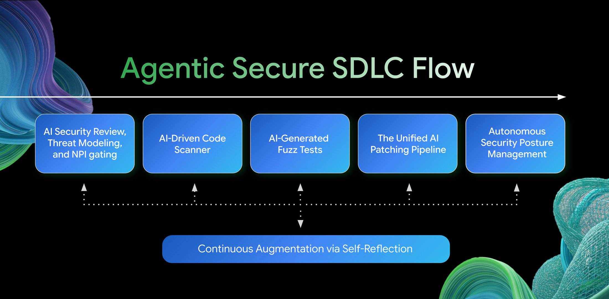
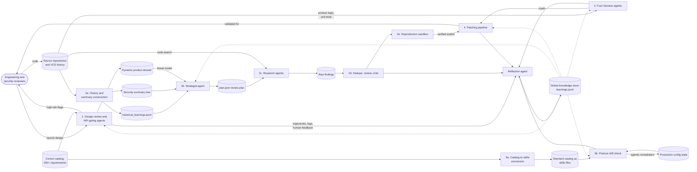

# Google Cloud Autonomous SDLC Security

**Source:** [Cloud CISO Perspectives: Our path to autonomous SDLC security (Google Cloud, 2026-06-29)](https://cloud.google.com/blog/products/identity-security/cloud-ciso-perspectives-how-google-cloud-security-uses-ai-internally) · local clip at `.raw/articles/cloud-ciso-perspectives-how-google-cloud-security-uses-ai-internally-2026-09-18.md`, banner transcription at `.raw/images/agentic-secure-sdlc-flow-2026-09-18.md`

Google Cloud CISO Chris Betz and Security Engineering senior director Ruchi Shah describe the agentic software lifecycle Google Cloud runs on its own products. Specialized agents sit at five stages, from launch review to production posture, and a reflection agent writes what each run learned into a store that later runs read. The account is first-party and carries no measurement of the system it describes.

The premise is a patch-window argument the wiki tracks elsewhere: "AI has upended the economics of exploiting vulnerabilities, effectively erasing the traditional patching window. To survive this new reality, security requires an autonomous defense." Betz and Shah present the response as automated guardrails protecting code "at a scale and speed unreachable by human teams," with a stated intention to make the same guardrails widely available.

## Five stages

### 1. Design review and launch gating

Agents replace the manual launch intake and threat-modeling bottleneck. Engineering teams route product launches through an agent-based security review pipeline, where agents cross-reference designs against a continuous control catalog of more than 200 security requirements.[^ciso] High-risk indicators are triaged automatically and flagged for human engineering intervention, and a dynamic product dossier updates in real time in place of a static threat model. The flow banner labels this stage "NPI gating" — new product introduction — where the body text says only launch intakes.

### 2. Centralized code scanning and Mantis

Google names the failure mode it built this stage to escape: naive, decentralized AI code scanning is sloppy, hallucinates bugs frequently, and yields true-positive rates under 7%.[^ciso] That figure measures the practice Google rejects, and the post gives no corresponding figure for the system that replaced it.

[[mantis|Mantis]] is the replacement, described as Google's core multi-agent orchestration framework for scalable, context-aware repository analysis. It avoids brute-force code ingestion by building a hierarchical security summary tree, condensing individual files into directory-level and root-level summaries, which Google states reduces token overhead by over 85% while preserving structural context across large repositories.[^ciso] Four roles run the pipeline: a strategist agent that reads code structure, threat models and dependency graphs to produce a prioritized plan of investigation tasks; research agents that act as domain investigators, drilling into raw source files through internal code search to examine data tracking, control flows and sanitization logic; deduplicator, reviewer and critic agents that filter noise and false positives; and a reproduction sandbox that runs AI-generated proof-of-concept exploits in an isolated, emulated environment to verify real-world exploitability before a developer is alerted.

The core skills are open source at [github.com/google/mantis](https://github.com/google/mantis), which Google frames as a demonstration of the concept, with a fuller version running internally and securing customers. [[mantis|The Mantis page]] carries the published skill roster, the sandbox options and the responsible-use constraints the repository attaches.

### 3. Self-healing fuzz testing

Code scanning supplies breadth and fuzzing reaches deep runtime defects, and Google identifies the writing and maintenance of fuzz harnesses as the engineering bottleneck in the second. An autonomous multi-agent engine removes the manual step. Context and drafting agents synthesize product logic and existing unit tests into an initial harness. Building and testing agents execute it and feed live compiler and linker errors into a hallucination-cleaner agent that repairs broken dependencies and build configurations. Quality analyzer agents watch runtime execution and adjust inputs to get past code blockers and reach deeper into stateful APIs.

### 4. The unified patching pipeline

Discovery at scale creates a remediation backlog, so discovery tools route findings straight into an autonomous remediation pipeline of four agents. A reproduce agent replicates the crash in the sandbox. A bug-context agent maps the failure execution path. A patch agent generates a targeted fix. An evaluation agent runs a regression loop that recompiles the code and executes tests to establish that the patch is safe. Google states that only fully validated fixes are submitted to a human reviewer.

That gate is the same shape as the one [[google-cloud-codemender-preview|the CodeMender preview]] describes at its remediate stage, where an [[llm-as-a-judge|LLM-as-a-judge]] check screens for functional disruption and a developer approves before commit. The evaluation agent here runs compilation and tests rather than a model judgment, which is the stronger of the two instruments on the same question.

### 5. Autonomous posture management

Post-launch integrity is maintained by what Google calls an autonomous security posture management system, abbreviating it ASPM. The abbreviation collides with the established application-security-posture reading and with [[ai-spm|AI-SPM]] on this wiki; the system described is a drift checker for production configuration. Google converts its security standard catalog into programmable skills files, and the system continuously checks production systems for configuration drift, triggering agentic remediation automatically when a violation occurs.

## Data flow

The diagram reproduces the pipeline as processes, the stores they read and write, and the flows between them. Where the post describes a store without naming it, the name is taken from the open-source Mantis skills that write the same artifact. Three edges are read across sections of the post rather than stated in one: the dossier reaching the strategist, which the post supports by having the dossier replace static threat models and the strategist read threat models; the repository reaching the fuzz agents, which the post gives as product logic and existing unit tests; and the catalog-to-skills conversion, which the post gives as a sentence in the posture stage. Authorship of the control catalog itself is out of frame, because the post names no one who writes it.

Three properties of the flow carry the design. Every discovery path converges on one remediation pipeline, so a finding from code scanning and a crash from fuzzing take the same route to a patch and the same validation before a human sees either. The repository is the single input every discovery stage draws on, read three ways: as history for past defects, as summaries for navigation, and as product logic and unit tests for harness authoring. And the knowledge store is the only element that every stage both writes to and reads from, which makes it the shared state of the whole lifecycle rather than a component of any one stage.

## Cross-cutting self-reflection

Google states the failure it built the loop to correct: stateless AI systems repeatedly fall into the same logical traps, attempting to fix bugs inefficiently and hallucinating about non-existent code. After a workflow concludes, a dedicated reflection agent analyzes execution logs, tool histories and human feedback. Successful trajectories and design patterns are written into a global knowledge store, and later agents receive that intelligence injected into their context window on start-up, which Google describes as a compounding-interest effect on its security engineering. The stated outcome is an improvement in both the vulnerability fix success rate and efficiency, with no figure attached to either.

The banner and the body disagree on when the loop runs. The body describes reflection as post-hoc, after a workflow concludes. The banner draws the spanning self-reflection box feeding all five stages, with the connector under the code-scanning stage carrying arrowheads at both ends and the other four pointing only upward into their stage. Read together, the store is written after a run and read at the start of the next, and code scanning is the one stage drawn as exchanging with it during a run.

This is the across-run counterpart to the within-run discipline the open-source field converged on. [[adversarial-reflexion|Adversarial Reflexion]] verifies a candidate finding inside the run that produced it; this store carries a completed run's lessons into runs that have not started. The mechanism is inspectable in the public repository, where a `mantis-reflect` skill writes successes, failures and false assumptions from a campaign's trajectories into `learnings.jsonl` and a `mantis-advise` skill queries that file before later code edits. What stays unpublished is the internal store's contents and any measurement of what it contributes.

## Omissions

> [!gap] One measured figure, and it belongs to the baseline
> The only quantities in the post are a control-catalog count, a token-overhead reduction, and a true-positive rate under 7% for the naive decentralized scanning Google replaced.[^ciso] None of the three measures the described system's security output. No finding count, no false-positive rate, no patch count, no fix-success rate before and after the reflection loop, and no comparison against a non-agentic baseline appears anywhere in the article as served. The efficacy statement for the reflection loop is qualitative: it "helped us to improve both the vulnerability fix success rate and efficiency." The architecture is therefore recorded as described, and every performance claim on this page stands unevidenced.

The post also leaves the internal-to-public boundary undrawn beyond one sentence. Google states the core skills are open source and a more full-fledged version runs internally, without saying which stages the public skills cover. Comparing the repository against the five stages supplies a partial answer: the published skills implement stage 2 end to end, carry patch, calibrate and reflect skills that reach stage 4 and the reflection loop, and carry a threat-model skill covering the modeling half of stage 1's banner label, while nothing in the roster corresponds to the launch gate itself, to fuzz-harness authoring, or to posture drift checking.

## Significance

The account carries weight here because of its scope. It describes one operator's whole lifecycle, and three standing positions on this wiki move against it.

**A vendor has published an end-to-end agentic SDLC.** Every other Google security artifact this wiki holds occupies one stage: Big Sleep discovers, CodeMender patches, Mantis scans. [[secure-sdlc-framework-stack-2026|The secure-SDLC framework stack]] records that no framework layer governs the coding agent as an actor in the lifecycle, and that the controls which exist are vendor-side and unstandardized. This account is the fullest vendor-side description the wiki holds of what such a stack looks like in production, and it governs agents across design, scanning, fuzzing, patching and posture. It remains one operator's internal programme rather than a framework, so the standards gap stays open and now has a concrete instance to be measured against.

**The harness-over-model argument gains a first-party design statement.** [[frontier-ai-for-vuln-discovery|The vulnerability-discovery thesis]] holds that the durable engineering sits in the harness rather than the model. Google names no model in the five-stage account and attributes its results to orchestration, summary-tree context compression, a filter chain, and a sandbox. The 7% true-positive rate it attributes to naive decentralized scanning is the same argument stated from the other end.

**The remediation bottleneck is addressed and the deployment leg is not.** [[vulnops|VulnOps]] carries the finding that the constraint has moved from discovery to verification, disclosure and patching, and Google's own March 2026 talk named redeploying auto-mended code at scale as an unsolved problem. This pipeline automates through validated fix and stops at a human reviewer. The posture-management stage does reach production, triggering agentic remediation on configuration drift, which is a narrower class than a code patch and the one place in the account where an agent changes a running system.

Google's stated destination is "immune" software development, in which applications continuously discover, validate and patch their own weaknesses in real time. [[google-cloud-codemender-preview|The CodeMender preview]], three weeks later, states the same destination as a continuous, self-healing agentic software development lifecycle. Neither post names the other's system, and [[mantis|the Mantis page]] carries the open question about how the two stacks relate.

## See also

- [[mantis|Mantis (Google)]] — the open-source framework at the centre of stage 2.
- [[google-cloud-codemender-preview|CodeMender Preview on Google Cloud]] — the managed product with the same stage shape, published three weeks later.
- [[sdlc-in-the-ai-attacker-era|SDLC in the AI-Attacker Era]] — the patch-window argument this post opens on.
- [[secure-sdlc-framework-stack-2026|Secure-SDLC Framework Stack]] — the framework layer this programme has no counterpart in.
- [[oss-ai-vuln-discovery-harness-landscape|OSS AI Vuln-Discovery Harness Landscape]] — where the published half of this stack sits.
- [[google|Google]] — the publisher.

[^ciso]: Chris Betz and Ruchi Shah, [Cloud CISO Perspectives: Our path to autonomous SDLC security](https://cloud.google.com/blog/products/identity-security/cloud-ciso-perspectives-how-google-cloud-security-uses-ai-internally), Google Cloud, 2026-06-29. The control-catalog count is the number of security requirements agents check a design against; the 85% figure is Google's stated reduction in token overhead from summary-tree construction against brute-force ingestion, with no absolute token counts given; the sub-7% true-positive rate is Google's characterization of naive, decentralized AI code scanning, the practice Mantis replaced, and is not a figure for Mantis.
