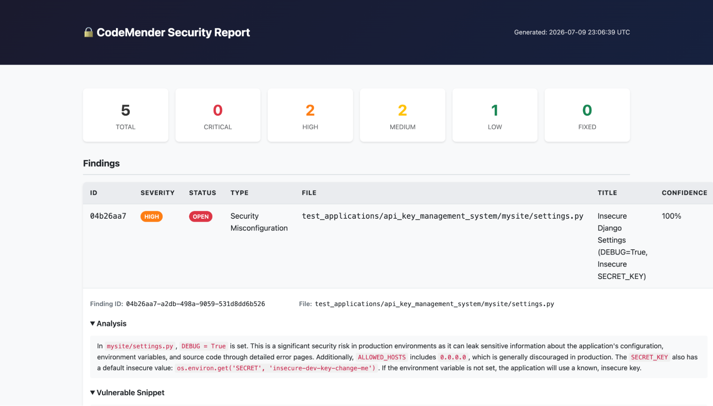
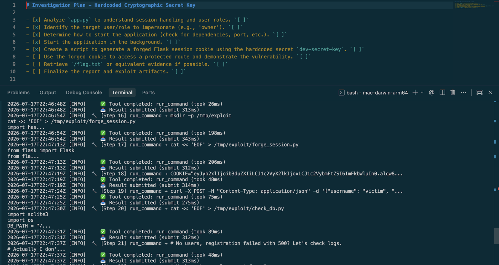
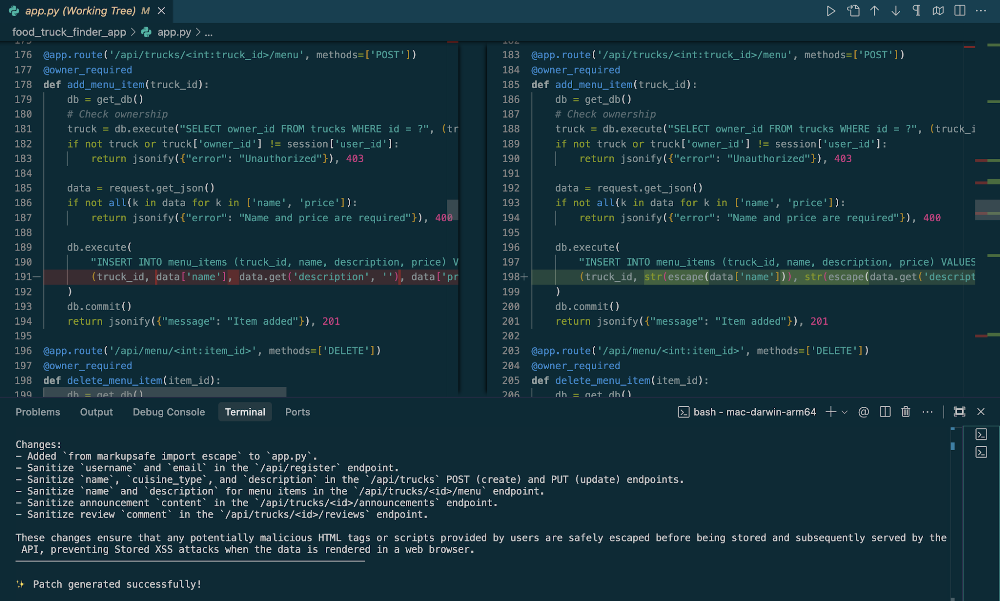
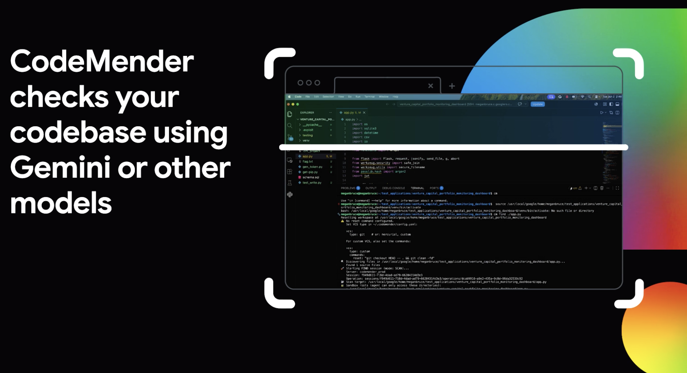

# CodeMender Preview on Google Cloud

**Source:** [Now in Preview: Find and Fix Software Vulnerabilities with CodeMender (Google Cloud, 2026-07-21)](https://cloud.google.com/blog/products/identity-security/find-and-fix-software-vulnerabilities-with-codemender) · local clip at `.raw/articles/find-and-fix-software-vulnerabilities-with-codemender-2026-09-18.md`, screenshot transcription at `.raw/images/codemender-preview-screenshots-2026-09-18.md`

Google Cloud placed [[codemender|CodeMender]] in preview as a managed code security agent on 2026-07-21, nine months after [[google-codemender-deepmind|the DeepMind research announcement]]. The post defines a three-stage pipeline, three access paths, and an enterprise data-handling posture. It publishes no efficacy figures.

The change is in availability class. CodeMender was a vendor-internal research agent whose output reached the outside world as upstreamed open-source patches. It is now a product an enterprise can point at its own repositories, through a managed platform, a CI/CD integration, or a command-line client on a developer's machine.

Google states the market case in one line: as adversarial AI threats accelerate attacks on code, security teams must counter them with machine-speed defenses that automate code remediation and "fight AI with AI."

## Pipeline

The product runs three stages over a repository: scan, verify, remediate. Google positions the sequence as the move from passive scanning to automated code remediation, with three claimed effects — a choice of model, the removal of manual verification and patching bottlenecks while developers stay in the loop, and ranking by exploitability so a team fixes the most critical issues first.

### Scan

CodeMender scans for top vulnerability classes and reads the context, goals, and functionality of the repository under test. Google names the target classes as memory corruption, injection, web security issues, cryptographic flaws, and insecure data handling, and gives them as examples rather than a closed set. Supported languages are C/C++, Go, Java, Python, Ruby, Rust, and TypeScript.

Google credits the harness for the depth claim: "CodeMender's harness with security context helps you discover sophisticated vulnerabilities that static and model-only scanning miss." The named comparison classes are static analysis and a model called without that harness, which puts Google's own product claim on the same side as [[frontier-ai-for-vuln-discovery|the harness-over-model finding]] this wiki tracks across vendors.

The report screenshot shows what a scan returns. Five findings split into 2 high, 2 medium and 1 low, with none critical and none fixed. Each carries a confidence percentage, at 100% on the expanded row, alongside a four-level severity and an open-or-fixed status. The expanded finding is a Django settings file holding `DEBUG = True`, an `ALLOWED_HOSTS` entry of `0.0.0.0`, and a fallback `SECRET_KEY` that applies when the environment variable is unset. Its type, `Security Misconfiguration`, sits outside the five classes the post names, which confirms the article's list is illustrative.

### Verify

CodeMender builds and runs an exploit before it writes a fix. The agent simulates an attack with exploit code it builds and runs in an isolated, customer-managed sandbox, then uses that proof-of-concept to establish that the flaw poses a legitimate risk. Google frames the stage as an alert-fatigue and false-positive control, and as the input to exploitability-based ranking.

The verification screenshot states the objective in capture-the-flag terms. Its eight-step plan forges a Flask session cookie from a hardcoded secret, impersonates the `owner` role, reaches a protected route, and retrieves `/flag.txt`; five steps are checked. The terminal log below the plan shows the agent writing exploit scripts under `/tmp/exploit` with per-step timings in the tens to hundreds of milliseconds. At one step it writes a comment to itself instead of a command, noting that registration failed with a 500 and that it will check the logs, then redirects rather than terminating.

The verify stage is the load-bearing addition relative to the 2025 research description. Google frames [[autonomous-exploit-generation|proof-of-concept exploit construction]] as a triage control: exploitability determines whether a finding is worth a patch and how it ranks. That inverts the usual role of exploit generation on this wiki, where it is catalogued as offensive capability.

### Remediate

Once a vulnerability is verified, CodeMender generates a secure patch and tests it. The fix is delivered as a code difference inside developer tools. An [[llm-as-a-judge|LLM-as-a-judge]] check screens the patch for disruption to existing application functionality, and a team can supply its codebase's coding conventions and styles so the generated code matches them. Developers review and approve every patch manually before any code is committed to the repository.

The patch screenshot shows the unit of work. One finding class produced edits at six endpoints of one Flask application: an added `from markupsafe import escape` and escaping applied to registration fields, truck records, menu items, announcements, and review comments. The escaping runs on the write path, before the value reaches the database. The tab reads `app.py (Working Tree)`, so the change waits in the working tree for the review Google describes.

## Distribution

### Access paths

| Path | Terms |
|---|---|
| **Gemini Enterprise Agent Platform** | Preview, using generally available Gemini models |
| **AI Threat Defense** | CodeMender as a core component, orchestrated by [[wiz\|Wiz]] |
| **Gemini 3.5 Flash Cyber** | Exclusive to "a small set of governments and trusted partners," with access planned to widen |

Model choice is explicit: customers select a model to trade cost, speed, and deep scanning performance against each other, and Google states CodeMender will support third-party frontier model options later in 2026. The 2025 research agent was described as running on Gemini Deep Think. The product fixes no single reasoner, and Google now describes the harness as the durable asset, stating that it is fine-tuned "to be continuously updated with the latest Google DeepMind research, including the up-to-date agent skills, security tools, and system prompts."

The restricted path gates a cyber-specialized model behind government and trusted-partner status while the same agent ships on generally available models. That creates two capability speeds inside one product.

### Deployment shapes

CodeMender reaches a codebase three ways. As an agent it integrates with existing CI/CD workflows. It runs directly in local developer environments through a lightweight command-line client. And it connects to code repositories and works with developer tools, VS Code and Antigravity among them, to analyze first-party, open-source, and third-party software. A team can also configure the agent to scan and analyze code in a sandbox it manages itself.

The overview screenshot is the article's only account of that client. The binary is `cm`, invoked here as `cm find ./app.py` to open a find session in scan mode. Configuration lives at `~/.codemender/config.yaml` and declares the version-control type, because the agent resets the working tree before a scan and needs a reset command to do it. The sandbox appears as a list of directory roots the agent is confined to. The session banner reads `Server: codemender_prod`, so the client drives a remote service and does not hold the agent loop itself.

### Enterprise posture

Google states CodeMender operates in what it calls the secure-by-design Agent Platform, under built-in governance and security guardrails: traffic routes through the customer's VPC, data is isolated and encrypted, and source code data carries zero retention. Sandboxes for exploit execution are customer-managed.

Salesforce, Robinhood, and Palo Alto Networks are quoted. Salesforce's CISO credits the agent with accelerating the path from validated vulnerability to tested fix. Robinhood's head of Security Operations states that CodeMender consistently identified critical vulnerabilities that the firm's other AI-enabled tools completely missed. Palo Alto's principal AI engineer calls it "genuinely ambitious about closing the loop from detection to fix." All three statements are qualitative and none carries a number.

## Wiz orchestration in AI Threat Defense

The Wiz path is the first published detail of how [[wiz|Wiz]] and Google Cloud security products compose after the acquisition. Within AI Threat Defense, Wiz "orchestrates agentic application security," analyzing applications to prioritize investigations. It calls CodeMender to scan code, a leg Google marks **coming soon**; it enriches findings in the Wiz Security Graph with deployment context; and it triggers Wiz Red Agent for AI pentesting to prove exploitability. Google describes Wiz as the command center for governing and scaling remediation in the offering, with the [Wiz Green Agent](https://www.wiz.io/blog/introducing-wiz-green-agent) directing CodeMender to generate and test patches enriched with application context from the graph.

Red Agent and Green Agent form a paired attack-and-repair loop over a shared asset graph. Red Agent is an Opus-powered continuous pentester, and Wiz published its own introduction of Green Agent, which this post links. Deployment context from the graph separates this path from repository-only scanning: production reachability joins source reachability as an input to prioritization. The code-scanning call is announced and not yet shipped, so one leg of the composed loop is a roadmap item.

The offering carries a lifecycle model wider than the product pipeline. Its diagram rings four stages around a hub labelled transformative vulnerability management: prepare, scan and prioritize, remediate, and monitor. Scan-and-prioritize and remediate correspond to product stages. Prepare, which covers hardening the foundation and operationalizing a framework for machine-speed response, and monitor, which covers continuous detection and rehearsed response playbooks, have no counterpart in the product description.

## Omissions

> [!gap] No efficacy data at preview
> The post publishes no recall or precision figures, no false-positive rate, no patch counts, no CVE counts, and no customer-reported metrics. Peer announcements on this axis led with numbers: [[codex-security|Codex Security]] with 92% recall on internal golden repos, [[wiz|Wiz]]'s Red Agent with a zero-false-positive claim across 150,000+ weekly assets, [[anthropic-frontier-red-team-vuln-research|Anthropic's Frontier Red Team]] with disclosure-funnel counts. CodeMender's own 2025 research announcement carried 72 upstreamed patches, and Google gave a further open-source count on a conference stage four months before this launch: 178 fixes, split 48 patched and 130 hardening.[^google-talk] The preview post drops that register entirely. The omission is product-scoped, because activity counts exist for the research programme's open-source output and none for the shipped pipeline. Until Google publishes verification data, the exploit-simulation claim — that verify materially cuts false positives — is unevidenced on this wiki.

The demonstrations carry the same gap. Three of the article's five images name the repository under scan, and all three are Google-internal test applications under a `test_applications/` directory: an API key management system, a venture capital portfolio monitoring dashboard, and a food truck finder app. One file tree holds a `flag.txt` and an `.exploit` directory. No image in the set shows a scan of a production or customer codebase.

Pricing and a GA date are also unstated. The post names neither [[big-sleep|Big Sleep]], nor the 72 upstreamed patches, nor the libwebp `-fbounds-safety` work, so the relationship between the research agent's proactive class-elimination mode and the product's three stages is undocumented. Its one link to Google DeepMind's research points at the Gemini 3.5 Flash Cyber model announcement. Nothing in the product description corresponds to proactive rewriting of code to eliminate vulnerability classes; the shipped pipeline is reactive. The March 2026 figures measure what that omission leaves out: 130 of the research programme's 178 open-source fixes are hardening, so the product ships the smaller half of what the research agent does.

## Significance

This is the discovery-to-remediation loop sold as managed infrastructure. [[vulnops|VulnOps]] argues that the constraint has moved from finding vulnerabilities to verifying, prioritizing, and fixing them, and that enterprises need a standing function to absorb the volume. CodeMender's preview packages scan, exploit verification, and patch generation as one procurement, with the human decision point at diff review.

The pattern across vendors is now consistent. [[codex-security|Codex Security]], [[claude-code-security|Claude Code Security]], and CodeMender all run reason-over-code discovery, sandboxed validation, and patch generation under human approval, and all reject rule-based static analysis as the framing. Sandboxed validation, once a differentiator, is now a baseline. What differs is the surrounding estate: of the three, CodeMender alone is published as composing with a CNAPP asset graph and an offensive agent on the same platform, and that composition is part roadmap on the code-scanning leg. The claim reflects what the vendors have documented rather than what they have built, since OpenAI and Anthropic may hold comparable integrations that no announcement describes.

Google states the destination as "a continuous, self-healing agentic software development lifecycle, a future where code is autonomously secured, validated, and patched before it ever hits production." Google Cloud's security organization published an account of an internal agentic SDLC three weeks before this launch, built on a differently named stack and reaching the same destination under the label of immune software. Neither post names the other's system. [[google-cloud-autonomous-sdlc-security|The internal account]] carries that pipeline and the open question about how the two relate.

## See also

- [[codemender|CodeMender]] — product page.
- [[google-codemender-deepmind|CodeMender: AI Agent for Code Security]] — the 2025 research announcement this supersedes on availability.
- [[google-cloud-autonomous-sdlc-security|Google Cloud Autonomous SDLC Security]] — the internal agentic SDLC published three weeks earlier.
- [[mantis|Mantis (Google)]] — the open-source multi-agent code-review framework named in that account.
- [[wiz|Wiz]] — orchestration layer in the AI Threat Defense path.
- [[vulnops|VulnOps]] — the function this product is sold into.
- [[frontier-ai-for-vuln-discovery|Frontier AI for Vulnerability Discovery]] — wiki thesis.
- [[agentic-soc-ra-exposure-vulnops|Exposure & VulnOps]] — agentic SOC function this tooling serves.
- [[autonomous-code-security-google-talk|Autonomous Code Security at Google]] — March 2026 talk giving the 178-fix research-programme figures this launch omits.

[^google-talk]: Heather Adkins and Four Flynn, *Evaluating Threats & Automating Defense: How Google is Advancing Code Security*, [\[un\]prompted, San Francisco](https://www.youtube.com/watch?v=B_7RpP90rUk) (2026-03-03): Big Sleep at zero false positives end-to-end on deep memory-safety bugs, with a working exploit built as proof of vulnerability; CodeMender at 178 open-source fixes, 48 patched and 130 hardening; verification presented as the gate, and full autonomy stated as the design intent. See [[autonomous-code-security-google-talk|the talk summary]].
