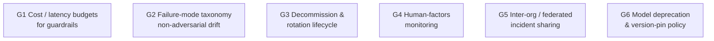
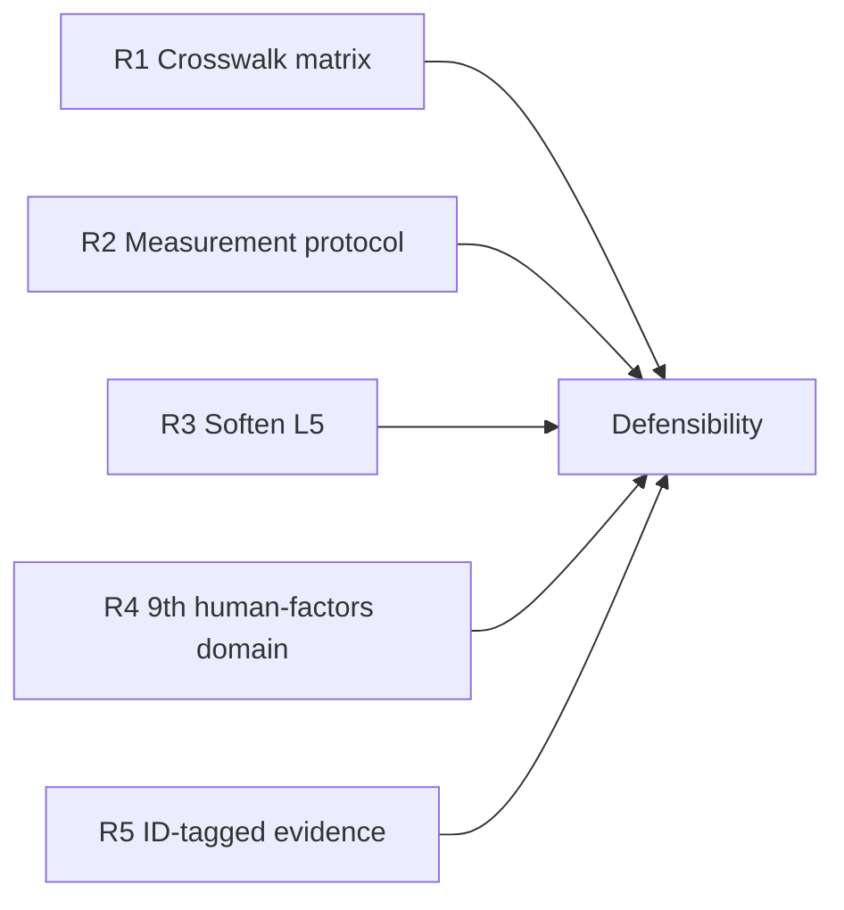

> [!stale] Historical snapshot — do not cite for current claims (demoted 2026-05-06)
> This page is a **2026-04-30 first-pass review** with a **2026-05-06 verification overlay** on §3 and §4. It is preserved for lineage but is **not the canonical source** for any current claim about the CMM or about the standards. The verification work that did happen (six parallel agents fetching primary docs, applying `[verified]` / `[verified-with-nuance]` / `[refuted → reframed]` tags) was *keyword-level evidence collection*, not clause-by-clause structural analysis. Treat surviving claims as load-bearing-pending-deeper-audit. The canonical homes for the still-load-bearing parts:
>
> | Section | Status | Canonical home for current claims |
> |---|---|---|
> | §1 Methodology | Documents the original wiki-summary-only constraint | [[standards-validation-methodology-2026-05\|Standards Validation Methodology]] is the replacement protocol |
> | §2 Per-standard verdicts | Mostly wiki-summary; three inline 2026-05-06 corrections (ATLAS / CSA ATF / EU AI Act Art. 50) | The audit backlog will produce per-standard reviews at `wiki/gaps/standards-review-<standard>-YYYY-Qn.md`; those supersede §2 fully as they land |
> | §3 Gaps no standard surfaces | Verified 2026-05-06; G2 refuted-and-reframed; G7 removed; rest verified-with-nuance | Folded into D9 "Why this domain exists" in [[agentic-ai-security-cmm-2026\|the canonical CMM]] |
> | §4 CMM exceeds standards | Verified 2026-05-06; #2 reframed (AIUC-1 B008.6 near-miss); rest verified | Folded into the new "What this CMM contributes beyond reviewed standards" appendix in [[agentic-ai-security-cmm-2026\|the canonical CMM]] |
> | §5 CMM overclaims | Three of seven addressed in CMM revisions; rest are stale or partly current | Still-valid limitations moved to [[cmm-known-limitations\|CMM Known Limitations]] (current-state living doc) |
> | §6 Recommendations | Closed; all five actioned | Outcomes live in [[agentic-ai-security-cmm-crosswalk\|crosswalk]], [[agentic-ai-security-cmm-measurement-protocol\|measurement protocol]], [[agentic-ai-security-cmm-dependency-rules\|dependency rules]], and CMM revisions |
> | §7 Verdict | Based on four blocking issues that have all been addressed; **stale** | See `[!stale]` callout on §7 itself |
> | §8 / §9 Ingest sharpenings | Closed; actioned | Already in CMM and architecture pages |
>
> Per-standard reviews will land one at a time over the coming quarters. After enough of the backlog has executed, this page can be archived entirely; for now it stays as the forensic record of how the validation work was conducted.

> [!check] All 5 recommendations addressed (2026-04-30)
> §6 recommendations have been actioned in the same session:
> 1. **Crosswalk matrix built** → [[agentic-ai-security-cmm-crosswalk|Agentic AI Security CMM — Standards Crosswalk Matrix]]
> 2. **Measurement protocol built** → [[agentic-ai-security-cmm-measurement-protocol|Agentic AI Security CMM — Measurement Protocol (Assessor's Handbook)]]
> 3. **L5 claims softened** — D2 L5, D4 L5, D6 L5, D3 L4, D5 L3, D1 L5 reframed (see CMM revision history)
> 4. **D9 Operations & Human Factors added** to the CMM as a 9th cross-cutting domain
> 5. **ID-tagged evidence** elevated to a global rule at L3+ in the CMM
>
> The CMM has moved from "well-argued proposal" toward "auditable model" per the validation §7 verdict criteria. Per-§6 status notes are inline below.

# Validation: Agentic AI Security CMM vs Widely Adopted Standards

**Superseded — navigation:** this is the 2026-04-30 first-pass snapshot. Current per-standard status lives on [[standards-review-backlog|the Standards Review Backlog]]; the method lives on [[standards-validation-methodology-2026-05|the Standards Validation Methodology]]. Per-standard reviews supersede §2 as they land. The wiki-summary-level treatment of **NIST SP 800-218A** here is superseded by [[standards-review-nist-sp-800-218a-2026-Q2|the NIST SP 800-218A Standards Review (2026-Q2)]], which works from Table 1 of the primary PDF and supplies a task-level coverage matrix across all nine CMM domains plus five falsifiable absence claims — correcting, among other things, the framework page's "three net-new tasks" count to the six tasks Table 1 tags `[Not part of SSDF 1.1]`.

An adversarial review of [[agentic-ai-security-cmm-2026|Agentic AI Security Capability Maturity Model]] against eleven widely adopted AI security standards. The brief: find what's missing, what's overclaimed, what conflicts, and what the CMM contributes beyond the standards.

## §1 Methodology

- **Inputs.** Read the CMM and the supporting [[agentic-ai-security-reference-architecture|Agentic AI Security Reference Architecture]] in full. Read the wiki summaries for each named standard. For AIUC-1 (no wiki page), pulled current spec details from the AIUC and Schellman primary sources (see Sources).
- **What counts as a gap.** A standard explicitly mandates / strongly emphasizes a control or artifact that the CMM does not name, score, or generate evidence for at any level. Conversely, a CMM gap-vs-standard means the CMM cites the standard but skips a load-bearing element of it.
- **What is overclaim.** The CMM names a specific shipping product or research artifact and assigns it a maturity level. If the product as documented does not yet ship the capability the level claims, that's an overclaim.
- **Out of scope.** The review scored the CMM's level criteria against published standards content alone, and against no production deployment. Empirical validation is a separate exercise.

## §2 Per-standard verdicts

### NIST AI RMF 1.0 + AI 600-1 GenAI Profile

> [!check] Superseded by the clause-level review (2026-06-21)
> This wiki-summary-level verdict is superseded by [[standards-review-nist-ai-rmf-2026-Q2|the NIST AI RMF Standards Review (2026-Q2)]], which works from the primary PDFs (AI 100-1, 600-1, 800-4 — now archived under `.raw/papers/`) and supplies a subcategory- and action-level coverage matrix plus seven falsifiable absence claims. The review also corrects the systematic AI 600-1 risk-category-numbering errors that had propagated into the crosswalk.

|                                        | Detail                                                                                                                                                                                                                                                                                                                                                                                                                                                                                                                                                   |
| -------------------------------------- | -------------------------------------------------------------------------------------------------------------------------------------------------------------------------------------------------------------------------------------------------------------------------------------------------------------------------------------------------------------------------------------------------------------------------------------------------------------------------------------------------------------------------------------------------------- |
| What CMM covers                        | Maps `D1` to AI RMF Govern; cites AI 600-1 prompt injection / data poisoning / model extraction implicitly through D4/D6. References NIST CAISI Concept Paper Feb 2026 in `D2` and `D5`.                                                                                                                                                                                                                                                                                                                                                                 |
| What CMM misses                        | The four functions (Govern, Map, Measure, Manage) are not used as a structural overlay. **Map** (context-and-stakeholder identification) and **Measure** (test-based assessment) are not surfaced as CMM criteria. NIST AI 800-4 (post-deployment monitoring, six categories with human factors flagged as the biggest blind spot) is not referenced anywhere — yet `D7` is the natural home. NIST IR 8605A COSAiS overlays go unmentioned even though `D1`/`D8` evidence would benefit from SP 800-53 control IDs. ([[nist-ai-rmf\|NIST AI Risk Management Framework (AI RMF)]], [[nist-ai-600-1\|NIST AI 600-1 — Generative AI Profile]]) |
| What standard misses that CMM provides | Testable evidence per level; agentic-specific identity, MCP/A2A, and AI-BOM controls — all flagged in [[nist-ai-rmf\|NIST AI Risk Management Framework (AI RMF)]] as gaps.                                                                                                                                                                                                                                                                                                                                                                                                                         |

### ISO/IEC 42001 + 42006:2025 + 27090 FDIS

> [!check] Superseded by the dedicated review (2026-06-22)
> The crosswalk gap this section flags is now addressed by [[standards-review-iso-42001-27090-2026-Q2|the 2026-Q2 ISO/IEC 42001 + 27090 review]], which maps the CMM against the public Annex A objective scheme (A.2-A.10) and corrects the crosswalk's earlier non-public numbering. That review is citation-only and paywall-bounded; its absence claims (no agentic/NHI control, no testable technical criterion, no AI-BOM, no decommission control, 27090 unpublished and guidance-only) confirm this section's findings within those bounds.

| | Detail |
|---|---|
| What CMM covers | `D1 L4` calls for AIUC-1 readiness; `D1 L5` lists ISO/IEC 42001 certified as evidence. `D2` references "ISO 27090 (FDIS Mar 2026)." |
| What CMM misses | Annex A's 38 controls are not crosswalked to CMM domains (the CMM acknowledges this gap in §"Open questions"). ISO 42006:2025 — the auditor-competence and certification-body standard — is named nowhere; this matters because the CMM proposes itself as a "self-assessment" instrument and silence on auditor competence is a real problem if levels will be audited externally. ISO 27090's 8-week ballot timeline could land mid-2026; the CMM doesn't sequence its own roadmap to that publication. ([[iso-iec-42001\|ISO/IEC 42001 — AI Management Systems]]) |
| What standard misses that CMM provides | Technical controls of any kind. ISO 42001 delegates technical security to ISO 27001, which has no AI controls — the CMM fills this with `D2`–`D7`. |

### MITRE ATLAS v5.4.0 *(current as of May 2026: v5.6.0)*

| | Detail |
|---|---|
| What CMM covers | `D4` cites ATLAS `T1612` (Adversarial AI); `D6` cites `T1565` (Data Manipulation). *[2026-05-06 correction: `T1612` and `T1565` are MITRE **ATT&CK** technique IDs (T1612 "Build Image on Host"; T1565 "Data Manipulation"), not ATLAS. ATLAS uses `AML.T####` IDs. The CMM should be re-cited against the actual ATLAS techniques it intends to anchor to — likely `AML.T0018` (Backdoor ML Model) for D4 and `AML.T0020` (Poison Training Data) for D6.]* **[2026-Q2: superseded by [[standards-review-mitre-atlas-2026-Q2\|the MITRE ATLAS review]] — verified against atlas-data v5.6.0: D4 anchors are `AML.T0051`/`AML.T0054`/`AML.T0053`, not the guessed `AML.T0018`; D6 is `AML.T0080`/`AML.T0070`/`AML.T0020`.]** |
| What CMM misses | ATLAS v5.4.0 added "Publish Poisoned AI Agent Tool" (`AML.T0104`) and "Escape to Host" (`AML.T0105`) — both load-bearing for `D8` (supply chain) and `D4` (sandbox) — and are not cited. `AML.T0080` (AI Agent Context Poisoning: Memory) was added 2025-09-30 (Microsoft documented in-the-wild exploitation Feb 2026); it is the canonical citation for `D6` and is missing. *[2026-05-06 correction: original wording said "confirmed in-the-wild Feb 2026" which conflated technique-add date with exploitation-disclosure date.]* The **OpenClaw Investigation** (7 new techniques + `CVE-2026-25253` + `AML.CS0050`) is referenced obliquely via "[[clawhavoc\|ClawHavoc — Agentic Skill Marketplace Supply Chain Attack]]" but no specific technique IDs are mapped to CMM levels. ATLAS's 35 mitigations (`M0000`–`M0034` as of v5.6.0; was 32 at v5.4.0) are not mapped against CMM domains at all. ([[mitre-atlas\|MITRE ATLAS]]) |
| What standard misses that CMM provides | Defensive control specifications; ATLAS is admittedly attack-only, mitigations are descriptive. CMM provides per-level evidence. |

### OWASP Agentic AI Top 10 (ASI) + AIVSS v0.8

> [!check] Superseded by the clause-level review (2026-Q2)
> This wiki-summary-level verdict is superseded by [[standards-review-owasp-agentic-aivss-2026-Q2|the OWASP Agentic AI Standards Review (2026-Q2)]], which reads the ASI Top 10 and the AIVSS v0.8 specification as one unit from the primary PDFs and supplies a category- and clause-level coverage matrix across the nine CMM domains.

| | Detail |
|---|---|
| What CMM covers | Most ASI categories cited explicitly across `D2`–`D8`. The reference architecture has a clean ASI→plane matrix (`ASI01`→Runtime+Control, etc.). |
| What CMM misses | **AIVSS v0.8 amplification factors** (Autonomy Level, Tool Use Scope, Multi-Agent Interactions, Non-Determinism, Self-Modification) — the CMM does not require AIVSS-scored vulnerabilities as evidence at any level, even though `D7 L4` mentions red-team eval programs. This is a clean fit at `L4` or `L5`. ASI sub-categories beyond the headlines (e.g. ASI05 sub-types like "leakage via inter-agent comms" vs "via tool output") are not differentiated. ([[owasp-agentic-ai-top-10\|OWASP Top 10 for Agentic Applications (ASI Top 10)]], [[owasp-aivss\|OWASP AI Vulnerability Scoring System (AIVSS)]]) |
| What standard misses that CMM provides | Implementation guidance for "Least Agency" (ASI's own acknowledged gap) — CMM `D3` provides four-tier implementation. AIVSS provides the score; CMM provides the program. |

### OWASP LLM Top 10 (2025)

Superseded by [[standards-review-owasp-llm-top-10-2026-Q2|the OWASP LLM Top 10 Standards Review (2026-Q2)]], which verifies all ten `LLM01:2025`-`LLM10:2025` codes against the primary source and supplies a category-level coverage matrix across the nine CMM domains plus five falsifiable absence claims.

| | Detail |
|---|---|
| What CMM covers | LLM-Top-10 risks are largely subsumed by ASI mappings in `D4` and `D6`. |
| What CMM misses | Specific LLM Top 10 IDs (e.g. `LLM01:2025` Prompt Injection; `LLM06:2025` Excessive Agency; `LLM07:2025` System Prompt Leakage; `LLM08:2025` Vector/Embedding Weaknesses) are not mapped. **System Prompt Leakage** is particularly notable because the CMM's "cognitive file integrity (SHA-256) on agent identity files (SOUL.md / IDENTITY.md / system prompts)" only protects integrity, not confidentiality — leakage is a separate threat the CMM is silent on. ([[owasp-llm-top-10\|OWASP Top 10 for LLM Applications]]) |
| What standard misses that CMM provides | Agentic categories `ASI07/08/10` that LLM Top 10 doesn't cover; identity/egress as their own domains. |

### Google SAIF / CoSAI

> [!check] Superseded by the 2026-Q2 deep review
> The SAIF/CoSAI rows below were the 2026-04-30 keyword-level pass. [[standards-review-saif-cosai-2026-Q2|The Google SAIF and CoSAI standards review (2026-06-22)]] supersedes them with a clause-level matrix: it verified the SAIF taxonomy (15 risks / 24 controls / 14 components), corrected the CoSAI workstream names and deliverable dates (MCP Security 2026-01-20; Agentic Identity and Access Management 2026-04-17; AI Incident Response Framework 2025-10-30), and flagged the "40 threats / 12 categories" MCP figure as not re-verifiable. Treat that review as authoritative where the dates or figures differ from this table.

| | Detail |
|---|---|
| What CMM covers | `D4` references Google ADK lifecycle hooks; `D5` cites the CoSAI MCP Security white paper (Jan 2026, "12 categories / 40 threats"); `D8` cites SLSA-based provenance ideas. |
| What CMM misses | The CoSAI **AI Incident Response Framework v1.0** (continuously updated) is not invoked at any level — yet `L2` ("AI-specific incident response playbook documented") and `L3` are exactly where it belongs. CoSAI's "Workstream 4 Secure Design Patterns for Agentic Systems" and **Project CodeGuard** are unreferenced. SAIF/A2A's "opacity principle" appears in the architecture doc but is not a CMM evidence item. ([[google-saif\|Google SAIF — Secure AI Framework]], [[cosai\|CoSAI — Coalition for Secure AI]]) |
| What standard misses that CMM provides | Maturity-graded enforcement. CoSAI explicitly admits its outputs are "principled guidance rather than enforceable specifications." |

### Microsoft ZT4AI / RAI / Agent 365

> [!check] Superseded by two dedicated reviews (2026-Q2)
> The control catalogue is reviewed in [[standards-review-microsoft-zt4ai-2026-Q2|the 2026-Q2 ZT4AI review]]; the goals standard and the management plane are reviewed in [[standards-review-microsoft-rai-agent-365-2026-Q2|the 2026-Q2 RAI / Agent 365 review]]. The key correction this row carried — that RAI is "the most control-rich AI security framework available" — is wrong on two counts: the 700+-control figure is the whole Zero-Trust Workshop (not even the AI pillar), and the [[microsoft-rai|RAI Standard]] is a responsible-AI **goals** standard (seventeen goals), not a control catalogue at all. RAI grounds D1 at the goal level; the controls are ZT4AI's; [[microsoft-entra-agent-id|Agent 365]] is the management plane over them.

|                                        | Detail                                                                                                                                                                                                                                                                                                                                                                                                                                              |
| -------------------------------------- | --------------------------------------------------------------------------------------------------------------------------------------------------------------------------------------------------------------------------------------------------------------------------------------------------------------------------------------------------------------------------------------------------------------------------------------------------- |
| What CMM covers                        | `D2 L5` references "Microsoft Agent 365 Registry"; `D7 L5` cites "Sentinel + Defender for Cloud Apps"; `D4` references Microsoft Prompt Shields. **FIDES** (zero successful PI on AgentDojo) is referenced via [[microsoft-rai\|Microsoft Responsible AI Standard (RAI)]] in the practitioner table but not as a CMM evidence target.                                                                                                                                                        |
| What CMM misses                        | **ZT4AI's 700+ controls in 116 logical groups across 33 swim lanes** is the most control-rich AI security framework available — the CMM does not crosswalk a single ZT4AI control. This is a missed concreteness opportunity, especially at `L4`/`L5`. The three Zero Trust pillars ("verify explicitly / least privilege / assume breach") could ground the CMM's `D2`/`D3` criteria. *[2026-05-26 correction → addressed by [[standards-review-microsoft-zt4ai-2026-Q2\|ZT4AI review (2026-Q2)]]: the "700 / 116 groups / 33 swim lanes" figure is stated in the Microsoft Security Blog for the **entire Zero Trust Workshop 3.0 (all seven pillars)**, not for the AI pillar; third-party write-ups conflated it with the AI pillar, so ZT4AI is not "the most control-rich AI framework" on that basis. The grounding ask is met in the review with a named, deep-linked control crosswalk across all nine CMM domains and the six RA planes — per-agent Entra Agent ID, the three access patterns, attribute/blueprint Conditional Access, ID Protection auto-remediation, least-action design, the Agent Governance Toolkit PDP, Purview answer-time entitlement, Content Safety / Defender runtime guardrails, the APIM AI Gateway, and Sentinel/Defender agentic-SOC detection. The crosswalk validated the CMM recalibration.]* ([[microsoft-rai\|Microsoft Responsible AI Standard (RAI)]]) |
| What standard misses that CMM provides | Vendor-neutral framing. ZT4AI is acknowledged as Azure-ecosystem-locked.                                                                                                                                                                                                                                                                                                                                                                            |

### CSA MAESTRO + Agentic Trust Framework

| | Detail |
|---|---|
| What CMM covers | `D3 L4` invokes "CSA ATF five-stage promotion gates implemented (autonomy levels 0–4 with documented promotion criteria)." The reference architecture cites MAESTRO Layer 4–5 in `D5`. *[2026-05-06 correction: per the open-spec `massivescale-ai/agentic-trust-framework` v0.9.1 + Feb 2 2026 announcement, ATF has **four maturity levels** (Intern / Junior / Senior / Principal — Observe+Report / Recommend+Approve / Act+Notify / Autonomous), not five. The "autonomy levels 0–4" framing in the CMM may stem from a different revision or a conflation with a separate CSA spec — needs primary-source recheck on the CMM side.]* |
| What CMM misses | *[2026-05-06 correction: original claim that ATF gates have "known under-specified implementation criteria" is **partially refuted**. The ATF v0.9.1 promotion criteria are reasonably concrete: minimum time at level (2–8 weeks), accuracy thresholds (>95% Junior, >99% Senior/Principal), availability targets (>99% to >99.9%), named security validations (vulnerability assessment, pen test, adversarial testing), named sign-off matrix (Technical Owner / Security / Business / Risk Committee). The technical-prerequisite layer at Principal (e.g. "hardware-bound identity," "policy-as-code enforcement") remains abstract enough that organizations need to fill in some details, but `D3 L4` is more checkable than this section originally implied.]* The **CSAI Foundation AI Risk Observatory** and **AI Controls Matrix expansion** (multi-standard crosswalk to ISO 42001 + ISO 27001 + SOC 2) — both March 23, 2026 — could power CMM `D1` and are unreferenced. ([[csa-maestro\|CSA MAESTRO / CSA Agentic Trust Framework]]) |
| What standard misses that CMM provides | Memory poisoning and supply chain controls: CSA ATF has *no* coverage of `ASI04` and `ASI06`. CMM's `D6` and `D8` fill the hole. |

### EU AI Act

> [!check] Superseded by the 2026-Q2 EU AI Act standards review
> The full clause-level review — [[standards-review-eu-ai-act-2026-Q2|EU AI Act Standards Review (2026-Q2)]] — supersedes this first-pass row. It verifies every article and Annex IV point against the primary source, corrects the crosswalk's Annex IV item map (cybersecurity is point 2(h), risk management is point 5 / Art. 9, lifecycle changes is point 6), and confirms the Act is outcome-stated risk-management and conformity-assessment law, not an agentic technical-control standard.

| | Detail |
|---|---|
| What CMM covers | `D1` maps to "EU AI Act Art. 9 risk management"; `D8` to "Art. 11/Annex IV." `D1 L5` accepts ISO/IEC 42001 cert as evidence. |
| What CMM misses | **Article 12** (logging/record-keeping) is the natural EU AI Act anchor for `D7` and is not cited there. **Article 14** (human oversight) is the anchor for `D3` HITL/least-agency and is not cited. **Article 50** is broader than "GPAI transparency" *[2026-05-06 correction: original framing was wrong]* — it covers (1) any AI system interacting with natural persons (Art. 50(1)), (2) providers of synthetic-content generators **including general-purpose AI systems** (Art. 50(2)), (3) deployers of emotion-recognition / biometric-categorisation / deepfakes (Art. 50(3)–(4)). The GPAI-specific transparency regime is in Articles 53–55, not 50. *[2026-05-06 correction: original claim that Art. 50 "applies regardless of Digital Omnibus delay" is wrong for legacy systems. The pending Digital Omnibus would delay Art. 50(2) marking obligations for systems placed on the market **before 2 Aug 2026** until **2 Feb 2027**; new placements on/after 2 Aug 2026 still fall under Art. 50 from that date.]* The CMM does not surface that **only 8 of 27 EU Member States** are ready for enforcement — material to a CISO planning rollout. The **Digital Omnibus delay risk** is unflagged; an organization following the CMM `Phase 4 (18+ mo)` timeline may hit the deadline either way and the CMM should hedge. The CMM acknowledges the Annex IV crosswalk gap explicitly in §"Open questions." ([[eu-ai-act\|EU AI Act]]) |
| What standard misses that CMM provides | Technical and runtime controls. EU AI Act is process- and documentation-heavy; it does not specify any of `D2`–`D7`. |

### AIUC-1 (per AIUC + Schellman, Q2 2026 update)

|                                        | Detail                                                                                                                                                                                                                                                                                                                                                                                                                                                                                                                                                                                                                                                                                                                                                 |
| -------------------------------------- | ------------------------------------------------------------------------------------------------------------------------------------------------------------------------------------------------------------------------------------------------------------------------------------------------------------------------------------------------------------------------------------------------------------------------------------------------------------------------------------------------------------------------------------------------------------------------------------------------------------------------------------------------------------------------------------------------------------------------------------------------------ |
| What CMM covers                        | `D1 L4` requires "AIUC-1 readiness assessment complete"; `D1 L5` requires "AIUC-1 certified." Cites Schellman accreditation Feb 2026. The CMM positions AIUC-1 alongside ISO 42001 as a certification target.                                                                                                                                                                                                                                                                                                                                                                                                                                                                                                                                          |
| What CMM misses                        | [[aiuc-1\|AIUC-1]]'s six pillars (Data & Privacy, Security, Safety, Reliability, Accountability, Society) and its "50+ technical, operational and legal safeguards" do not map to the CMM's eight domains anywhere — there's no crosswalk. AIUC-1's quarterly refresh cadence (Q2 2026 update focused on MCP security, third-party risk management, agent identity and permissions per AIUC's own statements) means the CMM's `L5` "AIUC-1 certified" is a *moving target*. The CMM treats AIUC-1 as binary; in practice each quarterly drop changes what certification means. AIUC-1's "Society" pillar (catastrophic-misuse / national security) has **no analogue anywhere in the CMM** — the CMM is silent on misuse externalities. (See Sources.) |
| What standard misses that CMM provides | AIUC-1's gaps per its own published material include MCP/A2A specifics, AI-BOM, sandboxing, autonomy tiers, observability — all directly addressed by the CMM. The CMM is more technically opinionated than AIUC-1.                                                                                                                                                                                                                                                                                                                                                                                                                                                                                                                                    |

## §3 Gaps in the CMM that no standard surfaces

Genuinely uncovered ground — none of the eleven standards demands these either, but a credible agentic-AI CMM should. Each item carries a verification tag: **[verified]** = primary source confirms · **[verified-with-nuance]** = standard touches the area generically but does not specify the agentic-specific control · **[refuted]** = primary source contradicts; reframed below · **[wiki-summary]** = only checked against summary, not primary.

1. **[verified-with-nuance] Guardrail cost / latency budgets.** The CMM stacks LlamaFirewall + AlignmentCheck + CodeShield + grounding classifier + PDP + sandbox + AgentGateway. No reviewed AI standard names guardrail-specific latency or cost budgets or fail-closed measurement. NIST AI 800-4 "Operational Monitoring" covers infrastructure resource consumption generically; ISO 42001 A.6.2.6 covers AI system operation/monitoring generically; CoSAI MCP Security §MCP-T10 names "Denial of Wallet" / resource exhaustion as a *threat* without a control. None operationalize a per-guardrail latency / cost SLA. Production agents will have one or both fail; "fail-closed" is in the architecture but not measured.
2. **[refuted → reframed] Non-adversarial drift, hallucination-rate, and capability regression as level-gated metrics.** *Original claim ("no standard mandates measurement of benign drift over time") is wrong.* NIST AI RMF MEASURE explicitly addresses "data drift, model drift, distributional shift, performance degradation thresholds." NIST AI 800-4 "Functionality Monitoring" is defined as "confirming that the AI continues to perform its intended tasks reliably, including detecting performance degradation or concept drift over time." CSA Agentic Profile of AI RMF defines AG-MG.2 "behavioral drift." ISO 42001 A.6.2.6 plausibly subsumes drift under "operation and monitoring." AIUC-1 D002/D004 require quarterly third-party point-in-time hallucination/tool-call evaluation. **The reframed gap:** standards mandate non-adversarial drift monitoring *in principle*, but none operationalize **hallucination-rate-over-time as a continuously-tracked metric with a level-gated threshold and cadence**. The CMM has the same gap — `D7 L4` mentions Azure Groundedness Detection but does not require continuous drift-as-time-series.
3. **[verified-with-nuance] Agent decommission / rotation lifecycle.** NIST AI RMF GOVERN 1.7 covers AI system decommissioning in principle ("Processes and procedures are in place for decommissioning and phasing out AI systems safely"). CSA Agentic Profile extends this to credential revocation, persistent-memory disposition, downstream-dependency assessment, audit-log retention. ISO 42001 Annex A has no retirement/decommission control (A.6.2.x stops at .8 event logs). **The agentic-specific gap is intact**: no AI standard specifies *rotation cadence*, *orphaned-agent reaper SLAs*, or *post-incident kill-switch drill frequency*. The CMM has no level criterion for these either.
4. **[verified — attribution corrected] Human-factors monitoring.** NIST AI 800-4 (Mar 2026) names "Human Factors Monitoring" as one of six post-deployment categories and notes the literature on human-AI feedback loops is sparse. *The "biggest blind spot" framing is third-party commentary (Clearwater 2026), not a direct NIST quote — original wording corrected.* The CMM has no level that addresses HITL-fatigue, approval rubber-stamping, or false-positive burnout — all leading indicators of `D3` collapse. (NIST AI 800-4 names the *category* but does not specify HITL-fatigue metrics or rubber-stamp-rate thresholds either.)
5. **[verified-with-nuance] Federated incident sharing / disclosure.** CoSAI AI Incident Response Framework v1.0 §3.5.2 ("Information Sharing with Community") explicitly endorses sector-based ISAC reporting, FIRST coordinated vulnerability disclosure, OASIS STIX 2.1, and OpenCTI for cross-org sharing — and frames information sharing as "one of defenders' greatest advantages." Language is descriptive/recommended, not mandatory. **The agentic-specific gap is intact**: no AI standard *requires* participation in any cross-org sharing community at any maturity level (no CoSAI-run sharing program exists). The CMM has the same shape — `D8 L4` mentions ML-VEX equivalent for disclosure but does not require participation.
6. **[verified] Model deprecation and version-pin policy.** Confirmed against NIST AI RMF / 600-1 / 800-4, CSA Agentic Profile, ISO 42001 Annex A, and MITRE ATLAS v5.6.0 (full `techniques.yaml` + `mitigations.yaml` searched for "deprecat / version pin / end-of-support / end-of-life / stale model / outdated model" — zero hits). ATLAS supply-chain coverage is upstream (T0010 sub-techniques, T0109 Rug Pull, T0111 Reputation Inflation; M0005/M0013/M0014/M0023/M0025) — all about acquisition/provenance, none about post-deployment lifecycle of an in-use model version. `D8` covers AI-BOM but not the lifecycle of a model becoming end-of-support, or pinning vs floating in production. This is a real-world [[clawhavoc|ClawHavoc — Agentic Skill Marketplace Supply Chain Attack]]-style attack vector.

> [!info] Removed: G7 system-prompt confidentiality
> Previously listed here as a gap "no standard surfaces." This was incorrect — `OWASP LLM07:2025` (System Prompt Leakage) explicitly covers it, as already noted in §2's OWASP LLM Top 10 row. Reclassified as a CMM gap that OWASP *does* surface; tracked in §2, not §3.

## §4 Areas where the CMM exceeds standards

Where the CMM is in front of where the major standards are today. Tags as in §3.

1. **[wiki-summary] Cross-domain aggregation discipline (dependency-resolved effective scores).** No reviewed AI security standard enforces cross-domain aggregation. CMMC 2.0 uses cumulative levels; the CMM imports the discipline but uses **dependency-resolved effective scores** ([[agentic-ai-security-cmm-dependency-rules|dependency-rules page]], v1 = 3 conservative caps: D2→D5, D2→D7, D3→D4) rather than a single floor — captures cross-domain attack-path failures (e.g. weak D2 caps D5 because per-agent egress can't be enforced without per-agent identity) without punishing strategic trade-offs (e.g. D9 ops lag does not undermine D2 identity). Prevents the "L4 in governance, L1 in egress" cherry-picking that plagues self-assessments.
2. **[refuted → reframed] Cognitive File Integrity (CFI) as a primitive scoped to system prompts and identity files.** *Original claim ("none name this control") is too strong.* AIUC-1 B008.6 ("Protect AI system deployment environment") explicitly mandates "cryptographic checksums or signed artifacts to detect tampering" and "verifying model integrity before and during deployment" — but scoped to **model artifacts**, not system prompts or identity files. MITRE ATLAS has integrity-adjacent mitigations: M0013 "Code Signing" (binary + AIBOM components), M0014 "Verify AI Artifacts" (checksums of datasets, models, software dependencies), M0031 "Memory Hardening" (semantic integrity checks) — none names system prompts, `SOUL.md`/`IDENTITY.md`, or agent config files as the artifacts to hash. AML.T0081 "Modify AI Agent Configuration" describes the attack with no integrity-hash mitigation. NIST AI RMF / AI 600-1 / IR 8605A: not named. ISO 42001 Annex A: not named. CSA ATF and Google SAIF: not named. **The reframed novelty:** *the CMM's specific scoping — SHA-256 of system prompts and identity files (`SOUL.md` / `IDENTITY.md`) at `D6 L3+`* — is unnamed in any reviewed standard. AIUC-1 B008.6 is the closest; it covers model-artifact integrity but not the prompt/identity-file surface.
3. **[verified] Credential proxy at `D2 L4` as a hard line.** Calling out "zero credentials in context" with named tools (AgentKeys / Keychains.dev / Aegis) is sharper than any standard. CoSAI MCP Security recommends token exchange / "do not pass through OAuth tokens" as a principle; CoSAI Agentic IAM and Google SAIF discuss credential management and identity propagation as flat principles — none gate credential proxy by maturity tier. CSA ATF Senior level mentions "Access credentials within scope" but does not specify a credential-proxy mechanism.
4. **[verified] Lethal Trifecta as a structural test.** `D3 L4` "lethal-trifecta breaker active" makes Simon Willison's structural argument auditable. Verbatim search across CoSAI MCP Security, CoSAI Principles for Secure-by-Design Agentic Systems, CoSAI Agentic IAM, CoSAI AI Incident Response Framework v1.0, Google SAIF (incl. Focus on Agents), AIUC-1, and CSA ATF — zero hits for "trifecta" or any structural naming. SAIF Focus on Agents *describes* the chain in prose ("an agent can leak information by creating and sharing a document, writing an email, opening a website and leaking information in the URL") under Rogue Actions framing, but does not name a structural pattern. CoSAI MCP Security §MCP-T5 covers data exfiltration as a consequence without the trifecta framing. No standard names the trifecta.
5. **[verified] Real-time AI-BOM at `L5`** (Miggo DeepTracing). CycloneDX 1.6 schema treats `machine-learning-model` as a static component type — no runtime reconciliation, attestation, or deployed-vs-manifested verification fields (only build-time `hashes`, `licenses`, `purl`, `externalReferences`, `properties`). EU AI Act Annex IV item 9 requires only "a detailed description of the system in place to evaluate the AI system performance in the post-market phase in accordance with Article 72" — i.e., documentation OF a monitoring plan, not the runtime reconciliation itself. Annex IV is a build-time pre-market documentation deliverable; the runtime obligation lives in Article 72 (post-market monitoring) and Article 12 (logs), neither of which mandates AI-BOM-vs-deployed reconciliation. Only the CMM treats runtime AI-BOM reconciliation as a graded capability.
6. **[wiki-summary] CaMeL / privileged-quarantined LLM split** at `D4 L5+`. Research-stage in standards-land ([[google-saif|Google SAIF — Secure AI Framework]]); CMM names it as a leading-edge target.
7. **[verified] Multi-agent cascade detection** at `D7 L5+`. The cascade-detection rule library is research-stage and lives at L5+ as a leading-edge target. MITRE ATLAS v5.6.0 cross-check confirms zero matches for "multi-agent / agent-to-agent / A2A / inter-agent / cascade / sub-agent" across `techniques.yaml` and `mitigations.yaml`. AML.T0108 "AI Agent" and AML.T0103 "Deploy AI Agent" exist but treat the agent as a single Persona-actor, not as a member of an inter-agent graph. [[csa-maestro|CSA MAESTRO / CSA Agentic Trust Framework]] has only partial coverage. The CMM names the gap and points at how a future standard would close it.

## §5 Risks and overclaims in the CMM

Where the CMM may be promising more than the named tools/products actually deliver.

1. **`D5 L3`: "AgentGateway / Solo Enterprise / equivalent MCP+A2A+LLM gateway between agent and tools."** AgentGateway moved to LF in July 2025 and is "Mature (OSS)" per the architecture, but the *combined* MCP+A2A+LLM proxy with all three protocols enforced uniformly is not yet a settled spec. The [[a2a-protocol|A2A v1.0.0 spec]] (LF-governed since June 2025) covers transport (§7) and Agent Card signing (§8.4) but not message-level integrity, replay protection, or cryptographic agent identity — these remain vendor-side ([[multi-agent-runtime-security|Oktsec-class enforcement]]) or proposal-side ([Issue #1575](https://github.com/a2aproject/A2A/issues/1575)). Treating this as `L3` (org-wide standard) is aggressive without an org-authored A2A enforcement profile.
2. **`D3 L4`: "CSA ATF five-stage promotion gates implemented (autonomy levels 0–4 with documented promotion criteria)."** Per [[csa-maestro|CSA MAESTRO / CSA Agentic Trust Framework]], "Specific implementation criteria for each gate are not yet fully specified in published guidance." The CMM is making organizations build the rubric CSA didn't publish, then auditing them against it. That's a `L4` evidence item with no standard to anchor against.
3. **`D4 L5`: "Proof-of-Guardrail TEE attestation (AWS Nitro Enclaves) for high-risk tiers."** [[agentic-ai-security-reference-architecture|Agentic AI Security Reference Architecture]] lists this as "Research-stage." Calling it `L5` is consistent with "leading-edge" but auditors evaluating "TEE attestation chain" will find no standard chain-of-custody schema to evaluate against.
4. **`D6 L5`: "provably bounded poisoning rate (e.g., <0.001% threshold per Nature Medicine 2024)."** A medical-imaging study's empirical threshold is not a transferable assurance bound for arbitrary RAG corpora. Citing it as a CMM evidence target risks codifying a number that doesn't generalize.
5. **`D2 L5`: "Microsoft Agent 365 Registry or equivalent unified governance."** Agent 365 GA is May 1, 2026; the CMM was authored April 30, 2026. There is no shipping deployment evidence yet. "Or equivalent" softens this, but no other product offers the documented Agent 365 capability set, so "equivalent" is currently undefined.
6. **`D1 L5`: "AIUC-1 certified."** AIUC-1 updates quarterly. A `L5` claim is implicitly a "currently certified against the most recent quarterly refresh" claim, which the CMM doesn't articulate. Schellman is currently the only accredited auditor — single-auditor capacity is a real gating constraint.
7. **`D7 L4`: "Quarterly red-team eval (Promptfoo / Mindgard CART / PyRIT / Garak)."** These four tools have very different scopes (Promptfoo: regression; PyRIT: orchestration; Garak: probe library; Mindgard: commercial CART). Treating them as interchangeable understates the work; an organization running only Garak will look like it satisfies `L4` but will miss agentic-orchestration attacks that PyRIT covers.

## §6 Top 5 prioritized recommendations

Ranked by leverage on defensibility.

1. **Build the standards-crosswalk matrix the CMM already promises.** Open-questions §1 and §2 admit the lack of an Annex IV / AIUC-1 / ISO 42001 control map. Until this exists, `D1 L4`/`L5` and `D8 L5` are unfalsifiable. A control-by-control matrix (CMM domain × Annex IV item × AIUC-1 safeguard × ISO 42001 Annex A control × NIST SP 800-53 ID via IR 8605A) is the single highest-leverage addition.
2. **Add measurement protocol artifacts.** `Open questions §1` admits "the assessment instrument itself … is not yet built." Without an interview script + artifact checklist + scoring rubric, two auditors will reach different verdicts on the same organization. Borrow the BSIMM observation/assertion model or CMMC 2.0's three-level assessment guides.
3. **Soften L5 claims that depend on shipping-this-quarter products.** Specifically: `D2 L5` (Agent 365 GA May 1), `D4 L5` (Proof-of-Guardrail TEE, research-stage), `D6 L5` (provably bounded poisoning rate). Either reframe as "documented program toward" or move to a `L5+` "leading edge" tier separate from the audit ladder.
4. **Add a 9th cross-cutting domain or sub-domain for human factors and program operations** (HITL fatigue, decommission drills, latency/cost budgets, federated disclosure participation, model deprecation policy). These are §3 gaps no standard covers but a real CISO will need.
5. **Make ASI / AIVSS / ATLAS technique IDs first-class evidence.** Each level should require evidence tagged with specific `ASI##` + `AIVSS` score + `AML.T####` IDs. This is the difference between a CMM that maps to standards and one that *operates on* them. It also makes the CMM machine-checkable downstream.

## §7 Verdict

> [!stale] Verdict from 2026-04-30 snapshot — all four blocking issues have been actioned; do not cite as current
> The four issues this verdict cited as blocking defensibility have all been addressed:
> 1. **Crosswalk matrix** — built; lives at [[agentic-ai-security-cmm-crosswalk|Agentic AI Security CMM — Standards Crosswalk Matrix]].
> 2. **Scoring rubric / assessor protocol** — built; lives at [[agentic-ai-security-cmm-measurement-protocol|Agentic AI Security CMM — Measurement Protocol (Assessor's Handbook)]].
> 3. **L5 forward-bet criteria** — addressed via the L5/L5+ split filed in [[cmm-calibration-stress-test-2026|CMM Calibration Stress Test (2026-05-02)]] and adopted in the canonical CMM revision; L5 is now achievable with shipping products, research-stage capabilities live at L5+.
> 4. **CSA ATF gates** — partially: the 2026-05-06 verification pass found ATF v0.9.1 promotion criteria are reasonably concrete (minimum time, accuracy thresholds, named validations, sign-off matrix), only the Principal-tier technical primitives remain abstract enough to need org-authored rubric. The CMM's `D3 L4` clause was rewritten 2026-05-06 to reflect this. The "CSA hasn't specified the gates" framing in the original verdict is wrong.
>
> The current CMM's actual remaining limitations live in [[cmm-known-limitations|CMM Known Limitations]]. Treat that page as the current-state replacement for this §7.

Defensible **as a draft** — not yet defensible **as an audit instrument**. The CMM correctly identifies the agentic-specific surface that broader frameworks ([[nist-ai-rmf|NIST AI Risk Management Framework (AI RMF)]], [[iso-iec-42001|ISO/IEC 42001 — AI Management Systems]], [[microsoft-rai|Microsoft Responsible AI Standard (RAI)]]) miss, imports the right design lessons from CMMC and CMMI, and is uniquely concrete on cognitive file integrity, credential proxy, lethal-trifecta breakers, and runtime AI-BOM. But four issues block defensibility today: (1) no crosswalk matrix to the standards it cites, even though the author flags this in `Open questions`; (2) no scoring rubric or assessor protocol — two auditors will diverge; (3) several `L5` criteria depend on products and research artifacts that ship in May 2026 or later, making the top tier a forward bet rather than an audited state; (4) it imports CSA ATF gates that CSA itself has not yet specified. Closing items 1–4 would move the CMM from "well-argued proposal" to "auditable model" and would make it a serious contender to slot in alongside (not under) AIUC-1 and ISO 42001 in 2026 enterprise AI security programs.

## §8 Knostic ingest sharpenings (2026-04-30, post-validation)

After the original 5 §6 recommendations were applied, the [[ai-coding-agent-governance|Knostic coding-agent governance post]] was ingested as a gap-check. It surfaced 5 additional sharpenings that have all been applied to the CMM and architecture:

1. **Foundational governance ≠ security distinction.** New section in CMM intro making explicit that the CMM measures *both* security (preventing harm) and governance (defining authority and accountability) and that they are not interchangeable.
2. **Decision-rights matrix as D1 L3 evidence.** D1 L3 now requires a documented [[decision-rights|Decision Rights for AI Agents]] matrix per agent type (action class × decision right × approver × justification × time bound). Concept page introduced.
3. **Sample audit log schema at D7 L3.** D7 L3 now requires `{timestamp, agent_id, user_id, action_type, resource_path, approval_status, rollback_ref}` as the minimum action-log schema, with `rollback_ref` mandatory.
4. **Time-bounded elevation + segregation of duties at D3 L4.** D3 L4 now requires JIT elevation scoped to maintenance window or single approval, auto-reverting at expiry; SoD between proposing / approving / deploying agents enforced.
5. **Coding-agent archetype evidence rubric.** Deployment-shape table sharpened for the generative-coding-tool row: agent rules-file integrity (extending CFI to `.cursorrules` / Copilot Workspace rules), IDE extension provenance, typosquat / dependency-hijack defense, destructive-action classification. Architecture's coding-tool row updated to match.

This closes Open-question item #1 ("agent-archetype tailoring") for the coding-agent archetype specifically. Other archetypes (data-science copilot, multi-agent mesh, MCP-server-as-provider) remain open.

## §9 Oasis NHI ingest sharpenings (2026-04-30, post-Knostic)

After the Knostic ingest closed five sharpenings, [[what-are-non-human-identities|Oasis Security's "What Are Non-Human Identities?"]] was ingested as a second gap-check focused on the identity / NHI plane. It surfaced 5 additional sharpenings, all applied:

1. **Identity-credential coupling** as a load-bearing concept the wiki had not named. New page [[identity-credential-coupling|Identity-Credential Coupling]]. The credential proxy pattern cannot help where the credential IS the identity (SAS tokens, storage access keys, PATs); these workflows must rotate-as-identity-rotation.
2. **NHI lifecycle bound to code-deploy pipeline, not HR joiner/mover/leaver** as **D2 L3** evidence. Closes the structural reason legacy IAM/PAM fail for NHIs at scale.
3. **Coupled-credential migration plan** as **D2 L4** evidence. Organizations must have a documented plan to replace SAS tokens / storage access keys with decoupled alternatives (managed identities, role-based access).
4. **Per-credential dependency map** as **D9 L4** evidence — required before automated rotation can be enabled. Without it, rotation breaks production workflows. Direct Oasis quote: "Where rotation is operationally risky, invest in dependency mapping to understand what will break before making changes."
5. **NHI taxonomy enrichment + scale evidence triangulation** in [[non-human-identity|Non-Human Identity (NHI)]] — eleven types enumerated with rotation profile, three breach incidents added (Microsoft SAS / 38TB; CircleCI OAuth; Mercedes-Benz service accounts), scale data triangulated (CyberArk 82:1 + Rubrik 45:1 + arxiv 50K→250K).

This sharpens the **Identity & Authorization** plane of the architecture and the **D2 + D9** axes of the CMM. No new domain or plane needed — the Oasis content fits cleanly into the existing structure.

## Sources

- [AIUC-1 — World's first AI agent standard](https://www.aiuc-1.com/) — six pillars, quarterly update cadence, Q2-2026 focus on MCP / third-party risk / agent identity.
- [Schellman: What Is AIUC-1?](https://www.schellman.com/blog/ai-services/what-is-aiuc-1) — six control domains, 4–8 week assessment, Schellman as first accredited auditor.
- [Schellman becomes first accredited AIUC-1 auditor (Feb 3, 2026)](https://www.globenewswire.com/news-release/2026/02/03/3231179/0/en/Schellman-Becomes-the-First-Accredited-Auditor-for-AIUC-1-the-Security-Standard-for-AI-Agents.html) — accreditation date.
- [AIUC: Launching AIUC-1](https://aiuc.com/research/introducing-aiuc-1) — alignment with NIST AI RMF, EU AI Act, MITRE ATLAS; 50+ safeguards.
- [UiPath achieves AIUC-1 certification](https://www.uipath.com/newsroom/uipath-achieves-aiuc-1-certification) — early certification reference.
- [Knostic — AI Coding Agent Governance (2026)](https://www.knostic.ai/blog/ai-coding-agent-governance) — source for §8 sharpenings; ingested as [[ai-coding-agent-governance|AI Coding Agent Governance (Knostic, 2025–2026)]].
- [Oasis Security — What Are Non-Human Identities? (2026)](https://www.oasis.security/blog/what-are-non-human-identities) — source for §9 sharpenings; ingested as [[what-are-non-human-identities|What Are Non-Human Identities? (Oasis Security)]]. References Rubrik Zero Labs (45:1 ratio), arxiv 2503.18255 (50K→250K machine identities), IBM 2025 Cost of a Data Breach Report (\$4.44M / \$10.22M), Microsoft SAS / CircleCI / Mercedes-Benz incidents.
